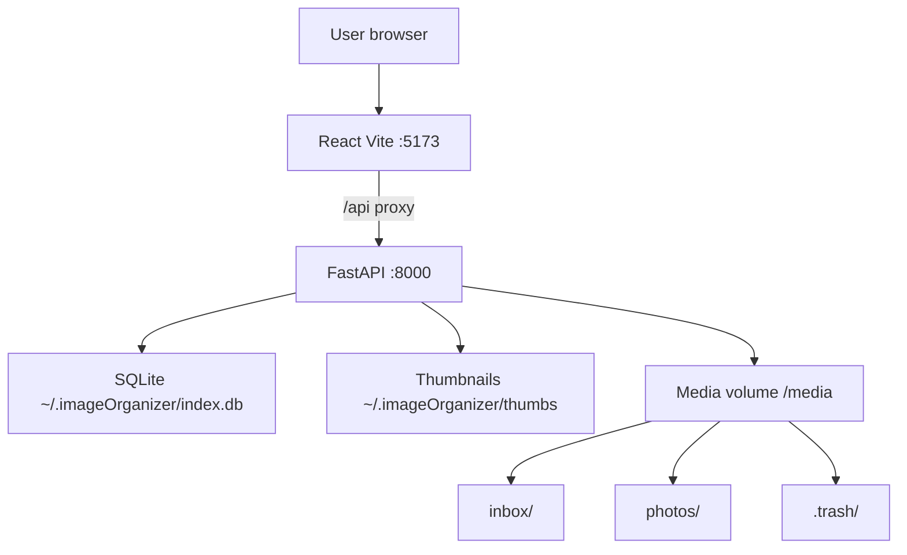
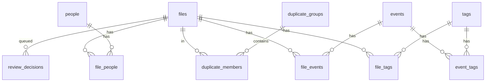
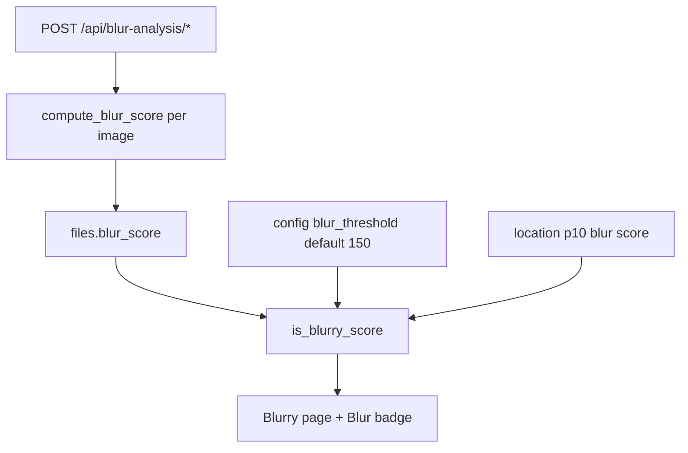

# Image Organizer — Architecture

Local-first web app for organizing photos and videos: inbox landing folder, calendar browse, events, people, tags, deduplication, and safe apply.

**Related docs:** [DEVELOPMENT_BOOK.md](DEVELOPMENT_BOOK.md) — collected implementation plans and design history.

## Design principles

- **Preview before write** — filesystem changes happen only when the user clicks Apply on the Review page.
- **Trash, not delete** — removed files move to `.trash/` under the media root.
- **Index separate from media** — SQLite and thumbnails live in `APP_DATA_DIR`; photos/videos stay on disk in user-controlled folders.
- **Single machine** — no auth layer; intended for personal use on localhost or LAN.

## System context



In Docker, the frontend dev server proxies `/api` to the backend. Host paths are mounted via `docker-compose.yml` (`MEDIA_HOST_PATH`, `APP_DATA_HOST_PATH`).

## Tech stack

| Layer | Choice |
|-------|--------|
| Backend | Python 3.12, FastAPI, SQLite |
| Frontend | React 18, TypeScript, Vite, TanStack Query, react-router |
| Media | Pillow (images/thumbs), ffmpeg/ffprobe (video metadata), perceptual hash dedupe |
| Deploy | Docker Compose |

Full interactive API spec: `http://localhost:8000/docs` when the backend is running.

## Repository layout

### Backend (`backend/app/`)

| Module | Responsibility |
|--------|----------------|
| `main.py` | HTTP routes, request/response mapping |
| `db.py` | SQLite schema, connection, config key-value store |
| `models.py` | Pydantic request/response models |
| `config.py` | Paths, supported extensions, env vars |
| `scanner.py` | Background scan of inbox/archive into `files` |
| `metadata.py` | EXIF/ffprobe extraction, thumbnails |
| `organizer.py` | Date-folder and rename preview/apply |
| `dedupe.py` | Exact (SHA256) and perceptual (pHash) duplicate groups |
| `blur_analysis.py` | Background sharpness analysis job + status |
| `blur_detect.py` | Threshold parsing, p10 outlier helper, shared `is_blurry` logic |
| `events.py` | Trip/event CRUD and file assignment |
| `people.py` | People CRUD, file assignment, merge |
| `tags.py` | Tag CRUD, file tags, event tags, merge |

### Frontend (`frontend/src/`)

| Area | Responsibility |
|------|----------------|
| `api/client.ts` | Typed fetch wrapper for all `/api/*` endpoints |
| `pages/` | Route-level views (Inbox, Calendar, Events, etc.) |
| `components/` | Reusable UI (PhotoGrid, bulk assign bars, pickers) |

## Data model

SQLite schema is defined in `backend/app/db.py` and applied on startup via `init_db()`.

### Migrations

Schema changes run in `_migrate_schema()` on every backend start. When a migration must rebuild a table that other tables reference (e.g. adding `'trash'` to the `files.location` CHECK constraint), **foreign keys are disabled for the rebuild** (`PRAGMA foreign_keys = OFF`). With FK enforcement left on, `DROP TABLE files` implicitly deletes all file rows and cascades into `file_tags`, `file_people`, `file_events`, and `duplicate_members`.

If Tags, People, or Events show **0 photos** after upgrading to a Trash build, junction rows were likely wiped by the pre-fix migration. Restore from a pre-upgrade backup of `~/.imageOrganizer/index.db`:

```bash
# Stop the backend first
python backend/scripts/restore_junctions_from_backup.py /path/to/old/index.db --dry-run
python backend/scripts/restore_junctions_from_backup.py /path/to/old/index.db
```

Photos and tag/person/event **names** are unaffected; only file↔label links need restoring.



### Core entities

| Table | Purpose |
|-------|---------|
| `files` | Indexed media row (`location`: `inbox` \| `archive` \| `trash`), paths, hashes, capture date, dimensions, optional `blur_score` from sharpness analysis |
| `events` | Named trips/occasions with color, optional date span |
| `people` | Names tagged on individual photos |
| `tags` | Generic labels (e.g. Cars, house project) |

### Junction tables

| Table | Links |
|-------|-------|
| `file_events` | Photo ↔ event (trip grouping) |
| `file_people` | Photo ↔ person |
| `file_tags` | Photo ↔ tag (direct photo tagging) |
| `event_tags` | Event ↔ tag (optional event metadata; separate from file tags) |

### Supporting tables

| Table | Purpose |
|-------|---------|
| `duplicate_groups` / `duplicate_members` | Exact and perceptual duplicate clusters |
| `review_decisions` | Queued keep/delete/move/rename/skip actions |
| `operations_log` | Audit trail after Apply |
| `config` | Inbox/archive/trash paths, date/rename patterns, blur detection threshold |

API list responses enrich entities with counts and nested relations. `FileOut` includes nested `events`, `people`, and `tags`.

## Filesystem layout

Configured in `backend/app/config.py` (overridable via Settings UI → `config` table):

| Path | Role |
|------|------|
| `{MEDIA_ROOT}/inbox/` | New imports; scanned but not organized until Apply |
| `{MEDIA_ROOT}/photos/` | Organized archive (date-based subfolders after Apply) |
| `{MEDIA_ROOT}/.trash/` | Soft-deleted files |
| `{APP_DATA_DIR}/index.db` | SQLite database |
| `{APP_DATA_DIR}/backups/` | Timestamped database backups (`index-YYYY-MM-DD_HH-MM-SS.db`) |
| `{APP_DATA_DIR}/mosaics/` | Generated photomosaic JPEGs |
| `{APP_DATA_DIR}/thumbs/` | Cached JPEG thumbnails (keyed by file id + mtime) |

Environment variables:

- `MEDIA_ROOT` — media tree root (default `/Users/alex/Media`, `/media` in Docker)
- `APP_DATA_DIR` — app state (default `~/.imageOrganizer`, `/data` in Docker)

Supported media: common image formats (JPEG, PNG, HEIC, WebP, TIFF) and video (MP4, MOV, MKV, WebM, AVI).

## Core workflows

### 1. Scan

1. User triggers scan (inbox or archive) → `POST /api/scan/inbox` or `/archive`.
2. `scanner.py` walks the folder in a background thread; status via `GET /api/scan/status`.
3. For each file: read metadata (`metadata.py`), compute SHA256/pHash, upsert `files` row, generate thumbnail.

### 2. Organize preview

1. `organizer.py` reads date/rename patterns from config.
2. `POST /api/organize/preview` or `/api/review/preview-inbox` returns proposed target paths without writing disk.

### 3. Review and Apply

1. User marks files on Review page → `POST /api/review/decisions` (delete, skip, etc.).
2. Queue shown at `GET /api/review/queue`.
3. **Restore** on delete decisions (`POST /api/review/decisions/cancel`) removes them from the queue without affecting organize/keep items; available in list, grid bulk, and photo detail.
4. `POST /api/apply` executes queued operations: move/rename into archive layout or move deletes to `.trash/` (files row kept with `location='trash'`).
5. Results logged in `operations_log`.

### 4. Trash and restore

1. After Apply, deleted files live in `{MEDIA_ROOT}/.trash/` and appear in the DB with `location='trash'`.
2. **Trash** page (`/trash`) lists them via `GET /api/files?location=trash`.
3. **Scan trash** (`POST /api/scan/trash`) indexes files on disk (including legacy deletes not yet in the DB).
4. **Restore** (`POST /api/trash/restore`) moves files back to the original path from `operations_log` (inbox or archive); falls back to inbox when unknown.

The Inbox **Delete queue** filter (`pending_delete=true`) is separate: it shows photos marked for delete *before* Apply.

### 5. Deduplication

1. `dedupe.py` groups by SHA256 (exact) and pHash distance (perceptual).
2. UI at `/duplicates`; user picks keeper per group → `PATCH /api/duplicates/{id}/keeper`.

### 6. Blur detection

Sharpness analysis is a **separate pass** from inbox/archive scan. Scan and blur analysis cannot run at the same time.

#### User flow

1. User opens **Blurry** (`/blurry`) and clicks **Analyze inbox**, **Analyze archive**, or **Analyze all**.
2. Background job reports progress via `GET /api/blur-analysis/status` (header banner on the Blurry page).
3. Flagged photos appear in the grid with a purple **Blur** badge; filter by **All**, **Inbox**, or **Archive**.
4. **Blur** badge also appears on Inbox and Calendar grids when a photo is classified blurry.
5. **PhotoDetail** shows the sharpness score when analyzed (lower = blurrier).
6. Multi-select on the Blurry page → **Mark for delete** queues photos for Review (same delete flow as Inbox).
7. Sensitivity: **Settings → Quality → Blur detection threshold** (default 150). Higher threshold flags more photos.

#### Algorithm and classification



| Step | Detail |
|------|--------|
| Scoring | Open image → EXIF transpose → grayscale → downscale 400px → Laplacian variance (Pillow). **Lower score = blurrier.** |
| Storage | `files.blur_score` (REAL). Videos skipped. Re-analyze only processes images without a score yet. |
| Absolute rule | `blur_score < blur_threshold` (Settings, default **150**) |
| Outlier rule | When 10+ scored images in location: also flag if `blur_score < p10 × 0.22` (catches obvious misses when threshold is set too low) |
| API filter | `GET /api/files?blurry=true` uses the same rules as `is_blurry` on `FileOut` |

Example from a typical inbox batch:

| File | Score | Flagged |
|------|-------|---------|
| IMG_7483.JPG | 130 | yes (outlier) |
| IMG_7484.JPG | 2818 | no |

Implementation: [`metadata.py`](../backend/app/metadata.py) (`compute_blur_score`), [`blur_analysis.py`](../backend/app/blur_analysis.py) (background job), [`blur_detect.py`](../backend/app/blur_detect.py) (classification helpers).

### 7. Labeling (events, people, tags)

- **Events** — assign photos to trips (`file_events`); bulk bars on Inbox/Calendar.
- **People** — tag who appears in a photo (`file_people`).
- **Tags** — generic categories on photos (`file_tags`); Browse filters by direct file tags.

Event-level tags (`event_tags`) label the event record itself and do not imply all event photos carry that tag.

### 8. Calendar browse

- Multi-month grid with per-month label chips (events, people, tags) and an **Untagged** chip per month.
- Top bar: year selector (defaults to latest year with photos), **All / Untagged** global filter, Archive/Inbox scope, and Images/Videos media filter.
- When a single year is selected, a year-level label bar aggregates events, people, and tags for that year (`GET /api/calendar/year-labels`). Selecting a chip switches browse to a paginated year photo grid (`CalendarYearPhotosPanel`) instead of the month grid; **All** clears the filter and restores months. Filter state syncs to URL query params (`tag_id`, `person_id`, `event_id`, `unlabeled=1`) for bookmarking and browser Back.
- Clicking a month title in browse mode opens a paginated month photo grid (`CalendarMonthPhotosPanel`) via `?view=month` on `/calendar/:y/:m`. Month label chips inside that panel filter the grid using the same query param names. Year and month photo views are mutually exclusive. Both month and year photo grids support multi-select and bulk labeling (tags, people, events).
- Day panel: selection bar and photo grid on the right; label editors below month calendars on the left when photos are selected; tag search in label editors. Day navigation preserves active filter query params.
- Days with more than 100 photos paginate in the day panel (`GET /api/calendar/day?page=&page_size=`; default page size 100, max 500).

### 9. Database backup

- **Settings → Storage → Backup database** creates a consolidated SQLite copy via the online backup API (safe while the app runs with WAL).
- Copies are written to `{APP_DATA_DIR}/backups/index-YYYY-MM-DD_HH-MM-SS.db`.
- CLI: `python backend/scripts/backup_database.py` (optional `--db` path).
- Use backups with [`restore_junctions_from_backup.py`](../backend/scripts/restore_junctions_from_backup.py) after a bad migration.

### 10. Photomosaic

- **Mosaic** page (`/mosaic`): select a source image, filter tile pool by tag/person/event/all, generate a color-matched grid mosaic.
- `POST /api/mosaic/preview` — tile count and output dimensions.
- `POST /api/mosaic/generate` — writes JPEG to `{APP_DATA_DIR}/mosaics/`; served at `GET /api/mosaic/output/{filename}`.

## API overview

Grouped by domain. See `/docs` for parameters and schemas.

| Group | Endpoints |
|-------|-----------|
| Health | `GET /api/health` |
| Config | `GET/PATCH /api/config` |
| Database backup | `POST /api/database/backup`, `GET /api/database/backups` |
| Mosaic | `POST /api/mosaic/preview`, `POST /api/mosaic/generate`, `GET /api/mosaic/output/{filename}` |
| Scan | `POST /api/scan/inbox`, `/archive`, `/trash`, `GET /api/scan/status` |
| Blur analysis | `POST /api/blur-analysis/inbox`, `/archive`, `/all`, `GET /api/blur-analysis/status` |
| Files | `GET /api/files` (filters: location, `capture_day`, `capture_year`, `capture_month`, event, person, tag, blurry), thumbnails, original, metadata |
| File relations | `PATCH /api/files/{id}/events`, `/people`, `/tags` |
| Calendar | `GET /api/calendar/months`, `/summary`, `/labels`, `/year-labels`, `/events`, `/day` (paginated; `page`, `page_size`) |
| Events | CRUD, files list, assign-ids, assign-range |
| People | CRUD, merge, assign-ids, unassign-ids |
| Tags | CRUD, merge, assign-ids, unassign-ids |
| Duplicates | `GET /api/duplicates`, `PATCH .../keeper` |
| Review / organize | preview, decisions, cancel (restore delete), queue, apply |
| Operations | `GET /api/operations` |
| Trash | `GET /api/files?location=trash`, `POST /api/trash/restore` |

## Frontend routes

| Route | Page |
|-------|------|
| `/inbox` | Scan inbox; bulk assign events, people, tags |
| `/calendar`, `/calendar/:y/:m/:d` | Multi-month view, year-filter photo grid, or month photo grid (`?view=month`); day panel with bulk assign and pagination; optional `?tag_id=` / `?person_id=` / `?event_id=` / `?unlabeled=1` |
| `/events`, `/events/:slug` | Event list and detail |
| `/people` | People CRUD, merge, delete |
| `/tags` | Tags CRUD, merge, delete |
| `/browse`, `/browse/:kind/:slug` | Filter by person or tag |
| `/mosaic` | Photomosaic from source photo + filtered tile pool |
| `/duplicates` | Duplicate review |
| `/blurry` | Analyze sharpness; review blurry photos; mark for delete |
| `/trash` | Browse `.trash/` (paginated); scan and restore deleted photos |
| `/review` | Decision queue, restore deletes, and Apply |
| `/settings` | Paths, rename patterns, blur threshold |

Version is shown in the sidebar (from `frontend/package.json`).

## Versioning

Date-based releases: `YYYY.MM.DD`; multiple releases same day append `a`–`z`.

- Release notes: [CHANGELOG.md](../CHANGELOG.md)
- Version strings: `frontend/package.json`, FastAPI app version in `main.py`

## Keeping this document current

Update **this file** in the same change when you modify:

- SQLite schema (`backend/app/db.py`)
- New or removed API route groups
- New frontend routes or major user workflows
- Docker volumes, env vars, or external dependencies (ffmpeg, etc.)
- Responsibilities of core backend modules

Do **not** duplicate README quick-start steps or CHANGELOG release bullets here. Skip doc updates for trivial fixes (styling, copy tweaks) that do not change structure or behavior.

Cursor agents: see `.cursor/rules/architecture-doc.mdc`.
