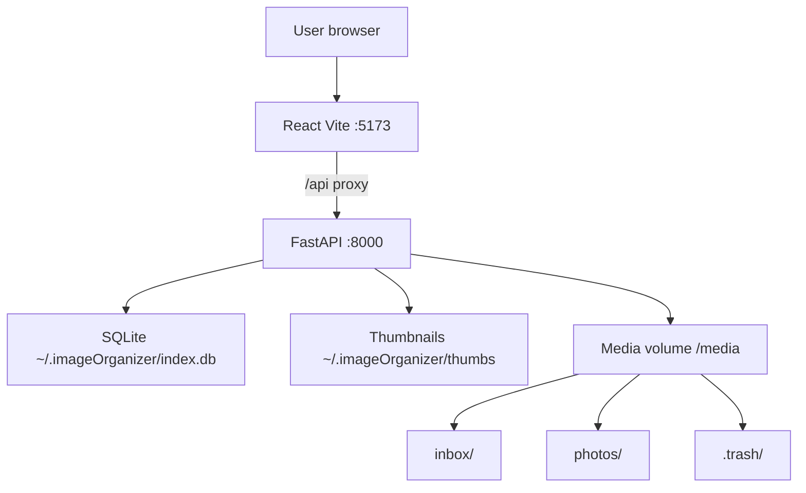
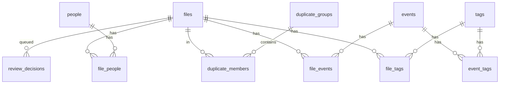

# Image Organizer — Architecture

Local-first web app for organizing photos and videos: inbox landing folder, calendar browse, events, people, tags, deduplication, and safe apply.

**Related docs:** [DEVELOPMENT_BOOK.md](DEVELOPMENT_BOOK.md) — collected implementation plans and design history.

## Design principles

- **Preview before write** — filesystem changes happen only when the user clicks Apply on the Review page.
- **Trash, not delete** — removed files move to `.trash/` under the media root.
- **Index separate from media** — SQLite and thumbnails live in `APP_DATA_DIR`; photos/videos stay on disk in user-controlled folders.
- **Single machine** — no auth layer; intended for personal use on localhost or LAN.

## System context

In Docker, the frontend dev server proxies `/api` to the backend. Host paths are mounted via `docker-compose.yml` (`MEDIA_HOST_PATH`, `APP_DATA_HOST_PATH`).

## Tech stack

| Layer | Choice |
|-------|--------|
| Backend | Python 3.12, FastAPI, SQLite |
| Frontend | React 18, TypeScript, Vite, TanStack Query, react-router |
| Media | Pillow (images/thumbs), ffmpeg/ffprobe (video metadata), perceptual hash dedupe |
| Deploy | Docker Compose |

Full interactive API spec: `http://localhost:8000/docs` when the backend is running.

## Repository layout

### Backend (`backend/app/`)

| Module | Responsibility |
|--------|----------------|
| `main.py` | HTTP routes, request/response mapping |
| `db.py` | SQLite schema, connection, config key-value store |
| `models.py` | Pydantic request/response models |
| `config.py` | Paths, supported extensions, env vars |
| `scanner.py` | Background scan of inbox/archive into `files` |
| `metadata.py` | EXIF/ffprobe extraction, thumbnails |
| `organizer.py` | Date-folder and rename preview/apply |
| `dedupe.py` | Exact (SHA256) and perceptual (pHash) duplicate groups |
| `events.py` | Trip/event CRUD and file assignment |
| `people.py` | People CRUD, file assignment, merge |
| `tags.py` | Tag CRUD, file tags, event tags, merge |

### Frontend (`frontend/src/`)

| Area | Responsibility |
|------|----------------|
| `api/client.ts` | Typed fetch wrapper for all `/api/*` endpoints |
| `pages/` | Route-level views (Inbox, Calendar, Events, etc.) |
| `components/` | Reusable UI (PhotoGrid, bulk assign bars, pickers) |

## Data model

SQLite schema is defined in `backend/app/db.py` and applied on startup via `init_db()`.

### Core entities

| Table | Purpose |
|-------|---------|
| `files` | Indexed media row (`location`: `inbox` \| `archive`), paths, hashes, capture date, dimensions |
| `events` | Named trips/occasions with color, optional date span |
| `people` | Names tagged on individual photos |
| `tags` | Generic labels (e.g. Cars, house project) |

### Junction tables

| Table | Links |
|-------|-------|
| `file_events` | Photo ↔ event (trip grouping) |
| `file_people` | Photo ↔ person |
| `file_tags` | Photo ↔ tag (direct photo tagging) |
| `event_tags` | Event ↔ tag (optional event metadata; separate from file tags) |

### Supporting tables

| Table | Purpose |
|-------|---------|
| `duplicate_groups` / `duplicate_members` | Exact and perceptual duplicate clusters |
| `review_decisions` | Queued keep/delete/move/rename/skip actions |
| `operations_log` | Audit trail after Apply |
| `config` | Inbox/archive/trash paths, date/rename patterns |

API list responses enrich entities with counts and nested relations. `FileOut` includes nested `events`, `people`, and `tags`.

## Filesystem layout

Configured in `backend/app/config.py` (overridable via Settings UI → `config` table):

| Path | Role |
|------|------|
| `{MEDIA_ROOT}/inbox/` | New imports; scanned but not organized until Apply |
| `{MEDIA_ROOT}/photos/` | Organized archive (date-based subfolders after Apply) |
| `{MEDIA_ROOT}/.trash/` | Soft-deleted files |
| `{APP_DATA_DIR}/index.db` | SQLite database |
| `{APP_DATA_DIR}/thumbs/` | Cached JPEG thumbnails (keyed by file id + mtime) |

Environment variables:

- `MEDIA_ROOT` — media tree root (default `/Users/alex/Media`, `/media` in Docker)
- `APP_DATA_DIR` — app state (default `~/.imageOrganizer`, `/data` in Docker)

Supported media: common image formats (JPEG, PNG, HEIC, WebP, TIFF) and video (MP4, MOV, MKV, WebM, AVI).

## Core workflows

### 1. Scan

1. User triggers scan (inbox or archive) → `POST /api/scan/inbox` or `/archive`.
2. `scanner.py` walks the folder in a background thread; status via `GET /api/scan/status`.
3. For each file: read metadata (`metadata.py`), compute SHA256/pHash, upsert `files` row, generate thumbnail.

### 2. Organize preview

1. `organizer.py` reads date/rename patterns from config.
2. `POST /api/organize/preview` or `/api/review/preview-inbox` returns proposed target paths without writing disk.

### 3. Review and Apply

1. User marks files on Review page → `POST /api/review/decisions` (delete, skip, etc.).
2. Queue shown at `GET /api/review/queue`.
3. `POST /api/apply` executes queued operations: move/rename into archive layout or move deletes to `.trash/`.
4. Results logged in `operations_log`.

### 4. Deduplication

1. `dedupe.py` groups by SHA256 (exact) and pHash distance (perceptual).
2. UI at `/duplicates`; user picks keeper per group → `PATCH /api/duplicates/{id}/keeper`.

### 5. Labeling (events, people, tags)

- **Events** — assign photos to trips (`file_events`); bulk bars on Inbox/Calendar.
- **People** — tag who appears in a photo (`file_people`).
- **Tags** — generic categories on photos (`file_tags`); Browse filters by direct file tags.

Event-level tags (`event_tags`) label the event record itself and do not imply all event photos carry that tag.

## API overview

Grouped by domain. See `/docs` for parameters and schemas.

| Group | Endpoints |
|-------|-----------|
| Health | `GET /api/health` |
| Config | `GET/PATCH /api/config` |
| Scan | `POST /api/scan/inbox`, `/archive`, `GET /api/scan/status` |
| Files | `GET /api/files` (filters: location, day, event, person, tag), thumbnails, original, metadata |
| File relations | `PATCH /api/files/{id}/events`, `/people`, `/tags` |
| Calendar | `GET /api/calendar/months`, `/summary`, `/events`, `/day` |
| Events | CRUD, files list, assign-ids, assign-range |
| People | CRUD, merge, assign-ids, unassign-ids |
| Tags | CRUD, merge, assign-ids, unassign-ids |
| Duplicates | `GET /api/duplicates`, `PATCH .../keeper` |
| Review / organize | preview, decisions, queue, apply |
| Operations | `GET /api/operations` |

## Frontend routes

| Route | Page |
|-------|------|
| `/inbox` | Scan inbox; bulk assign events, people, tags |
| `/calendar`, `/calendar/:y/:m/:d` | Multi-month view; day panel with bulk assign |
| `/events`, `/events/:slug` | Event list and detail |
| `/people` | People CRUD, merge, delete |
| `/tags` | Tags CRUD, merge, delete |
| `/browse`, `/browse/:kind/:slug` | Filter by person or tag |
| `/duplicates` | Duplicate review |
| `/review` | Decision queue and Apply |
| `/settings` | Paths and rename patterns |

Version is shown in the sidebar (from `frontend/package.json`).

## Versioning

Date-based releases: `YYYY.MM.DD`; multiple releases same day append `a`–`z`.

- Release notes: [CHANGELOG.md](../CHANGELOG.md)
- Version strings: `frontend/package.json`, FastAPI app version in `main.py`

## Keeping this document current

Update **this file** in the same change when you modify:

- SQLite schema (`backend/app/db.py`)
- New or removed API route groups
- New frontend routes or major user workflows
- Docker volumes, env vars, or external dependencies (ffmpeg, etc.)
- Responsibilities of core backend modules

Do **not** duplicate README quick-start steps or CHANGELOG release bullets here. Skip doc updates for trivial fixes (styling, copy tweaks) that do not change structure or behavior.

Cursor agents: see `.cursor/rules/architecture-doc.mdc`.
