# Image Organizer — Development Book

*Release 2026.07.26 · collected Cursor implementation plans*

Related: [ARCHITECTURE.md](ARCHITECTURE.md) · [CHANGELOG.md](../CHANGELOG.md)

## Introduction

This book collects the Cursor agent implementation plans written while building Image Organizer. Each chapter records design intent, scope, and verification steps for a feature or fix. It is a development history — not end-user documentation. For current system design, see [ARCHITECTURE.md](ARCHITECTURE.md). For shipped changes by release, see [CHANGELOG.md](../CHANGELOG.md).

## Table of Contents

### Part I — Foundation

1. [Image Organizer Web App](#chapter-1-image-organizer-web-app)
2. [Architecture design doc](#chapter-2-architecture-design-doc)
3. [Initial GitHub push](#chapter-3-initial-github-push)
4. [Finish GitHub push](#chapter-4-finish-github-push)
5. [Video support](#chapter-5-video-support)
6. [Tags and people](#chapter-6-tags-and-people)

### Part II — Calendar

7. [Calendar browse vs focus](#chapter-7-calendar-browse-vs-focus)
8. [Fix browse calendar stretch](#chapter-8-fix-browse-calendar-stretch)
9. [Calendar layout optimization](#chapter-9-calendar-layout-optimization)
10. [Fix calendar layout](#chapter-10-fix-calendar-layout)
11. [Skip empty calendar months](#chapter-11-skip-empty-calendar-months)
12. [Calendar tag wrapping](#chapter-12-calendar-tag-wrapping)
13. [Event calendar deeplink](#chapter-13-event-calendar-deeplink)
14. [Edit event title](#chapter-14-edit-event-title)
15. [Calendar media type filter](#chapter-15-calendar-media-type-filter)
16. [Calendar session cache](#chapter-16-calendar-session-cache)
17. [Calendar untagged edit mode](#chapter-17-calendar-untagged-edit-mode)
18. [Fix calendar tag search layout](#chapter-18-fix-calendar-tag-search-layout)
19. [Calendar year selector](#chapter-19-calendar-year-selector)
20. [Calendar year tag filter](#chapter-20-calendar-year-tag-filter)
21. [Year filter photo grid](#chapter-21-year-filter-photo-grid)
22. [Month photo grid](#chapter-22-month-photo-grid)
23. [Fix calendar grid selection](#chapter-23-fix-calendar-grid-selection)
24. [Calendar untagged months](#chapter-24-calendar-untagged-months)

### Part III — Inbox and Review

25. [Inbox multi-select events](#chapter-25-inbox-multi-select-events)
26. [Inbox unlabeled filter](#chapter-26-inbox-unlabeled-filter)
27. [Inbox used tags filter](#chapter-27-inbox-used-tags-filter)
28. [Inbox tag search](#chapter-28-inbox-tag-search)
29. [Advance after mark delete](#chapter-29-advance-after-mark-delete)
30. [Inbox delete queue view](#chapter-30-inbox-delete-queue-view)
31. [Remove apply alert popup](#chapter-31-remove-apply-alert-popup)
32. [Inbox camera filters](#chapter-32-inbox-camera-filters)
33. [Cameras nav page](#chapter-33-cameras-nav-page)
34. [Fix stale review preview](#chapter-34-fix-stale-review-preview)
35. [Review page layout](#chapter-35-review-page-layout)
36. [Inbox batch review](#chapter-36-inbox-batch-review)
37. [Inbox bulk delete shortcut](#chapter-37-inbox-bulk-delete-shortcut)
38. [Review queue preview release](#chapter-38-review-queue-preview-release)
39. [Global photo sort setting](#chapter-39-global-photo-sort-setting)
40. [Fix inbox scan jank](#chapter-40-fix-inbox-scan-jank)
41. [Inbox compact layout](#chapter-41-inbox-compact-layout)
42. [Compact bulk date editor](#chapter-42-compact-bulk-date-editor)
43. [Inbox sticky controls](#chapter-43-inbox-sticky-controls)
44. [Trash view pagination](#chapter-44-trash-view-pagination)
45. [Sticky page controls](#chapter-45-sticky-page-controls)
46. [Slim inbox delete refetch](#chapter-46-slim-inbox-delete-refetch)
47. [Fix blocked scan clicks](#chapter-47-fix-blocked-scan-clicks)
48. [Throttle inbox scan refetch](#chapter-48-throttle-inbox-scan-refetch)
49. [Background dup index](#chapter-49-background-dup-index)

### Part IV — Labels and Photo UX

50. [Photo tags feature](#chapter-50-photo-tags-feature)
51. [Removable grid labels](#chapter-51-removable-grid-labels)
52. [Bulk chip label editors](#chapter-52-bulk-chip-label-editors)
53. [People bulk and CRUD](#chapter-53-people-bulk-and-crud)
54. [People name browse links](#chapter-54-people-name-browse-links)
55. [Detail multi-tag select](#chapter-55-detail-multi-tag-select)
56. [Split select vs detail](#chapter-56-split-select-vs-detail)
57. [Fix thumbnail orientation](#chapter-57-fix-thumbnail-orientation)
58. [Shift-click range select](#chapter-58-shift-click-range-select)
59. [ESC close detail viewer](#chapter-59-esc-close-detail-viewer)
60. [Recently used tags](#chapter-60-recently-used-tags)
61. [Browse label mode](#chapter-61-browse-label-mode)
62. [Browse multi-tag AND](#chapter-62-browse-multi-tag-and)
63. [Browse subset people fix](#chapter-63-browse-subset-people-fix)
64. [Browse cameras subset](#chapter-64-browse-cameras-subset)
65. [Fix camera model order](#chapter-65-fix-camera-model-order)
66. [Tags page search](#chapter-66-tags-page-search)
67. [Single video playback](#chapter-67-single-video-playback)
68. [Fix zoom view scroll and nav](#chapter-68-fix-zoom-view-scroll-and-nav)
69. [Fix zoom scale-to-fit](#chapter-69-fix-zoom-scale-to-fit)
70. [Mosaic from detail viewer](#chapter-70-mosaic-from-detail-viewer)
71. [Fix mosaic navigation](#chapter-71-fix-mosaic-navigation)
72. [Library mosaic save](#chapter-72-library-mosaic-save)
73. [Lightbox tag fonts](#chapter-73-lightbox-tag-fonts)
74. [Subtle delete icon](#chapter-74-subtle-delete-icon)
75. [Cut tag refetch storm](#chapter-75-cut-tag-refetch-storm)
76. [Home landscapes landing](#chapter-76-home-landscapes-landing)
77. [Home tag and view skin](#chapter-77-home-tag-and-view-skin)
78. [Fix skin scroll brightness](#chapter-78-fix-skin-scroll-brightness)
79. [Skin scroll with fade](#chapter-79-skin-scroll-with-fade)
80. [Skin rotate interval fade](#chapter-80-skin-rotate-interval-fade)
81. [Pills for labels manage](#chapter-81-pills-for-labels-manage)
82. [Browse hide deleted files](#chapter-82-browse-hide-deleted-files)
83. [Align label photo counts](#chapter-83-align-label-photo-counts)
84. [Home tagline tweak](#chapter-84-home-tagline-tweak)
85. [Label editor columns](#chapter-85-label-editor-columns)
86. [Image rotate 90](#chapter-86-image-rotate-90)
87. [Filename below buttons](#chapter-87-filename-below-buttons)

### Part V — Dates and Alerts

88. [Filename date mismatch](#chapter-88-filename-date-mismatch)
89. [Browser date correction](#chapter-89-browser-date-correction)
90. [Photo grid alerts](#chapter-90-photo-grid-alerts)
91. [Photo keyboard navigation](#chapter-91-photo-keyboard-navigation)

### Part VI — Dedupe and Integrity

92. [Duplicate keeper defaults](#chapter-92-duplicate-keeper-defaults)
93. [Fix tag counts after dedupe](#chapter-93-fix-tag-counts-after-dedupe)
94. [Fix orphan tag counts](#chapter-94-fix-orphan-tag-counts)
95. [Fix SQLite lock errors](#chapter-95-fix-sqlite-lock-errors)
96. [Fix remaining scan locks](#chapter-96-fix-remaining-scan-locks)
97. [Unblock calendar during dedupe](#chapter-97-unblock-calendar-during-dedupe)
98. [Show dup card tags](#chapter-98-show-dup-card-tags)

### Part VII — Release and Meta

99. [Version and changelog](#chapter-99-version-and-changelog)
100. [Sidebar version badge](#chapter-100-sidebar-version-badge)
101. [Save plans gitignore](#chapter-101-save-plans-gitignore)
102. [Plans development book](#chapter-102-plans-development-book)
103. [Co-locate library storage](#chapter-103-co-locate-library-storage)

### Appendix — Unlisted Plans

104. [Add major US hubs](#chapter-104-add-major-us-hubs)
105. [Add major US hubs](#chapter-105-add-major-us-hubs)
106. [Add Northeast regionals](#chapter-106-add-northeast-regionals)
107. [Add Northeast regionals](#chapter-107-add-northeast-regionals)
108. [Add plane type to results](#chapter-108-add-plane-type-to-results)
109. [Add plane type to results](#chapter-109-add-plane-type-to-results)
110. [Blur feature documentation](#chapter-110-blur-feature-documentation)
111. [Blurry image detection](#chapter-111-blurry-image-detection)
112. [Blurry scroll and nav](#chapter-112-blurry-scroll-and-nav)
113. [Book update and release](#chapter-113-book-update-and-release)
114. [Browse cameras subset](#chapter-114-browse-cameras-subset)
115. [Browse multi-tag AND](#chapter-115-browse-multi-tag-and)
116. [Browse subset people fix](#chapter-116-browse-subset-people-fix)
117. [Bump version 2026.07.25a](#chapter-117-bump-version-20260725a)
118. [Bump version 2026.07.25a](#chapter-118-bump-version-20260725a)
119. [Calendar day pagination](#chapter-119-calendar-day-pagination)
120. [Calendar global untagged](#chapter-120-calendar-global-untagged)
121. [Calendar tagging bottom-left](#chapter-121-calendar-tagging-bottom-left)
122. [Calendar untagged edit mode](#chapter-122-calendar-untagged-edit-mode)
123. [Calendar untagged filter](#chapter-123-calendar-untagged-filter)
124. [Clone datefare repo](#chapter-124-clone-datefare-repo)
125. [Clone datefare repo](#chapter-125-clone-datefare-repo)
126. [Connection airport icons](#chapter-126-connection-airport-icons)
127. [Connection airport icons](#chapter-127-connection-airport-icons)
128. [cursor-book development book](#chapter-128-cursor-book-development-book)
129. [cursor-book development book](#chapter-129-cursor-book-development-book)
130. [Cursor book tool repo](#chapter-130-cursor-book-tool-repo)
131. [Database datetime backups](#chapter-131-database-datetime-backups)
132. [Detail applied labels](#chapter-132-detail-applied-labels)
133. [Detail applied labels](#chapter-133-detail-applied-labels)
134. [Dockerize datefare app](#chapter-134-dockerize-datefare-app)
135. [Dockerize datefare app](#chapter-135-dockerize-datefare-app)
136. [Docs commit and PR](#chapter-136-docs-commit-and-pr)
137. [Docs commit and PR](#chapter-137-docs-commit-and-pr)
138. [Document and commit foundation](#chapter-138-document-and-commit-foundation)
139. [Document and commit foundation](#chapter-139-document-and-commit-foundation)
140. [Expand Plattsburgh regionals](#chapter-140-expand-plattsburgh-regionals)
141. [Expand Plattsburgh regionals](#chapter-141-expand-plattsburgh-regionals)
142. [Fix blocked scan clicks](#chapter-142-fix-blocked-scan-clicks)
143. [Fix blur detection threshold](#chapter-143-fix-blur-detection-threshold)
144. [Fix calendar tag search layout](#chapter-144-fix-calendar-tag-search-layout)
145. [Fix camera model order](#chapter-145-fix-camera-model-order)
146. [Fix fast-flights v3 API](#chapter-146-fix-fast-flights-v3-api)
147. [Fix fast-flights v3 API](#chapter-147-fix-fast-flights-v3-api)
148. [Fix label data loss](#chapter-148-fix-label-data-loss)
149. [Fix lightbox scale-to-fit](#chapter-149-fix-lightbox-scale-to-fit)
150. [Fix mosaic navigation](#chapter-150-fix-mosaic-navigation)
151. [Fix tag wrap blowout](#chapter-151-fix-tag-wrap-blowout)
152. [Fix tag wrap blowout](#chapter-152-fix-tag-wrap-blowout)
153. [HTML book output](#chapter-153-html-book-output)
154. [HTML book output](#chapter-154-html-book-output)
155. [Inbox autotag investigation](#chapter-155-inbox-autotag-investigation)
156. [Inbox detail auto-advance](#chapter-156-inbox-detail-auto-advance)
157. [Kitchen Ledger recipe app](#chapter-157-kitchen-ledger-recipe-app)
158. [Library mosaic save](#chapter-158-library-mosaic-save)
159. [Lightbox tag fonts](#chapter-159-lightbox-tag-fonts)
160. [Lightbox tag overlay](#chapter-160-lightbox-tag-overlay)
161. [Link inbox image as hero](#chapter-161-link-inbox-image-as-hero)
162. [Link inbox image as hero](#chapter-162-link-inbox-image-as-hero)
163. [People autotag options](#chapter-163-people-autotag-options)
164. [Per-passenger price display](#chapter-164-per-passenger-price-display)
165. [Per-passenger price display](#chapter-165-per-passenger-price-display)
166. [Persist collapsible sections](#chapter-166-persist-collapsible-sections)
167. [Persist collapsible sections](#chapter-167-persist-collapsible-sections)
168. [Persist search form settings](#chapter-168-persist-search-form-settings)
169. [Persist search form settings](#chapter-169-persist-search-form-settings)
170. [Recent people like tags](#chapter-170-recent-people-like-tags)
171. [Recipe hero dish photo](#chapter-171-recipe-hero-dish-photo)
172. [Release 2026.07.10](#chapter-172-release-20260710)
173. [Release 2026.07.12b](#chapter-173-release-20260712b)
174. [Release 2026.07.14](#chapter-174-release-20260714)
175. [Release 2026.07.14](#chapter-175-release-20260714)
176. [Review restore deletes](#chapter-176-review-restore-deletes)
177. [Separate Kitchen Ledger agent](#chapter-177-separate-kitchen-ledger-agent)
178. [Separate Kitchen Ledger agent](#chapter-178-separate-kitchen-ledger-agent)
179. [Show connections in results](#chapter-179-show-connections-in-results)
180. [Show connections in results](#chapter-180-show-connections-in-results)
181. [Slim inbox delete refetch](#chapter-181-slim-inbox-delete-refetch)
182. [Sticky search form](#chapter-182-sticky-search-form)
183. [Sticky search form](#chapter-183-sticky-search-form)
184. [Throttle inbox scan refetch](#chapter-184-throttle-inbox-scan-refetch)
185. [Trash view and restore](#chapter-185-trash-view-and-restore)
186. [Update cursor-book submodule](#chapter-186-update-cursor-book-submodule)
187. [Update cursor-book submodule](#chapter-187-update-cursor-book-submodule)
188. [Widen content max-width](#chapter-188-widen-content-max-width)
189. [Widen content max-width](#chapter-189-widen-content-max-width)

### Skipped Duplicates

- `align_label_photo_counts_a4c92ffe` — Duplicate of `align_label_photo_counts_7a5bd48e`.
- `background_dup_index_659b1108` — Duplicate of `background_dup_index_8cf3240e`.
- `browse_hide_deleted_files_73e8a0c0` — Duplicate of `browse_hide_deleted_files_ab2717c8`.
- `calendar_tag_wrapping_a49a3fe3` — Superseded by `calendar_tag_wrapping_efb8630a`.
- `calendar_untagged_months_2356fccd` — Duplicate of `calendar_untagged_months_3b2d6809`.
- `co-locate_library_storage_6f564eda` — Duplicate of `co-locate_library_storage_34eee391`.
- `cut_tag_refetch_storm_c31fe440` — Duplicate of `cut_tag_refetch_storm_8dda7fb5`.
- `filename_below_buttons_576d13c3` — Duplicate of `filename_below_buttons_be596bf6`.
- `fix_inbox_fullsize_scroll_a4badb8c` — Superseded — wrong split-view lightbox approach.
- `fix_skin_scroll_brightness_d9e1951b` — Duplicate of `fix_skin_scroll_brightness_500738da`.
- `home_landscapes_landing_68c71a56` — Duplicate of `home_landscapes_landing_d4a1d942`.
- `home_tag_and_view_skin_b5851c33` — Duplicate of `home_tag_and_view_skin_fec8e024`.
- `home_tagline_tweak_c49a8f68` — Duplicate of `home_tagline_tweak_bab0cd82`.
- `image_rotate_90_858a561c` — Duplicate of `image_rotate_90_5a7038ea`.
- `label_editor_columns_84de2d91` — Duplicate of `label_editor_columns_dd3228ea`.
- `pills_for_labels_manage_2d102669` — Duplicate of `pills_for_labels_manage_d9182094`.
- `restore_full-screen_lightbox_pan_dc4aeae3` — Superseded by `fix_lightbox_pan_and_delete` and `fix_zoom_scale-to-fit`.
- `scale_zoom_to_viewport_9b4c2911` — Superseded by `fix_zoom_scale-to-fit_35b9a5d7`.
- `show_dup_card_tags_0aa9e23a` — Duplicate of `show_dup_card_tags_eff4e889`.
- `skin_rotate_interval_fade_211b523b` — Duplicate of `skin_rotate_interval_fade_5ff815a3`.
- `skin_scroll_with_fade_a1afcdb0` — Duplicate of `skin_scroll_with_fade_56bb8170`.
- `unblock_calendar_during_dedupe_ac15c4af` — Duplicate of `unblock_calendar_during_dedupe_42d0e137`.

---

# Part I — Foundation

<a id="chapter-1-image-organizer-web-app"></a>

## Chapter 1: Image Organizer Web App

> **Overview:** Scaffold a local-first web app (Dockerized) with calendar browse, event labels, inbox landing workflow, dedupe, metadata, and safe apply.

# Image Organizer — Local Web App Plan

## Goal

Build a **local web app** centered on a **landing folder** (inbox), a **calendar browse view** linked to capture dates, and **event labels** to group photos by meaningful moments (e.g. "Trip to Spain", "NY World Series") across one or many days.

Target repo: [github.com/aherna04/imageOrganizer](https://github.com/aherna04/imageOrganizer)  
Project root: `[~/Documents/github/imageOrganizer](/Users/alex/Documents/github/imageOrganizer)`  
Media root: `[/Users/alex/Media](/Users/alex/Media)`

## Media paths

All user photo files live under `/Users/alex/Media`:


| Role                     | Path                        |
| ------------------------ | --------------------------- |
| Media root               | `/Users/alex/Media`         |
| Landing (inbox)          | `/Users/alex/Media/inbox/`  |
| Archive (organized)      | `/Users/alex/Media/photos/` |
| Trash (rejected/deleted) | `/Users/alex/Media/.trash/` |


App data (SQLite index, thumbnail cache) stays outside the media tree at `~/.imageOrganizer/` so the media folder stays clean for syncing/backup.

Default archive date pattern: `/{YYYY}/{MM}/{DD}/` → e.g. `/Users/alex/Media/photos/2024/07/04/IMG_1234.jpg`

Paths are configurable in Settings but default to the above on first launch. Create missing folders if they don't exist.

## Architecture

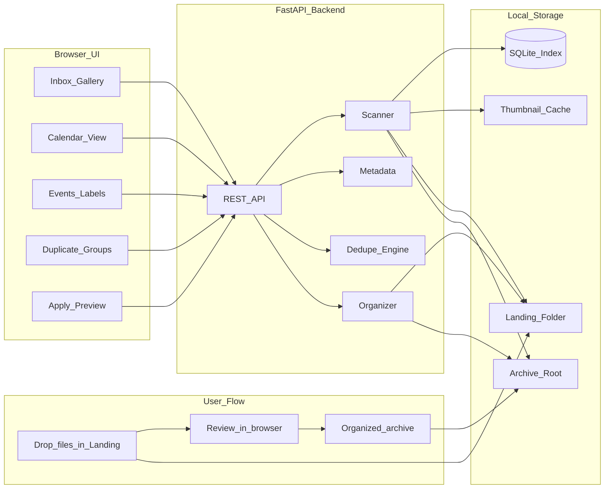


**Why this stack**

- **Python + FastAPI**: strong EXIF/image libraries (`Pillow`, `piexif`, `imagehash`), simple file operations, fast to iterate.
- **React + Vite**: good fit for thumbnail grids, duplicate comparison, and review queues.
- **Docker**: reproducible dev environment; backend + frontend run in containers with host media folder mounted in.

## Project layout

Root directory: `~/Documents/github/imageOrganizer/` (clone or init here; all app code lives in this repo).

```
~/Documents/github/imageOrganizer/
├── backend/
│   ├── app/
│   │   ├── main.py           # FastAPI app, CORS, routes
│   │   ├── config.py         # paths via env (MEDIA_ROOT, APP_DATA_DIR)
│   │   ├── db.py             # SQLite schema + queries
│   │   ├── scanner.py        # recursive scan, thumbnail gen
│   │   ├── metadata.py       # EXIF read/write
│   │   ├── dedupe.py         # exact + perceptual grouping
│   │   ├── organizer.py      # date sort, rename, apply ops
│   │   ├── events.py         # event/label CRUD + file assignment
│   │   └── models.py         # Pydantic request/response types
│   ├── requirements.txt
│   └── pyproject.toml        # optional; ruff/pytest config
├── frontend/
│   ├── src/
│   │   ├── App.tsx
│   │   ├── api/client.ts     # typed fetch wrapper
│   │   ├── pages/
│   │   │   ├── Inbox.tsx     # landing folder gallery (workflow entry)
│   │   │   ├── Calendar.tsx  # month calendar linked to capture dates (primary browse)
│   │   │   ├── Events.tsx    # browse/manage event labels (trips, games, etc.)
│   │   │   ├── Duplicates.tsx
│   │   │   ├── Review.tsx
│   │   │   └── Settings.tsx
│   │   └── components/
│   │       ├── PhotoGrid.tsx
│   │       ├── PhotoDetail.tsx
│   │       ├── ApplyPanel.tsx
│   │       ├── CalendarMonth.tsx   # month grid with day cells
│   │       ├── CalendarDayPanel.tsx # selected day's photo grid
│   │       ├── EventPicker.tsx     # assign events to photo(s)
│   │       └── EventBadge.tsx      # colored label chip
│   ├── package.json
│   └── vite.config.ts        # proxy /api → backend:8000 in Docker
├── docker-compose.yml        # dev: backend + frontend with hot reload
├── backend/Dockerfile
├── frontend/Dockerfile
├── .dockerignore
├── .env.example              # MEDIA_HOST_PATH, APP_DATA_HOST_PATH
├── .gitignore
└── README.md
```

## Docker setup

The app runs in **two containers** orchestrated by Docker Compose. No local Python/Node install required for day-to-day dev.

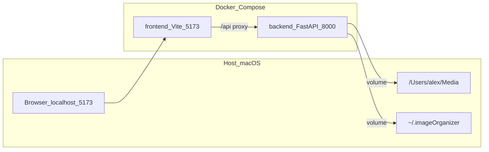

**Services**

| Service | Image | Port | Purpose |
|---------|-------|------|---------|
| `backend` | `backend/Dockerfile` (Python 3.12) | 8000 | FastAPI, scanner, file ops |
| `frontend` | `frontend/Dockerfile` (Node 20) | 5173 | Vite dev server + HMR |

**Volume mounts** (configured in `.env`, defaults for your machine):

| Host path | Container path | Purpose |
|-----------|----------------|---------|
| `/Users/alex/Media` | `/media` | Inbox, archive, trash — read/write |
| `~/.imageOrganizer` | `/data` | SQLite DB, thumbnail cache |
| `./backend` | `/app` | Hot reload (dev) |
| `./frontend` | `/app` | Hot reload (dev) |

**Environment variables** (`.env.example`):

```
MEDIA_HOST_PATH=/Users/alex/Media
APP_DATA_HOST_PATH=/Users/alex/.imageOrganizer
MEDIA_ROOT=/media
APP_DATA_DIR=/data
```

Backend `config.py` resolves paths from `MEDIA_ROOT` / `APP_DATA_DIR` inside the container, mapping to inbox (`/media/inbox`), archive (`/media/photos`), trash (`/media/.trash`), and app data (`/data/db.sqlite`, `/data/thumbs/`).

**Commands**

```bash
cd ~/Documents/github/imageOrganizer
cp .env.example .env
docker compose up --build        # start dev stack
docker compose down              # stop
```

App available at **http://localhost:5173** (frontend proxies `/api` → backend).

**Production build** (optional later): multi-stage frontend Dockerfile builds static assets; nginx or backend serves them. Not required for v1 local use.

## Landing folder workflow (primary)

The app is built around an **inbox → review → archive** flow:

1. **Landing folder** — user drops new photos at `/Users/alex/Media/inbox/` (Downloads, AirDrop, camera import, etc.). Configurable in Settings.
2. **Scan inbox** — app indexes landing folder only for the primary workflow; shows count badge when new files are waiting.
3. **Review** — user inspects metadata, resolves duplicates, flags keep/delete.
4. **Apply** — approved files move from landing → archive using date/rename patterns; rejects go to trash.
5. **Empty inbox** — successful apply clears the landing folder, giving a clear "done" signal.

**Why landing-first**

- One obvious place to dump messy imports without touching the organized library.
- Dedupe can compare inbox files against the **entire archive**, catching re-imports.
- Safer defaults: archive is read-only during review; only explicit Apply mutates files.

**Archive** — organized output at `/Users/alex/Media/photos/` with pattern `/{YYYY}/{MM}/{DD}/`. Explored primarily via the **Calendar** view (by capture date), not folder paths.

## Data model (SQLite)


| Table              | Purpose                                                                                               |
| ------------------ | ----------------------------------------------------------------------------------------------------- |
| `config`           | Landing path, archive path, rename/date patterns                                                      |
| `files`            | One row per image: path, `location` (`inbox`                                                          |
| `review_decisions` | Per-file: `keep` / `delete` / `move` / `rename`, target path/pattern                                  |
| `duplicate_groups` | Group id + member file ids (exact or perceptual); may span inbox + archive                            |
| `events`           | Named label/event: name, color, optional `start_date` / `end_date`, optional cover photo, description |
| `file_events`      | Many-to-many: `file_id` ↔ `event_id`                                                                  |
| `operations_log`   | Applied moves/renames/deletes for audit + future undo                                                 |


**Capture date resolution order**: EXIF `DateTimeOriginal` → EXIF `DateTime` → file mtime.

## Feature design (v1)

### 1. Inbox scan & browse (primary view)

- On first launch, create `/Users/alex/Media/inbox/`, `/Users/alex/Media/photos/`, and `/Users/alex/Media/.trash/` if missing; show paths in Settings.
- **Scan inbox** watches/recursively scans landing folder only; skips hidden files (`.DS_Store`, dotfiles).
- Supported formats v1: **JPEG, PNG, HEIC** (via `pillow-heif`), **TIFF, WebP**.
- Generate cached thumbnails (~~400px) under `~~/.imageOrganizer/thumbs/` keyed by file hash + mtime.
- **Inbox page**: paginated grid of pending files; badge/count when landing has unprocessed items.

### 2. Calendar browse view (primary library UI)

The main way to explore organized (and optionally pending) media is a **month calendar** where each day links to its photos.

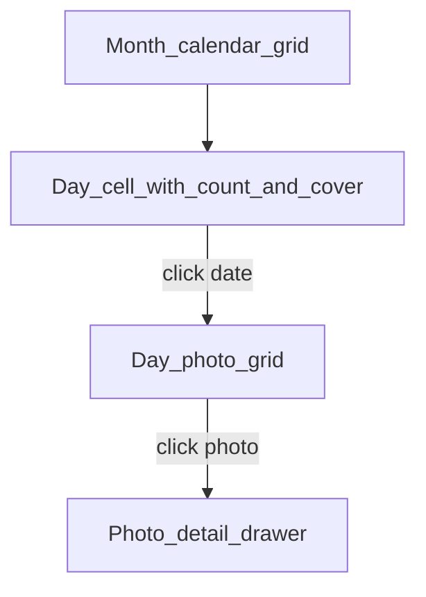


**Month view**

- Standard month grid with prev/next month navigation and year picker.
- Days with media show: **photo count badge**, subtle highlight, and a **cover thumbnail** (first photo of the day by capture time).
- Days with no media are dimmed and not clickable.
- Toggle filter: **Archive only** (default), **Include inbox**, or **Filter by event** (one or more event labels).
- Route: `/calendar` (default month = today); `/calendar/2024/07` for direct month link.

**Day drill-down**

- Clicking a day opens a **day panel** (below calendar or side drawer) with a photo grid for that date, sorted by capture time.
- Each thumbnail opens the existing **PhotoDetail** drawer (metadata, EXIF, actions).
- URL updates to `/calendar/2024/07/04` so days are bookmarkable/shareable locally.

**Date source**

- `capture_day` derived at scan time from EXIF `DateTimeOriginal` → `DateTime` → file mtime.
- Files with no reliable date grouped under an **Undated** section (link in calendar header, not on the grid).

**Backend**

- `GET /calendar/summary?year=2024&month=7&location=archive|all` → `[{ date, count, cover_file_id }]`
- `GET /calendar/day?date=2024-07-04&location=archive|all` → paginated file list for that day
- SQLite index on `capture_day` for fast month aggregation.

**Frontend library**: `react-day-picker` v9 for the month grid, customized day renderers for count badges and cover thumbs.

**Archive** — organized output at `/Users/alex/Media/photos/`. Explored via **Calendar** (by date) and **Events** (by label, spanning multiple dates).

## Events & labels

**Events** are user-defined labels for grouping photos around meaningful moments — multi-day trips ("Trip to Spain"), single-day occasions ("NY World Series Game 3"), or any custom grouping. A photo can belong to **multiple events**.


| Example event        | Typical span                        |
| -------------------- | ----------------------------------- |
| Trip to Spain        | Jun 10 – Jun 24 (many days)         |
| NY World Series      | Oct 30 (one day, or series of days) |
| Emma's birthday 2024 | Apr 12                              |


Events are stored in SQLite only (not written to EXIF in v1) so assignment is fast and reversible.

### 3. Events & labels (browse + assign)

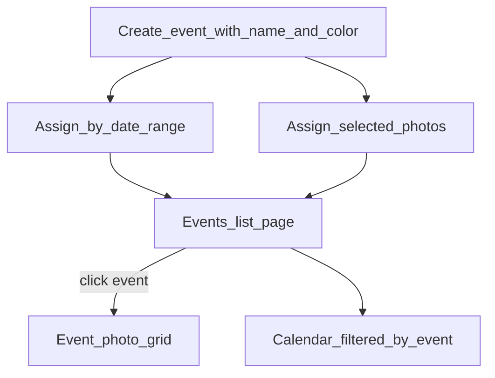


**Create & manage**

- **Events page** (`/events`): card/list of all events — name, color chip, photo count, date span (earliest → latest capture date among members), cover thumbnail.
- Create/edit/delete events: name, optional description, pick a **color** (for badges and calendar highlights).
- Optional `start_date` / `end_date` on the event (metadata only — not enforced, but used for quick-assign suggestions).

**Assign photos to an event**

- **By date range**: from Calendar or Events page — pick start/end dates → assign all archive photos in that range to the event (with preview count before confirming).
- **By selection**: in day view or event grid — multi-select photos → "Add to event".
- **Per photo**: EventPicker in PhotoDetail drawer — add/remove events on a single file.
- **During review**: optional event picker on inbox items before Apply (event assignment carries over to archive).

**Browse by event**

- Click an event → full photo grid sorted by capture date (spans however many days the event covers).
- Route: `/events/trip-to-spain` (slug from name).

**Calendar integration**

- **Event filter** dropdown/chips on Calendar page — select one or more events to filter the month grid and day panel.
- Filtered month view: only days containing photos in the selected event(s) are highlighted; other days dimmed.
- Day panel shows **event badges** on each thumbnail when events are assigned.
- Selecting an event can auto-navigate calendar to the event's `start_date` month (or earliest member photo).

**Backend**

- `GET/POST/PATCH/DELETE /events`
- `GET /events/{id}/files` — paginated photos for an event
- `POST /events/{id}/files` — bulk assign by `file_ids[]` or `{ start_date, end_date }`
- `DELETE /events/{id}/files/{file_id}` — remove one photo from event
- `PATCH /files/{id}/events` — replace event set on a file
- `GET /files?event_id=` and `GET /calendar/summary?event_id=` — filter support

### 4. Metadata

- Detail panel shows EXIF: date, camera, lens, GPS (if present), dimensions, file size.
- Editable fields v1: **caption/description** (EXIF ImageDescription or XMP if present), **rating** (stored in DB; optional EXIF write later).
- API: `GET /files/{id}/metadata`, `PATCH /files/{id}/metadata`.

### 5. Date-based organization (preview first)

- Archive root + pattern configured in Settings, default `/{YYYY}/{MM}/{DD}/`.
- **Preview** computes inbox file → archive path without touching files.
- Review queue shows before → after for each inbox file.
- **Apply** moves from landing → archive; conflicts (name collision) get suffix `_(1)`, `_(2)`.
- After apply, landing folder should be empty (or only contain skipped/rejected items).

### 6. Deduplication

- **Exact**: SHA-256 of file bytes — grouped on scan.
- **Near-duplicate**: perceptual hash (`imagehash.phash`) — Hamming distance ≤ 5 (configurable).
- **Cross-library dedupe**: compare inbox files against archive index — flag "already have this" before apply.
- Duplicates UI: side-by-side comparison (inbox vs archive), pick **keeper**, mark inbox copy delete/skip.
- Never auto-delete; always requires review + apply.

### 7. Batch rename

- Pattern tokens: `{date}`, `{YYYY}`, `{MM}`, `{DD}`, `{original}`, `{camera}`, `{seq:4}`.
- Example: `{YYYY}-{MM}-{DD}_{seq:4}_{original}` → `2024-07-04_0001_IMG_1234.jpg`.
- Preview + apply same pipeline as date sort.

### 8. Review workflow + safe apply

- **Review page**: queue of pending decisions (duplicates, organize preview, manual flags).
- Actions: Keep, Delete (move to `/Users/alex/Media/.trash/`), Move, Rename.
- **Apply panel**: summary counts + dry-run diff list; user confirms once.
- All destructive ops go to trash first, not permanent delete (v1).

## API surface (core routes)


| Method                | Route                   | Purpose                                                         |
| --------------------- | ----------------------- | --------------------------------------------------------------- |
| GET/PATCH             | `/config`               | Landing path, archive path, patterns                            |
| POST                  | `/scan/inbox`           | Scan landing folder (async)                                     |
| POST                  | `/scan/archive`         | Index archive for dedupe/browse (async)                         |
| GET                   | `/scan/status`          | Progress                                                        |
| GET                   | `/files`                | Paginated list; filter by `location`, `date`, `capture_day`     |
| GET                   | `/calendar/summary`     | Month overview: dates with counts + cover thumb                 |
| GET                   | `/calendar/day`         | All files for a given `capture_day`; optional `event_id` filter |
| GET/POST/PATCH/DELETE | `/events`               | List, create, update, delete event labels                       |
| GET                   | `/events/{id}/files`    | Photos in an event                                              |
| POST                  | `/events/{id}/files`    | Bulk assign by `file_ids` or date range                         |
| PATCH                 | `/files/{id}/events`    | Set events on a single file                                     |
| GET                   | `/files/{id}/thumbnail` | Cached thumb                                                    |
| GET/PATCH             | `/files/{id}/metadata`  | Read/write metadata                                             |
| GET                   | `/duplicates`           | Duplicate groups                                                |
| POST                  | `/organize/preview`     | Date-sort / rename preview                                      |
| POST                  | `/review/decisions`     | Save keep/delete/move                                           |
| GET                   | `/review/queue`         | Pending items                                                   |
| POST                  | `/apply`                | Execute approved operations                                     |


Long-running scan runs in a **background task** (FastAPI `BackgroundTasks` or asyncio worker); frontend polls `/scan/status`.

## Safety defaults

- No file mutations until user clicks **Apply**.
- Deletes → move to app trash directory.
- Log every applied operation in `operations_log`.
- Re-scan detects moved/deleted files and updates index.

## Dev workflow

Primary: **Docker Compose** (see [Docker setup](#docker-setup) above).

```bash
cd ~/Documents/github/imageOrganizer
cp .env.example .env
docker compose up --build
# → http://localhost:5173
```

Fallback without Docker (optional): run backend and frontend natively if preferred — same env vars, same ports.

## Implementation phases

Work is ordered so each phase is demoable in the browser.

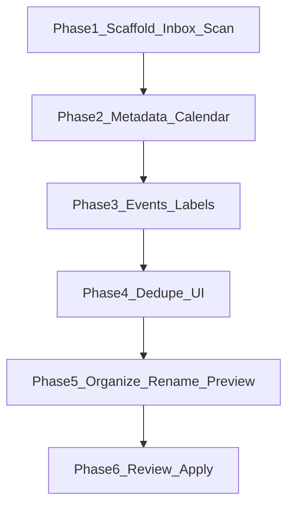


1. **Scaffold + inbox scan** — init repo at `~/Documents/github/imageOrganizer`, Docker Compose + Dockerfiles, FastAPI/React skeleton, SQLite, create landing/archive paths, scan inbox, show Inbox grid + pending count.
2. **Metadata + calendar** — EXIF panel, `capture_day` indexing, calendar month grid with day drill-down.
3. **Events & labels** — event CRUD, bulk assign by date range/selection, Events browse page, calendar event filter.
4. **Dedupe** — hash on scan, duplicate groups page, pick keeper.
5. **Organize + rename preview** — pattern engine, before/after paths in UI.
6. **Review + apply** — decision queue, trash-safe apply, operations log.

## Key dependencies

**Backend** (`requirements.txt`):

- `fastapi`, `uvicorn[standard]`, `pillow`, `pillow-heif`, `piexif`, `imagehash`, `python-multipart`

**Frontend** (`package.json`):

- `react`, `react-router-dom`, `vite`, `@tanstack/react-query` (server state + polling)
- `react-day-picker` (calendar month grid with custom day renderers)

## Out of scope for v1

- iCloud Photos library integration
- RAW development / editing
- Cloud sync or multi-user auth
- AI auto-tagging
- Permanent delete (trash only)

## README contents

- Prerequisites: **Docker Desktop** (primary); Python 3.12+ / Node 20+ optional for native dev
- Quick start: `cp .env.example .env && docker compose up --build`
- Landing folder workflow: drop photos in `/Users/alex/Media/inbox/` → scan → review → apply to `/Users/alex/Media/photos/`
- Calendar browse: navigate by month, click a date to see all photos from that day
- Events/labels: group photos by trips or occasions; filter calendar by event
- Default paths under `/Users/alex/Media` and how to change them in Settings
- Safety model (preview → review → apply)
- Example rename/date patterns

---

<a id="chapter-2-architecture-design-doc"></a>

## Chapter 2: Architecture design doc

> **Overview:** Create `docs/ARCHITECTURE.md` documenting the Image Organizer system (stack, data model, API, frontend, workflows), link it from README, and add a Cursor rule so agents keep the doc in sync when architecture changes.

## Deliverables

1. **[`docs/ARCHITECTURE.md`](/Users/alex/Documents/github/imageOrganizer/docs/ARCHITECTURE.md)** — committed to git (unlike `.cursor/plans/`)
2. **[`.cursor/rules/architecture-doc.mdc`](/Users/alex/Documents/github/imageOrganizer/.cursor/rules/architecture-doc.mdc)** — maintenance rule for Cursor agents
3. **[`README.md`](/Users/alex/Documents/github/imageOrganizer/README.md)** — one-line link under the version line

## Document structure

Single markdown file with mermaid diagrams where they clarify structure. Sections:

### 1. Overview

- Purpose: local-first photo/video organizer with inbox → review → archive workflow
- Design principles: no filesystem writes until Apply; trash not delete; SQLite index separate from media files

### 2. System context

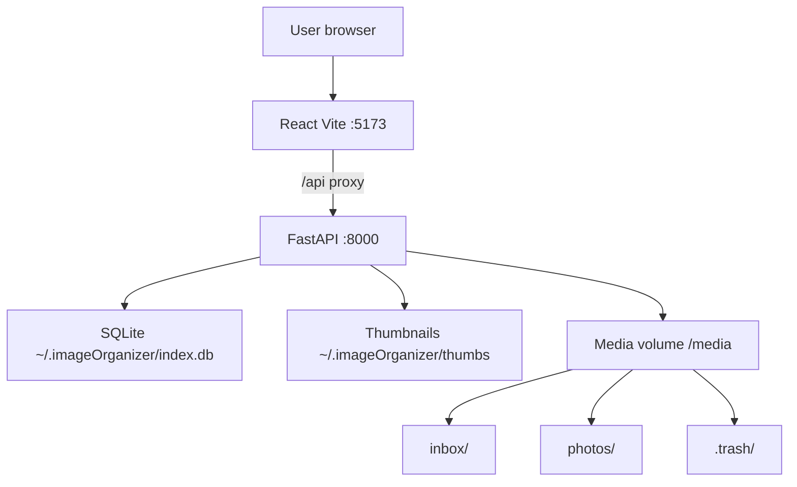

### 3. Tech stack

| Layer | Choice |
|-------|--------|
| Backend | Python 3.12, FastAPI, SQLite |
| Frontend | React 18, TypeScript, Vite, TanStack Query, react-router |
| Media | Pillow, ffmpeg/ffprobe (video), perceptual hash dedupe |
| Deploy | Docker Compose ([`docker-compose.yml`](/Users/alex/Documents/github/imageOrganizer/docker-compose.yml)) |

### 4. Repository layout

Brief map of [`backend/app/`](/Users/alex/Documents/github/imageOrganizer/backend/app/) modules and [`frontend/src/`](/Users/alex/Documents/github/imageOrganizer/frontend/src/) — not a file tree dump, only meaningful boundaries:

- `main.py` — routes
- `db.py` — schema + connection
- `scanner.py`, `metadata.py`, `organizer.py`, `dedupe.py` — core pipeline
- `events.py`, `people.py`, `tags.py` — domain services
- `api/client.ts` — frontend API surface
- `pages/` — route-level views

### 5. Data model

Entity-relationship summary from [`backend/app/db.py`](/Users/alex/Documents/github/imageOrganizer/backend/app/db.py):

- **files** — indexed media (inbox | archive)
- **events** ↔ **file_events** — trip/event grouping
- **people** ↔ **file_people** — who is in a photo
- **tags** ↔ **file_tags** — generic photo tags (Cars, house project)
- **tags** ↔ **event_tags** — optional labels on events (separate from file tags)
- **duplicate_groups** / **duplicate_members**, **review_decisions**, **operations_log**, **config**

Include a mermaid ER diagram for the junction tables.

### 6. Filesystem layout

From [`backend/app/config.py`](/Users/alex/Documents/github/imageOrganizer/backend/app/config.py):

- `MEDIA_ROOT/inbox`, `photos`, `.trash`
- `APP_DATA_DIR/index.db`, `thumbs/`
- Env vars: `MEDIA_ROOT`, `APP_DATA_DIR` (Docker maps host paths in compose)

### 7. Core workflows

Short numbered flows:

1. **Scan** — `scanner.py` walks inbox/archive, extracts metadata, writes `files` rows
2. **Organize preview** — `organizer.py` computes target paths from date/rename patterns
3. **Review / Apply** — user queues decisions; Apply moves/renames/deletes (to trash)
4. **Dedupe** — SHA256 exact + pHash perceptual groups

### 8. API overview

Grouped endpoint table (not every route — link to FastAPI `/docs` for full spec):

- Config, scan, files, calendar
- Events, people, tags (including assign-ids / unassign-ids)
- Duplicates, review, organize

Note: `FileOut` includes nested `events`, `people`, `tags`.

### 9. Frontend routes

From [`frontend/src/App.tsx`](/Users/alex/Documents/github/imageOrganizer/frontend/src/App.tsx):

| Route | Page |
|-------|------|
| `/inbox` | Scan + bulk assign (events, people, tags) |
| `/calendar` | Multi-month browse + day panel |
| `/events`, `/people`, `/tags` | CRUD / management |
| `/browse` | Filter by person or tag |
| `/duplicates`, `/review`, `/settings` | Dedupe, apply queue, paths |

### 10. Versioning

- Date-based versions (`YYYY.MM.DD`, same-day suffix `a`–`z`) — see [`CHANGELOG.md`](/Users/alex/Documents/github/imageOrganizer/CHANGELOG.md)
- Version strings: [`frontend/package.json`](/Users/alex/Documents/github/imageOrganizer/frontend/package.json), FastAPI `version`, sidebar UI

### 11. Maintenance (meta section)

At the bottom of the doc, a **“Keeping this document current”** checklist:

Update `docs/ARCHITECTURE.md` when you change:

- SQLite schema (`db.py`)
- New API route groups or auth boundaries
- New frontend routes or major user workflows
- Docker volumes / env vars
- External dependencies (ffmpeg, etc.)

---

## Cursor rule — [`.cursor/rules/architecture-doc.mdc`](/Users/alex/Documents/github/imageOrganizer/.cursor/rules/architecture-doc.mdc)

```yaml
---
description: Keep docs/ARCHITECTURE.md in sync with structural changes
alwaysApply: true
---
```

Rule body (concise):

- When modifying schema, API routes, App routes, docker-compose, or core module responsibilities, **update the relevant section(s) of `docs/ARCHITECTURE.md` in the same task**
- Do not duplicate README quick-start or CHANGELOG release notes in the arch doc
- Prefer updating existing sections over adding redundant prose
- If a change is trivial (bug fix, styling), skip the doc update

**Commit `.cursor/rules/`** to git (not gitignored — unlike `.cursor/plans/`).

## README update

Add after the version line:

```markdown
Architecture: [docs/ARCHITECTURE.md](docs/ARCHITECTURE.md)
```

## Out of scope

- Auto-generated OpenAPI → markdown sync
- Separate ADR files per decision
- Version bump / CHANGELOG entry (unless you ask)
- Editing plan files in `.cursor/plans/`

## Verification

- `docs/ARCHITECTURE.md` exists and renders mermaid in GitHub preview
- README links to it
- `.cursor/rules/architecture-doc.mdc` exists with `alwaysApply: true`
- Doc reflects current features including `file_tags`, video support, Tags page

---

<a id="chapter-3-initial-github-push"></a>

## Chapter 3: Initial GitHub push

> **Overview:** Initialize git in imageOrganizer, create three logical commits (scaffold, backend, frontend), and push to https://github.com/aherna04/imageOrganizer — creating the remote repo if needed.

# Initial GitHub Commits

## Current state

- Project lives at [`/Users/alex/Documents/github/imageOrganizer`](/Users/alex/Documents/github/imageOrganizer)
- **No git repository** yet (`git init` never run)
- [`.gitignore`](/Users/alex/Documents/github/imageOrganizer/.gitignore) already excludes secrets and build artifacts: `.env`, `backend/.venv/`, `frontend/node_modules/`, `frontend/dist/`
- [`README.md`](/Users/alex/Documents/github/imageOrganizer/README.md) and [`.env.example`](/Users/alex/Documents/github/imageOrganizer/.env.example) exist
- GitHub URL `https://github.com/aherna04/imageOrganizer` returned **404** — repo likely needs to be created first (empty, no README)

## Pre-flight checks

Before committing:

1. Confirm `.env` is **not** staged (gitignored)
2. Confirm `backend/.venv/` and `frontend/node_modules/` are not staged
3. Do **not** commit empty `scripts/` folder unless you add a placeholder — skip it for now

Optional small README tweak (can do in scaffold commit): mention videos, people/tags, and Browse page — current README only covers the original photo workflow.

## Commit structure (your choice: 3 commits)

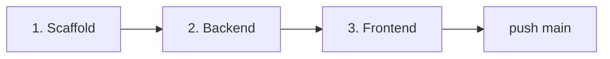

### Commit 1 — Scaffold and Docker

**Message:** `Add project scaffold, Docker Compose, and dev config`

**Files:**
- `.gitignore`, `.dockerignore`, `.env.example`
- `README.md`
- `docker-compose.yml`
- `backend/Dockerfile`, `backend/requirements.txt`
- `frontend/Dockerfile`, `frontend/package.json`, `frontend/tsconfig.json`, `frontend/vite.config.ts`, `frontend/index.html`

### Commit 2 — Backend

**Message:** `Add FastAPI backend: scan, calendar, events, people, tags, video support`

**Files:**
- `backend/app/` (all Python modules: `main.py`, `db.py`, `scanner.py`, `metadata.py`, `events.py`, `people.py`, `tags.py`, etc.)

### Commit 3 — Frontend

**Message:** `Add React frontend: inbox, calendar, events, browse, people management`

**Files:**
- `frontend/src/` (pages, components, API client, styles)
- `frontend/src/vite-env.d.ts`

## Git commands (execution order)

Run from `/Users/alex/Documents/github/imageOrganizer`:

```bash
git init
git branch -M main

# Commit 1 — scaffold only
git add .gitignore .dockerignore .env.example README.md docker-compose.yml \
  backend/Dockerfile backend/requirements.txt \
  frontend/Dockerfile frontend/package.json frontend/tsconfig.json \
  frontend/vite.config.ts frontend/index.html
git commit -m "Add project scaffold, Docker Compose, and dev config"

# Commit 2 — backend
git add backend/app/
git commit -m "Add FastAPI backend: scan, calendar, events, people, tags, video support"

# Commit 3 — frontend
git add frontend/src/
git commit -m "Add React frontend: inbox, calendar, events, browse, people management"

# Remote + push
git remote add origin https://github.com/aherna04/imageOrganizer.git
git push -u origin main
```

## GitHub repo setup

If the remote repo does not exist yet, create it first (one of):

- **GitHub web:** [github.com/new](https://github.com/new) → name `imageOrganizer`, owner `aherna04`, **empty** (no README/license — we have our own)
- **gh CLI** (if available after install): `gh repo create aherna04/imageOrganizer --private --source=. --remote=origin --push`

Push requires GitHub auth (SSH key or HTTPS credential / `gh auth login`).

## Verification

After push:

```bash
git log --oneline
git status   # clean working tree
git remote -v
```

Confirm on GitHub: 3 commits on `main`, no `.env` or `.venv` in the tree.

## Out of scope

- CI/CD, GitHub Actions
- LICENSE file (add separately if desired)
- `package-lock.json` (not present; npm install in Docker handles deps)

---

<a id="chapter-4-finish-github-push"></a>

## Chapter 4: Finish GitHub push

> **Overview:** Install the GitHub CLI as a standalone binary in ~/bin, authenticate interactively, create the empty remote repo, and push the three existing local commits on main.

## Current state (already done)

Local repo at [`/Users/alex/Documents/github/imageOrganizer`](/Users/alex/Documents/github/imageOrganizer) is ready:

| Step | Status |
|------|--------|
| `git init` + 3 commits on `main` | Done |
| `origin` → `https://github.com/aherna04/imageOrganizer.git` | Done |
| Working tree clean | Done |
| Remote repo exists on GitHub | **404 — not created yet** |
| `gh` on PATH | **Not installed** |

Commit history (unchanged):

```
a4fefc0 Add React frontend: inbox, calendar, events, browse, people management
b43d144 Add FastAPI backend: scan, calendar, events, people, tags, video support
0d48b78 Add project scaffold, Docker Compose, and dev config
```

## Remaining work

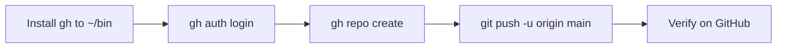

### 1. Install `gh` binary (no Homebrew)

Run in your terminal (macOS x86_64):

```bash
mkdir -p ~/bin
curl -sL -o /tmp/gh.zip \
  "https://github.com/cli/cli/releases/download/v2.96.0/gh_2.96.0_macOS_amd64.zip"
unzip -q /tmp/gh.zip -d /tmp/gh
cp /tmp/gh/gh_*/bin/gh ~/bin/gh
chmod +x ~/bin/gh
```

Ensure `~/bin` is on PATH. If `which gh` still fails, add to `~/.zshrc`:

```bash
export PATH="$HOME/bin:$PATH"
```

Then reload: `source ~/.zshrc` and confirm: `gh --version`.

### 2. Authenticate (you must run this interactively)

```bash
gh auth login
```

Recommended choices when prompted:

- **GitHub.com**
- **HTTPS**
- **Login with a web browser** (easiest) or paste a Personal Access Token

Confirm: `gh auth status` should show `Logged in to github.com as aherna04`.

### 3. Create the empty GitHub repo

From the project directory:

```bash
cd ~/Documents/github/imageOrganizer
gh repo create aherna04/imageOrganizer --private \
  --description "Local photo and video organizer"
```

Do **not** pass `--push` or initialize with README/license — the local repo already has 3 commits and `origin` is configured.

If `gh` reports the repo already exists, skip this step.

### 4. Push

```bash
git push -u origin main
```

With `gh auth login` + HTTPS, git will use gh's credential helper automatically.

### 5. Verify

```bash
git log --oneline
git status          # clean working tree
git remote -v
gh repo view aherna04/imageOrganizer --web
```

On GitHub confirm:

- 3 commits on `main`
- No `.env`, `backend/.venv/`, or `frontend/node_modules/` in the tree (all gitignored)

## What the agent will do after you confirm

Once you switch back to Agent mode and approve execution:

1. Mark `create-repo` in progress → install `gh` to `~/bin` and update PATH if needed
2. **Pause for you** to run `gh auth login` in your terminal (cannot be automated)
3. Create repo + push + verify
4. Mark all todos complete

## If push still fails after auth

- **Repo exists but push rejected:** ensure the GitHub repo was created **empty** (no initial README commit on remote)
- **Auth works but git push prompts for password:** run `gh auth setup-git`, then retry push
- **Prefer SSH later:** `gh auth login` with SSH + `git remote set-url origin git@github.com:aherna04/imageOrganizer.git`

## Out of scope (unchanged from original plan)

- CI/CD, LICENSE, README updates, editing the plan file

---

<a id="chapter-5-video-support"></a>

## Chapter 5: Video support

> **Overview:** Enable MP4 and other common video formats in the inbox/archive workflow by extending the scanner, extracting metadata/thumbnails via ffmpeg, and updating the frontend to display and play videos alongside photos.

## Why videos don't appear today

Your MP4s in `inbox/i9 spring 2018 flag football/` are never indexed. The pipeline is image-only at every step:

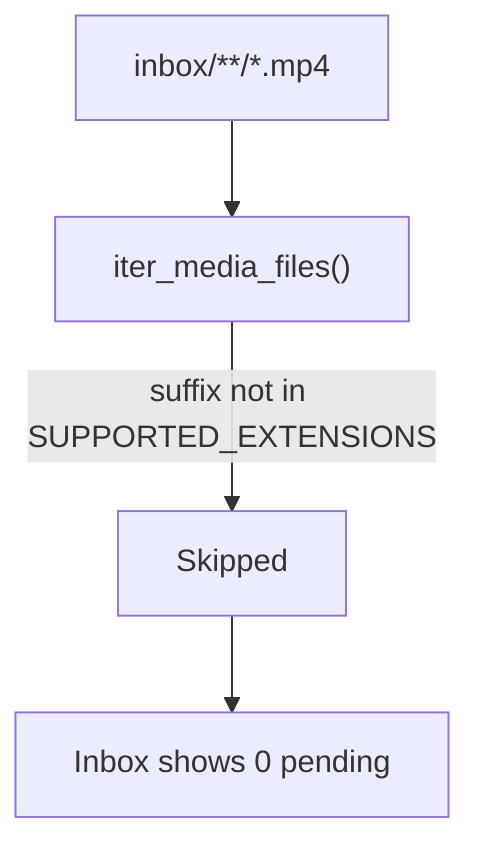

| Layer | Current behavior | Blocker |
|-------|------------------|---------|
| [`config.py`](backend/app/config.py) | `SUPPORTED_EXTENSIONS` = jpg, heic, png… | No `.mp4` |
| [`metadata.py`](backend/app/metadata.py) | `Image.open()` for metadata + thumbnails | PIL can't open video |
| [`metadata.py`](backend/app/metadata.py) | `compute_phash()` via imagehash | N/A for video (already returns `None` on failure) |
| [`Dockerfile`](backend/Dockerfile) | No ffmpeg | Can't extract frames/metadata |
| Frontend | `` everywhere | No playback |

Subfolder scanning already works (`rglob` in `iter_media_files`) — only the extension filter blocks your files.

## Target behavior

- Scan inbox/archive picks up `.mp4`, `.mov`, `.m4v`, `.mkv`, `.webm`, `.avi`
- Videos get `capture_date` from ffprobe creation time, fallback to file mtime (same as images today)
- Thumbnail = ffmpeg frame grab (JPEG cache, same as photos)
- Inbox/Calendar/Browse grids show thumbnail + video badge
- PhotoDetail plays video inline with `<video controls>`
- Events, people, tags, organize/review flows work unchanged (extension preserved in [`organizer.py`](backend/app/organizer.py) line 61–62)

## Backend changes

### 1. Config — split image vs video extensions

[`backend/app/config.py`](backend/app/config.py):

```python
IMAGE_EXTENSIONS = {".jpg", ".jpeg", ".png", ".heic", ".heif", ".tiff", ".tif", ".webp"}
VIDEO_EXTENSIONS = {".mp4", ".mov", ".m4v", ".mkv", ".webm", ".avi"}
SUPPORTED_EXTENSIONS = IMAGE_EXTENSIONS | VIDEO_EXTENSIONS

def media_type_for_suffix(suffix: str) -> Literal["image", "video"]:
    return "video" if suffix.lower() in VIDEO_EXTENSIONS else "image"
```

### 2. Docker — install ffmpeg

[`backend/Dockerfile`](backend/Dockerfile): add `ffmpeg` to apt-get install (provides `ffmpeg` + `ffprobe`).

### 3. Metadata + thumbnails

[`backend/app/metadata.py`](backend/app/metadata.py):

- `is_video(path)` helper
- `extract_video_metadata(path)` via `ffprobe -v quiet -print_format json -show_format -show_streams`
  - `creation_time` or `tags.creation_time` → `capture_date` / `capture_day`
  - video stream `width` / `height`
  - fallback to mtime (existing logic)
- `generate_video_thumbnail(path, file_id, mtime)` via ffmpeg:

  ```bash
  ffmpeg -ss 1 -i input.mp4 -vframes 1 -q:v 2 -y output.jpg
  ```

- Branch in `extract_metadata()`, `generate_thumbnail()`, `compute_phash()` (skip phash for video)

### 4. API — expose media type + playback

[`backend/app/models.py`](backend/app/models.py): add `media_type: Literal["image", "video"]` to `FileOut`.

[`backend/app/main.py`](backend/app/main.py):

- `_file_out`: set `media_type` from path suffix
- New endpoint `GET /api/files/{file_id}/original` → `FileResponse` with correct MIME (`video/mp4`, etc.)
- Thumbnail endpoint unchanged (JPEG frame for both)

### 5. No schema migration needed

Videos use the same `files` table. `phash` stays `NULL` for videos; dedupe perceptual grouping skips them (exact SHA-256 dedupe still works).

## Frontend changes

### 1. API client

[`frontend/src/api/client.ts`](frontend/src/api/client.ts):

- Add `media_type: "image" | "video"` to `MediaFile`
- Add `originalUrl(id)` → `/api/files/{id}/original`

### 2. Grid cards

[`frontend/src/components/PhotoGrid.tsx`](frontend/src/components/PhotoGrid.tsx):

- Keep `` for thumbnail
- Overlay `.video-badge` (play icon) when `media_type === "video"`
- Empty state: "No media found" (minor copy tweak)

### 3. Detail drawer

[`frontend/src/components/PhotoDetail.tsx`](frontend/src/components/PhotoDetail.tsx):

- If video: render `<video src={originalUrl} controls poster={thumbUrl}>` instead of ``
- Show duration if available later; not required for v1

### 4. Minor copy updates

Inbox help text, Browse/Events counts: "photos" → "items" or "media" where user-visible (optional, low priority).

## What stays the same

- Calendar groups by `capture_day` (mtime fallback works for your Apr/May 2018 videos)
- Event assignment, people tags, bulk assign — file-type agnostic
- Organize/review move to archive — suffix preserved
- HEIC/image path unchanged

## Test plan

1. Rebuild backend Docker image (ffmpeg installed)
2. Scan inbox → 7 MP4s from `i9 spring 2018 flag football` appear with thumbnails
3. Double-click video → plays in detail drawer
4. Assign to event, tag people, organize to archive — `.mp4` extension kept
5. Existing photos still scan and display normally
6. Calendar shows video days (by mtime/creation date) after archive

## Effort estimate

~4 files backend, ~3 files frontend, 1 Dockerfile change. No DB migration.

---

<a id="chapter-6-tags-and-people"></a>

## Chapter 6: Tags and people

> **Overview:** Add a tags system for events (generic labels) and a people system for individual photos (with bulk assign), plus a Browse page to search photos by person or tag.

## Design (per your choices)

| Entity | Attached to | Example | Search result |
|--------|-------------|---------|---------------|
| **Generic tag** | Event | `winter`, `outdoors` | All photos in events with that tag |
| **Person** | Individual photo | `Elliott`, `Jake` | All photos tagged with that person |

People are **not** event-level — they come from a shared people list and are applied per photo (with bulk apply, mirroring the existing event assign bar).

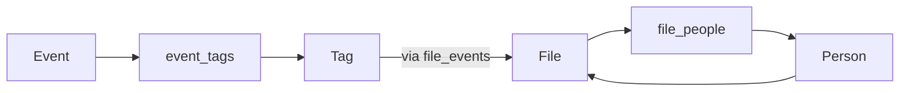

## Database

Add to [`backend/app/db.py`](backend/app/db.py) `SCHEMA`:

```sql
CREATE TABLE tags (
  id INTEGER PRIMARY KEY AUTOINCREMENT,
  name TEXT NOT NULL,
  slug TEXT NOT NULL UNIQUE,
  created_at TEXT DEFAULT (datetime('now'))
);

CREATE TABLE event_tags (
  event_id INTEGER NOT NULL REFERENCES events(id) ON DELETE CASCADE,
  tag_id INTEGER NOT NULL REFERENCES tags(id) ON DELETE CASCADE,
  PRIMARY KEY (event_id, tag_id)
);

CREATE TABLE people (
  id INTEGER PRIMARY KEY AUTOINCREMENT,
  name TEXT NOT NULL,
  slug TEXT NOT NULL UNIQUE,
  created_at TEXT DEFAULT (datetime('now'))
);

CREATE TABLE file_people (
  file_id INTEGER NOT NULL REFERENCES files(id) ON DELETE CASCADE,
  person_id INTEGER NOT NULL REFERENCES people(id) ON DELETE CASCADE,
  PRIMARY KEY (file_id, person_id)
);

CREATE INDEX idx_event_tags_tag ON event_tags(tag_id);
CREATE INDEX idx_file_people_person ON file_people(person_id);
```

`CREATE IF NOT EXISTS` handles existing databases on next startup.

## Backend

### New service modules

**[`backend/app/tags.py`](backend/app/tags.py)**
- `list_tags()` — with `photo_count` (distinct files via event_tags → file_events)
- `create_tag(name)` — slugify, dedupe slug
- `set_event_tags(event_id, tag_ids)` — replace junction rows
- `get_event_tags(event_id)` — tags for one event

**[`backend/app/people.py`](backend/app/people.py)**
- `list_people()` — with `photo_count`
- `create_person(name)` — slugify, dedupe slug
- `set_file_people(file_id, person_ids)` — replace junction rows
- `assign_people_by_ids(person_ids, file_ids)` — bulk add (INSERT OR IGNORE)
- `get_file_people(file_id)`

### Models ([`backend/app/models.py`](backend/app/models.py))

- `TagOut`: `id`, `name`, `slug`, `photo_count`
- `PersonOut`: `id`, `name`, `slug`, `photo_count`
- Extend `EventOut` with `tags: list[TagOut] = []`
- Extend `FileOut` with `people: list[PersonOut] = []`
- `EventUpdate`: add optional `tag_ids: list[int] | None`
- `FilePeopleUpdate`: `person_ids: list[int]`
- `PeopleAssignByIds`: `person_ids: list[int]`, `file_ids: list[int]`

### API routes ([`backend/app/main.py`](backend/app/main.py))

| Method | Endpoint | Purpose |
|--------|----------|---------|
| `GET` | `/api/tags` | List tags with photo counts |
| `POST` | `/api/tags` | Create tag `{ name }` |
| `GET` | `/api/people` | List people with photo counts |
| `POST` | `/api/people` | Create person `{ name }` |
| `PATCH` | `/api/files/{id}/people` | Replace people on one photo |
| `POST` | `/api/people/assign-ids` | Bulk add people to photos |
| `GET` | `/api/files` | Add `person_id` and `tag_id` query params |

**Search queries** (extend existing `api_list_files`):

```sql
-- person_id filter
f.id IN (SELECT file_id FROM file_people WHERE person_id = ?)

-- tag_id filter (photos in tagged events)
f.id IN (
  SELECT fe.file_id FROM file_events fe
  JOIN event_tags et ON et.event_id = fe.event_id
  WHERE et.tag_id = ?
)
```

**Hydration**: update `_file_out` to include `people`; update `_event_out` / `get_event` to include `tags`.

**Event update**: when `tag_ids` present in `PATCH /api/events/{id}`, call `set_event_tags`.

## Frontend

### API client ([`frontend/src/api/client.ts`](frontend/src/api/client.ts))

Add `Tag`, `Person` interfaces; extend `Event` and `MediaFile`; add:
- `listTags()`, `createTag(name)`
- `listPeople()`, `createPerson(name)`
- `updateFilePeople(fileId, personIds)`
- `assignPeopleIds(personIds, fileIds)`
- `listFiles({ personId?, tagId?, ... })`

### New Browse page ([`frontend/src/pages/Browse.tsx`](frontend/src/pages/Browse.tsx))

Route: `/browse` and `/browse/:kind/:slug` (`kind` = `person` | `tag`)

- Left panel: two sections — **People** and **Tags** (clickable list with photo counts)
- Right panel: `PhotoGrid` of matching photos
- Optional search input to filter the list by name
- Add **Browse** nav link in [`frontend/src/App.tsx`](frontend/src/App.tsx)

### Event tags UI ([`frontend/src/pages/Events.tsx`](frontend/src/pages/Events.tsx))

In event detail edit mode (alongside name/color):
- Multi-select tag chips from existing tags + "Add tag" inline create
- Save sends `tag_ids` in `updateEvent`
- Read-only view shows tag badges below title

New component: [`frontend/src/components/TagPicker.tsx`](frontend/src/components/TagPicker.tsx) — toggle tags on/off, create new tag inline (pattern from [`EventPicker.tsx`](frontend/src/components/EventPicker.tsx))

### People on photos

**[`frontend/src/components/PersonPicker.tsx`](frontend/src/components/PersonPicker.tsx)** — toggle people on a single photo; create new person inline

**[`frontend/src/components/BulkPersonAssignBar.tsx`](frontend/src/components/BulkPersonAssignBar.tsx)** — mirror [`BulkEventAssignBar.tsx`](frontend/src/components/BulkEventAssignBar.tsx):
- Select existing person(s) + Assign
- Create new person + assign to selection

Wire into:
- [`frontend/src/components/PhotoDetail.tsx`](frontend/src/components/PhotoDetail.tsx) — `PersonPicker`
- [`frontend/src/pages/Inbox.tsx`](frontend/src/pages/Inbox.tsx) — bulk bar below event bar
- [`frontend/src/components/CalendarDayPanel.tsx`](frontend/src/components/CalendarDayPanel.tsx) — bulk bar

### Photo grid badges ([`frontend/src/components/PhotoGrid.tsx`](frontend/src/components/PhotoGrid.tsx))

Show people names as small badges on photo cards (distinct style from event badges), same as events already shown.

### CSS ([`frontend/src/index.css`](frontend/src/index.css))

- `.person-badge` — neutral/muted chip (vs colored event badges)
- `.tag-badge` — subtle outline chip for event tags
- `.browse-layout` — two-column list + grid (reuse patterns from calendar layout)

## Out of scope (v1)

- Face detection / auto-tagging
- Tagging people on events
- Deleting tags/people (can add later)
- Combined AND/OR multi-filter search

## Test plan

1. Create tag `winter` on event "Vermont 2020" → Browse by tag shows 3 photos
2. Create people `Elliott`, `Jake` → bulk assign to 6 photos on 2014-01-19 → Browse by Elliott shows those photos
3. PhotoDetail toggles people on/off for one photo
4. Event edit adds/removes tags; badges update on event detail
5. Photo cards show people + event badges together

---

# Part II — Calendar

<a id="chapter-7-calendar-browse-vs-focus"></a>

## Chapter 7: Calendar browse vs focus

> **Overview:** Split calendar into two modes: browse (all months with photos in a full-width grid) and focus (3-month sidebar + day thumbnails when a date is selected), with a close control to deselect and CSS fixes for broken month grids.

## Problem

[`Calendar.tsx`](frontend/src/pages/Calendar.tsx) always slices `activeMonths` to 3 and paginates with Prev/Next — even when no day is selected. That leaves most of the screen empty (screenshot 1). When a day **is** selected, the 3-column + thumbnail split works well (screenshot 3), but there is no way to deselect. Some month grids still collapse (October 2014 overlap / weekday misalignment in screenshot 2) because columns can shrink below react-day-picker's 7×32px intrinsic width.

## Target behavior

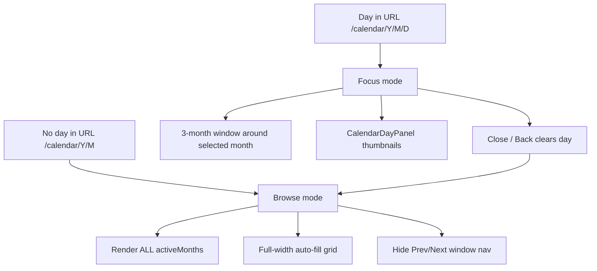

| Mode | URL | Months shown | Layout | Nav |
|------|-----|--------------|--------|-----|
| Browse | `/calendar/:year/:month` | All months with photos | Full-width scrollable grid | None |
| Focus | `/calendar/:year/:month/:day` | 3 months (window aligned to selected month) | Left calendars + right thumbnails | Prev/Next (3-month jump) |

---

## 1. Conditional month list — [`Calendar.tsx`](frontend/src/pages/Calendar.tsx)

Replace the always-3 slice:

```tsx
const visibleMonths = useMemo(
  () => activeMonths.slice(windowStartIndex, windowStartIndex + 3),
  [activeMonths, windowStartIndex]
);
```

With:

```tsx
const visibleMonths = useMemo(() => {
  if (selectedDayStr) {
    return activeMonths.slice(windowStartIndex, windowStartIndex + 3);
  }
  return activeMonths; // browse: all months
}, [activeMonths, windowStartIndex, selectedDayStr]);
```

Other changes in this file:

- **`handleClearDay`**: `navigate(\`/calendar/${urlYear}/${urlMonth}\`)` — drops `:day` segment, returns to browse mode.
- **Window index on day select**: keep existing `useEffect` that calls `alignWindowStart` when URL month changes; only run window alignment when `dayParam` is present (focus mode).
- **Prev/Next handlers**: only navigate/advance window when `selectedDayStr` is set; in browse mode these are unused.
- Pass new props to the month grid component: `showWindowNav={!!selectedDayStr}`, `onClearDay={handleClearDay}`.

When selecting a day, existing `handleSelectDay` → `navigate(/calendar/Y/M/D)` stays as-is.

---

## 2. Month grid component — [`CalendarThreeMonthView.tsx`](frontend/src/components/CalendarThreeMonthView.tsx)

Add props:

- `showWindowNav: boolean` — conditionally render the Prev/Next bar and title
- `mode: 'browse' | 'focus'` — applied as CSS class on root: `calendar-month-grid browse` vs `calendar-month-grid focus`

When `showWindowNav` is false, render only the month columns (no nav row). Optionally show a lightweight subtitle: `"N months with photos"`.

Rename is optional; keeping `CalendarThreeMonthView` minimizes diff.

---

## 3. Deselect control — [`CalendarDayPanel.tsx`](frontend/src/components/CalendarDayPanel.tsx)

Add `onClose: () => void` prop. Update header:

```tsx
<div className="calendar-day-panel-header-row">
  <h3>{date}</h3>
  <button type="button" className="btn btn-secondary" onClick={onClose}>
    Close
  </button>
</div>
```

Wire from `Calendar.tsx`: `onClose={handleClearDay}`.

Optional enhancement (same handler): allow DayPicker `onSelect(undefined)` when clicking the already-selected day — low priority since Close button covers the need.

---

## 4. CSS fixes — [`index.css`](frontend/src/index.css)

### Browse mode (full grid)

```css
.calendar-month-grid.browse {
  width: 100%;
  max-width: none;
}

.calendar-page-layout:not(.has-day) .calendar-three-month-columns {
  grid-template-columns: repeat(auto-fill, minmax(260px, 1fr));
  width: 100%;
}
```

All months flow across the viewport; no `width: max-content` constraint on the outer wrapper.

### Focus mode (3 columns, no squeeze)

```css
.calendar-page-layout.has-day .calendar-three-month-columns {
  grid-template-columns: repeat(3, minmax(260px, max-content));
}

.calendar-month-grid.focus {
  width: max-content;
  flex-shrink: 0;
}
```

Explicit 3 tracks prevents `auto-fit` from reflowing into broken partial columns when the left pane is narrow.

### Fix broken day grids (October overlap)

Root cause: column narrower than 7 × `--rdp-day-width` (32px). Harden sizing:

```css
.calendar-month-column {
  min-width: calc(var(--rdp-day-width, 32px) * 7 + 1.5rem);
  overflow: visible; /* was hidden — clips weekday headers */
}

.rdp-compact .rdp-month {
  width: fit-content;
  min-width: calc(var(--rdp-day-width, 32px) * 7);
}

.rdp-compact .rdp-month_grid,
.rdp-compact table[role="grid"] {
  width: calc(var(--rdp-day-width, 32px) * 7);
}
```

Add weekday cell width lock if needed after visual check:

```css
.rdp-compact .rdp-weekday {
  width: var(--rdp-day-width, 32px);
  flex: 0 0 var(--rdp-day-width, 32px);
}
```

(Class names may vary by react-day-picker v9 — inspect rendered DOM once and target the weekday row + day grid table.)

### Day panel header row

```css
.calendar-day-panel-header-row {
  display: flex;
  align-items: center;
  justify-content: space-between;
  gap: 1rem;
  margin-bottom: 0.75rem;
}
```

---

## 5. What stays unchanged

- [`CalendarMonthColumn.tsx`](frontend/src/components/CalendarMonthColumn.tsx) — per-month API queries (React Query caches; parallel fetch for ~20–50 months is acceptable for a personal archive)
- [`CalendarMonth.tsx`](frontend/src/components/CalendarMonth.tsx) — DayPicker config
- Backend calendar endpoints — no changes
- Day-selected split layout (`has-day` → `auto 1fr`) — keep as-is

---

## Verification

1. **Browse** (`/calendar/2014/1`): all months with photos visible in a multi-column grid; no Prev/Next bar; full viewport width used.
2. **Select day**: navigates to `/calendar/Y/M/D`; only 3 months on left; thumbnails on right.
3. **Close**: returns to `/calendar/Y/M`; full month grid restored; day panel gone.
4. **October 2014** (and similar): weekday headers align with day columns; no overlap into adjacent months.
5. **Prev/Next** in focus mode: still jumps 3 active months; disabled at list boundaries.
6. **Narrow screen** (<900px): months stack vertically in both modes; day panel below calendars.

## Out of scope

- Virtualizing/lazy-loading month columns (only needed if archive grows to 100+ months and load time becomes noticeable)
- Multi-day selection
- Changes to Events/Browse pages

---

<a id="chapter-8-fix-browse-calendar-stretch"></a>

## Chapter 8: Fix browse calendar stretch

> **Overview:** Fix the broken full calendar browse view where the last month (especially a lone item on the final row) stretches to full row width, causing react-day-picker day cells to expand into large blue squares.

# Fix Browse Calendar Date Highlighting

## Root cause

Browse mode grid in [`index.css`](frontend/src/index.css) uses:

```css
.calendar-page-layout:not(.has-day) .calendar-three-month-columns {
  grid-template-columns: repeat(auto-fill, minmax(260px, 1fr));
}
```

With 12 months in a 7-column row, **July 2026 is alone on the last row**. The `1fr` max track size lets that card stretch to the full remaining row width.

Inside the stretched card, react-day-picker is allowed to grow via:

```css
.rdp-compact .rdp-month {
  max-width: 100%;  /* expands to fill the wide column */
}
```

Day buttons then flex to fill the oversized grid → every date looks like a large blue/highlighted square. Overflow artifacts appear outside the card border (visible in your screenshot).

This is **not** a selection-state bug — browse mode correctly passes `selectedDay={null}`. It is a **CSS stretch** bug affecting any month that is the sole item on its grid row (and, on narrow viewports, potentially all months because of `grid-template-columns: 1fr` below 900px).

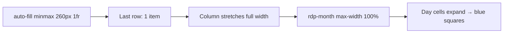

## Fix (CSS in [`index.css`](frontend/src/index.css))

### 1. Stop browse columns from stretching

```css
.calendar-page-layout:not(.has-day) .calendar-three-month-columns {
  grid-template-columns: repeat(auto-fill, minmax(260px, max-content));
  justify-content: start;
  width: 100%;
}
```

Use `max-content` instead of `1fr` so each month card stays at its intrinsic ~260px width regardless of row position.

### 2. Cap month column width in browse mode

```css
.calendar-month-grid.browse .calendar-month-column {
  width: max-content;
  max-width: fit-content;
}
```

### 3. Lock react-day-picker compact sizing

Prevent day cells from flexing when a parent is wider than 7×32px:

```css
.rdp-compact .rdp-month {
  width: fit-content;
  min-width: calc(var(--rdp-day-width, 32px) * 7);
  max-width: none; /* remove 100% cap */
}

.rdp-compact .rdp-day,
.rdp-compact .rdp-day_button {
  width: var(--rdp-day-width, 32px);
  height: var(--rdp-day-height, 32px);
  max-width: var(--rdp-day-width, 32px);
  flex: 0 0 var(--rdp-day-width, 32px);
}
```

(Class names may need a quick DOM check against react-day-picker v9 — adjust selectors if the library uses `rdp-day_button` vs nested button.)

### 4. Fix narrow-viewport browse mode

The existing `@media (max-width: 900px)` rule forces `grid-template-columns: 1fr`, which would stretch **every** month on tablet/mobile. Update to keep content-sized columns:

```css
@media (max-width: 900px) {
  .calendar-three-month-columns {
    grid-template-columns: repeat(auto-fill, minmax(260px, max-content));
    justify-content: start;
  }
}
```

Keep focus mode (`has-day`) stacking to single column on narrow screens if desired, or apply the same `max-content` rule there too since focus mode already uses fixed 3-column tracks on desktop.

### 5. Clip overflow after stretch is fixed

Restore safe clipping on month cards to prevent badge/button bleed:

```css
.calendar-month-column {
  overflow: hidden; /* was changed to visible in browse/focus work */
}
```

`overflow: visible` was added to fix weekday header clipping; with columns no longer stretching, `hidden` is safe again. If weekday clipping recurs, scope `overflow: hidden` only to `.rdp-root` inner wrapper instead of the whole column.

## Files to change

- [`frontend/src/index.css`](frontend/src/index.css) only — no React/URL logic changes needed

## Verification

1. Browse view with 12 months: July 2026 (last item) matches other cards — compact 32px cells, only photo days show count badges
2. No blue squares floating outside the July 2026 card border
3. Focus mode (day selected): 3-month sidebar unchanged
4. Narrow viewport: months wrap in a grid without full-width stretch
5. October 2014 and other months: weekday headers still align with day columns

---

<a id="chapter-9-calendar-layout-optimization"></a>

## Chapter 9: Calendar layout optimization

> **Overview:** Fix the three-month calendar to a stable width and give the remaining horizontal space to the day thumbnail panel, with larger grid cells and full-height scrolling.

# Calendar Layout — Expand Thumbnails

## Problem

Current layout in [`frontend/src/index.css`](frontend/src/index.css):

```css
.calendar-page-layout.has-day {
  grid-template-columns: 1fr minmax(280px, 360px);
}
```

The calendar row expands to fill space; the day panel is capped at **360px**, producing tiny thumbnails and wasted empty area below the calendars (as in your screenshot).

## Target layout

```
┌──────────────────────────────┬────────────────────────────────────┐
│  ← Prev   Jan · Sep · Jun →  │  2014-01-19                        │
│  [3 month columns ~fixed]    │  ┌──────┐ ┌──────┐ ┌──────┐        │
│                              │  │ thumb│ │ thumb│ │ thumb│  ...   │
│                              │  └──────┘ └──────┘ └──────┘        │
└──────────────────────────────┴────────────────────────────────────┘
     ~720px (unchanged)              flex: 1 (all remaining width)
```

- **Left**: three-month calendar keeps current compact size (`flex-shrink: 0`).
- **Right**: day panel grows to fill remaining viewport width; thumbnails use larger grid cells.

## Changes

### 1. Page grid — invert column sizing

[`frontend/src/index.css`](frontend/src/index.css) — update `.calendar-page-layout.has-day`:

```css
@media (min-width: 1100px) {
  .calendar-page-layout.has-day {
    grid-template-columns: auto 1fr;
    align-items: start;
  }
}
```

- `auto` = calendar column sizes to its content (3 compact months + padding).
- `1fr` = day panel absorbs all remaining width.

Optionally set explicit cap so calendar never grows:

```css
.calendar-three-month {
  width: max-content;
  max-width: 720px;
  flex-shrink: 0;
}
```

(720px ≈ 3 × ~220px columns + gaps; tune if needed after visual check.)

### 2. Day panel wrapper

[`frontend/src/components/CalendarDayPanel.tsx`](frontend/src/components/CalendarDayPanel.tsx):

- Wrap content in `<div className="calendar-day-panel">`.
- Simplify header: smaller `h3`, remove redundant `.page-header` flex (use compact `.calendar-day-panel-header`).

[`frontend/src/pages/Calendar.tsx`](frontend/src/pages/Calendar.tsx):

- No structural change; day panel stays second grid child.

### 3. Larger thumbnails in day panel only

[`frontend/src/index.css`](frontend/src/index.css):

```css
.calendar-day-panel {
  min-width: 0;
  max-height: calc(100vh - 8rem);
  overflow-y: auto;
  padding-left: 0.5rem;
  border-left: 1px solid #2a2f3a;
}

.calendar-day-panel .photo-grid {
  grid-template-columns: repeat(auto-fill, minmax(200px, 1fr));
  gap: 1rem;
}

.calendar-day-panel .photo-card img {
  aspect-ratio: 1;
}
```

- Global `.photo-grid` (`minmax(160px, 1fr)`) unchanged for Inbox/Events.
- Wider panel → more/larger columns automatically.

Optional: add `size="large"` prop to [`PhotoGrid.tsx`](frontend/src/components/PhotoGrid.tsx) (`className="photo-grid photo-grid-large"`) instead of descendant selector — minimal, scoped change.

### 4. Responsive

- **≥1100px**: side-by-side, expanded thumbnails (above).
- **<1100px**: stack vertically (existing behavior); day panel full width below calendars.

## Files to change

| File | Change |
|------|--------|
| [`frontend/src/index.css`](frontend/src/index.css) | Grid column swap, `.calendar-three-month` fixed width, `.calendar-day-panel` + larger grid |
| [`frontend/src/components/CalendarDayPanel.tsx`](frontend/src/components/CalendarDayPanel.tsx) | Add `calendar-day-panel` wrapper + compact header |
| [`frontend/src/components/PhotoGrid.tsx`](frontend/src/components/PhotoGrid.tsx) | Optional `className` / `size` prop for large variant |

No backend changes.

## Test plan

1. Select a day with 6+ photos — thumbnails visibly larger, using full right-side width
2. Three-month calendar width unchanged vs before
3. Narrow window (<1100px) — stacks cleanly, thumbnails still full width
4. Inbox page grid unchanged (160px min cells)

---

<a id="chapter-10-fix-calendar-layout"></a>

## Chapter 10: Fix calendar layout

> **Overview:** Fix calendar overflow/overlap caused by an overly tight 720px max-width and grid columns shrinking below the react-day-picker compact grid's intrinsic width (~248px per month).

# Fix Broken Calendar Views

## Root cause

The recent layout optimization in [`frontend/src/index.css`](frontend/src/index.css) introduced two conflicting constraints:

```css
.calendar-three-month {
  width: max-content;
  max-width: 720px;   /* too narrow for 3 months */
}

.calendar-three-month-columns {
  grid-template-columns: repeat(3, 1fr);  /* splits 720px → ~227px/column */
}

.calendar-month-column {
  min-width: 0;  /* allows column to shrink below content */
}
```

Each compact month needs **7 × 32px = 224px** for day cells, plus **~24px** column padding → **~248px minimum per column**. Three months need **~780px+**, not 720px.

When columns shrink below 248px, Fr/Sa overflow the card border (screenshot 1). With only one visible month, a single column gets **1/3 of 720px (~240px)** while the DayPicker grid stays full width, producing the overlapping “ghost” calendar (screenshot 2).

The page-level `grid-template-columns: auto 1fr` change is correct and should stay — only the inner sizing is wrong.

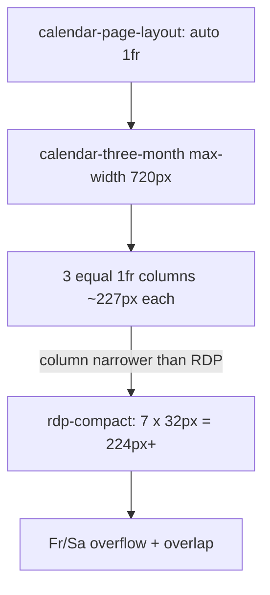

## Fix (CSS only)

All changes in [`frontend/src/index.css`](frontend/src/index.css):

### 1. Let the calendar size to its content

Remove the `max-width: 720px` cap from `.calendar-three-month`. Keep `width: max-content` and `flex-shrink: 0` so the left column in `auto 1fr` still sizes naturally (~780–810px for 3 months) while the day panel keeps all remaining width.

### 2. Use content-based column tracks

Replace `repeat(3, 1fr)` with:

```css
.calendar-three-month-columns {
  display: grid;
  grid-template-columns: repeat(auto-fit, minmax(248px, max-content));
  gap: 1rem;
  align-items: start;
}
```

- Each month column is at least 248px (fits 7 compact day cells + padding).
- With 1 visible month, it gets a full-width column instead of 1/3 of a capped container.
- With 3 months, each sizes to content side-by-side.

### 3. Stop shrinking columns below content

Change `.calendar-month-column`:

```css
.calendar-month-column {
  min-width: min-content;  /* was min-width: 0 */
  overflow: hidden;        /* safety clip if RDP ever exceeds */
}
```

### 4. Remove double chrome inside month columns

Global `.rdp-root` styles (background, border, padding) apply inside `.calendar-month-column`, which already has its own card styling. Scope them off for compact nested pickers:

```css
.calendar-month-column .rdp-root {
  background: transparent;
  border: none;
  padding: 0;
  border-radius: 0;
}
```

### 5. Let compact month grid use intrinsic width

Update `.rdp-compact .rdp-month`:

```css
.rdp-compact .rdp-month {
  width: fit-content;
  max-width: 100%;
}
```

This prevents forcing a 224px grid into a narrower container.

## What stays unchanged

- [`frontend/src/pages/Calendar.tsx`](frontend/src/pages/Calendar.tsx) — no structural changes
- [`frontend/src/components/CalendarThreeMonthView.tsx`](frontend/src/components/CalendarThreeMonthView.tsx) — no changes
- Day panel expansion (`auto 1fr`, `PhotoGrid size="large"`) — unchanged
- Inbox/Events photo grids — unchanged

## Test plan

1. **Three months** (Jan 2014 · Sep 2016 · Jun 2020): all 7 weekday columns visible inside each card; no Fr/Sa bleeding into adjacent months
2. **Single month** (July 2026): one card, no overlapping background grid
3. **Day selected** (wide screen): calendar stays left at natural width; day thumbnails still fill right panel
4. **Narrow window** (<900px): months stack vertically; no horizontal overflow
5. **Inbox page**: photo grid unchanged

---

<a id="chapter-11-skip-empty-calendar-months"></a>

## Chapter 11: Skip empty calendar months

> **Overview:** Three-month calendar view (only months with photos), each column with its own event labels below; prev/next advances by 3 active months; day panel on the right when a date is selected.

# Three-Month Calendar View + Per-Month Event Labels

## Goal

1. Show **3 calendar months side-by-side**, each only if it has photos (from active-months index).
2. **Event labels below each month column** — only events with photos in that specific month.
3. **Prev/next** advances the 3-month window (jumps 3 active months at a time).
4. Click a day in any column → **day panel** on the right (unchanged).
5. Click a label under a month → filter that column's days + day panel to that event.
6. Remove global event dropdown; keep location filter only.

## Target layout

```
┌──────────────────────────────────────────────────────────────────────────┐
│ Calendar                                              [Scan archive]      │
│ [Archive only ▼]                                                          │
├──────────────────────────────────────────────────────────────────────────┤
│  ← Prev          Apr 2020 · May 2020 · Jun 2020          Next →          │
├────────────────────┬────────────────────┬────────────────────┬───────────┤
│  April 2020        │  May 2020          │  June 2020         │ 2020-06-21│
│  [day grid]        │  [day grid]        │  [day grid]        │ [photos]  │
│  Vermont (2)       │  (no labels)       │  Vermont (3)       │           │
│  Deck removal (1)  │                    │  RC planes (5)     │           │
└────────────────────┴────────────────────┴────────────────────┴───────────┘
```

On narrow screens (<900px): stack the 3 columns vertically; day panel below.

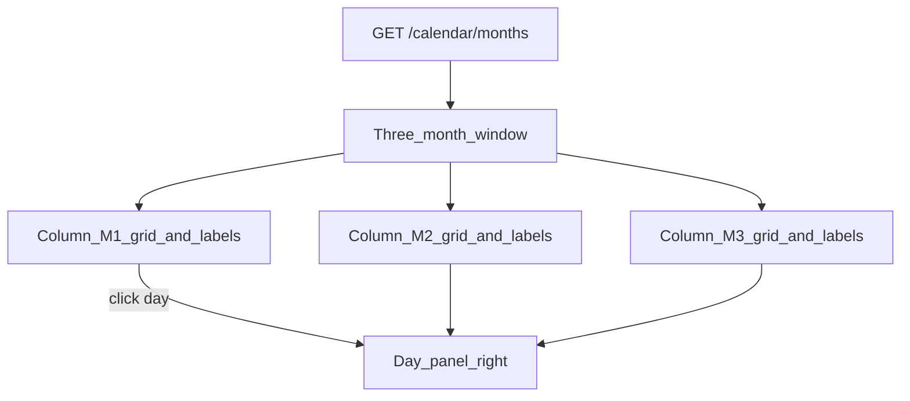

## Approach

### 1. Backend — active months index

```
GET /api/calendar/months?location=archive
→ { "months": [{ "year": 2020, "month": 6, "count": 3 }, ...] }
```

Used to build the 3-month window (only months with photos).

### 2. Backend — events per month

```
GET /api/calendar/events?year=2020&month=6&location=archive
→ { "events": [{ "id", "name", "slug", "color", "photo_count" }, ...] }
```

One call per visible column (3 parallel requests).

Existing `/calendar/summary` and `/calendar/day` unchanged; pass `event_id` when a label is active for that month.

### 3. Frontend — `CalendarMonthColumn`

**New** [`frontend/src/components/CalendarMonthColumn.tsx`](frontend/src/components/CalendarMonthColumn.tsx):

- Props: `{ year, month, location, selectedDay?, activeEventId?, onSelectDay, onSelectEvent }`
- Fetches `calendarSummary` + `calendarEvents` for its month.
- Renders compact [`CalendarMonth`](frontend/src/components/CalendarMonth.tsx) (no built-in nav — hide DayPicker chevrons).
- Renders [`CalendarMonthLabels`](frontend/src/components/CalendarMonthLabels.tsx) directly below the grid.
- Highlights selected day if it falls in this month.

### 4. Frontend — `CalendarThreeMonthView`

**New** [`frontend/src/components/CalendarThreeMonthView.tsx`](frontend/src/components/CalendarThreeMonthView.tsx):

- Input: `activeMonths[]`, `windowStartIndex`, `location`, selection state.
- Renders global **← Prev | Next →** that moves `windowStartIndex` by **3** (clamped to list bounds).
- Header shows names of the 3 visible months (e.g. "April 2020 · May 2020 · June 2020").
- If fewer than 3 active months remain at end of list, show 1 or 2 columns.
- CSS grid: `grid-template-columns: 1fr 1fr 1fr` (or 1fr 1fr 1fr 1fr with day panel).

### 5. Frontend — `CalendarMonthLabels`

**New** [`frontend/src/components/CalendarMonthLabels.tsx`](frontend/src/components/CalendarMonthLabels.tsx):

- Compact chip row under one month column.
- One chip per event in that month; optional **All** chip.
- `activeEventId` scoped per column (stored as `{ year, month, eventId }` in parent).

### 6. Calendar page logic

Update [`frontend/src/pages/Calendar.tsx`](frontend/src/pages/Calendar.tsx):

1. Fetch `calendarMonths(location)`.
2. Compute **window start** from URL `year/month` (find index in active list, align to multiple of 3 or use as leftmost month of triplet).
3. On load: if URL month empty, redirect to nearest active month and set window.
4. **Remove** global event `<select>`.
5. State:
   - `selectedDay: { year, month, day } | null`
   - `monthEventFilter: { year, month, eventId } | null` — which label is active under which column
6. Day panel uses `selectedDay` + optional `eventId` from filter if same month.

**Window alignment**: Given anchor month from URL, window = `[index, index+1, index+2]` in `activeMonths`. Prev: `index -= 3`. Next: `index += 3`. Update URL to leftmost month of window on nav.

### 7. Styles

[`frontend/src/index.css`](frontend/src/index.css):

- `.calendar-three-month` — 3-column grid + optional day panel column
- `.calendar-month-column` — vertical stack: title, grid, labels
- `.calendar-month-labels` — wrap chips, smaller font for column width
- `.calendar-window-nav` — global prev/next above columns
- Responsive: single column stack on mobile

## Files to change

| File | Change |
|------|--------|
| [`backend/app/models.py`](backend/app/models.py) | Month/events response models |
| [`backend/app/main.py`](backend/app/main.py) | `GET /api/calendar/months`, `GET /api/calendar/events` |
| [`frontend/src/api/client.ts`](frontend/src/api/client.ts) | `calendarMonths()`, `calendarEvents()` |
| [`frontend/src/components/CalendarMonth.tsx`](frontend/src/components/CalendarMonth.tsx) | Compact mode: hide nav, smaller cells |
| **New** `CalendarMonthColumn.tsx` | Month grid + labels stack |
| **New** `CalendarMonthLabels.tsx` | Per-column event chips |
| **New** `CalendarThreeMonthView.tsx` | 3-column layout + window nav |
| [`frontend/src/pages/Calendar.tsx`](frontend/src/pages/Calendar.tsx) | Wire 3-month view, day panel, remove event dropdown |
| [`frontend/src/index.css`](frontend/src/index.css) | 3-column + label styles |

## Out of scope

- Sparse day list (hide empty days within a month)
- Year picker
- More than 3 months visible at once

## Test plan

1. Library has photos in Apr, May, Jun 2020 → all 3 columns visible with correct labels under each
2. Only 2 active months total → 2 columns shown
3. Prev/next jumps 3 active months (e.g. Jan–Mar → Apr–Jun)
4. Click label under June → only June column + day panel filter to that event
5. Click day in May column → day panel shows May photos; URL updates to `/calendar/2020/5/15`
6. Location filter refreshes all 3 columns
7. No global event dropdown

---

<a id="chapter-12-calendar-tag-wrapping"></a>

## Chapter 12: Calendar tag wrapping

> **Overview:** Make focus mode (day selected) use the same fixed-width month columns as full calendar browse mode, so footer label chips wrap to multiple rows instead of stretching columns horizontally.

# Calendar footer tag wrapping (focus = browse sizing)

## Problem

Calendar month footer chips (events, people, tags) in [`frontend/src/components/CalendarMonthLabels.tsx`](frontend/src/components/CalendarMonthLabels.tsx) already use `flex-wrap: wrap` via `.calendar-month-labels` in [`frontend/src/index.css`](frontend/src/index.css). Wrapping fails in **focus mode** (day selected + day panel open) because parent sizing uses `max-content`, so the column grows to fit one long row of chips.

Full **browse mode** (no day selected) behaves better: month cards stay narrow and tags wrap.

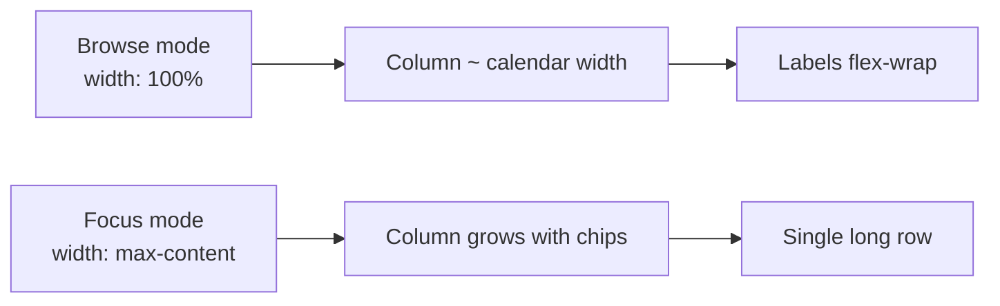

## Root cause (CSS)

Focus-specific rules allow horizontal growth:

- [`.calendar-month-grid.focus`](frontend/src/index.css) — `width: max-content`
- [`.calendar-page-layout.has-day .calendar-three-month-columns`](frontend/src/index.css) — `repeat(3, minmax(260px, max-content))`
- [`.calendar-month-grid.browse .calendar-month-column`](frontend/src/index.css) — `width: max-content` (should be removed; explicit fixed width is better in both modes)

Browse mode partially avoids the issue via `.calendar-month-grid.browse { width: 100% }` and `auto-fill` grid, but sizing is inconsistent between modes.

## Solution

**CSS-only** changes in [`frontend/src/index.css`](frontend/src/index.css). No component changes.

### 1. Lock month column width to the calendar grid

Replace `max-content` column sizing with the intrinsic calendar width (7 day cells + padding):

```css
.calendar-month-column {
  width: calc(var(--rdp-day-width, 32px) * 7 + 1.5rem);
  max-width: calc(var(--rdp-day-width, 32px) * 7 + 1.5rem);
  /* keep existing min-width, overflow: hidden, etc. */
}
```

Remove the browse-only override:

```css
/* DELETE */
.calendar-month-grid.browse .calendar-month-column {
  width: max-content;
  max-width: fit-content;
}
```

### 2. Constrain the labels container

Ensure chips wrap within the fixed column:

```css
.calendar-month-labels {
  width: 100%;
  min-width: 0;
  /* flex-wrap: wrap already present */
}

.calendar-event-chip {
  max-width: 100%;
  /* optional: white-space: normal for very long event names */
}
```

### 3. Align focus mode with browse mode

- Change `.calendar-month-grid.focus` from `width: max-content` to `width: 100%` (or drop the rule and inherit browse behavior).
- Change has-day grid tracks from `max-content` to fixed/min width:

```css
.calendar-page-layout.has-day .calendar-three-month-columns {
  grid-template-columns: repeat(3, minmax(260px, 1fr));
  /* or repeat(3, calc(var(--rdp-day-width) * 7 + 1.5rem)) for exact match */
}
```

- Keep page layout `grid-template-columns: auto 1fr` so the day panel still fills remaining space; the calendar side will no longer expand with tag count.

### 4. Preserve browse grid behavior

Leave browse-specific rules that work well:

- `.calendar-month-grid.browse { width: 100% }`
- `.calendar-page-layout:not(.has-day) .calendar-three-month-columns { auto-fill; width: 100% }`

Both modes will share the same fixed column width; browse continues to tile all months, focus continues to show 3 months + day panel.

## Out of scope

- Photo card labels in day panel sidebar
- Bulk editors / tag pickers
- Splitting tags onto a separate semantic row from people/events (not requested)

## Verification

1. **Browse** (`/calendar/Y/M`, no day): month with many labels (e.g. August 2015) — chips wrap within card; card width matches calendar grid above.
2. **Focus** (`/calendar/Y/M/D`, day panel open): same month shows identical card width and wrapped chips (no horizontal stretch across 3 columns).
3. Long event names (e.g. "Remote control airplanes…") wrap or truncate within chip without breaking column width.
4. Day panel still receives remaining horizontal space on wide screens.
5. Mobile (`max-width: 900px`): single-column focus layout unchanged.

---

<a id="chapter-13-event-calendar-deeplink"></a>

## Chapter 13: Event calendar deeplink

> **Overview:** Make the event detail date span clickable, linking to the existing calendar day route (`/calendar/:year/:month/:day`) so users can jump from an event to that day in focus mode.

# Event View → Calendar Day Deeplink

## Problem

Event detail in [`Events.tsx`](frontend/src/pages/Events.tsx) renders the date span as plain text:

```124:128:frontend/src/pages/Events.tsx
        {activeEvent.date_span_start && (
          <p style={{ color: "#8891a0" }}>
            {activeEvent.date_span_start} — {activeEvent.date_span_end}
          </p>
        )}
```

Calendar already supports day focus at `/calendar/:year/:month/:day` (see [`App.tsx`](frontend/src/App.tsx) routes and [`Calendar.tsx`](frontend/src/pages/Calendar.tsx)).

## Solution

Add a small path helper and render the date span as `Link` elements.

### 1. Helper — [`frontend/src/utils/calendarPath.ts`](frontend/src/utils/calendarPath.ts) (new)

```ts
/** ISO date "YYYY-MM-DD" → "/calendar/Y/M/D" (no zero-padding required in URL; Calendar parses numbers) */
export function calendarDayPath(isoDate: string): string {
  const [year, month, day] = isoDate.split("-").map(Number);
  return `/calendar/${year}/${month}/${day}`;
}
```

### 2. Event detail date links — [`Events.tsx`](frontend/src/pages/Events.tsx)

Replace the static `<p>` with:

- **Same start/end** (e.g. `2014-09-25 — 2014-09-25`): single link to that day
- **Range** (e.g. `2014-09-25 — 2014-10-02`): separate links for start and end, separated by ` — `

Use react-router `Link` with existing `.link-btn` class for consistent styling.

```tsx
<p className="event-date-span">
  {activeEvent.date_span_start === activeEvent.date_span_end ? (
    <Link to={calendarDayPath(activeEvent.date_span_start)} className="link-btn">
      {activeEvent.date_span_start}
    </Link>
  ) : (
    <>
      <Link to={calendarDayPath(activeEvent.date_span_start)} className="link-btn">
        {activeEvent.date_span_start}
      </Link>
      {" — "}
      <Link to={calendarDayPath(activeEvent.date_span_end!)} className="link-btn">
        {activeEvent.date_span_end}
      </Link>
    </>
  )}
</p>
```

### 3. Minor CSS — [`index.css`](frontend/src/index.css)

```css
.event-date-span {
  color: #8891a0;
  margin: 0 0 1rem;
}
```

## Behavior after click

Navigating to `/calendar/2014/9/25` opens calendar **focus mode**: 3-month sidebar around September 2014 + day panel with all photos on that date. No backend or route changes needed.

## Out of scope

- URL query param to pre-filter day panel by event ID (day panel shows all photos on that date)
- Deeplinks on event list cards (`event-cards` grid) — can add later using the same helper

## Verification

1. Open `/events/motorola` (or any event with `date_span_start`)
2. Click the date — lands on `/calendar/Y/M/D` with day panel open
3. Range event: start and end dates each link to their respective days
4. Close on calendar returns to browse mode (existing behavior)

---

<a id="chapter-14-edit-event-title"></a>

## Chapter 14: Edit event title

> **Overview:** Add inline edit on the event detail page so users can fix the event name (and color); backend PATCH already exists — frontend-only change with query invalidation and slug redirect.

## Problem

Event detail page ([`frontend/src/pages/Events.tsx`](frontend/src/pages/Events.tsx)) shows a **read-only** title. The user cannot fix typos like "Elltiott" → "Elliott".

Backend already supports updates:
- `PATCH /api/events/{id}` via [`api.updateEvent`](frontend/src/api/client.ts)
- [`events.py`](backend/app/events.py) `update_event()` updates `name`, regenerates `slug`, updates `color`

No backend work needed.

## UX

On event detail view (`/events/:slug`):

```
[← Back]  Remote control airplanes with Elliott and Jake  [Edit]
          2014-01-19 — 2014-01-19                         6 photos
```

Click **Edit** → inline form replaces title:

```
Name:  [Remote control airplanes with Elliott and Jake]
Color: [■ picker]
       [Save]  [Cancel]
```

- **Save** → `api.updateEvent(id, { name, color })`, refresh caches, redirect to `/events/{newSlug}` if slug changed
- **Cancel** → revert to read-only view

Event badges on photo cards refresh automatically via invalidated `event-files` and `events` queries.

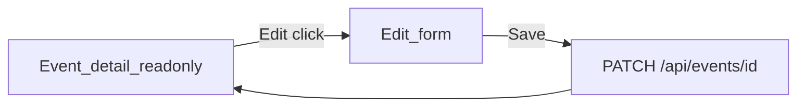

## Implementation

### [`frontend/src/pages/Events.tsx`](frontend/src/pages/Events.tsx)

In the `if (activeEvent)` branch:

1. Add state: `editing`, `editName`, `editColor` (initialized from `activeEvent` when entering edit mode).
2. Add **Edit** button (`btn btn-secondary`) beside the title.
3. When `editing`:
   - Show name input + color input (reuse same fields as create form)
   - Save/Cancel buttons
4. `useMutation` calling `api.updateEvent(activeEvent.id, { name: editName, color: editColor })`
5. `onSuccess`:
   - `qc.invalidateQueries({ queryKey: ["events"] })`
   - `qc.invalidateQueries({ queryKey: ["calendar-events"] })`
   - `qc.invalidateQueries({ queryKey: ["event-files"] })`
   - `setEditing(false)`
   - If returned `slug !== slug` param → `navigate(/events/${newSlug}, { replace: true })`

### [`frontend/src/index.css`](frontend/src/index.css) (minimal)

Optional `.event-edit-form` — compact inline row matching existing create form styling; can reuse existing `.form-group` without new CSS if layout is fine.

## Out of scope

- Edit from Events list cards
- Edit from Calendar month label chips
- Delete event button (separate feature)

## Test plan

1. Open event with typo → Edit → fix name → Save → title and photo badges update
2. URL updates if slug changes (e.g. name change produces new slug)
3. Cancel restores original title without API call
4. Color change reflects on badge chips after save

---

<a id="chapter-15-calendar-media-type-filter"></a>

## Chapter 15: Calendar media type filter

> **Overview:** Add a global Images/Videos filter to the Calendar page, wired through all calendar API endpoints so month lists, day counts, label chips, and the day panel stay consistent.

## Goal

Add a second global filter on the Calendar page (next to the existing location dropdown) to show **All**, **Images only**, or **Videos only**. This should affect which months appear, per-day counts on the grid, footer label counts, and photos in the day panel.

## Approach

Media type is not stored in the DB; it is derived from filename extension via [`media_type_for_suffix`](backend/app/config.py) (`video` if extension in `VIDEO_EXTENSIONS`, otherwise `image`). Filter SQL will match that rule:

- **video**: `lower(filename) LIKE '%.mp4' OR ...` (all video extensions)
- **image**: `NOT (video clause)` — everything else, consistent with the app

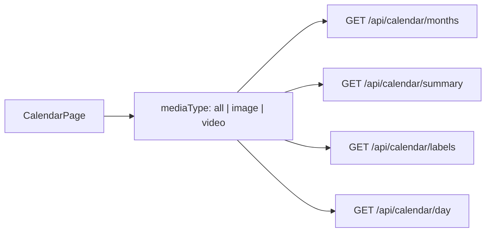

## Backend

### 1. Shared SQL helper

Add [`backend/app/media_filter.py`](backend/app/media_filter.py):

```python
def filename_media_type_clause(column: str, media_type: Literal["image", "video"]) -> tuple[str, list]:
    # Returns ("AND (...)", params) for use in WHERE clauses
```

Use `VIDEO_EXTENSIONS` from config; image = negated video match.

### 2. Extend calendar endpoints in [`backend/app/main.py`](backend/app/main.py)

Add optional query param `media_type: Literal["image", "video"] | None = None` to:

| Endpoint | What changes |
|----------|----------------|
| `GET /api/calendar/months` | Filter months that have matching files |
| `GET /api/calendar/summary` | Day counts + cover subquery (`f2`) both filtered |
| `GET /api/calendar/labels` | Event/person/tag counts filtered via `_month_location_clauses` + media clause on `f.filename` |
| `GET /api/calendar/day` | Pass `media_type` through to `api_list_files` |

Update `_month_location_clauses` (or add sibling helper) to optionally append the media-type clause.

### 3. Extend `api_list_files`

Add `media_type: Literal["image", "video"] | None = None` and apply the same filename clause on `f.filename` so the day panel and any future callers stay consistent.

## Frontend

### Types and API ([`frontend/src/api/client.ts`](frontend/src/api/client.ts))

```typescript
export type CalendarMediaType = "all" | "image" | "video";
```

Add optional `mediaType?: CalendarMediaType` to calendar API helpers; append `media_type=image|video` to query string when not `"all"`.

Include `mediaType` in React Query keys for: `calendar-months`, `calendar-summary`, `calendar-labels`, `calendar-day`.

### Calendar page ([`frontend/src/pages/Calendar.tsx`](frontend/src/pages/Calendar.tsx))

- State: `mediaType` default `"all"`
- Second `<select>` in `.calendar-filters`:
  - All media
  - Images
  - Videos
- On change: reset `monthFilter`, pass `mediaType` to child components
- Update empty-state copy when filtered (optional minor tweak)

### Prop threading

Pass `mediaType` through:

- [`CalendarThreeMonthView.tsx`](frontend/src/components/CalendarThreeMonthView.tsx) → [`CalendarMonthColumn.tsx`](frontend/src/components/CalendarMonthColumn.tsx) (summary + labels queries)
- [`CalendarDayPanel.tsx`](frontend/src/components/CalendarDayPanel.tsx) (day query + `useEffect` deps)

Extend [`CalendarDayFilter`](frontend/src/api/client.ts) or pass `mediaType` as a separate prop (prefer **separate prop**, parallel to `location`, since it is global not per-month).

Update [`monthFilterToDayFilter`](frontend/src/utils/calendarFilter.ts) — no change needed; media type stays separate from event/person/tag chips.

### CSS

Existing [`.calendar-filters`](frontend/src/index.css) flex layout already supports a second select; no structural changes required.

## Verification

1. Calendar with mixed images/videos → **All** unchanged from today.
2. **Videos** → only days/months with videos show counts; day panel lists videos only.
3. **Images** → video-only days hidden; image days show correct counts.
4. Combine with **Archive only** / **Include inbox** — both filters apply.
5. Month footer label counts (e.g. `Alex (7)`) reflect the active media filter.
6. Switching media type clears month chip filter and refetches all calendar queries.

## Files to change

| File | Change |
|------|--------|
| [`backend/app/media_filter.py`](backend/app/media_filter.py) | New filename media-type SQL helper |
| [`backend/app/main.py`](backend/app/main.py) | `media_type` on calendar endpoints + `api_list_files` |
| [`frontend/src/api/client.ts`](frontend/src/api/client.ts) | `CalendarMediaType` + query params |
| [`frontend/src/pages/Calendar.tsx`](frontend/src/pages/Calendar.tsx) | Filter UI + state |
| [`frontend/src/components/CalendarThreeMonthView.tsx`](frontend/src/components/CalendarThreeMonthView.tsx) | Pass `mediaType` |
| [`frontend/src/components/CalendarMonthColumn.tsx`](frontend/src/components/CalendarMonthColumn.tsx) | Query keys + API calls |
| [`frontend/src/components/CalendarDayPanel.tsx`](frontend/src/components/CalendarDayPanel.tsx) | Day query with `mediaType` |

---

<a id="chapter-16-calendar-session-cache"></a>

## Chapter 16: Calendar session cache

> **Overview:** Cache calendar API responses in React Query for the browser session so revisiting Calendar reuses in-memory data instead of refetching summary/labels for every month; explicit invalidation on scan, apply, and label/date changes keeps data fresh.

## Problem

Every visit to Calendar in **browse mode** fires **2 requests per month** (`/api/calendar/summary` + `/api/calendar/labels`). Your log shows ~80 requests for archive (2017–2026). Navigating away and back repeats the full burst because:

- [`CalendarMonthColumn.tsx`](frontend/src/components/CalendarMonthColumn.tsx) mounts one column per month with two `useQuery` hooks each
- Global [`main.tsx`](frontend/src/main.tsx) `staleTime` is only **5 seconds** — data goes stale quickly and refetches on remount

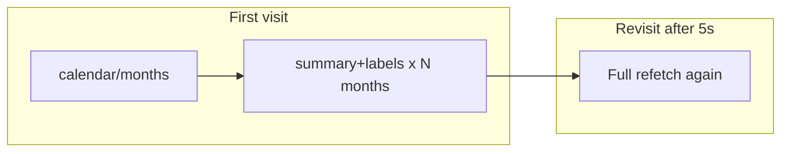

Browse mode intentionally renders **all** months ([`Calendar.tsx`](frontend/src/pages/Calendar.tsx) `visibleMonths = activeMonths`), so first load will always be N×2 requests. Goal: **cache hits on revisit** for the life of the SPA session (container running, no hard refresh).

## Approach: React Query session cache

Add shared calendar query defaults with long `staleTime` and generous `gcTime`. Data stays fresh until **explicit invalidation** (already wired for apply, date changes, label edits).

### 1. Shared options helper

New [`frontend/src/utils/calendarQueryOptions.ts`](frontend/src/utils/calendarQueryOptions.ts):

```typescript
/** Treat calendar grid data as fresh for the SPA session; invalidate on scan/apply/label changes. */
export const CALENDAR_STALE_TIME = Infinity;
export const CALENDAR_GC_TIME = 1000 * 60 * 60 * 8; // 8h in memory after unmount

export function calendarQueryOptions<T>(options: { queryKey: ...; queryFn: ... }) {
  return { ...options, staleTime: CALENDAR_STALE_TIME, gcTime: CALENDAR_GC_TIME };
}
```

Use `Infinity` for `staleTime` so revisiting Calendar serves cached data with **zero network** unless invalidated.

### 2. Apply to calendar queries

| File | Query keys |
|------|------------|
| [`Calendar.tsx`](frontend/src/pages/Calendar.tsx) | `calendar-months` |
| [`CalendarMonthColumn.tsx`](frontend/src/components/CalendarMonthColumn.tsx) | `calendar-summary`, `calendar-labels` |
| [`CalendarDayPanel.tsx`](frontend/src/components/CalendarDayPanel.tsx) | `calendar-day` |

Example in `CalendarMonthColumn`:

```typescript
const { data: summary } = useQuery(calendarQueryOptions({
  queryKey: ["calendar-summary", year, month, location, dayFilter, mediaType],
  queryFn: () => api.calendarSummary(...),
}));
```

### 3. Keep invalidation paths (no stale forever bugs)

Existing invalidators already target calendar keys — no change needed except ensuring scan triggers them:

| Trigger | File | Keys invalidated |
|---------|------|------------------|
| Apply review | [`invalidateAfterApply.ts`](frontend/src/utils/invalidateAfterApply.ts) | summary, labels, day, months |
| Date change | [`invalidateAfterDateChange.ts`](frontend/src/utils/invalidateAfterDateChange.ts) | same |
| Day panel labels | [`CalendarDayPanel.tsx`](frontend/src/components/CalendarDayPanel.tsx) | labels, summary |
| Events CRUD | [`Events.tsx`](frontend/src/pages/Events.tsx) | labels, summary |

**Fix gap:** [`Calendar.tsx`](frontend/src/pages/Calendar.tsx) line 120 — `scanArchive().then(() => {})` does **not** invalidate calendar cache. After scan, calendar would show stale data until hard refresh.

Add helper `invalidateCalendarQueries(qc)` (or extend existing util) and call it:
- On **Scan archive** success in `Calendar.tsx`
- On **Scan archive** success in [`Cameras.tsx`](frontend/src/pages/Cameras.tsx) (optional but consistent)

Pattern:

```typescript
qc.invalidateQueries({ queryKey: ["calendar-months"] });
qc.invalidateQueries({ queryKey: ["calendar-summary"] });
qc.invalidateQueries({ queryKey: ["calendar-labels"] });
qc.invalidateQueries({ queryKey: ["calendar-day"] });
```

### 4. Out of scope (future)

- **Batch API** for all month summaries in one request (backend change; would help first load)
- **Lazy-load month columns** with Intersection Observer (helps first load in browse mode)
- **Server-side Redis cache** (user asked for session-level; in-memory React Query is sufficient)

## Verification

1. Open Calendar (browse mode) — note request count in backend logs (~N×2 + 1 for months)
2. Navigate to Inbox, wait >5s, return to Calendar — **no** summary/labels refetch (only months list if needed from cache)
3. Change location/media filter — new query keys, expected fetch once, then cached
4. Run **Scan archive**, return to Calendar — calendar refetches after invalidation
5. Apply review or edit capture date — calendar updates via existing invalidators

## Files to change

| File | Change |
|------|--------|
| [`frontend/src/utils/calendarQueryOptions.ts`](frontend/src/utils/calendarQueryOptions.ts) | New shared staleTime/gcTime helper |
| [`frontend/src/utils/invalidateAfterDateChange.ts`](frontend/src/utils/invalidateAfterDateChange.ts) or new `invalidateCalendarQueries.ts` | Extract reusable calendar invalidation |
| [`Calendar.tsx`](frontend/src/pages/Calendar.tsx) | Use calendar query options; invalidate after scan |
| [`CalendarMonthColumn.tsx`](frontend/src/components/CalendarMonthColumn.tsx) | Use calendar query options |
| [`CalendarDayPanel.tsx`](frontend/src/components/CalendarDayPanel.tsx) | Use calendar query options |
| [`Cameras.tsx`](frontend/src/pages/Cameras.tsx) | Invalidate calendar after archive scan (optional) |

No backend changes. Patch release **2026.07.10b** if shipping immediately.

---

<a id="chapter-17-calendar-untagged-edit-mode"></a>

## Chapter 17: Calendar untagged edit mode

> **Overview:** Fix Calendar untagged workflow: memoize the day filter to stop selection from clearing on every re-render (flash/exit), and while photos are selected in untagged mode, fetch the day as \"all\" so tagged photos stay visible until selection is cleared.

# Calendar untagged selection fix

## Root causes

### 1. Flash on select (immediate exit)

In [`Calendar.tsx`](imageOrganizer/frontend/src/pages/Calendar.tsx), `dayPanelFilter` is recreated every render:

```tsx
const dayPanelFilter = globalUnlabeled
  ? { unlabeled: true as const }
  : monthFilterToDayFilter(...);
```

[`CalendarDayPanel.tsx`](imageOrganizer/frontend/src/components/CalendarDayPanel.tsx) resets selection when `filter` changes:

```tsx
useEffect(() => {
  setPage(1);
  setSelectedIds([]);
  setDetailFile(null);
  ...
}, [date, location, filter, mediaType]);
```

Selecting a photo → `onLabelContextChange` → `setLabelContext` in Calendar → parent re-renders → **new filter object reference** → effect runs → selection cleared → tagging panel vanishes. This matches "flash and exit."

In **All** mode, `filter` is usually `undefined` (stable), so the bug only shows under **Untagged**.

### 2. Photo disappears after tagging

With `filter={ unlabeled: true }`, `handleLabelsChange` refetches the day; once a tag is applied the photo is no longer untagged and drops out of `data.items`, emptying `selectedFiles` and closing the label panel.

## Fix

### 1. Stabilize browse filter — [`Calendar.tsx`](imageOrganizer/frontend/src/pages/Calendar.tsx)

Memoize `dayPanelFilter`:

```tsx
const dayPanelFilter = useMemo(
  () =>
    globalUnlabeled
      ? ({ unlabeled: true as const } satisfies CalendarDayFilter)
      : monthFilterToDayFilter(monthFilter, urlYear, urlMonth),
  [globalUnlabeled, monthFilter, urlYear, urlMonth],
);
```

### 2. Untagged edit mode — [`CalendarDayPanel.tsx`](imageOrganizer/frontend/src/components/CalendarDayPanel.tsx)

Keep `filter` prop as the **browse intent** (still unlabeled). Derive a separate **query filter**:

```tsx
const editingUntagged =
  !!filter?.unlabeled && (selectedIds.length > 0 || detailFile != null);
const queryFilter = editingUntagged ? undefined : filter;
```

Use `queryFilter` in:
- `useQuery` / `queryKey`
- `api.calendarDay(..., queryFilter, ...)`

While photos are selected (or detail is open), the day loads **all** photos so the current item stays on screen during tagging.

Exit edit mode when selection is cleared **and** detail is closed → query returns to unlabeled; tagged photos disappear from the grid (expected).

### 3. Reset effect uses browse filter only — [`CalendarDayPanel.tsx`](imageOrganizer/frontend/src/components/CalendarDayPanel.tsx)

Keep the reset `useEffect` keyed on `filter` (now stable via memo) — do **not** key it on `queryFilter`, so toggling into edit mode does not clear selection.

Optionally stabilize further with explicit deps:

```tsx
}, [date, location, mediaType, filter?.unlabeled, filter?.eventId, filter?.personId, filter?.tagId]);
```

### 4. After tagging — keep selection IDs in sync (small)

In `handleLabelsChange`, if refetch completes under edit mode (`queryFilter` undefined), selected files remain in `data.items`. No change needed.

When user clears selection after tagging, grid refetches unlabeled-only; tagged photo is gone — correct.

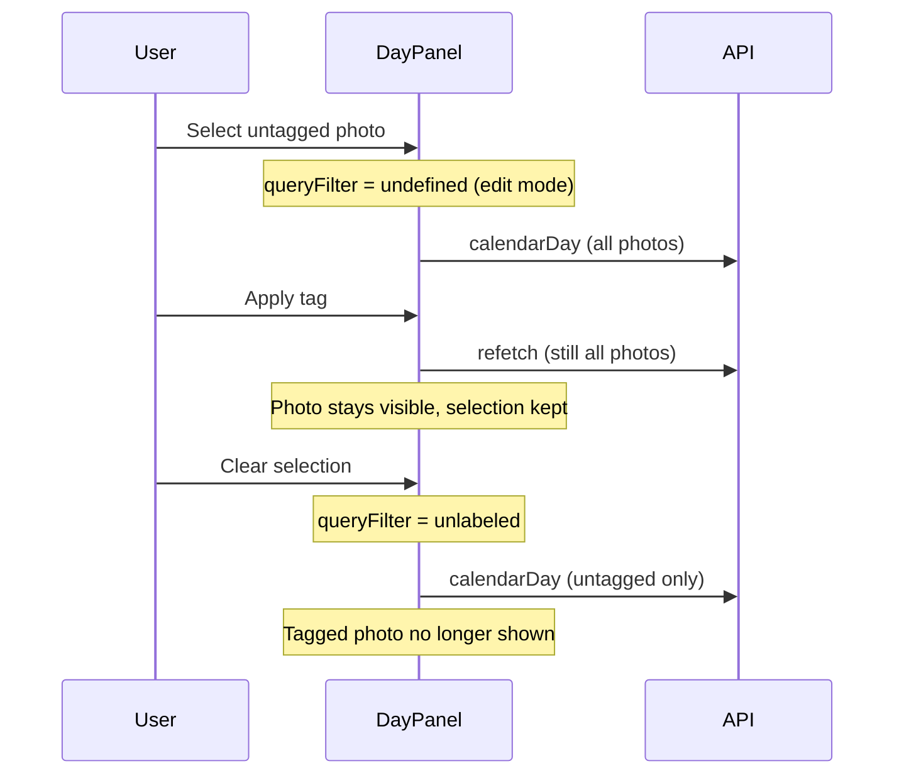

## Files

- [`frontend/src/pages/Calendar.tsx`](imageOrganizer/frontend/src/pages/Calendar.tsx) — memoize `dayPanelFilter`
- [`frontend/src/components/CalendarDayPanel.tsx`](imageOrganizer/frontend/src/components/CalendarDayPanel.tsx) — `queryFilter` edit mode

## Test plan

1. Calendar → **Untagged** → open day with untagged photos → select photo → tagging panel stays open (no flash)
2. Apply tag/person while selected → photo **remains** in grid and selection; panel stays open
3. Clear selection → grid shows untagged only; tagged photo gone
4. **All** mode unchanged — select, tag, behavior as before
5. Toggle Untagged ↔ All while day open → selection resets (browse filter changed)

---

<a id="chapter-18-fix-calendar-tag-search-layout"></a>

## Chapter 18: Fix calendar tag search layout

> **Overview:** Single-character tag search matches many tags; the chip row expands horizontally because the calendar left column uses `width: max-content` and tag chip containers lack width constraints. Fix by constraining the tagging panel to the calendar column width and ensuring chip rows wrap.

## Root cause

When tag search is active with 1–2 characters (e.g. `"t"`, `"ta"`), [`filterTagsByQuery`](imageOrganizer/frontend/src/utils/filterLabelsByQuery.ts) returns many tags. Those render as chip buttons in a flex row in [`FileTagPicker.tsx`](imageOrganizer/frontend/src/components/FileTagPicker.tsx) / [`BulkLabelEditors.tsx`](imageOrganizer/frontend/src/components/BulkLabelEditors.tsx).

The calendar layout chain:

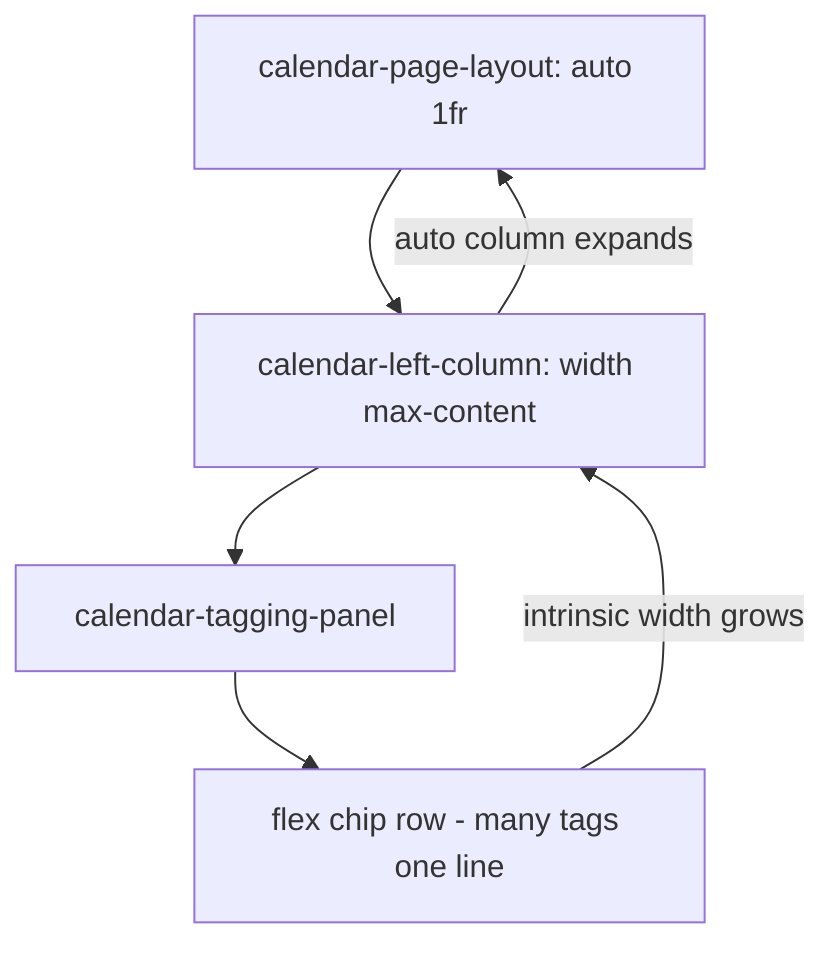

- [`.calendar-left-column`](imageOrganizer/frontend/src/index.css) has `width: max-content` (sized by widest child)
- [`.calendar-tagging-panel`](imageOrganizer/frontend/src/index.css) has `width: 100%` but no effective max when the parent grows with content
- Chip rows use inline `display: flex; flex-wrap: wrap` but default `min-width: auto` lets the flex item's min-content width equal the **unwrapped** row width
- With 3+ characters, fewer matches fit naturally; with 1 char, the row is very wide and blows out the left column (visible in your `"ta"` screenshot)

## Fix

### 1. Constrain tagging panel to calendar width — [`index.css`](imageOrganizer/frontend/src/index.css)

Turn `.calendar-left-column` into a single-column grid so the calendar row sets width and the tagging panel follows it:

```css
.calendar-left-column {
  display: grid;
  grid-template-columns: minmax(0, max-content);
  gap: 1rem;
  flex-shrink: 0;
}

.calendar-tagging-panel {
  /* existing styles... */
  width: 0;
  min-width: 100%;
  min-width: 0; /* allow shrink for wrapping — use min-width: 100% via min-width: min(100%, ...) or grid stretch */
  overflow-x: hidden;
  box-sizing: border-box;
}
```

Implementation detail: use the grid stretch pattern:

```css
.calendar-left-column {
  display: grid;
  grid-template-columns: minmax(0, max-content);
  gap: 1rem;
}

.calendar-tagging-panel {
  min-width: 0;
  max-width: 100%;
  overflow-x: hidden;
}
```

And ensure `.calendar-three-month` remains `width: max-content` so the grid column width comes from the calendars, not the tag panel.

Also tighten page grid so the left column can shrink if needed:

```css
.calendar-page-layout.has-day {
  grid-template-columns: minmax(0, max-content) minmax(0, 1fr);
}
```

### 2. Constrain chip rows — [`index.css`](imageOrganizer/frontend/src/index.css) + components

Existing [`.tag-picker-chips`](imageOrganizer/frontend/src/index.css) has `flex-wrap: wrap` but lacks width constraints. Extend it:

```css
.tag-picker-chips {
  display: flex;
  flex-wrap: wrap;
  gap: 0.35rem;
  align-items: center;
  min-width: 0;
  max-width: 100%;
}

.recent-tags-chips {
  /* existing */
  min-width: 0;
  max-width: 100%;
}

.calendar-tagging-panel .tag-picker-chips,
.calendar-tagging-panel .recent-tags-chips {
  min-width: 0;
}
```

Replace inline flex styles in [`FileTagPicker.tsx`](imageOrganizer/frontend/src/components/FileTagPicker.tsx) (line ~141) and [`BulkLabelEditors.tsx`](imageOrganizer/frontend/src/components/BulkLabelEditors.tsx) (line ~404) with `className="tag-picker-chips"`.

### 3. Inner editors min-width — [`index.css`](imageOrganizer/frontend/src/index.css)

```css
.calendar-tagging-panel .single-file-label-editors {
  min-width: 0;
  max-width: 100%;
}
```

## Out of scope

- Minimum search length (e.g. 2 chars) — not needed if layout is constrained correctly; avoids changing search behavior
- Inbox / PhotoDetail pickers — benefit from shared `.tag-picker-chips` fix but calendar-specific grid rules stay scoped to `.calendar-tagging-panel`

## Test plan

1. Calendar → select a day → select photo(s) → tag search: type **1 char** (e.g. `t`) → chip row wraps inside panel; left column width unchanged; no horizontal blowout
2. Type **2 chars** (`ta`) → still constrained, wraps
3. Type **3+ chars** (`sch`) → normal narrow results
4. Empty search → Recently used chips still wrap correctly
5. Photo grid on the right stays aligned; no page-level horizontal scroll

---

<a id="chapter-19-calendar-year-selector"></a>

## Chapter 19: Calendar year selector

> **Overview:** Add a year dropdown to Calendar filters that defaults to the latest year with photos, client-filters the month grid, and stays consistent in browse and focus (day) modes.

## Problem

Browse mode renders **every** month returned by `GET /api/calendar/months` at once ([`Calendar.tsx`](imageOrganizer/frontend/src/pages/Calendar.tsx) → `visibleMonths = activeMonths`). With 80+ months spanning many years, the grid is hard to navigate. Location, media, and All/Untagged filters exist; there is no year filter.

## Approach

Client-side filter only — no backend change. `activeMonths` already includes `{ year, month }` per entry; derive distinct years and filter locally.

```mermaid
flowchart LR
  api["calendarMonths()"] --> activeMonths
  activeMonths --> yearSelect[Year dropdown]
  yearSelect --> filteredMonths
  filteredMonths --> visibleMonths
  visibleMonths --> CalendarThreeMonthView
```

## Changes

### 1. [`Calendar.tsx`](imageOrganizer/frontend/src/pages/Calendar.tsx)

**State & derived data**

```tsx
const [selectedYear, setSelectedYear] = useState<number | "all">("all");

const availableYears = useMemo(
  () => [...new Set(activeMonths.map((m) => m.year))].sort((a, b) => b - a),
  [activeMonths],
);

const filteredMonths = useMemo(
  () =>
    selectedYear === "all"
      ? activeMonths
      : activeMonths.filter((m) => m.year === selectedYear),
  [activeMonths, selectedYear],
);
```

**Default to latest year with photos** (per your preference): when `activeMonths` loads and `selectedYear` is still `"all"`, set it to `availableYears[0]` (newest year). Use a ref or effect keyed on `[activeMonths]` so user manual changes are not overwritten on refetch.

**Use `filteredMonths` everywhere `activeMonths` currently drives display/windowing:**
- `visibleMonths` slice (browse + focus)
- `totalMonths` passed to `CalendarThreeMonthView`
- `windowStartIndex` bounds in `handlePrev` / `handleNext`
- `alignWindowStart` / `findMonthIndex` in the URL-sync effect (search within filtered list)

**Year dropdown** in `.calendar-filters` (after media type select, same native `<select>` pattern):

```tsx
<select value={selectedYear === "all" ? "all" : String(selectedYear)} onChange={...}>
  <option value="all">All years</option>
  {availableYears.map((y) => (
    <option key={y} value={y}>{y}</option>
  ))}
</select>
```

**On year change:**
- Reset `monthFilter` and `windowStartIndex` to `0`
- If a day is open and `urlYear !== selectedYear` (and not "all"), close day panel → navigate to `/calendar/{year}/{firstMonth}` for that year (first month in `filteredMonths`)
- If "All years" selected with day open, keep current URL/day behavior

**On location / mediaType change:** reset `selectedYear` back to latest year (`availableYears[0]`) alongside existing filter resets.

**When day selected:** sync year selector to `urlYear` so focus-mode window stays within the visible year.

### 2. [`CalendarThreeMonthView.tsx`](imageOrganizer/frontend/src/components/CalendarThreeMonthView.tsx)

Add optional `yearLabel?: number | "all"` prop; update browse summary:

| `yearLabel` | Summary text |
|-------------|--------------|
| `"all"` or omitted | `{n} months with photos` |
| `2014` | `12 months in 2014` (or actual count) |

Focus-mode window nav title unchanged (still shows month names).

### 3. CSS

No new styles required — year `<select>` sits in existing [`.calendar-filters`](imageOrganizer/frontend/src/index.css) flex row with Archive/Media dropdowns.

## Edge cases

| Case | Behavior |
|------|----------|
| Year has 1 month | Show single month column |
| URL month not in filtered year | Redirect to first month of selected year |
| Scan adds new year | `availableYears` updates; default effect sets latest if still uninitialized |
| Empty archive | Hide year select or disable when `availableYears.length === 0` |

## Out of scope

- URL query param for year (`?year=2014`) — local state matches other calendar filters
- Backend `year` param on `/api/calendar/months`
- Sticky year selector (separate from prior sticky-controls work)

## Test plan

1. Open Calendar with large archive → year defaults to latest year; grid shows only that year's months
2. Switch to **2014** → only 2014 month cards; summary reads `N months in 2014`
3. **All years** → restores full multi-year grid
4. Select a day → year selector shows that day’s year; 3-month focus window stays within filtered months
5. Change year while day open (different year) → day panel closes, navigates to first month of new year
6. Change location/media → year resets to latest; month tag filters cleared

---

<a id="chapter-20-calendar-year-tag-filter"></a>

## Chapter 20: Calendar year tag filter

> **Overview:** Add a year-level label bar (tags, events, people, untagged) when a single year is selected in Calendar browse mode, backed by a new API endpoint and wired as a global filter across all month grids and the day panel.

# Calendar year-level label filter

## Problem

With a year selected (e.g. 2015), each month card shows its own tag/event/person chips ([`CalendarMonthLabels.tsx`](imageOrganizer/frontend/src/components/CalendarMonthLabels.tsx)). Filters are **month-scoped** (`CalendarMonthFilter` includes `month`). There is no aggregated view of labels used across the year, and no way to filter the entire year grid by one tag at once.

## Approach

```mermaid
flowchart TB
  yearSelect[Year = 2015] --> api["GET /api/calendar/year-labels"]
  api --> yearBar[CalendarYearLabels bar]
  yearBar --> yearFilter[yearLabelFilter state]
  yearFilter --> summary["calendarSummary per month with tag_id/event_id/person_id"]
  yearFilter --> dayPanel[CalendarDayPanel filter]
```

- New backend endpoint aggregates labels for `capture_day LIKE '2015%'`
- New chip bar above the month grid when `effectiveYear !== "all"` (browse mode)
- `yearLabelFilter` applies to **every month** in that year via existing `CalendarDayFilter` params on `calendarSummary` / `calendarDay`
- Year filter and month-level chip filter are **mutually exclusive** (selecting one clears the other)

## Backend

### [`backend/app/models.py`](imageOrganizer/backend/app/models.py)

Add:

```python
class CalendarYearLabelsOut(BaseModel):
    year: int
    events: list[CalendarMonthEventOut]
    people: list[CalendarMonthPersonOut]
    tags: list[CalendarMonthTagOut]
    unlabeled_count: int = 0
```

### [`backend/app/main.py`](imageOrganizer/backend/app/main.py)

Add helper `_year_location_clauses(year, location, media_type)` — same as `_month_location_clauses` but `capture_day LIKE '2015%'` (no month).

Add `GET /api/calendar/year-labels?year=2015&location=archive&media_type=...` — reuse the same SQL as [`api_calendar_labels`](imageOrganizer/backend/app/main.py) (lines 750–788), swapping month prefix for year prefix.

## Frontend types & API

### [`frontend/src/api/client.ts`](imageOrganizer/frontend/src/api/client.ts)

```tsx
export type CalendarYearFilter =
  | { year: number; kind: "event"; id: number }
  | { year: number; kind: "person"; id: number }
  | { year: number; kind: "tag"; id: number }
  | { year: number; kind: "unlabeled" };

calendarYearLabels: (year, location, mediaType) => ...
```

## Filter wiring

### [`frontend/src/utils/calendarFilter.ts`](imageOrganizer/frontend/src/utils/calendarFilter.ts)

Add:

```tsx
export function yearFilterToDayFilter(
  filter: CalendarYearFilter | null,
  year: number,
): CalendarDayFilter | undefined

export function resolveDayFilter(
  monthFilter, yearFilter, year, month, globalUnlabeled,
): CalendarDayFilter | undefined
// priority: globalUnlabeled > monthFilter (matching month) > yearFilter (matching year)
```

### [`Calendar.tsx`](imageOrganizer/frontend/src/pages/Calendar.tsx)

- State: `yearLabelFilter: CalendarYearFilter | null`
- Query: `calendarYearLabels(effectiveYear, location, mediaType)` when `effectiveYear !== "all"`
- Reset `yearLabelFilter` on location/media/year change and when top-bar Untagged is toggled
- `handleSelectYearFilter(filter)` — sets year filter, clears `monthFilter`
- Update `handleSelectFilter` — clears `yearLabelFilter` when a month chip is clicked
- Pass `yearLabelFilter` + `effectiveYear` to `CalendarThreeMonthView`
- Update `dayPanelFilter` to include year filter when day is in filtered year

### [`CalendarMonthColumn.tsx`](imageOrganizer/frontend/src/components/CalendarMonthColumn.tsx)

Pass `yearLabelFilter` and `filterYear` into updated `resolveDayFilter` so each month's day counts reflect the global filter.

## UI component

### New [`CalendarYearLabels.tsx`](imageOrganizer/frontend/src/components/CalendarYearLabels.tsx)

- Mirror [`CalendarMonthLabels.tsx`](imageOrganizer/frontend/src/components/CalendarMonthLabels.tsx) chip layout (All, Untagged, events, people, tags)
- Props: `labels`, `activeFilter`, `globalUnlabeled`, `onSelectFilter`
- Reuse existing `.calendar-month-labels` / `.calendar-event-chip` classes; add wrapper `.calendar-year-labels` for spacing (full-width row above grid)

### [`CalendarThreeMonthView.tsx`](imageOrganizer/frontend/src/components/CalendarThreeMonthView.tsx)

When `mode === "browse"` and `yearLabel !== "all"`:
- Render `CalendarYearLabels` between browse summary (`12 months in 2015`) and month columns
- Pass through new props from `Calendar.tsx`

Focus mode (day open): hide year bar (month window is narrow); year filter still applies to summaries and day panel via shared state.

## CSS

[`index.css`](imageOrganizer/frontend/src/index.css) — minimal addition:

```css
.calendar-year-labels {
  margin-bottom: 0.75rem;
}
```

Reuse chip styles; no new visual language.

## Edge cases

| Case | Behavior |
|------|----------|
| All years selected | No year label bar |
| Year filter active + click month chip | Clear year filter, apply month filter |
| Top-bar Untagged | Clear year filter |
| Open day with year filter | Day panel shows only matching photos |
| Month with 0 matching days | Empty calendar grid for that month (expected) |

## Out of scope

- Filtering in "All years" multi-year browse
- Backend filter on `/api/calendar/months` (months list unchanged; day counts filter client-side via summary)
- ARCHITECTURE/CHANGELOG (unless you cut a release separately)

## Test plan

1. Select **2015** → year label bar appears with all tags/events/people used that year (aggregated counts)
2. Click **Chicago Trip** → all 12 month grids show only days with that event; other months may be empty
3. Click **All** on year bar → full counts restore
4. With year filter active, click a month-level chip → year filter clears, month filter applies to one month only
5. Open a day with year filter → day panel photos match filter
6. Switch to **All years** → year bar hidden; no stale filter

---

<a id="chapter-21-year-filter-photo-grid"></a>

## Chapter 21: Year filter photo grid

> **Overview:** When a year-level label chip is selected in Calendar browse mode, switch to a distinct "year photos" view (internal view enum + URL query sync) that replaces the month grid with a scrollable paginated photo grid for that year filter.

# Year filter → photo grid view

## Current behavior

Selecting **Alex (24)** in the year label bar sets `yearLabelFilter` and updates each month's day dots via `calendarSummary`, but there is **no photo grid**. Users must click individual days to see images.

[`GET /api/files`](imageOrganizer/backend/app/main.py) supports `tag_id`, `person_id`, `event_id`, and exact `capture_day`, but **not year scope** — so we cannot fetch "Alex in 2015" without a small backend addition.

## View model (hybrid — your choice)

Treat this as a **distinct browse view** inside Calendar, not a separate page component or route file. Use an internal view enum **synced to URL query params** so it behaves like a page (bookmarkable, back button clears filter) while staying in [`Calendar.tsx`](imageOrganizer/frontend/src/pages/Calendar.tsx).

```mermaid
flowchart TB
  url["/calendar/2015/6?tag_id=3"]
  url --> parse[Parse searchParams]
  parse --> viewEnum["browseView: months | yearPhotos"]
  viewEnum -->|yearPhotos| grid[CalendarYearPhotosPanel]
  viewEnum -->|months| months[CalendarThreeMonthView]
  dayUrl["/calendar/2015/6/15"] --> dayView[day panel unchanged]
```

### View enum

```tsx
type CalendarBrowseView = "months" | "yearPhotos";
```

| State | Condition |
|-------|-----------|
| `months` | No year label filter in URL/state (default) |
| `yearPhotos` | Year label filter active, no day open |
| day panel | `dayParam` set (existing; takes precedence over grid) |

Day view is already URL-backed (`/calendar/:y/:m/:d`). Year photos view adds query params on the month URL.

### URL sync (query params on existing route)

Keep routes in [`App.tsx`](imageOrganizer/frontend/src/App.tsx) unchanged. Extend `/calendar/:year/:month` with search params:

| Filter | URL example |
|--------|-------------|
| Tag | `/calendar/2015/6?tag_id=3` |
| Person | `/calendar/2015/6?person_id=2` |
| Event | `/calendar/2015/6?event_id=1` |
| Untagged | `/calendar/2015/6?unlabeled=1` |

**On chip select:** `navigate({ pathname, search: "?tag_id=3" })` (push, not replace — back button returns to month grid).

**On All / clear:** `navigate(pathname)` — strip search params.

**On mount / searchParams change:** derive `yearLabelFilter` from query; set `browseView = "yearPhotos"` when a filter param is present.

Location, media type, and year dropdown remain local state (consistent with existing calendar filters).

## Chosen UX

**Replace calendars** while in `yearPhotos` view:

- Month heatmaps hidden; year chip bar stays pinned
- Grid shows all matching photos for the year (24 for Alex · 2015)
- **All** on chip bar clears URL params → `months` view
- Opening a day navigates to `/calendar/y/m/d?tag_id=3` — day panel inherits filter via existing `dayPanelFilter` logic

## Backend

### [`backend/app/main.py`](imageOrganizer/backend/app/main.py)

Add optional `capture_year: int | None` query param to `api_list_files`:

```python
if capture_year:
    clauses.append("f.capture_day LIKE ?")
    params.append(f"{capture_year:04d}%")
```

Reject if both `capture_day` and `capture_year` are set.

## Frontend

### New [`CalendarYearPhotosPanel.tsx`](imageOrganizer/frontend/src/components/CalendarYearPhotosPanel.tsx)

- Query `api.listFiles({ tag_id | person_id | event_id | unlabeled, capture_year, location, media_type, page, page_size: 100 })`
- Header: `{labelName} · {total} photos in {year}`
- `PhotoGridWithAlerts` + pagination when total > 100
- `PhotoDetail` on click

### [`Calendar.tsx`](imageOrganizer/frontend/src/pages/Calendar.tsx)

- `useSearchParams()` for filter query sync
- `browseView === "yearPhotos"` → render `CalendarYearPhotosPanel`; else `CalendarThreeMonthView`
- Lift `CalendarYearLabels` to parent when `effectiveYear !== "all"` (visible in both views)
- `handleSelectYearFilter` updates URL; chip bar and view enum stay in sync

### [`CalendarThreeMonthView.tsx`](imageOrganizer/frontend/src/components/CalendarThreeMonthView.tsx)

Remove year labels from browse mode (parent owns chip bar). Focus mode unchanged.

## API client

Pass `capture_year` through existing `listFiles` params — no new endpoint.

## CSS

Optional `.calendar-year-photos-panel` for header spacing; reuse `.photo-grid` and pagination classes.

## Edge cases

| Case | Behavior |
|------|----------|
| Browser back from grid | URL loses query params → month grid returns |
| Bookmark `/calendar/2015/6?tag_id=3` | Opens directly in yearPhotos view |
| 150+ photos | Paginate at 100 |
| Day open + filter param | Day panel; filter applies to day query |
| Switch year dropdown | Clear search params → months view |

## Out of scope

- New route file or `/calendar/2015/tag/alex` path segment (query params only)
- Side panel or grid-below-calendars layouts
- Browse page deep-link

## Test plan

1. Click **Alex (24)** → URL gains `?tag_id=X`, grid replaces months, 24 photos shown
2. Browser **Back** → month calendars return
3. Reload bookmarked filter URL → grid restores
4. Click **All** → query params cleared
5. Open day with filter param → day panel shows filtered photos

---

<a id="chapter-22-month-photo-grid"></a>

## Chapter 22: Month photo grid

> **Overview:** Make each month card in Calendar browse mode clickable to open a paginated photo grid for that month, mirroring the existing year-label → yearPhotos pattern with URL-synced navigation and optional label filtering.

# Month-selectable photo grid

## Goal

In year browse mode (e.g. all 12 months of 2016), clicking a month title/card opens a **month photo grid** instead of requiring a day click. Behavior mirrors [`CalendarYearPhotosPanel`](frontend/src/components/CalendarYearPhotosPanel.tsx): sticky header, paginated grid (100/page), `PhotoDetail`, label chips to narrow results, browser Back returns to the month grid.

## Current behavior

```mermaid
flowchart TB
  browseMonths["Browse: all month cards"] --> clickDay["Click day with photos"]
  clickDay --> focusMode["Focus: 3-month window + day panel"]
  browseMonths --> clickYearChip["Click year label chip"]
  clickYearChip --> yearPhotos["yearPhotos grid"]
  browseMonths --> clickMonthChip["Click month label chip"]
  clickMonthChip --> highlightDays["Filter day highlights in that column only"]
```

Month titles in [`CalendarMonthColumn.tsx`](frontend/src/components/CalendarMonthColumn.tsx) are static `<h4>` text — not interactive.

## Target behavior

```mermaid
flowchart TB
  browseMonths["Browse: all month cards"] --> clickMonth["Click month title/card"]
  clickMonth --> monthPhotos["monthPhotos grid for YYYY-MM"]
  monthPhotos --> backBtn["Back / browser Back"]
  backBtn --> browseMonths
  monthPhotos --> clickMonthChip["Click month label chip"]
  clickMonthChip --> filteredMonthPhotos["Same grid, tag/person/event/unlabeled filter"]
```

| Mode | URL signal | View |
|------|------------|------|
| Year month grid | `/calendar/:y/:m` (no day, no `view=month`) | All months |
| Month photo grid | `/calendar/:y/:m?view=month` (+ optional `tag_id` / `person_id` / `event_id` / `unlabeled=1`) | Paginated photos |
| Year photo grid | `?tag_id=…` (no day, no `view=month`) | Existing `yearPhotos` |
| Day focus | `/calendar/:y/:m/:d` | Existing focus mode |

**Mutual exclusivity:** selecting a month clears year-filter query params; selecting a year chip clears `view=month`. Month label chips inside the photo grid update the same query params (reuse year-style param names, scoped by path month).

---

## 1. Backend — `capture_month` on `GET /api/files`

File: [`backend/app/main.py`](backend/app/main.py)

Add optional `capture_month: str | None` (format `YYYY-MM`):

```python
if capture_month:
    clauses.append("f.capture_day LIKE ?")
    params.append(f"{capture_month}%")
```

Reject combinations with `capture_day` or `capture_year` (400). Same pattern as existing `capture_year` at lines 473–489.

No new endpoint — month labels already come from `GET /api/calendar/labels?year=&month=`.

---

## 2. Filter utilities — extend [`calendarFilter.ts`](frontend/src/utils/calendarFilter.ts)

- Extend `CalendarBrowseView` → `"months" | "yearPhotos" | "monthPhotos"`
- Add helpers parallel to year filter (reuse query param names):
  - `parseMonthFilterFromSearchParams(searchParams, year, month)` → `CalendarMonthFilter | null`
  - `monthFilterToSearchParams(filter)` → query string (without `view=month`; caller merges)
  - `monthFilterLabelName(filter, labels)` 
  - `monthFilterToListFilesParams(filter, year, month, location, mediaType)` → `{ capture_month: "YYYY-MM", page_size: 100, … }`

---

## 3. New component — `CalendarMonthPhotosPanel.tsx`

Clone structure from [`CalendarYearPhotosPanel.tsx`](frontend/src/components/CalendarYearPhotosPanel.tsx):

- Props: `year`, `month`, `filter: CalendarMonthFilter | null`, `location`, `mediaType`, `labels` (from `calendarLabels` API)
- Query key: `["calendar-month-photos", year, month, filter, location, mediaType, page]`
- Sticky header: **"July 2016 · 42 photos"** or **"{label} · N photos in July 2016"**
- Render [`CalendarMonthLabels`](frontend/src/components/CalendarMonthLabels.tsx) below header for in-month filtering
- **Back to calendar** button → parent clears `view=month` (+ filter params)
- Pagination + `PhotoGridWithAlerts` + `PhotoDetail` (same as year panel)

Add query invalidation in [`invalidateCalendarQueries.ts`](frontend/src/utils/invalidateCalendarQueries.ts): `calendar-month-photos`.

---

## 4. Wire browse view — [`Calendar.tsx`](frontend/src/pages/Calendar.tsx)

**Detect view:**

```tsx
const monthPhotosMode = searchParams.get("view") === "month";
const monthLabelFilter = monthPhotosMode
  ? parseMonthFilterFromSearchParams(searchParams, urlYear, urlMonth)
  : null;

const browseView = !selectedDayStr && monthPhotosMode
  ? "monthPhotos"
  : !selectedDayStr && yearLabelFilter
    ? "yearPhotos"
    : "months";
```

**Handlers:**

- `handleSelectMonth(year, month)` — clear year filter + month chip state; `navigate(calendarPath(year, month, undefined, "view=month"))`
- `handleSelectMonthFilter(filter)` — merge `view=month` + filter params into URL (mirror `handleSelectYearFilter`)
- `handleBackToMonthGrid()` — navigate to same year/month without `view=month` or filter params

**Render:** when `browseView === "monthPhotos"`, replace `CalendarThreeMonthView` with `CalendarMonthPhotosPanel` (fetch labels via existing `calendarLabels` query for `urlYear`/`urlMonth`).

Year label bar stays hidden in monthPhotos mode (same as it is replaced entirely in yearPhotos mode).

---

## 5. Clickable month card — [`CalendarMonthColumn.tsx`](frontend/src/components/CalendarMonthColumn.tsx)

- Add `onSelectMonth: (year, month) => void` prop
- Make month title a `<button>` (or clickable header) calling `onSelectMonth`
- Optional: add `cursor: pointer` + hover on `.calendar-month-column-title`; do **not** make the whole card clickable (avoids conflicting with day clicks and label chips)

Pass `onSelectMonth={handleSelectMonth}` through [`CalendarThreeMonthView.tsx`](frontend/src/components/CalendarThreeMonthView.tsx).

---

## 6. CSS — [`index.css`](frontend/src/index.css)

Reuse year panel styles where possible (`.calendar-year-photos-panel` patterns → `.calendar-month-photos-panel`). Style clickable month title (hover, focus ring). Sticky controls already shared via `.page-sticky-controls`.

---

## Test plan

1. Select year 2016 → click **July 2016** → URL `/calendar/2016/7?view=month`, paginated grid loads
2. Browser **Back** → full 12-month grid
3. Bookmark `?view=month&tag_id=X` → grid opens filtered on load
4. Click year label chip → yearPhotos view; `view=month` cleared
5. Click day from month grid (browse) → existing focus mode still works; monthPhotos not triggered
6. Month label chip inside monthPhotos panel → grid refilters without leaving view

## Files touched

| File | Change |
|------|--------|
| [`backend/app/main.py`](backend/app/main.py) | `capture_month` param |
| [`frontend/src/utils/calendarFilter.ts`](frontend/src/utils/calendarFilter.ts) | `monthPhotos` view + URL/list helpers |
| [`frontend/src/components/CalendarMonthPhotosPanel.tsx`](frontend/src/components/CalendarMonthPhotosPanel.tsx) | **New** |
| [`frontend/src/pages/Calendar.tsx`](frontend/src/pages/Calendar.tsx) | View enum, handlers, conditional render |
| [`frontend/src/components/CalendarMonthColumn.tsx`](frontend/src/components/CalendarMonthColumn.tsx) | Clickable month title |
| [`frontend/src/components/CalendarThreeMonthView.tsx`](frontend/src/components/CalendarThreeMonthView.tsx) | Pass `onSelectMonth` |
| [`frontend/src/utils/invalidateCalendarQueries.ts`](frontend/src/utils/invalidateCalendarQueries.ts) | Invalidate month photos |
| [`frontend/src/index.css`](frontend/src/index.css) | Month photos + clickable title styles |

No doc/release bump in this task unless you ask afterward.

---

<a id="chapter-23-fix-calendar-grid-selection"></a>

## Chapter 23: Fix calendar grid selection

> **Overview:** Enable multi-select and bulk label editing in Calendar month and year photo grid views by wiring selection state and BulkLabelEditors, matching the existing Inbox and CalendarDayPanel patterns.

# Fix calendar month/year photo grid selection

## Root cause

[`CalendarMonthPhotosPanel.tsx`](frontend/src/components/CalendarMonthPhotosPanel.tsx) and [`CalendarYearPhotosPanel.tsx`](frontend/src/components/CalendarYearPhotosPanel.tsx) intentionally disable selection:

```tsx
selectedIds={[]}
onToggleSelect={() => {}}
multiSelectMode={false}
```

[`PhotoGrid.tsx`](frontend/src/components/PhotoGrid.tsx) shows checkboxes when `onToggleSelect` is truthy (even as a no-op), so the UI looks selectable but clicks do nothing and no bulk label bar appears.

## Target behavior

Match [`CalendarDayPanel.tsx`](frontend/src/components/CalendarDayPanel.tsx) + [`Inbox.tsx`](frontend/src/pages/Inbox.tsx):

```mermaid
flowchart LR
  clickCheckbox["Click checkbox / card"] --> selectedIds["selectedIds state"]
  selectedIds --> bulkBar["BulkEventAssignBar"]
  selectedIds --> labelEditors["SingleFileLabelEditors or BulkLabelEditors"]
  labelEditors --> api["assignTagIds / assignPeopleIds / etc."]
  api --> refetch["Refetch grid + invalidate calendar queries"]
```

- Click checkbox or card to select (shift-click range select via [`togglePhotoSelection`](frontend/src/utils/photoSelection.ts))
- **1 selected** → `SingleFileLabelEditors` with tag search
- **2+ selected** → `BulkLabelEditors` with tag search
- `BulkEventAssignBar` shows count, Clear, Select all
- Clear selection on page/filter/year/month change

---

## 1. Fix [`CalendarMonthPhotosPanel.tsx`](frontend/src/components/CalendarMonthPhotosPanel.tsx)

Add state and handlers (copy pattern from `CalendarDayPanel`):

- `selectedIds: number[]`, `selectionAnchorRef`
- `toggleSelect(id, event)` using `togglePhotoSelection`
- `selectedFiles` via `useMemo`
- Reset selection in existing `useEffect` (filter/year/month/location/mediaType) **and** on page change (wrap pagination in `goToPage` that clears selection)

**Sticky controls** (inside `.page-sticky-controls`, after month label chips):

```tsx
<BulkEventAssignBar
  selectedIds={selectedIds}
  totalCount={total}
  visibleCount={data?.items.length}
  onSelectAll={() => setSelectedIds(data?.items.map((f) => f.id) ?? [])}
  onClear={() => { setSelectedIds([]); selectionAnchorRef.current = null; }}
/>
{selectedIds.length === 1 && selectedFiles[0] && (
  <SingleFileLabelEditors file={selectedFiles[0]} onChange={handleLabelsChange} showTagSearch />
)}
{selectedIds.length >= 2 && (
  <BulkLabelEditors selectedFiles={selectedFiles} onChange={handleLabelsChange} showTagSearch />
)}
```

**PhotoGridWithAlerts** — replace stub props:

```tsx
selectedIds={selectedIds}
onToggleSelect={toggleSelect}
onOpenDetail={setDetailFile}
multiSelectMode
```

Extend `handleLabelsChange` to also invalidate `calendar-month-photos` (already refetches via local `refetch()`).

---

## 2. Fix [`CalendarYearPhotosPanel.tsx`](frontend/src/components/CalendarYearPhotosPanel.tsx)

Same changes as month panel (no back button / month labels bar, but identical selection + bulk label wiring).

Use `calendar-year-photos` invalidation in `handleLabelsChange`.

---

## 3. Optional CSS tweak — [`index.css`](frontend/src/index.css)

If bulk editors feel cramped inside sticky controls, add a small gap class on `.calendar-month-photos-panel .page-sticky-controls` / `.calendar-year-photos-panel .page-sticky-controls` (e.g. `display: flex; flex-direction: column; gap: 0.75rem`). Only add if needed after visual check.

---

## Test plan

1. Calendar → 2013 → click **December 2013** → checkboxes toggle selection; card highlights
2. Select 2+ photos → `BulkLabelEditors` appears → apply a tag → grid refreshes with tags
3. Shift-click range select works
4. **Clear** / page change resets selection
5. Year photo grid (year label chip) — same selection + bulk tag flow works
6. Single photo detail still opens via card click (split-select-detail mode)

## Files touched

| File | Change |
|------|--------|
| [`CalendarMonthPhotosPanel.tsx`](frontend/src/components/CalendarMonthPhotosPanel.tsx) | Selection state, bulk bars, label editors |
| [`CalendarYearPhotosPanel.tsx`](frontend/src/components/CalendarYearPhotosPanel.tsx) | Same |
| [`index.css`](frontend/src/index.css) | Optional sticky-controls spacing |

No backend changes. No release bump unless requested after fix.

---

<a id="chapter-24-calendar-untagged-months"></a>

## Chapter 24: Calendar untagged months

> **Overview:** When Calendar’s top-level Untagged filter is on, only show month cards that contain at least one untagged photo—by filtering `/api/calendar/months` with the same unlabeled definition already used for day grids.

# Filter calendar months to untagged only

## Problem

Selecting **Untagged** already filters **day counts** (`calendarSummary?unlabeled=true`) and the day panel, but the **month card list** still comes from unfiltered [`GET /api/calendar/months`](imageOrganizer/backend/app/main.py) — so fully tagged months stay visible as empty calendars.

From your screenshots: with Untagged on, only months that have an `Untagged (n)` chip (e.g. July 2021, January 2022) should remain.

## Approach

Reuse the existing unlabeled definition (`_unlabeled_clause`: no `file_tags` / `file_people` / `file_events`) on the months endpoint, and pass `unlabeled=true` from the Calendar page when the top toggle is Untagged.

```mermaid
flowchart LR
  toggle["Untagged toggle"]
  months["GET /calendar/months?unlabeled=true"]
  cards["visibleMonths"]
  days["day grids already unlabeled"]
  toggle --> months --> cards
  toggle --> days
```

## Backend

In [`backend/app/main.py`](imageOrganizer/backend/app/main.py) `api_calendar_months`:

- Add `unlabeled: bool = Query(False)`.
- When true, alias the `files` table (or use `f.` consistently) and append `_unlabeled_clause("f")` to the same `WHERE` used for location/media_type.
- Keep response shape (`year`, `month`, `count`) — `count` becomes unlabeled photo count for that month (fine for status text).

Match the pattern already used on summary/day list filters around `_unlabeled_clause`.

## Frontend

1. [`frontend/src/api/client.ts`](imageOrganizer/frontend/src/api/client.ts) — extend `calendarMonths(location, mediaType, unlabeled?)` to append `unlabeled=true` when set.
2. [`frontend/src/pages/Calendar.tsx`](imageOrganizer/frontend/src/pages/Calendar.tsx) — include `globalUnlabeled` in the months query key and pass it into `api.calendarMonths`:

```ts
queryKey: ["calendar-months", location, mediaType, globalUnlabeled],
queryFn: () => api.calendarMonths(location, mediaType, globalUnlabeled),
```

`activeMonths` / year dropdown / `"N months with photos"` already derive from that query, so they shrink automatically (e.g. All years → only years that still have untagged months).

No per-column client filter on `unlabeled_count` — that would flash wrong months and depend on N label fetches.

## Verify

- Calendar → **Untagged**: only months with untagged photos; status count drops (e.g. not “110 months” if most are fully tagged).
- Toggle back to **All**: full month list returns.
- Year filter + Untagged: year list/options only include years that still have matching months.
- Archive / All media filters still compose with unlabeled.

---

# Part III — Inbox and Review

<a id="chapter-25-inbox-multi-select-events"></a>

## Chapter 25: Inbox multi-select events

> **Overview:** Add multi-select and bulk event/trip assignment to the Inbox page, reusing existing backend APIs and the selection pattern already used on the Calendar day panel.

# Inbox Multi-Select → Event Grouping

## Problem

The Inbox page ([`frontend/src/pages/Inbox.tsx`](frontend/src/pages/Inbox.tsx)) only supports single-click → detail drawer. Multi-select + event assignment already exists on the Calendar day panel ([`frontend/src/components/CalendarDayPanel.tsx`](frontend/src/components/CalendarDayPanel.tsx)) but not in Inbox.

Backend APIs are **already implemented** — no new routes needed:
- `POST /api/events` — create event
- `POST /api/events/{id}/assign-ids` — bulk assign `{ file_ids: [...] }`
- `GET /api/events` — list existing events

## UX design

```mermaid
flowchart TD
  Inbox[Inbox_page]
  Select[Click_to_toggle_selection]
  ActionBar[Selection_action_bar]
  Existing[Add_to_existing_event]
  New[Create_new_event]
  Badges[Event_badges_on_cards]

  Inbox --> Select
  Select --> ActionBar
  ActionBar --> Existing
  ActionBar --> New
  Existing --> Badges
  New --> Badges
```

**Selection behavior**
- Click a photo card → toggle selection (highlight border, same as Calendar day panel)
- Double-click a card → open **PhotoDetail** drawer (preserve single-file inspect)
- **Select all** / **Clear** links in the action bar when any items exist

**Action bar** (visible when `selectedIds.length > 0`)
- Label: `3 selected`
- Dropdown: pick an **existing event** → `api.assignEventIds(eventId, selectedIds)`
- Button: **New trip/event** → small inline form or modal (name + color) → `api.createEvent` then assign
- **Clear selection** button

Extract shared logic into a reusable component to avoid duplicating CalendarDayPanel's `prompt()` pattern.

## Files to change

| File | Change |
|------|--------|
| [`frontend/src/pages/Inbox.tsx`](frontend/src/pages/Inbox.tsx) | Add `selectedIds` state, wire `PhotoGrid` with `onToggleSelect`, render action bar, double-click → detail |
| [`frontend/src/components/PhotoGrid.tsx`](frontend/src/components/PhotoGrid.tsx) | Add optional `onDoubleClick(file)` prop; optional checkbox overlay when in multi-select mode |
| **New** `frontend/src/components/BulkEventAssignBar.tsx` | Shared bar: existing-event dropdown, create-new form, clear/select-all |
| [`frontend/src/components/CalendarDayPanel.tsx`](frontend/src/components/CalendarDayPanel.tsx) | Replace inline `prompt()` with `BulkEventAssignBar` |
| [`frontend/src/index.css`](frontend/src/index.css) | Styles for action bar, selection checkbox overlay |

## BulkEventAssignBar component

Props:
```typescript
{
  selectedIds: number[];
  onClear: () => void;
  onAssigned: () => void;  // invalidate queries + clear selection
  totalCount?: number;     // for "Select all N"
  onSelectAll?: () => void;
}
```

Behavior:
1. Fetch events via `useQuery(["events"], api.listEvents)`
2. **Add to event** dropdown → assign selected IDs, toast/feedback, call `onAssigned`
3. **New event** → name input + color picker (defaults from Events page) → create + assign
4. After assign, refetch inbox files so event badges appear on cards (PhotoGrid already renders `file.events`)

## Inbox page integration

Replace current single-select flow in [`Inbox.tsx`](frontend/src/pages/Inbox.tsx):

```tsx
const [selectedIds, setSelectedIds] = useState<number[]>([]);
const [detailFile, setDetailFile] = useState<MediaFile | null>(null);

// PhotoGrid: onToggleSelect toggles id; onDoubleClick opens detail
<BulkEventAssignBar
  selectedIds={selectedIds}
  totalCount={data?.total}
  onSelectAll={() => setSelectedIds(data?.items.map(f => f.id) ?? [])}
  onClear={() => setSelectedIds([])}
  onAssigned={() => { setSelectedIds([]); refetch(); qc.invalidateQueries({ queryKey: ["events"] }); }}
/>
```

Update helper text under the header to mention: *Click to select, double-click to view details, then group into a trip/event.*

## Out of scope

- No backend changes
- No drag-to-select or shift-range select in v1 (can add later)
- Event assignment on Apply to archive already persists via `file_events` junction table — no migration needed

## Test plan

1. Scan inbox with multiple photos
2. Click several cards → verify highlight + action bar count
3. Create new event "Summer 2020" → verify badges appear on selected cards
4. Select more photos → assign to existing event via dropdown
5. Double-click a photo → detail drawer opens without toggling selection
6. Confirm assigned events visible on Calendar/Events pages after Apply moves files to archive

---

<a id="chapter-26-inbox-unlabeled-filter"></a>

## Chapter 26: Inbox unlabeled filter

> **Overview:** Add an Inbox filter to show only fully unlabeled photos (no tags, people, or events) so you can focus on tagging before import. Backend query param for correct counts/pagination; frontend toggle matching existing alert-filter UX.

# Inbox filter for unlabeled photos

## Goal

On the Inbox page, add an **All / Untagged** filter where **Untagged** means the photo has **no tags, no people, and no events** — fully unlabeled and still needing work before import.

## Approach

```mermaid
flowchart LR
  inbox [Inbox page] --> filterState["filter: all | unlabeled"]
  filterState --> api["GET /api/files?location=inbox&unlabeled=true"]
  api --> sql["Exclude files in file_tags, file_people, file_events"]
  sql --> grid [PhotoGridWithAlerts]
```

Use a **backend query param** (not client-side only) so `total` in the header and "Select all N" stay accurate if the inbox grows beyond the current `page_size: 100`.

## Backend

**[`backend/app/main.py`](backend/app/main.py)** — extend `api_list_files`:

- Add query param: `unlabeled: bool = False`
- When true, append:

```python
clauses.append("""
    f.id NOT IN (SELECT file_id FROM file_tags)
    AND f.id NOT IN (SELECT file_id FROM file_people)
    AND f.id NOT IN (SELECT file_id FROM file_events)
""")
```

This applies to both the `COUNT(*)` and the `SELECT` query, keeping grid and badge in sync.

## Frontend

### API client

**[`frontend/src/api/client.ts`](frontend/src/api/client.ts)** — `listFiles` already passes arbitrary params; pass `unlabeled: true` when filter is active (boolean coerced to string by `URLSearchParams`).

### Inbox page

**[`frontend/src/pages/Inbox.tsx`](frontend/src/pages/Inbox.tsx)**:

1. Add state: `inboxFilter: "all" | "unlabeled"` (default `"all"`).
2. Update query:

```tsx
queryKey: ["files", "inbox", inboxFilter],
queryFn: () => api.listFiles({
  location: "inbox",
  page_size: 200,
  ...(inboxFilter === "unlabeled" ? { unlabeled: true } : {}),
}),
```

Bump `page_size` to **200** (matches Browse) so larger inboxes stay fully filterable.

3. Add a filter bar above the grid (reuse `.photo-alerts-filter` button styling from [`frontend/src/index.css`](frontend/src/index.css)):

- **All** — show everything in inbox
- **Untagged** — show only fully unlabeled photos
- Show count chip when filter active, e.g. `{data?.total ?? 0} untagged`

4. Header badge: when filter is `unlabeled`, label it `{n} untagged`; when `all`, keep `{n} pending`.

5. Wire filtered list through existing components:
   - `BulkEventAssignBar` — `totalCount={data?.total}`, `onSelectAll` selects from `data.items` (already filtered by API)
   - `PhotoGridWithAlerts` — `files={data?.items ?? []}`
   - `PhotoDetail` — `files={data?.items ?? []}` for arrow-key navigation within filtered set

6. On filter change, clear `selectedIds` and close detail if the open file is no longer visible (avoids confusing selection state).

### Optional small helper

**[`frontend/src/utils/fileLabels.ts`](frontend/src/utils/fileLabels.ts)** (new, ~5 lines):

```ts
export function isFileUnlabeled(file: MediaFile): boolean {
  return !file.tags?.length && !file.people?.length && !file.events?.length;
}
```

Use only if needed for tests or future client-side summaries; primary filtering stays server-side.

## UI sketch

```
[Inbox header]  72 pending          [Scan inbox]

[All] [Untagged]     42 untagged     ← new filter bar

Select all 42
[photo grid — only unlabeled when filter on]
```

## Files to change

| File | Change |
|------|--------|
| [`backend/app/main.py`](backend/app/main.py) | `unlabeled` query param + SQL clause |
| [`frontend/src/pages/Inbox.tsx`](frontend/src/pages/Inbox.tsx) | Filter state, bar UI, query wiring, selection reset |
| [`frontend/src/index.css`](frontend/src/index.css) | Optional: `.inbox-filter-bar` spacing (or reuse `.photo-alerts-bar` layout) |

No schema changes.

## Verification

1. Inbox with mix of labeled/unlabeled photos → **All** shows full count (e.g. 72 pending).
2. **Untagged** shows only photos with no tag/people/event chips; count matches visible grid.
3. Tag a photo → it disappears from Untagged view after refetch.
4. **Select all** in Untagged mode selects only visible unlabeled photos.
5. Arrow keys in detail drawer navigate within the filtered set only.

---

<a id="chapter-27-inbox-used-tags-filter"></a>

## Chapter 27: Inbox used tags filter

> **Overview:** When no photos are selected on Inbox, show tags already used on inbox files as clickable filter chips. Selecting a tag filters the grid via existing tag_id query so you can select that group and add more tags.

# Inbox "Used tags" filter (no selection)

## Goal

During import, when **nothing is selected**, show **Used tags** — tags that appear on at least one inbox photo — and let clicking a tag **filter the inbox grid** to those photos. Then use **Select all** + bulk tag editors to add additional tags to that group.

```mermaid
flowchart LR
  noSelect[Nothing selected] --> usedTags[Used tags bar]
  usedTags -->|click Cars| tagFilter["tagFilterId = Cars"]
  tagFilter --> listFiles["GET /api/files?location=inbox&tag_id=..."]
  listFiles --> grid[Filtered grid]
  grid --> selectAll[Select all N]
  selectAll --> bulkTags[BulkLabelEditors add more tags]
```

## Backend

### New endpoint: inbox-scoped tag counts

Add `GET /api/inbox/tags` in [`backend/app/main.py`](backend/app/main.py):

```sql
SELECT t.id, t.name, t.slug, COUNT(DISTINCT f.id) AS photo_count
FROM tags t
JOIN file_tags ft ON ft.tag_id = t.id
JOIN files f ON f.id = ft.file_id
WHERE f.location = 'inbox'
GROUP BY t.id
ORDER BY t.name
```

Response model (reuse or mirror [`CalendarMonthTagOut`](backend/app/models.py)): `{ tags: [{ id, name, slug, photo_count }] }`.

No new table; [`api_list_files`](backend/app/main.py) already supports `location=inbox` + `tag_id` together.

## Frontend

### API ([`frontend/src/api/client.ts`](frontend/src/api/client.ts))

- Add `InboxUsedTag` type (same fields as calendar month tag).
- Add `inboxTags: () => request<{ tags: InboxUsedTag[] }>("/api/inbox/tags")`.

### New component: [`frontend/src/components/InboxUsedTagsBar.tsx`](frontend/src/components/InboxUsedTagsBar.tsx)

Shown when `selectedIds.length === 0` and inbox has used tags.

- Section label: **Used tags** (helper text: "Filter by tag, then select photos to add more tags").
- Fetch `api.inboxTags()` via React Query (`queryKey: ["inbox-tags"]`).
- Render clickable chips (reuse `.calendar-event-chip` / `.tag-badge` patterns from calendar).
- Props: `activeTagId: number | null`, `onSelectTag: (id: number | null) => void`.
- Click active chip again → clear filter (`null`).
- Show count per tag, e.g. `Cars (4)`.
- Invalidate `inbox-tags` on label changes (same as tags query in `handleLabelsChange`).

### Inbox page ([`frontend/src/pages/Inbox.tsx`](frontend/src/pages/Inbox.tsx))

State:

- `tagFilterId: number | null` (default `null`).

Extend file query:

```tsx
queryKey: ["files", "inbox", inboxFilter, tagFilterId],
queryFn: () => api.listFiles({
  location: "inbox",
  page_size: 200,
  ...(inboxFilter === "unlabeled" ? { unlabeled: true } : {}),
  ...(tagFilterId ? { tag_id: tagFilterId } : {}),
}),
```

Filter interactions:

- Click used tag → set `tagFilterId`, force `inboxFilter` to `"all"` (tag filter and Untagged are mutually exclusive).
- Click **Untagged** → clear `tagFilterId`.
- Click **All** → clear `tagFilterId` (or keep tag if user wants — prefer **clear tag** for simpler All = full inbox).
- Any filter change → clear `selectedIds` and close detail (same as existing `changeInboxFilter`).

UI placement: render `InboxUsedTagsBar` below `BulkEventAssignBar` when nothing selected (above grid).

Header badge when tag filter active: show filtered count + tag name, e.g. `28 · Cars` (lookup name from used-tags query).

`handleLabelsChange`: also `invalidateQueries({ queryKey: ["inbox-tags"] })`.

### CSS

Optional small addition in [`frontend/src/index.css`](frontend/src/index.css):

- `.inbox-used-tags` — spacing consistent with `.inbox-filter-bar` / bulk label editors.
- Active chip: reuse existing `.calendar-event-chip.active` or `.photo-alerts-filter .btn.active` border treatment.

## Out of scope

- Used events/people filters (tags only per request).
- Showing used tags while photos are selected (bulk editors remain as today).

## Verification

1. Inbox with some tagged photos, none selected → **Used tags** lists only tags on inbox files with correct counts.
2. Click a tag → grid shows only those photos; **Select all N** matches count.
3. Select filtered photos → bulk Tags section appears; add another tag successfully.
4. **Untagged** filter clears tag filter; used tag click clears Untagged.
5. After tagging/untagging, used tags list refreshes.

## Files to change

| File | Change |
|------|--------|
| [`backend/app/models.py`](backend/app/models.py) | `InboxTagsOut` response model |
| [`backend/app/main.py`](backend/app/main.py) | `GET /api/inbox/tags` |
| [`frontend/src/api/client.ts`](frontend/src/api/client.ts) | `inboxTags()` + type |
| [`frontend/src/components/InboxUsedTagsBar.tsx`](frontend/src/components/InboxUsedTagsBar.tsx) | New used-tags filter UI |
| [`frontend/src/pages/Inbox.tsx`](frontend/src/pages/Inbox.tsx) | `tagFilterId` state, query wiring, render bar |
| [`frontend/src/index.css`](frontend/src/index.css) | Optional `.inbox-used-tags` layout |

---

<a id="chapter-28-inbox-tag-search"></a>

## Chapter 28: Inbox tag search

> **Overview:** Add a client-side search box to filter tag chips on the Inbox page only — in the Used tags bar (no selection) and in the Tags section when one or more photos are selected.

## Problem

On Inbox, tag lists can be very long (dozens of chips). The screenshot shows bulk labeling with 15 photos and an unwieldy Tags row. [`Browse.tsx`](frontend/src/pages/Browse.tsx) already filters tags client-side with a search input; Inbox tag pickers do not.

## Scope (per your choice)

**Inbox only, tags only:**

| Context | Component | When shown |
|---------|-----------|------------|
| Filter bar | [`InboxUsedTagsBar.tsx`](frontend/src/components/InboxUsedTagsBar.tsx) | Nothing selected |
| Single selection | [`FileTagPicker.tsx`](frontend/src/components/FileTagPicker.tsx) via [`SingleFileLabelEditors.tsx`](frontend/src/components/SingleFileLabelEditors.tsx) | 1 photo selected |
| Bulk selection | [`BulkLabelEditors.tsx`](frontend/src/components/BulkLabelEditors.tsx) Tags section | 2+ photos selected |

No backend changes — filter the existing `api.listTags()` / `api.inboxTags()` results in the browser.

## UX

```mermaid
flowchart TD
  query[User types in search box]
  query --> filter[Case-insensitive substring match on tag.name]
  filter --> chips[Show matching tag chips]
  pinned[Always show active or assigned tags]
  pinned --> chips
```

- Search input above each tag chip row: placeholder **"Search tags…"**
- **Case-insensitive** substring match on `tag.name`
- **Always visible** (even when query doesn't match):
  - **Used tags bar:** the currently active filter chip
  - **FileTagPicker:** tags already on the file (`selectedIds`)
  - **BulkLabelEditors:** tags with coverage `all` or `some` on the selection
- Empty query → show all tags (current behavior)
- No matches → small hint: *"No tags match — try another term"*
- Reuse styling from [`.browse-search`](frontend/src/index.css) via a shared class (e.g. `.label-search-input`)

## Implementation

### 1. Shared filter helper

Add [`frontend/src/utils/filterLabelsByQuery.ts`](frontend/src/utils/filterLabelsByQuery.ts):

```ts
export function filterTagsByQuery<T extends { id: number; name: string }>(
  items: T[],
  query: string,
  alwaysIncludeIds?: Set<number>,
): T[]
```

Trim query; if empty return `items`; else `name.toLowerCase().includes(q)` OR `id in alwaysIncludeIds`.

### 2. Shared search input (optional thin wrapper)

Add [`frontend/src/components/LabelSearchInput.tsx`](frontend/src/components/LabelSearchInput.tsx) — controlled `type="search"` input with `className="label-search-input"`, `aria-label="Search tags"`. Keeps markup consistent across three call sites.

### 3. `InboxUsedTagsBar`

- Local `searchQuery` state
- Render `LabelSearchInput` above chips
- Filter `tags` with `filterTagsByQuery`, passing `activeTagId` in `alwaysIncludeIds`
- Show count when filtering: e.g. `12 of 48 tags` in the hint line (optional, subtle)

### 4. `FileTagPicker` + `SingleFileLabelEditors`

- Add optional prop `showTagSearch?: boolean` (default `false`)
- When true: search state + input + filtered tag list; `alwaysIncludeIds = selectedIds`
- [`SingleFileLabelEditors.tsx`](frontend/src/components/SingleFileLabelEditors.tsx): pass `showTagSearch` through to `FileTagPicker`
- [`Inbox.tsx`](frontend/src/pages/Inbox.tsx): `<SingleFileLabelEditors … showTagSearch />`

Calendar and other pages unchanged (prop defaults false).

### 5. `BulkLabelEditors`

- Add optional prop `showTagSearch?: boolean` (default `false`)
- Tags section only: search input + filter; `alwaysIncludeIds` = tag ids where coverage is `all` or `some`
- [`Inbox.tsx`](frontend/src/pages/Inbox.tsx): `<BulkLabelEditors … showTagSearch />`

### 6. CSS

In [`frontend/src/index.css`](frontend/src/index.css):

```css
.label-search-input { /* same tokens as .browse-search, margin below label */ }
.inbox-used-tags .label-search-input { margin-bottom: 0.5rem; }
```

Chip container can get `max-height` + `overflow-y: auto` when tag count > ~20 (optional polish) — only if the row still feels too tall after filtering.

## Files to change

| File | Change |
|------|--------|
| [`frontend/src/utils/filterLabelsByQuery.ts`](frontend/src/utils/filterLabelsByQuery.ts) | New filter helper |
| [`frontend/src/components/LabelSearchInput.tsx`](frontend/src/components/LabelSearchInput.tsx) | New search input |
| [`frontend/src/components/InboxUsedTagsBar.tsx`](frontend/src/components/InboxUsedTagsBar.tsx) | Search + filter |
| [`frontend/src/components/FileTagPicker.tsx`](frontend/src/components/FileTagPicker.tsx) | Optional `showTagSearch` |
| [`frontend/src/components/SingleFileLabelEditors.tsx`](frontend/src/components/SingleFileLabelEditors.tsx) | Pass `showTagSearch` |
| [`frontend/src/components/BulkLabelEditors.tsx`](frontend/src/components/BulkLabelEditors.tsx) | Optional `showTagSearch` on Tags |
| [`frontend/src/pages/Inbox.tsx`](frontend/src/pages/Inbox.tsx) | Enable search on both editors |
| [`frontend/src/index.css`](frontend/src/index.css) | `.label-search-input` |

## Verification

1. Inbox, no selection, many used tags → search narrows chips; active filter chip stays visible
2. Select 1 photo → Tags search filters chips; tags already on photo stay visible
3. Select 15 photos (like screenshot) → type "car" → only matching tags + partial/all-assigned tags shown; click still toggles correctly
4. Calendar day panel → no search box on tag pickers
5. Clear search → full list returns

## Out of scope

- People/events search on Inbox
- Tags page or Browse page (already has search)
- Server-side tag search API
- Fuzzy match or slug search

---

<a id="chapter-29-advance-after-mark-delete"></a>

## Chapter 29: Advance after mark delete

> **Overview:** After Mark delete in PhotoDetail, advance to the next photo (or previous if at end) and keep the drawer open instead of closing. Add keyboard D for quick mark delete. Fix parent refetch sync so Inbox/Calendar do not clear detail when navigating away from a deleted file.

# Advance to next photo after Mark delete

## Current behavior

[`PhotoDetail.tsx`](frontend/src/components/PhotoDetail.tsx) closes the drawer on mark delete:

```tsx
await api.createDecision({ file_id: file.id, action: "delete" });
handleLabelsChange();
onClose();
```

On **Inbox**, deleted files disappear from the grid ([`inbox_filters`](backend/app/inbox_filters.py)). [`handleDateChange`](frontend/src/pages/Inbox.tsx) refetches and re-syncs `detailFile` using the **current** file id — which no longer exists — so the drawer closes even if we only removed `onClose()`.

```mermaid
sequenceDiagram
  participant User
  participant PhotoDetail
  participant Inbox

  User->>PhotoDetail: Mark delete
  PhotoDetail->>Inbox: onChangeFile(next) [async state]
  PhotoDetail->>Inbox: onDateChange() with stale openId
  Inbox->>Inbox: refetch, lookup deleted id
  Inbox->>Inbox: setDetailFile(null)
```

## Desired behavior

1. Mark delete → queue decision
2. If `files` + `onChangeFile` available: go to **next** photo (`index + 1`), or **previous** if at last
3. Refetch / invalidate so grid updates (deleted photo leaves Inbox)
4. Keep drawer open on the next photo
5. If only one photo (or no list): close drawer (same as today)

**Skip** unchanged (still closes) — user request is mark delete only.

**Keyboard:** Press **`D`** in the detail drawer to mark delete (same as the button — advances to next photo). Ignored when focus is in an input/textarea or when the lightbox is open.

## Implementation

### 1. Navigation helper

In [`frontend/src/utils/photoNavigation.ts`](frontend/src/utils/photoNavigation.ts):

```ts
export function nextFileAfterCurrent(files: MediaFile[], currentId: number): MediaFile | null {
  return adjacentFile(files, currentId, 1) ?? adjacentFile(files, currentId, -1);
}
```

### 2. PhotoDetail mark-delete handler

In [`frontend/src/components/PhotoDetail.tsx`](frontend/src/components/PhotoDetail.tsx):

- Change `onDateChange?: () => void` → `onDateChange?: (keepFileId?: number) => void`
- Update `handleLabelsChange(keepFileId?: number)` to pass through to `onDateChange?.(keepFileId)`
- Replace mark-delete button handler with shared `handleMarkDelete` (see below)
- Wire button: `onClick={() => handleMarkDelete()}`

Extract `handleMarkDelete` as an async function used by both the button and keyboard handler. Guard against double-fire while in flight (`deleting` state or ref).

```tsx
const handleMarkDelete = async () => {
  const next = files && onChangeFile ? nextFileAfterCurrent(files, file.id) : null;
  await api.createDecision({ file_id: file.id, action: "delete" });
  if (next && onChangeFile) {
    onChangeFile(next);
    handleLabelsChange(next.id);
  } else {
    handleLabelsChange();
    onClose();
  }
};
```

### 3. Keyboard shortcut `D`

Extend the existing `keydown` listener in [`PhotoDetail.tsx`](frontend/src/components/PhotoDetail.tsx) (same effect as arrow navigation):

```tsx
if (e.key === "d" || e.key === "D") {
  if (lightboxOpen || isEditableTarget(e.target)) return;
  e.preventDefault();
  void handleMarkDelete();
  return;
}
```

- **`d` / `D`** — mark delete and advance (no modifier keys)
- Same guards as arrow nav: skip when lightbox open or typing in caption/rating/date fields
- Do not bind when `deleting` is true (optional `useState` flag to prevent double-submit)

Optional UX: add `title="Mark delete (D)"` on the button so the shortcut is discoverable.

### 4. Parent refetch sync (Inbox + Calendar)

Update [`Inbox.tsx`](frontend/src/pages/Inbox.tsx) and [`CalendarDayPanel.tsx`](frontend/src/components/CalendarDayPanel.tsx) `handleDateChange`:

```tsx
const handleDateChange = (keepFileId?: number) => {
  const openId = keepFileId ?? detailFile?.id;
  // ... existing refetch + setDetailFile(still ?? null)
};
```

Browse and Events `onDateChange` can accept optional param and ignore it (no openId resync today).

### 5. Wire PhotoDetail callers

Pass through updated handlers — no API shape change beyond optional arg:

| Page | Change |
|------|--------|
| [`Inbox.tsx`](frontend/src/pages/Inbox.tsx) | `handleDateChange(keepFileId?)` |
| [`CalendarDayPanel.tsx`](frontend/src/components/CalendarDayPanel.tsx) | same |
| [`Browse.tsx`](frontend/src/pages/Browse.tsx) | optional param (no-op) |
| [`Events.tsx`](frontend/src/pages/Events.tsx) | optional param (no-op) |

## Verification

1. Inbox: open detail on photo 3 of 10 → Mark delete → drawer stays open on photo 4 (counter updates)
2. Last photo in list → Mark delete → drawer shows previous photo
3. Single photo in filtered list → Mark delete → drawer closes
4. Arrow keys still work after advancing
5. Press **`D`** in detail view → same as Mark delete (advances, does not fire while typing in caption)
6. Deleted photo disappears from grid behind drawer
7. Calendar day panel: same advance + keyboard behavior

## Files to change

| File | Change |
|------|--------|
| [`frontend/src/utils/photoNavigation.ts`](frontend/src/utils/photoNavigation.ts) | `nextFileAfterCurrent` |
| [`frontend/src/components/PhotoDetail.tsx`](frontend/src/components/PhotoDetail.tsx) | `handleMarkDelete`, advance, `D` shortcut, `keepFileId` on `onDateChange` |
| [`frontend/src/pages/Inbox.tsx`](frontend/src/pages/Inbox.tsx) | `handleDateChange(keepFileId?)` |
| [`frontend/src/components/CalendarDayPanel.tsx`](frontend/src/components/CalendarDayPanel.tsx) | `handleDateChange(keepFileId?)` |

No backend changes.

---

<a id="chapter-30-inbox-delete-queue-view"></a>

## Chapter 30: Inbox delete queue view

> **Overview:** Add a "Delete queue" filter on Inbox that shows photos marked for delete in a grid (with detail view), plus Restore/undelete actions that remove pending delete decisions and return photos to the normal inbox.

## Context

Mark delete calls `POST /api/review/decisions` with `action: "delete"`. Inbox listing excludes those files via [`inbox_filters.py`](backend/app/inbox_filters.py):

```python
f.id NOT IN (SELECT file_id FROM review_decisions WHERE applied = 0 AND action = 'delete')
```

The **Review** page lists the full queue as text ([`Review.tsx`](frontend/src/pages/Review.tsx)) but has no grid, thumbnails, or undelete. User wants inbox-native review + restore.

```mermaid
flowchart LR
  markDelete[Mark delete D] --> decision[review_decisions row]
  decision --> hidden[Hidden from All inbox]
  deleteQueue[Delete queue filter] --> grid[Photo grid + detail]
  grid --> restore[Restore]
  restore --> removeRow[DELETE decision row]
  removeRow --> hidden
  hidden --> allView[Visible in All again]
```

## Backend

### 1. List pending deletes in inbox

Extend [`GET /api/files`](backend/app/main.py) with query param `pending_delete: bool = False`.

When `location=inbox` and `pending_delete=true`:

- **Do not** call `append_inbox_visible_filter` (exclusion)
- **Add** inclusion clause in [`inbox_filters.py`](backend/app/inbox_filters.py):

```python
PENDING_DELETE_INCLUSION_F = """
f.id IN (
    SELECT file_id FROM review_decisions
    WHERE applied = 0 AND action = 'delete'
)
"""
```

`pending_delete` only valid with `location=inbox`; ignore or 400 otherwise.

`unlabeled`, `tag_id`, and `person_id` remain combinable if useful; Inbox UI will treat delete queue as mutually exclusive with label filters (same as Untagged).

### 2. Cancel / undelete API

Add `POST /api/review/decisions/cancel` in [`main.py`](backend/app/main.py):

```python
class ReviewDecisionsCancel(BaseModel):
    file_ids: list[int]
    action: Literal["delete"] = "delete"
```

Handler:

```sql
DELETE FROM review_decisions
WHERE file_id IN (...)
  AND applied = 0
  AND action = ?
```

Return `{ removed: int }`. Idempotent (0 rows OK).

No change to `review_decisions` schema.

## Frontend

### 3. API client

In [`client.ts`](frontend/src/api/client.ts):

- `listFiles({ ..., pending_delete: true })` — pass query param
- `cancelReviewDecisions(fileIds: number[], action?: "delete")` → `POST /api/review/decisions/cancel`

### 4. Inbox filter: Delete queue

In [`Inbox.tsx`](frontend/src/pages/Inbox.tsx):

- Extend `InboxFilter`: `"all" | "unlabeled" | "delete_queue"`
- Third button **Delete queue** in filter bar (next to All / Untagged)
- Prefetch count for badge: `listFiles({ location: "inbox", pending_delete: true, page_size: 1 })` → show `N queued` on button/chip when N > 0
- Files query when `delete_queue`:

```tsx
api.listFiles({
  location: "inbox",
  pending_delete: true,
  page_size: 200,
})
```

- Selecting **Delete queue** clears tag/person filters and selection (same as other filter changes)
- Hide **Used tags / Used people** bars in delete queue mode (nothing to filter by labels for triage)
- Header badge: e.g. `12 queued for delete`
- Reuse existing `PhotoGridWithAlerts` + `PhotoDetail` (no selection required for browse; keep multi-select for bulk restore)

### 5. Restore actions

**Bulk** — when `inboxFilter === "delete_queue"` and photos selected:

- Small bar above grid: **Restore N** → `cancelReviewDecisions(selectedIds)` → refetch + invalidate `review-queue`, `files`, `inbox-tags`, etc.

**Single in detail** — pass prop to PhotoDetail:

```tsx
<PhotoDetail ... deleteQueueMode={inboxFilter === "delete_queue"} />
```

In [`PhotoDetail.tsx`](frontend/src/components/PhotoDetail.tsx) when `deleteQueueMode`:

- Replace **Mark delete** with **Restore** (green/secondary, not danger)
- Restore calls `cancelReviewDecisions([file.id])`, then advance to next photo (reuse `nextFileAfterCurrent` + `keepFileId` pattern from mark delete)
- **Do not** bind `D` to delete in this mode (optional: bind `U` for restore — out of scope unless trivial)

When **not** in delete queue mode, Mark delete behavior unchanged.

### 6. CSS (minimal)

- Optional chip on filter bar: `.photo-alerts-chip.duplicate` for queue count (reuse existing duplicate chip style)
- Grid cards in delete queue could reuse `.duplicate-delete-queued` on thumbs — optional polish

## Verification

1. Mark several inbox photos delete → they disappear from **All**
2. **Delete queue** shows those photos with correct count
3. Open detail → **Restore** → photo returns to **All**, removed from queue
4. Select multiple in queue → **Restore N** → all return
5. Restore last item in queue → empty state or close detail gracefully
6. Review page queue count decreases after restore
7. Apply on Review still works for remaining delete decisions

## Files to change

| File | Change |
|------|--------|
| [`backend/app/inbox_filters.py`](backend/app/inbox_filters.py) | `PENDING_DELETE_INCLUSION_F`, helper for pending-delete mode |
| [`backend/app/models.py`](backend/app/models.py) | `ReviewDecisionsCancel`, response model |
| [`backend/app/main.py`](backend/app/main.py) | `pending_delete` on list files; cancel endpoint |
| [`frontend/src/api/client.ts`](frontend/src/api/client.ts) | `pending_delete` param; `cancelReviewDecisions` |
| [`frontend/src/pages/Inbox.tsx`](frontend/src/pages/Inbox.tsx) | Delete queue filter, count, bulk restore bar |
| [`frontend/src/components/PhotoDetail.tsx`](frontend/src/components/PhotoDetail.tsx) | `deleteQueueMode`, Restore + advance |

## Out of scope

- Undelete from Review page UI (queue list stays text-only for now)
- Cancel keep/move/skip decisions
- Archive-location delete queue (inbox only)

---

<a id="chapter-31-remove-apply-alert-popup"></a>

## Chapter 31: Remove apply alert popup

> **Overview:** Replace the blocking browser `alert()` after Apply on the Review page with inline status text next to the button, so apply completes without a modal interruption.

## Problem

After clicking **Apply changes** on Review, [`ApplyPanel.tsx`](frontend/src/components/ApplyPanel.tsx) calls:

```tsx
alert(`Applied ${result.applied} operations.${...}`)
```

That blocks the UI until dismissed (the popup in your screenshot). Data already refreshes via `onApplied()` → [`invalidateAfterApply`](frontend/src/utils/invalidateAfterApply.ts) (queue, preview, operations log, files, etc.).

## Change

**Single file:** [`frontend/src/components/ApplyPanel.tsx`](frontend/src/components/ApplyPanel.tsx)

1. Remove the `alert()` call from `onSuccess`.
2. Track the last apply result in local state (e.g. `lastResult: { applied: number; errors: string[] } | null`).
3. Render inline feedback beside/below the button:
   - Success: `Applied 17 operations` (muted text, same style as `.scan-status` / `#8891a0` used elsewhere)
   - Partial failure: same count plus error list in a warning color if `result.errors.length > 0`
4. Clear or overwrite the message on the next apply click / when a new apply starts (`onMutate`).

No backend changes. No new toast library — keep it consistent with existing inline status patterns on Inbox (`scan-status`).

## UX after change

```mermaid
flowchart LR
  clickApply[Click Apply changes] --> pending[Button: Applying...]
  pending --> done[Inline: Applied N operations]
  done --> refresh[Queries invalidate via onApplied]
  refresh --> log[Operations log updates below]
```

User sees apply progress on the button, a brief inline confirmation, and the operations log updates — no modal.

## Verification

1. Review page → **Apply changes** → no browser alert
2. Inline message shows correct count
3. Operations log and queue refresh as before
4. If apply returns errors, they appear inline (not in alert)

---

<a id="chapter-32-inbox-camera-filters"></a>

## Chapter 32: Inbox camera filters

> **Overview:** Add a searchable \"Used cameras\" filter bar on Inbox, mirroring Used tags: list distinct cameras from inbox files, client-side search, and filter the grid via a new `camera` query param on `GET /api/files`.

## Context

Inbox already has searchable **Used tags** ([`InboxUsedTagsBar.tsx`](frontend/src/components/InboxUsedTagsBar.tsx)) backed by `GET /api/inbox/tags` and `GET /api/files?tag_id=`. Camera is stored on each file at scan time in `files.camera` (e.g. `Canon Canon EOS 77D`) — no separate entity table.

User confirmed **camera only** (not lens).

```mermaid
flowchart LR
  scan[Inbox scan] --> cameraCol[files.camera]
  apiList["GET /api/inbox/cameras"] --> chips[Used cameras bar + search]
  chips --> filter["GET /api/files?camera=..."]
  filter --> grid[Inbox photo grid]
```

## Backend

### 1. List cameras used in inbox

Add to [`backend/app/models.py`](backend/app/models.py):

```python
class InboxCameraOut(BaseModel):
    name: str
    photo_count: int

class InboxCamerasOut(BaseModel):
    cameras: list[InboxCameraOut]
```

Add `GET /api/inbox/cameras` in [`backend/app/main.py`](backend/app/main.py) (same pattern as [`api_inbox_tags`](backend/app/main.py)):

```sql
SELECT f.camera AS name, COUNT(*) AS photo_count
FROM files f
WHERE f.location = 'inbox'
  AND f.camera IS NOT NULL AND f.camera != ''
  AND {PENDING_DELETE_EXCLUSION_F}
GROUP BY f.camera
ORDER BY f.camera
```

### 2. Filter files by camera

Extend `GET /api/files` in [`backend/app/main.py`](backend/app/main.py):

- Query param: `camera: str | None = None`
- When set: `clauses.append("f.camera = ?")` with exact match (camera strings are stable from EXIF)

## Frontend API

In [`frontend/src/api/client.ts`](frontend/src/api/client.ts):

- Type `InboxUsedCamera { name: string; photo_count: number }`
- `inboxCameras()` → `GET /api/inbox/cameras`
- Pass `camera` in `listFiles()` params

## Frontend UI

### 3. Search helper

Extend [`frontend/src/utils/filterLabelsByQuery.ts`](frontend/src/utils/filterLabelsByQuery.ts) with a generic `filterByNameQuery(items, query, alwaysIncludeNames?: Set<string>)` (or reuse existing function signature with `{ name: string }` items). Tags bar can keep using `filterTagsByQuery`; cameras use the generic helper.

### 4. Used cameras bar

New [`frontend/src/components/InboxUsedCamerasBar.tsx`](frontend/src/components/InboxUsedCamerasBar.tsx) — copy structure from [`InboxUsedTagsBar.tsx`](frontend/src/components/InboxUsedTagsBar.tsx):

- Label: **Used cameras**
- Hint: same pattern as tags ("Filter by camera…")
- [`LabelSearchInput`](frontend/src/components/LabelSearchInput.tsx) for client-side search
- Clickable chips: `{name} ({photo_count})`, toggle active
- Active camera always visible even when search would hide it (`alwaysIncludeNames`)

Reuse existing `.inbox-used-tags` CSS (same as people bar).

### 5. Wire into Inbox

In [`frontend/src/pages/Inbox.tsx`](frontend/src/pages/Inbox.tsx):

- State: `cameraFilter: string | null`
- Include in files query key and `listFiles({ ..., camera: cameraFilter })`
- **Mutual exclusivity** (same as tag/person):
  - Selecting camera → clear tag/person, set `inboxFilter` to `"all"`
  - Selecting tag/person → clear camera
  - `changeInboxFilter` / delete-queue mode → clear camera (extend `clearLabelFilters` → `clearFilters`)
- Header badge: show camera name when active (e.g. `42 · Canon Canon EOS 77D`)
- Filter bar chip for active camera (reuse `.photo-alerts-chip.duplicate` style)
- Render `InboxUsedCamerasBar` alongside tags/people when not in delete-queue mode and nothing selected
- Invalidate `["inbox-cameras"]` in `handleLabelsChange` / scan completion (cameras only change on scan, not label edits — optional but harmless)

## Out of scope

- Lens filter (not stored on `files`; would need schema + scan change)
- Browse/Archive camera filters (inbox only, matching tags/people)
- Fuzzy/partial camera match on files (search filters the chip list only; file query is exact camera string)

## Verification

1. Inbox with mixed cameras → **Used cameras** bar lists distinct models with counts
2. Search "canon" → chips filter; active chip stays visible
3. Click a camera → grid shows only those photos; header/chip reflect filter
4. Tag or person filter clears camera; vice versa
5. Delete queue mode hides the cameras bar
6. Photos without EXIF camera are omitted from the bar but still visible in **All**

---

<a id="chapter-33-cameras-nav-page"></a>

## Chapter 33: Cameras nav page

> **Overview:** Add a Cameras sidebar page listing all distinct cameras from inbox and archive (EXIF-derived, read-only), with search and links to browse photos by camera — matching the People/Tags pattern.

# Cameras page (like People, Tags)

## Context

Cameras are **not** managed entities — they come from EXIF at scan time (`files.camera`). Inbox already has a filter bar via `GET /api/inbox/cameras` and `GET /api/files?camera=...`. This adds a **global** Cameras section in the nav, covering **inbox + archive**.

People/Tags pattern:
- Dedicated list page in sidebar ([`People.tsx`](frontend/src/pages/People.tsx), [`Tags.tsx`](frontend/src/pages/Tags.tsx))
- Click name → browse photos via [`Browse.tsx`](frontend/src/pages/Browse.tsx) at `/browse/person/:slug` or `/browse/tag/:slug`

Cameras have no id/slug — use **URL-encoded camera name** in routes: `/browse/camera/Canon%20Canon%20EOS%2077D`.

**Backfill:** Camera data is written during scan ([`scanner.py`](backend/app/scanner.py) `_upsert_file` → `extract_metadata` → `files.camera`). Archive files indexed before camera support may have null `camera` until re-scanned. **Scan archive** re-reads EXIF and backfills — no migration needed. The Cameras page should expose this (button + empty-state copy), same pattern as Duplicates ([`Duplicates.tsx`](frontend/src/pages/Duplicates.tsx) "Re-scan archive").

```mermaid
flowchart LR
  scan[Scan inbox/archive] --> cameraCol[files.camera]
  apiList["GET /api/cameras"] --> camerasPage[Cameras page]
  camerasPage --> browse["/browse/camera/:name"]
  browse --> listFiles["GET /api/files?camera=..."]
  listFiles --> grid[Photo grid]
```

## Backend

### 1. Global cameras list

Add to [`backend/app/models.py`](backend/app/models.py) (reuse or alias existing `InboxCameraOut`):

```python
class CameraOut(BaseModel):
    name: str
    photo_count: int
    inbox_count: int
    archive_count: int

class CamerasOut(BaseModel):
    cameras: list[CameraOut]
```

Add `GET /api/cameras` in [`backend/app/main.py`](backend/app/main.py):

```sql
SELECT f.camera AS name,
       COUNT(*) AS photo_count,
       SUM(CASE WHEN f.location = 'inbox' THEN 1 ELSE 0 END) AS inbox_count,
       SUM(CASE WHEN f.location = 'archive' THEN 1 ELSE 0 END) AS archive_count
FROM files f
WHERE f.camera IS NOT NULL AND f.camera != ''
  AND (f.location = 'archive'
       OR (f.location = 'inbox' AND {PENDING_DELETE_EXCLUSION_F}))
GROUP BY f.camera
ORDER BY f.camera
```

Keep existing [`GET /api/inbox/cameras`](backend/app/main.py) for the Inbox filter bar (inbox-only subset).

`GET /api/files?camera=...` already filters across both locations when `location` is omitted — no backend change needed for browse.

## Frontend API

In [`frontend/src/api/client.ts`](frontend/src/api/client.ts):

- `Camera` type: `{ name, photo_count, inbox_count, archive_count }`
- `listCameras()` → `GET /api/cameras`

## Cameras page

New [`frontend/src/pages/Cameras.tsx`](frontend/src/pages/Cameras.tsx):

- Read-only list (no create/edit/merge — cameras are EXIF-derived)
- Header: **Cameras**, short description ("Detected from EXIF during scan")
- Search input (client-side, reuse `filterByNameQuery`)
- List rows reusing `.people-list` / `.people-list-row` styles from People/Tags:
  - Camera name as link → `/browse/camera/${encodeURIComponent(name)}`
  - Count: `{photo_count} photos` with optional breakdown `({inbox_count} inbox · {archive_count} archive)` when both > 0
- Empty state when no cameras: explain that cameras come from EXIF and prompt **Scan archive** (and scan inbox for new imports)
- Header action: **Scan archive** button → `api.scanArchive()`, poll scan status, invalidate `["cameras"]` + `["inbox-cameras"]` on completion (reuse scan-status polling pattern from Inbox)

## Browse integration

Extend [`frontend/src/pages/Browse.tsx`](frontend/src/pages/Browse.tsx):

- Fetch `api.listCameras()` (`queryKey: ["cameras"]`)
- Add **Cameras** section in sidebar (below Tags), same list/search pattern
- Support `kind === "camera"`: decode `slug` param with `decodeURIComponent`, match camera by exact name
- Photos query: `api.listFiles({ camera: selectedCamera.name, page_size: 200 })`
- Update selection label, empty states, and query invalidation keys for camera branch

Route already uses `/browse/:kind/:slug` — add handling for `kind=camera`; no new route pattern needed.

## Navigation

In [`frontend/src/App.tsx`](frontend/src/App.tsx):

- Nav link **Cameras** after Tags (before Browse)
- Route: `<Route path="/cameras" element={<CamerasPage />} />`

## Cache invalidation

Invalidate `["cameras"]` alongside `["inbox-cameras"]` when inbox/archive scan completes ([`Inbox.tsx`](frontend/src/pages/Inbox.tsx) scan effect). Cameras page scan button should do the same after archive scan finishes.

## Out of scope

- Create/rename/merge cameras (would require editing EXIF or normalizing strings)
- Lens filter (not on `files` table)
- Replacing Inbox Used cameras bar (stays as inbox-only quick filter)

## Verification

1. Sidebar shows **Cameras** between Tags and Browse
2. Cameras page lists all distinct models from inbox + archive with counts
3. Search filters the list (e.g. "canon")
4. Click a camera → Browse shows photos from both locations
5. Inbox Used cameras bar still works independently
6. **Scan archive** on Cameras page backfills camera data for previously indexed archive files

---

<a id="chapter-34-fix-stale-review-preview"></a>

## Chapter 34: Fix stale review preview

> **Overview:** After Apply on the Review page, invalidate and refetch the organize preview query so moved inbox files disappear from the table instead of showing stale cached data.

# Fix Stale Organize Preview After Apply

## Root cause

The Review page uses **two independent data sources**:

```mermaid
flowchart LR
  PreviewTable["Organize preview table"] --> Query["queryKey: organize-preview"]
  Query --> API1["POST /api/organize/preview"]
  ReviewQueue["Review queue count"] --> Query2["queryKey: review-queue"]
  ApplyBtn["Apply changes"] --> API2["POST /api/apply"]
```

In [`frontend/src/pages/Review.tsx`](/Users/alex/Documents/github/imageOrganizer/frontend/src/pages/Review.tsx):

- **Organize preview table** — `useQuery(["organize-preview"], api.organizePreview)` loads on mount and lists all `location = 'inbox'` files.
- **Apply** — [`ApplyPanel`](/Users/alex/Documents/github/imageOrganizer/frontend/src/components/ApplyPanel.tsx) `onSuccess` calls `onApplied`, which only invalidates `review-queue`, `files`, and `operations`.

After Apply, files are moved and `files.location` becomes `archive` ([`organizer.py`](/Users/alex/Documents/github/imageOrganizer/backend/app/organizer.py) lines 121–124), but **`organize-preview` is never invalidated**, so React Query keeps showing the old inbox list.

"Preview inbox organize" already refetches preview (`refetchPreview()` on mutation success) — Apply does not.

## Fix

### Update [`frontend/src/pages/Review.tsx`](/Users/alex/Documents/github/imageOrganizer/frontend/src/pages/Review.tsx)

Extend the `ApplyPanel` `onApplied` callback:

```tsx
onApplied={() => {
  qc.invalidateQueries({ queryKey: ["review-queue"] });
  qc.invalidateQueries({ queryKey: ["organize-preview"] });
  qc.invalidateQueries({ queryKey: ["files"] });
  qc.invalidateQueries({ queryKey: ["operations"] });
  refetchPreview();
}}
```

Call `refetchPreview()` for immediate UI update (not just background invalidation).

No backend changes required — `POST /api/organize/preview` already filters `location = 'inbox'` only.

## Verification

1. Inbox has files → Review page shows them in Organize preview.
2. Click **Preview inbox organize** → queue populated.
3. Click **Apply changes** → operations log shows moves; **Organize preview table clears** (or shows only remaining inbox files).
4. Review queue stays at `(0)`.

## Out of scope

- Auto-rescan after apply (DB already updated on move)
- Tying preview table only to review queue (larger UX change)
- Architecture doc update (trivial frontend cache fix)

---

<a id="chapter-35-review-page-layout"></a>

## Chapter 35: Review page layout

> **Overview:** Reorder the Review page so the review queue and Apply changes action sit at the top in a sticky panel, and make the long organize preview and operations log collapsible with scrollable bodies for large queues.

# Review Page — Queue First + Collapsible Sections

## Problem

On [`Review.tsx`](frontend/src/pages/Review.tsx), the page renders in this order today:

1. Organize preview table (can be hundreds of rows)
2. Review queue list
3. **Apply changes** button
4. Operations log

With a large inbox preview, users must scroll past the entire table to apply queued decisions. The inbox **apply** workflow lives entirely on this Review page (there is no separate Apply button on Inbox).

## Target layout

```mermaid
flowchart TD
  header[Page header: Review and Apply]
  queuePanel[Sticky review queue panel]
  applyBtn[Apply changes + status]
  queueList[Scrollable queue items max 40vh]
  previewSection[Collapsible: Organize preview]
  logSection[Collapsible: Operations log]
  header --> queuePanel
  queuePanel --> applyBtn
  queuePanel --> queueList
  queuePanel --> previewSection
  previewSection --> logSection
```

### Section 1 — Review queue (always at top, primary)

- **Sticky panel** (`.review-queue-panel`) pinned below the page header while scrolling
- **Header row:** `Review queue (N)` · **Apply changes** · inline applied status/errors (from [`ApplyPanel`](frontend/src/components/ApplyPanel.tsx))
- **Scrollable body:** queue items in a container with `max-height: ~40vh; overflow-y: auto` so even a long queue does not push actions off-screen
- Empty state when `queue.total === 0`

### Section 2 — Organize preview (collapsible)

- Move **Preview inbox organize** button into this section header (with item count)
- Collapsible via new shared component
- **Default open** when preview has items and queue is empty (fresh preview)
- **Default collapsed** when `queue.total > 0` (user is ready to apply; preview is reference only)
- Body: existing preview table + date-mismatch actions, wrapped in scrollable container (`max-height: ~50vh`) so expanded preview does not dominate the page

### Section 3 — Operations log (collapsible)

- **Default collapsed**
- Header shows count; body shows existing log rows (keep `slice(0, 20)`)
- Scrollable body when expanded

## New component — [`frontend/src/components/CollapsibleSection.tsx`](frontend/src/components/CollapsibleSection.tsx)

Small reusable wrapper (~40 lines):

```tsx
interface Props {
  title: string;
  count?: number;
  defaultOpen?: boolean;
  actions?: React.ReactNode;  // e.g. Preview inbox organize button
  children: React.ReactNode;
}
```

- Clickable header with chevron (▸/▾)
- `useState(defaultOpen)` for toggle
- No `<details>` — consistent styling and room for action buttons in the header

## Changes to existing files

### [`frontend/src/pages/Review.tsx`](frontend/src/pages/Review.tsx)

Reorder and compose:

1. Page header: title only (`Review & Apply`)
2. Review queue panel (queue list + `ApplyPanel` in header)
3. `CollapsibleSection` — Organize preview (move preview table + fix-dates logic here)
4. `CollapsibleSection` — Operations log

Compute default collapse:

```tsx
const queueCount = queue?.total ?? 0;
const previewCount = preview?.items.length ?? 0;
const previewDefaultOpen = previewCount > 0 && queueCount === 0;
const logDefaultOpen = false;
```

### [`frontend/src/components/ApplyPanel.tsx`](frontend/src/components/ApplyPanel.tsx)

- Add optional `disabled?: boolean` (disable when `queueCount === 0`)
- Add optional `compact?: boolean` — removes top margin; fits inline in queue header row
- Keep existing applied status + error display

### [`frontend/src/index.css`](frontend/src/index.css)

New classes:

| Class | Purpose |
|-------|---------|
| `.review-queue-panel` | Sticky top panel, border, background |
| `.review-queue-panel-header` | Flex row: title, Apply, status |
| `.review-queue-list` | Scrollable queue items |
| `.collapsible-section` | Section wrapper |
| `.collapsible-section-header` | Click target + chevron + optional actions |
| `.collapsible-section-body` | Content; scrollable when `.collapsible-section-body-scroll` |
| `.preview-table-wrap` | Scroll wrapper for preview table |

Sticky offset: `top: 0` within main content (sidebar layout unchanged).

## Out of scope

- Inbox page changes (no Apply UI there today)
- Backend / API changes
- Pagination of preview or queue on the server (client-side scroll caps are sufficient)
- Persisting collapse state to localStorage (can add later if desired)

## Verification

1. Open Review with a large organize preview (100+ rows) — **Apply changes** visible immediately at top without scrolling
2. Queue with many items — header + Apply stay visible; queue list scrolls inside panel
3. Organize preview collapsed by default when queue has items; expandable to inspect paths
4. Operations log collapsed by default; expands to show recent ops
5. Apply with empty queue — button disabled
6. After Apply — queue clears, status shows inline; preview/ops sections refresh via existing `invalidateAfterApply`

---

<a id="chapter-36-inbox-batch-review"></a>

## Chapter 36: Inbox batch review

> **Overview:** Let users submit manageable batches (up to 250) from Inbox to the Review queue, hide already-queued files from the default Inbox view, and fix append-safe queueing so delete marks are not wiped.

# Inbox Batch Submit to Review

## Problem

With 1855+ inbox photos, the grid is overwhelming. The only path to Review is the Review page's **Preview inbox organize** button. There is no batch action on Inbox, and files stay visible after being queued. Also, preview-inbox currently **deletes all unapplied review decisions** before queueing — wiping delete marks.

Existing backend cap: [`INBOX_BATCH_LIMIT = 250`](backend/app/organizer.py) (added recently, not yet committed or on main depending on state).

## Approach

```mermaid
flowchart LR
  inbox[Inbox grid] -->|Submit next 250| api[POST preview-inbox append]
  inbox -->|Submit selected| api
  api --> queue[review_decisions keep]
  queue --> hide[Hidden from default Inbox]
  hide --> review[Review page Apply]
  review --> archive[Archive / trash]
```

1. **Submit batches from Inbox** — primary action, no need to visit Review first
2. **Hide queued files** from default Inbox view — list shrinks as batches are submitted
3. **Append-safe queueing** — add keep decisions without clearing existing delete/skip entries

---

## Backend

### 1. Inbox visibility — [`backend/app/inbox_filters.py`](backend/app/inbox_filters.py)

Change default inbox filter to exclude **all** files with unapplied review decisions (not just `action = 'delete'`):

```sql
f.id NOT IN (SELECT file_id FROM review_decisions WHERE applied = 0)
```

[`append_inbox_pending_delete_filter`](backend/app/inbox_filters.py) unchanged — Delete queue tab still shows only delete-marked files.

Result: after submitting 250 to review, they disappear from All/Untagged inbox until Apply completes or decisions are cancelled.

### 2. Batch candidate query — [`backend/app/organizer.py`](backend/app/organizer.py)

Add helper used by `preview_organize` when `file_ids` is None:

```python
NOT_QUEUED = "id NOT IN (SELECT file_id FROM review_decisions WHERE applied = 0)"

# Next batch: oldest unqueued inbox files, LIMIT 250
SELECT * FROM files WHERE location = 'inbox' AND {NOT_QUEUED}
ORDER BY COALESCE(capture_date, mtime) ASC, id ASC LIMIT ?
```

Add `inbox_available_count(conn)` — inbox files not yet in unapplied queue.

When `file_ids` provided: validate inbox location, not already queued, cap at 250.

### 3. Append-safe preview-inbox — [`backend/app/main.py`](backend/app/main.py)

New request model in [`models.py`](backend/app/models.py):

```python
class PreviewInboxIn(BaseModel):
    file_ids: list[int] = []
    append: bool = True
```

Refactor `POST /api/review/preview-inbox`:

| Mode | Behavior |
|------|----------|
| `append=True` (default) | Do **not** DELETE existing decisions; INSERT keep for batch files not already queued |
| `append=False` | Current replace behavior (DELETE all unapplied, then queue batch) — keep for Review page full reset if needed |
| `file_ids=[]` | Next 250 unqueued inbox files (oldest first) |
| `file_ids=[...]` | Selected files only (max 250, must be inbox + unqueued) |

Response [`OrganizePreviewOut`](backend/app/models.py): keep `items`, `total`, add `inbox_total` = **available** (unqueued) count after operation.

Skip files already in queue silently; return only newly queued items.

---

## Frontend

### 4. API — [`frontend/src/api/client.ts`](frontend/src/api/client.ts)

```typescript
previewInbox: (body?: { file_ids?: number[]; append?: boolean }) =>
  request<...>("/api/review/preview-inbox", { method: "POST", body: JSON.stringify(body ?? {}) })
```

Export `INBOX_BATCH_LIMIT = 250` constant (match backend).

### 5. Inbox batch bar — new [`frontend/src/components/InboxReviewBatchBar.tsx`](frontend/src/components/InboxReviewBatchBar.tsx)

Render below page header when `inboxFilter !== "delete_queue"`:

- **Submit next 250 to review** — `previewInbox({ append: true })`
- **Submit N to review** — when `selectedIds.length > 0`, pass `file_ids` (cap at 250, toast/warning if over)
- **Review queue (N)** — link to `/review`, count from `reviewQueue` query
- Hint: `{available} ready in inbox · batches up to 250`
- On success: invalidate `files`, `review-queue`, `organize-preview`; clear selection; optional navigate to Review

Wire in [`Inbox.tsx`](frontend/src/pages/Inbox.tsx) with `useMutation` + `useQuery` for queue count.

### 6. Fix misleading Select all — [`BulkEventAssignBar.tsx`](frontend/src/components/BulkEventAssignBar.tsx)

When `totalCount > visibleCount` (new prop), label **Select all visible (200)** instead of **Select all 1855**. Inbox passes `visibleCount={data?.items.length}`.

### 7. Review page — [`Review.tsx`](frontend/src/pages/Review.tsx)

Update **Preview inbox organize** to use `previewInbox({ append: true })` so it adds the next batch without wiping delete marks. Update batch hint copy to reference Inbox submit as well.

Update Inbox description text to mention batch submit.

---

## Out of scope

- Full pagination / infinite scroll for inbox grid (hiding queued files is the primary list shrink)
- Changing Apply logic
- Server-side select-all across 1855 IDs

---

## Verification

1. Inbox with 1855 photos → batch bar shows **Submit next 250 to review**
2. Submit batch → 250 disappear from Inbox All view; Review queue shows 250
3. Mark 10 delete, submit next batch → delete marks remain; 250 keep added
4. Select 50 photos → **Submit 50 to review** works
5. Apply on Review → files move to archive; next inbox batch available
6. Select all label says **Select all visible (200)** not 1855
7. Delete queue tab still shows delete-marked files only

---

<a id="chapter-37-inbox-bulk-delete-shortcut"></a>

## Chapter 37: Inbox bulk delete shortcut

> **Overview:** Add a keyboard handler on the Inbox page so pressing D marks all checkbox-selected photos for delete, without opening detail view.

# Inbox Bulk Delete with D

## Problem

Multi-select via checkboxes works on Inbox, but **D only deletes in `PhotoDetail`** (detail drawer or zoom view) for the single open file. With 6 photos selected in the grid, pressing D does nothing.

[`PhotoDetail.tsx`](frontend/src/components/PhotoDetail.tsx) owns the only D handler today (lines 122–127). [`Inbox.tsx`](frontend/src/pages/Inbox.tsx) has `selectedIds` state but no keyboard shortcut.

## Behavior

| State | D key |
|-------|-------|
| `selectedIds.length >= 1`, not delete queue | Mark **all selected** for delete |
| `selectedIds.length === 0` | No-op (detail/zoom D unchanged if drawer open) |
| Delete queue filter | No-op (restore is via button, not D) |
| Focus in input/textarea | No-op (`isEditableTarget`) |

When multiple photos are selected and detail is open, bulk delete wins (stop propagation so `PhotoDetail` does not also fire).

After delete: refetch inbox, clear `selectedIds`, close `detailFile` if set.

## Implementation — [`frontend/src/pages/Inbox.tsx`](frontend/src/pages/Inbox.tsx)

Add a `useEffect` keyboard listener (capture phase, same as PhotoDetail):

```tsx
import { isEditableTarget } from "../utils/photoNavigation";

const bulkDeleteMutation = useMutation({
  mutationFn: (fileIds: number[]) =>
    Promise.all(fileIds.map((file_id) => api.createDecision({ file_id, action: "delete" }))),
  onSuccess: () => {
    handleLabelsChange();
    setSelectedIds([]);
    selectionAnchorRef.current = null;
    setDetailFile(null);
  },
});

useEffect(() => {
  const onKey = (e: KeyboardEvent) => {
    if (e.key !== "d" && e.key !== "D") return;
    if (inboxFilter === "delete_queue" || selectedIds.length === 0) return;
    if (isEditableTarget(e.target)) return;
    e.preventDefault();
    e.stopPropagation();
    bulkDeleteMutation.mutate(selectedIds);
  };
  window.addEventListener("keydown", onKey, true);
  return () => window.removeEventListener("keydown", onKey, true);
}, [inboxFilter, selectedIds, bulkDeleteMutation]);
```

Notes:
- Reuses existing `POST /api/review/decisions` per file (same as single delete); no backend change
- `stopPropagation` prevents double-delete when detail drawer is open with multi-select
- Single selected + detail open: Inbox handler runs first and deletes that one file — acceptable; detail closes via `setDetailFile(null)`

Optional: show deleting state / disable repeat presses via `bulkDeleteMutation.isPending` guard inside handler.

## No other files

- Browse, Calendar: out of scope (per your choice)
- No new API endpoint needed

## Verification

1. Inbox → checkbox-select 6 photos (shift-click range or individual) → press **D** → all marked delete, selection cleared, photos leave default inbox view
2. Select 1 photo, no detail open → **D** marks delete
3. Detail/zoom open, 0 grid selection → **D** still deletes current photo in detail (PhotoDetail handler)
4. Delete queue filter → **D** does nothing
5. Typing in tag search → **D** does not trigger delete

---

<a id="chapter-38-review-queue-preview-release"></a>

## Chapter 38: Review queue preview release

> **Overview:** Add a list/grid toggle with thumbnail preview in the Review queue panel, PhotoDetail on click, and a "Return to inbox" action that releases queued decisions so files reappear in Inbox.

# Review Queue Preview + Return to Inbox

## Problem

The Review queue panel ([`Review.tsx`](frontend/src/pages/Review.tsx)) only shows a **text list** of filenames and target paths. There is no visual preview before Apply.

**Return to inbox** is not possible for queued `keep` decisions: [`cancelReviewDecisions`](frontend/src/api/client.ts) only removes `action: "delete"` decisions (delete-queue restore). Queued organize batches use `action: "keep"` and hide files from Inbox via [`NOT_QUEUED`](backend/app/inbox_filters.py).

```mermaid
flowchart LR
  inboxSubmit[Inbox submit batch] --> decisions["review_decisions keep"]
  decisions --> hidden[Hidden from inbox grid]
  decisions --> reviewList[Review text list only]
  release[Return to inbox] --> deleteDecisions[Delete unapplied decisions]
  deleteDecisions --> visible[Files visible in inbox again]
```

## Solution

### 1. Backend — release queue endpoint

[`backend/app/main.py`](backend/app/main.py) + [`backend/app/models.py`](backend/app/models.py):

```python
class ReviewQueueReleaseIn(BaseModel):
    file_ids: list[int] = Field(default_factory=list)  # empty = release all

@app.post("/api/review/queue/release", response_model=ReviewDecisionsCancelOut)
def api_release_review_queue(body: ReviewQueueReleaseIn):
    # DELETE FROM review_decisions WHERE applied = 0
    # AND (file_ids empty OR file_id IN (...))
```

Reuses `ReviewDecisionsCancelOut` (`removed` count). Clears **all** unapplied actions (`keep`, `delete`, etc.) for the given files or entire queue.

### 2. Frontend API

[`frontend/src/api/client.ts`](frontend/src/api/client.ts):

```ts
releaseReviewQueue: (fileIds?: number[]) =>
  request<{ removed: number }>("/api/review/queue/release", {
    method: "POST",
    body: JSON.stringify({ file_ids: fileIds ?? [] }),
  }),
```

### 3. Review page — list/grid toggle + preview

[`frontend/src/pages/Review.tsx`](frontend/src/pages/Review.tsx):

**State:**
- `queueView: "list" | "grid"` (default `"list"`)
- `detailFile: MediaFile | null` for PhotoDetail

**Header actions** (beside Apply):
- **List / Grid** toggle buttons
- **Return to inbox** — `releaseReviewQueue()` when `queueCount > 0`; confirm if queue > 10 (simple `window.confirm`)

**Grid view:**
- Build `queueFiles` from `queue.items.map(i => i.file).filter(Boolean)`
- Render existing [`PhotoGrid`](frontend/src/components/PhotoGrid.tsx) with `onOpenDetail={setDetailFile}`
- Optional caption under thumb: truncated `target_path` via small overlay or meta line (CSS in [`index.css`](frontend/src/index.css))

**PhotoDetail:**
- When `detailFile` set, render `PhotoDetail` with `files={queueFiles}`, `onChangeFile`, `onClose` — same pattern as Inbox/Calendar (arrow nav within queue set)

**On release success**, invalidate:
```ts
["review-queue"], ["organize-preview"], ["files"], ["inbox-tags"], ...
```
(same as apply — reuse [`invalidateAfterApply`](frontend/src/utils/invalidateAfterApply.ts) or extend it)

### 4. CSS

[`frontend/src/index.css`](frontend/src/index.css):
- `.review-queue-view-toggle` — button group for list/grid
- `.review-queue-actions` — flex row: view toggle + return button + Apply
- Grid inside sticky panel: `max-height` + scroll (reuse `.review-queue-list` scroll pattern)

## Out of scope

- Fixing Organize preview table for queued IDs (user chose grid toggle only)
- Per-item remove from queue (bulk return-all is enough for v1)
- Changing Apply behavior

## Verification

1. Queue 61 photos from Inbox → Review shows text list
2. Switch to **Grid** → thumbnails visible; click opens PhotoDetail; arrows navigate within queue
3. **Return to inbox** → queue clears; photos reappear in Inbox default view
4. Delete-queue restore (`cancelReviewDecisions`) unchanged
5. Apply still works after previewing grid

---

<a id="chapter-39-global-photo-sort-setting"></a>

## Chapter 39: Global photo sort setting

> **Overview:** Add a photo_sort_order config setting (newest/oldest first) in Settings, applied globally to all photo grids and inbox batch ordering. Default remains newest first.

# Global Photo Sort Order Setting

## Goal

User wants photo order configurable globally via **Settings**, not hardcoded per page. Default: **newest first** (current behavior). Option to switch to **oldest first** (including Inbox).

Applies everywhere photos are listed:
- Inbox, Browse, Events, Calendar day panel (all use [`api_list_files`](backend/app/main.py))
- Inbox batch submit order in [`organizer.py`](backend/app/main.py) (currently hardcoded ASC — should follow setting)

## Config

New key in SQLite `config` table: `photo_sort_order`

| Value | Meaning |
|-------|---------|
| `desc` | Newest first (default) |
| `asc` | Oldest first |

## Backend

### 1. Models and defaults

[`backend/app/models.py`](backend/app/models.py):
- Add `photo_sort_order: Literal["asc", "desc"]` to `ConfigOut`
- Add optional field to `ConfigUpdate`

[`backend/app/db.py`](backend/app/db.py) `default_config()`:
```python
"photo_sort_order": "desc",
```

`INSERT OR IGNORE` on init seeds default for existing DBs.

### 2. Shared sort helper

Add small helper (e.g. in [`backend/app/db.py`](backend/app/db.py) or new `sorting.py`):

```python
def file_list_order_clause(cfg: dict[str, str], alias: str = "f") -> str:
    asc = cfg.get("photo_sort_order", "desc") == "asc"
    direction = "ASC" if asc else "DESC"
    return f"ORDER BY COALESCE({alias}.capture_date, {alias}.mtime) {direction}, {alias}.id {direction}"
```

Uses `COALESCE(capture_date, mtime)` for files missing EXIF date.

### 3. Wire into queries

[`backend/app/main.py`](backend/app/main.py) `api_list_files`:
```python
with get_conn() as conn:
    cfg = get_config(conn)
    order = file_list_order_clause(cfg)
    rows = conn.execute(
        f"SELECT f.* FROM files f {where} {order} LIMIT ? OFFSET ?",
        ...
    )
```

[`backend/app/organizer.py`](backend/app/organizer.py) — replace hardcoded `ORDER BY ... ASC` with same helper so grid and "Submit next 250" order match.

## Frontend

### 1. Types

[`frontend/src/api/client.ts`](frontend/src/api/client.ts) `Config`:
```ts
photo_sort_order: "asc" | "desc";
```

### 2. Settings UI

[`frontend/src/pages/Settings.tsx`](frontend/src/pages/Settings.tsx) — new **Display** section:

```tsx
<div className="form-group">
  <label>Photo sort order</label>
  <select
    value={val("photo_sort_order")}
    onChange={(e) => setForm({ ...form, photo_sort_order: e.target.value })}
  >
    <option value="desc">Newest first</option>
    <option value="asc">Oldest first</option>
  </select>
</div>
```

On save success, invalidate file list queries so grids refresh:
```ts
qc.invalidateQueries({ queryKey: ["files"] });
qc.invalidateQueries({ queryKey: ["calendar-day"] });
```

No per-page changes — all grids already call `api.listFiles` / `api.calendarDay`.

## Verification

1. Default (no change): Inbox/Browse/Calendar newest-first
2. Settings → Oldest first → Save → all grids reverse; arrow nav and shift-select follow new order
3. Inbox "Submit next 250" uses same order as grid
4. Switch back to Newest first → grids restore

---

<a id="chapter-40-fix-inbox-scan-jank"></a>

## Chapter 40: Fix inbox scan jank

> **Overview:** Stop inbox scan from freezing the UI by reducing per-file scanner work (mtime-fast-path, defer thumbnails), and keeping the Inbox grid responsive with isolated status updates and incremental refetch during scan.

# Fix inbox scan pausing rendering

## Diagnosis

During inbox scan the UI feels frozen for two independent reasons:

```mermaid
sequenceDiagram
    participant UI as InboxPage
    participant API as Backend
    participant Scan as ScannerThread

    loop every 1s
        UI->>API: GET scan/status
        Note over UI: Full page re-render
    end
    loop each file
        Scan->>Scan: sha256 + phash + thumbnail
        Note over Scan: CPU/disk saturated
    end
    UI->>API: GET files/thumbnails
    Note over API: Slow while scan runs
    Note over UI: Grid stale until scan ends
```

### Backend: expensive work per file

In [`scanner.py`](backend/app/scanner.py) `_upsert_file`:

```66:71:backend/app/scanner.py
    meta = extract_metadata(path)
    sha = compute_sha256(path)
    phash = compute_phash(path)
    existing = conn.execute("SELECT id, mtime FROM files WHERE path = ?", (str(path),)).fetchone()
    if existing and existing["mtime"] == meta["mtime"]:
        return None
```

**sha256 + phash run before the mtime skip** — every re-scan re-reads and hashes every file even when unchanged. For 91 photos this saturates CPU/disk and slows all API responses (single uvicorn worker in [`backend/Dockerfile`](backend/Dockerfile)).

After upsert, the scanner also **generates thumbnails synchronously** while the grid is requesting the same thumbs via `GET /api/files/{id}/thumbnail` — duplicate PIL/ffmpeg work.

### Frontend: stale grid + frequent re-renders

[`Inbox.tsx`](frontend/src/pages/Inbox.tsx):

- Polls `scan-status` every **1s** while running → updates `status` → **entire Inbox re-renders** (grid, filter bars, batch bar)
- File list **only refetches when scan finishes** (`wasScanning` effect) — photos don't appear until scan completes, so the page looks "paused"
- No memoization isolating the scan progress text from the photo grid

## Fix strategy

### 1. Backend: mtime-fast-path (big win on re-scan)

In [`scanner.py`](backend/app/scanner.py) `_upsert_file`:

1. `stat` / light metadata read first
2. SELECT existing row by path
3. If `mtime` unchanged → **return immediately** (no sha256, phash, or thumbnail)
4. Only compute hashes and INSERT for new/changed files

This alone makes repeat inbox scans near-instant for unchanged files.

### 2. Backend: defer thumbnail generation during scan

In `run_scan` loop, **remove** the post-commit `generate_thumbnail` call. Thumbnails are already created lazily by [`api_thumbnail`](backend/app/main.py) on first grid load.

Optional: after scan completes, spawn a low-priority background thread to pre-warm thumbs for newly upserted file IDs (out of scope unless first load still feels slow).

### 3. Frontend: isolate scan status from grid

Extract a memoized `ScanStatusBanner` component (or inline `React.memo`) that only receives `status` props. Parent passes stable callbacks so **PhotoGridWithAlerts does not re-render** when `processed/total` ticks.

### 4. Frontend: incremental inbox refresh during scan

In [`Inbox.tsx`](frontend/src/pages/Inbox.tsx), while `status.running && status.scope === "inbox"`:

- Debounced refetch of the files query (e.g. every **2–3s** or when `processed` increases by ≥5)
- Keeps grid updating as files are indexed instead of waiting for scan complete

Keep the existing refetch-on-complete for duplicates/cameras invalidation.

### 5. Frontend: slower status polling

Change `refetchInterval` from **1000ms → 2000ms** during scan (Inbox, Cameras, Calendar). Progress text updates half as often; less render churn.

## Verification

1. Re-scan inbox with **unchanged** 10 photos — completes in seconds, UI stays responsive
2. Add new photos, scan — grid fills incrementally during scan; thumbnails load lazily
3. Navigate/scroll/select during scan — no multi-second freezes
4. Dedupe + scan complete message still appear; delete (**D**) still works mid-scan (2026.07.10a fixes)

## Files to change

| File | Change |
|------|--------|
| [`backend/app/scanner.py`](backend/app/scanner.py) | Mtime check before hashes; skip thumbnail in scan loop |
| [`frontend/src/pages/Inbox.tsx`](frontend/src/pages/Inbox.tsx) | Memoized status banner; debounced refetch during scan; 2s poll |
| [`frontend/src/components/ScanStatusBanner.tsx`](frontend/src/components/ScanStatusBanner.tsx) | New small memoized component (optional file) |

No release version specified — can ship as **2026.07.10b** with calendar cache if not yet released, or **2026.07.11**.

---

<a id="chapter-41-inbox-compact-layout"></a>

## Chapter 41: Inbox compact layout

> **Overview:** Consolidate Inbox action rows into dense inline toolbars and make tag labeling search-first so selecting a photo no longer pushes the grid off-screen. Quick filters stay as three inline rows without separate bordered cards.

# Inbox compact actions layout

## Problem

The Inbox stacks **6+ full-width bordered panels** before the photo grid, and selecting one photo expands label editors that dump **every tag** onto the page:

```mermaid
flowchart TB
  subgraph today [Current vertical stack]
    H[Header + intro paragraph]
    B[InboxReviewBatchBar card]
    F[Filter tabs row]
    S[BulkEventAssignBar card]
    P[Used people card]
    T[Used tags card]
    C[Used cameras card]
    L[Label editors: date + all events + all people + all tags]
    G[Photo grid]
  end
  H --> B --> F --> S --> P --> T --> C --> L --> G
```

Your screenshots show the worst cases: empty purple boxes with one action on the left, and tag chips filling ~40% of the viewport when one photo is selected.

## Strategy

Two passes — **toolbar consolidation** (buttons/actions) and **label editor density** (biggest win when selecting photos). Quick filters use your preference: **inline rows, no bordered cards**.

---

### 1. Unified inbox toolbar (replace stacked cards)

Restructure [`frontend/src/pages/Inbox.tsx`](frontend/src/pages/Inbox.tsx) to use one `.inbox-toolbar` block instead of separate cards:

| Current | Compact |
|---------|---------|
| `InboxReviewBatchBar` full card + hint paragraph | Single flex row: submit buttons + review queue link + muted inline hint |
| `inbox-filter-bar` on its own row | Same row as above (wrap on narrow screens) |
| `BulkEventAssignBar` full card for "Select all" | Inline text: `Select all 91` / `1 selected · Select all · Clear` |

Implementation:
- Refactor [`InboxReviewBatchBar.tsx`](frontend/src/components/InboxReviewBatchBar.tsx) to support a `compact` layout (actions + hint on one row, no outer card padding/border).
- Refactor [`BulkEventAssignBar.tsx`](frontend/src/components/BulkEventAssignBar.tsx) to always render inline (remove `.bulk-event-bar` card styling; use `.inbox-toolbar-selection` span + link buttons).
- Add CSS in [`frontend/src/index.css`](frontend/src/index.css):

```css
.inbox-toolbar {
  display: flex;
  flex-wrap: wrap;
  align-items: center;
  gap: 0.5rem 0.75rem;
  margin-bottom: 0.65rem;
}
.inbox-toolbar-hint { font-size: 0.8rem; color: #8891a0; }
.inbox-toolbar-divider { /* subtle pipe or gap between groups */ }
```

- Shorten the intro `<p>` to one line (or move key hint into toolbar muted text) to reclaim ~1rem vertical space.

---

### 2. Inline quick filters (no bordered cards)

Update [`InboxUsedPeopleBar.tsx`](frontend/src/components/InboxUsedPeopleBar.tsx), [`InboxUsedTagsBar.tsx`](frontend/src/components/InboxUsedTagsBar.tsx), [`InboxUsedCamerasBar.tsx`](frontend/src/components/InboxUsedCamerasBar.tsx):

- Remove `.inbox-used-tags` card wrapper (background, border, large padding).
- Use a compact row pattern:

```
Used tags · [search input inline or full-width below label row] · chips wrap
```

- Drop verbose hint text (`"Filter by tag, then select photos…"`) — replace with shorter label or omit when chips are visible.
- Reduce chip gap / margin between the three rows (target ~0.35rem between sections instead of 1rem card margins).

Optional: wrap all three in a single `.inbox-quick-filters` container with one shared top label, but **no** collapsible/tabs per your choice.

---

### 3. Search-first tag picker (fixes selected-photo bloat)

In [`FileTagPicker.tsx`](frontend/src/components/FileTagPicker.tsx) and the tags section of [`BulkLabelEditors.tsx`](frontend/src/components/BulkLabelEditors.tsx), when `showTagSearch` is true and search is empty:

- Show **only**: tags already on the file(s) + recently used (max 12 from [`recentTags.ts`](frontend/src/utils/recentTags.ts))
- **Hide** the full catalog until the user types in the search box
- Add a one-line hint: `"Search to add more tags"`

This directly addresses screenshot 1 where dozens of tag chips appear below "Recently used".

When search is active, keep current filtered behavior.

---

### 4. Compact label editor layout

[`SingleFileLabelEditors.tsx`](frontend/src/components/SingleFileLabelEditors.tsx) / [`BulkLabelEditors.tsx`](frontend/src/components/BulkLabelEditors.tsx):

- **Date row**: inline in one line for single-select — `Date · Current 2017-06-30 · [date input] [Apply] [Use filename date]` via tighter [`CaptureDateEditor.tsx`](frontend/src/components/CaptureDateEditor.tsx) (add `compact` prop; skip stacked label/subtitle when compact).
- **Events / People**: wrap in existing [`CollapsibleSection.tsx`](frontend/src/components/CollapsibleSection.tsx), `defaultOpen={false}` — expand on demand; show assigned count in title when non-zero (e.g. `Events (2)`).
- **Tags**: keep open by default (primary inbox workflow) but benefit from search-first above.
- Reduce `.single-file-label-editors` padding (`0.75rem 1rem` → `0.5rem 0.65rem`) and section margins (`0.75rem` → `0.4rem`).

---

### 5. CSS density pass

Tighten shared spacing in [`index.css`](frontend/src/index.css):

- `.page-header` margin-bottom `1.5rem` → `1rem` on inbox (or globally if acceptable)
- `.inbox-review-batch-bar` / `.bulk-event-bar` — deprecate card styles for inbox toolbar usage
- `.inbox-filter-bar` margin — fold into toolbar
- `.badge` / chip rows — slightly smaller padding if needed for density

---

## Files to change

| File | Change |
|------|--------|
| [`Inbox.tsx`](frontend/src/pages/Inbox.tsx) | New toolbar structure; inline quick filters; shorter intro |
| [`InboxReviewBatchBar.tsx`](frontend/src/components/InboxReviewBatchBar.tsx) | Compact inline mode |
| [`BulkEventAssignBar.tsx`](frontend/src/components/BulkEventAssignBar.tsx) | Inline selection controls, no card |
| [`InboxUsed*Bar.tsx`](frontend/src/components/InboxUsedPeopleBar.tsx) (×3) | Strip card chrome, compact rows |
| [`FileTagPicker.tsx`](frontend/src/components/FileTagPicker.tsx) | Search-first catalog hiding |
| [`BulkLabelEditors.tsx`](frontend/src/components/BulkLabelEditors.tsx) | Search-first tags + collapsible Events/People |
| [`SingleFileLabelEditors.tsx`](frontend/src/components/SingleFileLabelEditors.tsx) | Collapsible Events/People; compact date |
| [`CaptureDateEditor.tsx`](frontend/src/components/CaptureDateEditor.tsx) | `compact` single-row layout |
| [`index.css`](frontend/src/index.css) | `.inbox-toolbar`, quick-filter, density tweaks |

Shared components (`FileTagPicker`, `BulkEventAssignBar`) also improve [`CalendarDayPanel.tsx`](frontend/src/components/CalendarDayPanel.tsx) automatically.

---

## Verification

1. **No selection**: Inbox shows ~2–3 compact rows above grid (toolbar + quick filters), not 5 bordered cards.
2. **Select 1 photo**: Grid visible without scrolling; tags show assigned + recent only until search; Events/People collapsed.
3. **Select multiple**: Same tag behavior; bulk date row still usable.
4. **Submit / filters / Select all / Clear**: All actions still work; review queue link unchanged.
5. **Delete queue view**: Restore button row unchanged functionally.

No backend changes. Can ship as **2026.07.12** if you want a release after.

---

<a id="chapter-42-compact-bulk-date-editor"></a>

## Chapter 42: Compact bulk date editor

> **Overview:** Extend the compact CaptureDateEditor layout to bulk selection (81+ photos) so the date row matches single-select: one inline line with status, input, and actions instead of stacked labels.

## Problem

Single-select already uses compact date layout (`Date · 2017-06-30 · [input] Apply From filename`). **Bulk selection does not** — [`CaptureDateEditor.tsx`](frontend/src/components/CaptureDateEditor.tsx) only applies compact when `compact && !isBulk`:

```91:102:frontend/src/components/CaptureDateEditor.tsx
  if (compact && !isBulk) {
    return (
      <div className="capture-date-editor capture-date-editor-compact">
        ...
      </div>
    );
  }
```

[`BulkLabelEditors.tsx`](frontend/src/components/BulkLabelEditors.tsx) calls `<CaptureDateEditor files={selectedFiles} />` without `compact`, producing the stacked layout in your screenshot:

- Line 1: `Date (81 photos)`
- Line 2: `Current: 2017-06-30`
- Line 3: input + buttons (with empty space to the right)

## Fix

### 1. Unify compact layout for single and bulk

In [`CaptureDateEditor.tsx`](frontend/src/components/CaptureDateEditor.tsx):

- Remove the `!isBulk` guard — when `compact` is true, always render the flex row.
- **Single row content:**

| Segment | Single | Bulk |
|---------|--------|------|
| Label | `Date` | `Date` |
| Count | — | muted `81 photos` |
| Current | `2017-06-30` or `Unknown` | `2017-06-30` if one day, `Mixed dates` if many, `No dates` if none |
| Hints | inline `Filename: …` (amber) | inline `{N} of {total} parseable from filename` only when partial |
| Controls | date input, Apply, From filename | same; Apply label stays `Apply to 81` or shorten to `Apply (81)` |

- Move success/error `message` inline at end of row (already in `controls`).
- Keep non-compact stacked layout for [`PhotoDetail.tsx`](frontend/src/components/PhotoDetail.tsx) (drawer has more room).

### 2. Wire compact in bulk editors

In [`BulkLabelEditors.tsx`](frontend/src/components/BulkLabelEditors.tsx):

```tsx
<CaptureDateEditor files={selectedFiles} onChange={onChange} compact />
```

### 3. CSS tweaks

In [`index.css`](frontend/src/index.css):

- Add `.capture-date-compact-count` for muted bulk count (`81 photos`).
- Ensure `.capture-date-editor-compact` wraps cleanly on narrow widths (controls drop to next line as a group, not each label on its own row).
- Optionally shorten button text via CSS or rename **Use filename date** → **From filename** in compact mode only (saves ~40px).

## Target layout (bulk, same date)

```
Date · 81 photos · 2017-06-30 · [06/30/2017] [Apply (81)] [From filename]
```

## Files to change

| File | Change |
|------|--------|
| [`CaptureDateEditor.tsx`](frontend/src/components/CaptureDateEditor.tsx) | Compact for bulk; inline status/hints |
| [`BulkLabelEditors.tsx`](frontend/src/components/BulkLabelEditors.tsx) | Pass `compact` |
| [`index.css`](frontend/src/index.css) | `.capture-date-compact-count`; minor compact row polish |

## Verification

1. Select 81 photos with same date — one compact row, no stacked "Date (81 photos)" / "Current:" lines.
2. Select photos with mixed dates — row shows `Mixed dates`, Apply still works.
3. "From filename" disabled when none parseable; partial bulk shows inline parseable hint.
4. Single-select compact row unchanged.
5. PhotoDetail drawer still uses full stacked layout.

No backend changes.

---

<a id="chapter-43-inbox-sticky-controls"></a>

## Chapter 43: Inbox sticky controls

> **Overview:** Keep the Inbox toolbar, filters, label editors, and alerts bar pinned while scrolling the photo grid; page title and scan header scroll away per your preference.

## Problem

Scrolling the Inbox photo grid scrolls away the toolbar, label editors, and duplicate/date alerts bar — users must scroll back up to submit batches, apply tags, or fix dates.

Scroll container is [`.main`](frontend/src/index.css) (`overflow: auto`). Controls are plain block elements with no `position: sticky`. Review page already uses this pattern on [`.review-queue-panel`](frontend/src/index.css) (`position: sticky; top: 0`).

## Scope (per your choice)

**Sticky (stay visible):**
- [`.inbox-toolbar`](frontend/src/pages/Inbox.tsx) — filters, submit, selection
- Delete-queue restore row (when shown)
- [`.inbox-quick-filters`](frontend/src/pages/Inbox.tsx) (no selection)
- [`SingleFileLabelEditors`](frontend/src/components/SingleFileLabelEditors.tsx) / [`BulkLabelEditors`](frontend/src/components/BulkLabelEditors.tsx) (when selecting)
- [`PhotoAlertsBar`](frontend/src/components/PhotoAlertsBar.tsx) — duplicate/date alert actions

**Scrolls away:**
- Page header (`Inbox`, scan status, pending badge, Scan inbox)
- Intro line

## Approach

```mermaid
flowchart TB
  subgraph scrolls [Scrolls away]
    H[page-header + intro]
  end
  subgraph sticky [inbox-sticky-controls]
    T[toolbar]
    F[quick filters or label editors]
    A[PhotoAlertsBar]
  end
  G[PhotoGrid]
  H --> sticky --> G
```

### 1. Extract shared alerts hook

[`PhotoGridWithAlerts.tsx`](frontend/src/components/PhotoGridWithAlerts.tsx) owns alert filter state + duplicate query. Extract to [`usePhotoGridAlerts.ts`](frontend/src/utils/usePhotoGridAlerts.ts):

- `alertFilter`, `setAlertFilter`
- `duplicateGroups`, `duplicateIndex`, `dateAlerts`, `visibleFiles`

Refactor `PhotoGridWithAlerts` to use the hook internally — **no behavior change** on Calendar, Browse, Events.

### 2. Restructure Inbox layout

In [`Inbox.tsx`](frontend/src/pages/Inbox.tsx):

```tsx
<div className="inbox-page">
  <div className="page-header">...</div>
  <p className="page-intro">...</p>

  <div className="inbox-sticky-controls">
    <div className="inbox-toolbar">...</div>
    {/* restore row, quick filters, label editors */}
    <PhotoAlertsBar ... />  {/* hoisted from PhotoGridWithAlerts */}
  </div>

  <PhotoGrid
    files={visibleFiles}
    duplicateIndex={duplicateIndex}
    dateAlerts={dateAlerts}
    alertFilter={alertFilter}
    ...
  />
</div>
```

Use `usePhotoGridAlerts(data?.items ?? [])` for alert state; pass `visibleFiles` to `PhotoGrid` instead of `PhotoGridWithAlerts`.

### 3. CSS

Add to [`index.css`](frontend/src/index.css):

```css
.inbox-sticky-controls {
  position: sticky;
  top: 0;
  z-index: 20;
  background: #0f1117;
  padding-bottom: 0.5rem;
  margin-bottom: 0.5rem;
  max-height: calc(100vh - 1rem);
  overflow-y: auto;
  border-bottom: 1px solid transparent;
}

.inbox-sticky-controls:is(:hover, :focus-within) {
  /* optional: subtle shadow when interacting */
}
```

- `max-height` + `overflow-y: auto`: if label editors exceed viewport (large bulk selection), controls scroll **inside** the sticky panel instead of being clipped.
- Solid `background` prevents grid bleed-through.
- Optional `box-shadow` on sticky block for visual separation when grid scrolls beneath.

No changes to [`.main`](frontend/src/index.css) padding or scroll container.

## Files to change

| File | Change |
|------|--------|
| [`usePhotoGridAlerts.ts`](frontend/src/utils/usePhotoGridAlerts.ts) | **New** — extract alert/filter logic |
| [`PhotoGridWithAlerts.tsx`](frontend/src/components/PhotoGridWithAlerts.tsx) | Use hook (other pages unchanged) |
| [`Inbox.tsx`](frontend/src/pages/Inbox.tsx) | Sticky wrapper; hook + PhotoGrid + hoisted PhotoAlertsBar |
| [`index.css`](frontend/src/index.css) | `.inbox-sticky-controls`, `.inbox-page` |

## Verification

1. Inbox with 80+ photos — scroll grid; toolbar + label editors + alerts bar remain reachable.
2. Page title / Scan inbox scroll away.
3. Select photos — bulk date/tag editors stay pinned; inner scroll works if panel taller than viewport.
4. Calendar / Browse still work via `PhotoGridWithAlerts` (unchanged externally).
5. PhotoDetail overlay unaffected.

No backend changes.

---

<a id="chapter-44-trash-view-pagination"></a>

## Chapter 44: Trash view pagination

> **Overview:** Add page state and Prev/Next controls to the Trash page, reusing the existing `listFiles` pagination API and the same UI pattern as Calendar day panel (100 photos per page).

# Paginate Trash view

## Problem

[`Trash.tsx`](imageOrganizer/frontend/src/pages/Trash.tsx) loads trash with a fixed first page only:

```tsx
api.listFiles({ location: "trash", page_size: 200 })
```

The header shows `{total} in trash` (e.g. 1887) but the grid only renders `data.items` from page 1 — no way to reach the rest. Backend [`GET /api/files`](imageOrganizer/backend/app/main.py) already supports `page` and `page_size`.

## Approach

Mirror [`CalendarDayPanel.tsx`](imageOrganizer/frontend/src/components/CalendarDayPanel.tsx) pagination (proven in-app pattern):

- `PAGE_SIZE = 100`
- `page` state in query key and API call
- Prev / Next bar with range label (`1–100 of 1887`) and `Page N of M`
- Clear selection + detail when changing pages

Reuse existing CSS classes [`.calendar-day-pagination`](imageOrganizer/frontend/src/index.css) (generic layout; no new styles required unless you prefer a shared rename — out of scope).

## Changes — [`Trash.tsx`](imageOrganizer/frontend/src/pages/Trash.tsx)

1. Add `const PAGE_SIZE = 100` and `const [page, setPage] = useState(1)`.

2. Update query:

```tsx
queryKey: ["files", "trash", page],
queryFn: () => api.listFiles({ location: "trash", page, page_size: PAGE_SIZE }),
```

3. Derive pagination values from `data`:

```tsx
const total = data?.total ?? 0;
const pageSize = data?.page_size ?? PAGE_SIZE;
const totalPages = Math.max(1, Math.ceil(total / pageSize));
const rangeStart = total === 0 ? 0 : (page - 1) * pageSize + 1;
const rangeEnd = Math.min(page * pageSize, total);
const showPagination = total > PAGE_SIZE;
```

4. `goToPage(next)` — set page, clear `selectedIds` and `detailFile`.

5. Render pagination bar above `PhotoGrid` when `showPagination`:

```tsx
<div className="calendar-day-pagination">
  <span className="calendar-day-pagination-label">{total} photos · {rangeStart}–{rangeEnd}</span>
  <div className="calendar-day-pagination-controls">
    <button disabled={page <= 1} onClick={() => goToPage(page - 1)}>Prev</button>
    <span className="calendar-day-pagination-page">Page {page} of {totalPages}</span>
    <button disabled={page >= totalPages} onClick={() => goToPage(page + 1)}>Next</button>
  </div>
</div>
```

6. **Empty page after restore** — after `restoreMutation` or bulk restore refetch, if current page has no items and `page > 1`, set `page` to `totalPages` (computed from updated total). Optional one-liner in `onSuccess` after refetch; keeps user from landing on an empty page.

7. `PhotoDetail` `files` prop stays as current page items; `handleDateChange` refetch already uses current query — no change needed.

## Out of scope

- Inbox / Blurry / Browse pagination (same API gap, separate follow-up)
- Infinite scroll
- Shared pagination component extraction

## Test plan

1. Trash with 1887 items → shows first 100, pagination bar visible, badge still shows total
2. **Next** → page 2 loads; selection cleared
3. **Prev** from page 2 → back to page 1
4. Restore all items on last page → lands on previous page (not empty grid)
5. Open photo detail on page 2 → prev/next navigates within that page only
6. Scan trash / restore → current page refetches correctly

---

<a id="chapter-45-sticky-page-controls"></a>

## Chapter 45: Sticky page controls

> **Overview:** Keep pagination and action toolbars pinned at the top of the scroll area while photo grids scroll, reusing the existing Inbox sticky-controls design language app-wide where it applies.

# Sticky nav / controls while scrolling

## Problem

On Trash (and similar grid pages), scrolling the photo grid scrolls away the **pagination bar** and **action toolbars**. The left sidebar already stays fixed via the app shell flex layout ([`App.tsx`](imageOrganizer/frontend/src/App.tsx) + [`.app-shell`](imageOrganizer/frontend/src/index.css)); what needs fixing is **in-page controls** that act as navigation.

Existing precedent: Inbox wraps its filters/toolbars in [`.inbox-sticky-controls`](imageOrganizer/frontend/src/index.css) (`position: sticky; top: 0;` with dark background, border, shadow). Review uses the same pattern for [`.review-queue-panel`](imageOrganizer/frontend/src/index.css).

```mermaid
flowchart TB
  subgraph shell [app-shell flex 100vh]
    sidebar[sidebar fixed width]
    main[main overflow-y auto]
  end
  main --> header[page-header scrolls away]
  main --> intro[page-intro scrolls away]
  main --> sticky[page-sticky-controls sticks at top:0]
  main --> grid[PhotoGrid scrolls]
  sticky --> pagination[Prev / Next]
  sticky --> toolbar[bulk actions / filters]
```

## Approach

1. **Generalize CSS** — add shared `.page-sticky-controls` with the same visual language as `.inbox-sticky-controls`; keep `.inbox-sticky-controls` as an alias (or swap Inbox to the shared class) so existing Inbox behavior is unchanged.

Shared styles (extract from lines 1296–1307 in [`index.css`](imageOrganizer/frontend/src/index.css)):

```css
.page-sticky-controls {
  position: sticky;
  top: 0;
  z-index: 20;
  background: #0f1117;
  padding-bottom: 0.5rem;
  margin-bottom: 0.5rem;
  border-bottom: 1px solid #2a2f3a;
  box-shadow: 0 4px 12px rgba(0, 0, 0, 0.35);
}
```

Nested spacing helpers (pagination margin, toolbar margin) can live under `.page-sticky-controls` mirroring the Inbox child selectors.

2. **Trash** — [`Trash.tsx`](imageOrganizer/frontend/src/pages/Trash.tsx): wrap the restore toolbar + pagination bar in one `.page-sticky-controls` block. Page title/intro stay scrollable (matches Inbox).

```tsx
<div className="page-sticky-controls">
  {selectedIds.length > 0 && (/* restore toolbar */)}
  {showPagination && (/* calendar-day-pagination */)}
</div>
```

3. **Calendar day panel** — [`CalendarDayPanel.tsx`](imageOrganizer/frontend/src/components/CalendarDayPanel.tsx): this panel has its **own** scroll container ([`.calendar-day-panel { overflow-y: auto }`](imageOrganizer/frontend/src/index.css)). Wrap header row + pagination + `BulkEventAssignBar` in `.page-sticky-controls` so Prev/Next stay visible while scrolling photos inside the day panel.

4. **Blurry** — [`Blurry.tsx`](imageOrganizer/frontend/src/pages/Blurry.tsx): wrap `.blurry-toolbar` (location filters + bulk delete) in `.page-sticky-controls` for the same UX on long blurry lists.

5. **Inbox** — swap `inbox-sticky-controls` class to `page-sticky-controls` (or add both classes) so one source of truth; no markup restructure needed.

## Out of scope

- Sticky page titles / intros (Inbox pattern keeps these scrollable)
- Sidebar changes (already fixed by shell layout)
- Browse sidebar, Duplicates, Settings (different layout; no pagination nav yet)
- New shared React component — CSS class reuse only

## Test plan

1. **Trash** with 1800+ items: scroll grid → pagination (Prev/Next, range label) stays pinned; title/intro scroll away
2. **Trash** select items → restore toolbar appears inside sticky bar and remains visible while scrolling
3. **Calendar** open a busy day → scroll day panel grid → date header + pagination + bulk bar stay pinned inside panel
4. **Blurry** long list → location filter toolbar stays pinned
5. **Inbox** regression — filters/toolbar still sticky, appearance unchanged

---

<a id="chapter-46-slim-inbox-delete-refetch"></a>

## Chapter 46: Slim inbox delete refetch

> **Overview:** Mark-delete does not need the full invalidateAfterReviewChange burst. Narrow that helper so Inbox only refetches what a delete decision actually changes.

# Slim invalidation after Inbox mark-delete

## Answer

**No.** After `POST /api/review/decisions` (mark delete), the burst in the logs is over-fetching.

Needed:

| Call | Why |
|------|-----|
| `GET /api/files?location=inbox…` | Hide the file from the visible inbox grid |
| `GET /api/files?…pending_delete=true&page_size=1` | Update delete-queue badge count |
| `GET /api/review/queue` | Keep Review page / queue badge in sync |

Not needed for mark-delete:

- `GET /api/tags`, `/api/people`, `/api/events`
- `GET /api/inbox/tags`, `/api/inbox/people`, `/api/inbox/cameras`

Those are invalidates intended for **label edits**, and they got lumped into [`invalidateAfterReviewChange`](frontend/src/utils/invalidateAfterReviewChange.ts), which [`PhotoDetail.handleMarkDelete`](frontend/src/components/PhotoDetail.tsx) calls after every delete.

Also in the logs you often see **duplicate** inbox file fetches (same query key invalidated from multiple places / active observers).

```mermaid
flowchart LR
  delete["POST review/decisions"] --> inv["invalidateAfterReviewChange"]
  inv --> need["files + delete_queue_count + review-queue"]
  inv --> waste["tags people events inbox-tags inbox-people"]
```

## Fix

Tighten [`invalidateAfterReviewChange`](frontend/src/utils/invalidateAfterReviewChange.ts) to only:

```ts
qc.invalidateQueries({ queryKey: ["files"] });
qc.invalidateQueries({ queryKey: ["files", "inbox", "delete_queue_count"] });
qc.invalidateQueries({ queryKey: ["review-queue"] });
```

Drop tags/people/events/inbox-tags/inbox-people/trash from that helper. Label mutation paths already invalidate labels separately (`handleLabelsChange` in PhotoDetail/Inbox). Keep trash invalidate only on restore-from-trash / apply paths that actually move files (already covered elsewhere, e.g. Trash page + `invalidateAfterApply`).

Caller sites of `invalidateAfterReviewChange` (PhotoDetail delete/skip/restore, Blurry, Review cancel, Trash) all benefit: mark-delete/skip only need queue + files visibility.

## Verify

Mark delete in Inbox detail → logs show files + pending_delete count + review-queue, not a tags/people/events storm.

---

<a id="chapter-47-fix-blocked-scan-clicks"></a>

## Chapter 47: Fix blocked scan clicks

> **Overview:** Scan clicks fail silently when another scan or blur analysis holds the mutex, or when scan_state.running is stuck true and disables the button. Fix by claiming/clearing scan state reliably and surfacing blocked/error state in the UI.

# Fix scan clicks that appear to do nothing

## What’s going on

From the live log: lots of `GET /api/scan/status` + inbox file refetches, **no** `POST /api/scan/…`. That matches Inbox while `scan_state.running === true` ([`ScanStatusBanner`](frontend/src/components/ScanStatusBanner.tsx) polls every 2s and refetches inbox; the Scan button is `disabled={scan.isPending || scanRunning}`).

Scans are also mutually exclusive with blur analysis:

```284:298:backend/app/main.py
    if blur_analysis_state.snapshot()["running"]:
        raise HTTPException(409, "Sharpness analysis already running")
    if not start_scan_background("inbox"):
        raise HTTPException(409, "Scan already running")
```

Inbox/Calendar/Cameras mutations have **no `onError` UI** — a 409 looks like a dead click.

```mermaid
flowchart TD
  click[Click Scan] --> disabled{Button disabled?}
  disabled -->|scanRunning stuck/true| noop[No POST]
  disabled -->|enabled| post[POST /api/scan/...]
  post --> blur{Blur running?}
  blur -->|yes| silent409[409 - no UI]
  blur -->|no| start{scan_state.running?}
  start -->|yes| silent409
  start -->|no| ok[Thread starts]
```

## Fix

### 1. Backend: claim scan state atomically + always clear

In [`backend/app/scanner.py`](backend/app/scanner.py) `start_scan_background`:

- Under `scan_state.lock`, if already running or blur running → return `False`.
- Otherwise set `running=True`, `scope`, `message="Starting {scope} scan..."`, `processed/total=0` **before** starting the thread (so status immediately reflects the claim; no double-start race).

In `run_scan`:

- Wrap the body in `try/finally` that always calls `scan_state.finish(...)` (success message in `try`, failure message on exception, still clear `running` in `finally` if needed).
- After listing files, update `total` / message via existing `start` or a small `set_progress` helper (don’t leave forever at `total=0` without finishing).

Same pattern for [`blur_analysis.start_blur_analysis_background`](backend/app/blur_analysis.py) / `run_blur_analysis` if easy (claim early + `finally`), so blur can’t stick and block scans either.

### 2. Frontend: show why scan didn’t start

On Inbox, Calendar, Cameras (and Trash if it has Scan):

- Poll or reuse `blur-analysis-status` (lightweight) so Scan is disabled while blur runs, with status text like “Sharpness analysis running…”.
- `onError` on the scan mutation: show the API error (409 detail) next to the button.
- Keep disabling while `scan-status.running`.

### 3. Docs

- [`CHANGELOG.md`](CHANGELOG.md) Unreleased: scan no longer silently no-ops when blocked; scan state always clears on failure.

## Verify

1. Start blur analysis → Scan inbox stays disabled / shows reason (not a silent click).
2. Start inbox scan → second click disabled or clear “already running”.
3. Kill/hang path: force an exception in scan → status returns to not-running; button re-enables.
4. Happy path: scan still completes and refreshes the grid.

---

<a id="chapter-48-throttle-inbox-scan-refetch"></a>

## Chapter 48: Throttle inbox scan refetch

> **Overview:** Stop reloading the full Inbox grid every few seconds during a scan. Keep lightweight status polling; refresh the grid once when the scan finishes (plus a much rarer mid-scan update if useful).

## Problem

While an inbox scan runs, [`ScanStatusBanner`](frontend/src/components/ScanStatusBanner.tsx) does two expensive things on top of status polling:

1. **Interval** — invalidate `["files", "inbox"]` every **2.5s** (refetches all ~200 inbox files + delete-queue badge via prefix match).
2. **Per-progress** — invalidate again every **5 files** processed.

That rebuilds the grid repeatedly and loads the single backend worker — felt as scroll jank. Status polling (`GET /api/scan/status` every 2s) is cheap and stays.

## Approach

Keep status polls. Remove continuous full-grid refetches during scan. Refresh the inbox (and related keys) **once when the scan stops**.

```mermaid
flowchart LR
  scanOn[Scan running] --> status["Poll scan/status every 2s"]
  scanOn --> noGrid["Do NOT refetch files/inbox"]
  scanOff[Scan finishes] --> once["Invalidate files/inbox once"]
```

## Changes

### 1. [`frontend/src/components/ScanStatusBanner.tsx`](frontend/src/components/ScanStatusBanner.tsx)

- **Keep** `refetchInterval` on `scan-status` while `running`.
- **Keep** the completion effect that invalidates inbox/trash/duplicates/cameras when `wasScanning → !running`.
- **Remove** the two mid-scan invalidate effects:
  - interval every `INBOX_REFETCH_INTERVAL_MS` for inbox
  - interval for trash during trash scan
  - “every 5 processed” timeout invalidate
- Delete unused constants (`INBOX_REFETCH_EVERY`, `INBOX_REFETCH_INTERVAL_MS`) and `lastInboxRefetchProcessed` ref.

Optional light touch (include): one invalidate of inbox at **scan start** is unnecessary — list is already loaded. End-of-scan is enough. New files won’t appear live during scan; progress text still updates.

### 2. Trash scan

Same component handles trash: remove mid-scan trash list refetch; completion effect already invalidates `["files", "trash"]`.

### 3. Blur status poll (small related tweak)

[`useScanBlockers`](frontend/src/utils/useScanBlockers.ts) polls blur every **8s** while idle. Leave as-is (cheap). Not the scroll bottleneck.

### 4. Docs

[`CHANGELOG.md`](CHANGELOG.md) Unreleased: Inbox no longer full-refetches the grid every few seconds during scan; updates when scan completes.

## Out of scope

- Grid virtualization (separate follow-up)
- Changing thumbnail/`loading="lazy"` behavior
- Archive scan calendar invalidation (already end-of-scan only)

## Verify

1. Start inbox scan — network shows repeated `scan/status`, **not** repeated `files?location=inbox&page_size=200`.
2. Scroll Inbox during scan — smoother; grid content may be briefly stale until scan ends.
3. Scan completes — grid refreshes once with new photos; delete-queue badge and cameras update.

---

<a id="chapter-49-background-dup-index"></a>

## Chapter 49: Background dup index

> **Overview:** Release scan (and Scan inbox) as soon as file indexing finishes; rebuild duplicates in a background job; expose an explicit scan phase so the banner shows Scanning / Pruning / Building duplicates without disabling Scan during dedupe.

# Background duplicate indexing + scan phases

## Problem

[`run_scan`](imageOrganizer/backend/app/scanner.py) keeps `scan_state.running = true` through `rebuild_duplicate_groups`, and sets `"Building duplicate index..."`. The UI disables Scan while `status.running` is true ([`Inbox.tsx`](imageOrganizer/frontend/src/pages/Inbox.tsx) via `ScanStatusBanner` → `scanRunning`). Dup rebuild can take a long time and wrongly blocks a new scan. The UI also only infers phase from ad-hoc message strings.

## Approach

1. Finish the scan after walk + prune; run dedupe as its own single-flight background job (Scan stays enabled).
2. Expose an explicit **`phase`** on scan status so the banner can show the current stage clearly.

```mermaid
flowchart LR
  scanStart[phase scanning] --> walk[Walk and upsert]
  walk --> prune[phase pruning]
  prune --> scanDone["scan finish — Scan free"]
  scanDone --> dedupeStart[phase building_duplicates]
  dedupeStart --> rebuild[rebuild_duplicate_groups]
  rebuild --> idle[phase idle]
```

## Phases

| `phase` | Meaning | Blocks Scan? |
|---|---|---|
| `idle` | Nothing in progress (last `message` may still show “Scan complete…”) | No |
| `scanning` | Walking/upserting media files | Yes |
| `pruning` | Removing DB rows for missing paths | Yes |
| `building_duplicates` | Background duplicate rebuild | No |

`running` remains true only for `scanning` and `pruning` (actual scan claim). `building_duplicates` uses separate `dedupe_state` and leaves `running=false`.

## Backend

**1. Add `DedupeState` + starter** in [`backend/app/dedupe.py`](imageOrganizer/backend/app/dedupe.py) (or next to scanner):

- Mirror blur/scan pattern: `running`, `message`, `claim` / `finish`, plus a **`dirty` coalesce flag**.
- `start_dedupe_rebuild_background()`: if already running → `dirty = True`; else claim and spawn thread that rebuilds, then loops once more if dirty.

**2. Change** [`run_scan`](imageOrganizer/backend/app/scanner.py) / `ScanState`:

- Add `phase` on `ScanState` (`idle` | `scanning` | `pruning`), set in `claim`/`start` → `scanning`, before prune → `pruning`, on `finish` → `idle`.
- After prune: `scan_state.finish("Scan complete: N files")`, then `start_dedupe_rebuild_background()` when `scope != "trash"`. Guard so outer `finally` does not double-finish.
- On scan failure: finish with error; do not start dedupe.

**3. Status API** — extend [`ScanStatusOut`](imageOrganizer/backend/app/models.py):

```python
phase: Literal["idle", "scanning", "pruning", "building_duplicates"]
```

[`GET /api/scan/status`](imageOrganizer/backend/app/main.py) merges:

- If `scan_state.running` → phase from scan (`scanning` / `pruning`), existing progress fields.
- Elif dedupe running → `phase="building_duplicates"`, `running=False`, `message="Building duplicate index..."`.
- Else → `phase="idle"`, leave last scan message.

Blur mutual exclusion stays scan-only; dedupe does not block scan or blur.

## Frontend

[`ScanStatusBanner.tsx`](imageOrganizer/frontend/src/components/ScanStatusBanner.tsx) + API client type:

- `onRunningChange(status.running)` only — Scan enabled during `building_duplicates`.
- Label by phase:
  - `scanning` → `Scanning {scope}: {processed}/{total}`
  - `pruning` → `Removing missing files…` (or status message)
  - `building_duplicates` → `Building duplicate index…`
  - `idle` → last `message` (unchanged)
- Poll while `phase !== "idle"` (or `running || phase === "building_duplicates"`).
- On leave `building_duplicates` → invalidate `["duplicates"]`; on scan `running` end → existing inbox/trash/cameras/duplicates invalidation.

## Docs

- Short [`CHANGELOG.md`](imageOrganizer/CHANGELOG.md) Unreleased note (background dedupe + phase in status banner).

## Verification

1. During file walk: banner shows `Scanning inbox: N/M`; Scan disabled.
2. Brief prune phase may flash `Removing missing files…`; Scan still disabled.
3. Then `Building duplicate index…` with Scan **enabled**; second Scan starts without 409.
4. After dedupe finishes: duplicates refresh; phase returns to `idle`.

---

# Part IV — Labels and Photo UX

<a id="chapter-50-photo-tags-feature"></a>

## Chapter 50: Photo tags feature

> **Overview:** Add direct photo-level tags (Cars, Typewriter, house project) via a new `file_tags` table and APIs mirroring People, plus bulk tagging on Inbox/Calendar, a Tags management page, and Browse/filter/display updates.

# Photo-Level Tags

## Problem

Tags today only attach to **events** via `event_tags`. Browse filters photos indirectly (event → tag). There is no way to tag individual photos with generic categories like "Cars" or "house project" — separate from **Events** (trips) and **People**.

```mermaid
flowchart LR
  subgraph today [Today]
    Tag --> EventTags --> Event --> FileEvents --> Photo
  end
  subgraph target [Target]
    Tag2[Tag] --> FileTags --> Photo2[Photo]
  end
```

## Backend

### 1. Schema — [`backend/app/db.py`](/Users/alex/Documents/github/imageOrganizer/backend/app/db.py)

Add junction table (same pattern as `file_people`):

```sql
CREATE TABLE IF NOT EXISTS file_tags (
    file_id INTEGER NOT NULL REFERENCES files(id) ON DELETE CASCADE,
    tag_id INTEGER NOT NULL REFERENCES tags(id) ON DELETE CASCADE,
    PRIMARY KEY (file_id, tag_id)
);
CREATE INDEX IF NOT EXISTS idx_file_tags_tag ON file_tags(tag_id);
```

Existing `tags` + `event_tags` tables stay — event labels on the Events page are unchanged.

### 2. Service layer — [`backend/app/tags.py`](/Users/alex/Documents/github/imageOrganizer/backend/app/tags.py)

Extend with functions mirroring [`backend/app/people.py`](/Users/alex/Documents/github/imageOrganizer/backend/app/people.py):

| Function | Purpose |
|----------|---------|
| `get_file_tags` | Tags on one file |
| `set_file_tags` | Replace tags on one file |
| `assign_tags_by_ids` | Bulk add tags to files |
| `remove_tags_by_ids` | Bulk remove tags from files |
| `update_tag` | Rename tag |
| `delete_tag` | Delete tag (cascades junction rows) |
| `merge_tags` | Merge source → target on `file_tags` + `event_tags` |

Update `list_tags` / `get_tag` **`photo_count`** to count via `file_tags` directly (not via events):

```sql
LEFT JOIN file_tags ft ON ft.tag_id = t.id
COUNT(DISTINCT ft.file_id) AS photo_count
```

### 3. Models — [`backend/app/models.py`](/Users/alex/Documents/github/imageOrganizer/backend/app/models.py)

- Add `tags: list[TagOut] = []` to `FileOut`
- Add `FileTagsUpdate`, `TagsAssignByIds`, `TagsUnassignByIds`, `TagUpdate`, `TagsMerge`

### 4. API routes — [`backend/app/main.py`](/Users/alex/Documents/github/imageOrganizer/backend/app/main.py)

- Include tags in `_file_out()` via `tags_svc.get_file_tags`
- Fix `tag_id` filter on `GET /api/files` to use `file_tags` instead of event join:

```python
f.id IN (SELECT file_id FROM file_tags WHERE tag_id = ?)
```

New endpoints:

| Method | Path | Notes |
|--------|------|-------|
| PATCH | `/api/files/{file_id}/tags` | Set tag_ids on one file |
| POST | `/api/tags/assign-ids` | Bulk tag |
| POST | `/api/tags/unassign-ids` | Bulk untag |
| PATCH | `/api/tags/{tag_id}` | Rename |
| DELETE | `/api/tags/{tag_id}` | Delete |
| POST | `/api/tags/merge` | Merge duplicates |

Existing `GET/POST /api/tags` unchanged.

## Frontend

### 5. API client — [`frontend/src/api/client.ts`](/Users/alex/Documents/github/imageOrganizer/frontend/src/api/client.ts)

- Add `tags: Tag[]` to `MediaFile`
- Add methods: `updateFileTags`, `assignTagIds`, `unassignTagIds`, `updateTag`, `deleteTag`, `mergeTags`

### 6. Bulk tag bar — new [`frontend/src/components/BulkTagAssignBar.tsx`](/Users/alex/Documents/github/imageOrganizer/frontend/src/components/BulkTagAssignBar.tsx)

Clone structure of [`BulkPersonAssignBar.tsx`](/Users/alex/Documents/github/imageOrganizer/frontend/src/components/BulkPersonAssignBar.tsx):

- Dropdown: "Tag..."
- **Tag** / **Untag** / **New tag** buttons
- Label: `{n} selected for tags`

Wire into:

- [`frontend/src/pages/Inbox.tsx`](/Users/alex/Documents/github/imageOrganizer/frontend/src/pages/Inbox.tsx)
- [`frontend/src/components/CalendarDayPanel.tsx`](/Users/alex/Documents/github/imageOrganizer/frontend/src/components/CalendarDayPanel.tsx)

### 7. Single-file picker — new [`frontend/src/components/FileTagPicker.tsx`](/Users/alex/Documents/github/imageOrganizer/frontend/src/components/FileTagPicker.tsx)

Chip toggle UI like [`PersonPicker.tsx`](/Users/alex/Documents/github/imageOrganizer/frontend/src/components/PersonPicker.tsx). Add to [`PhotoDetail.tsx`](/Users/alex/Documents/github/imageOrganizer/frontend/src/components/PhotoDetail.tsx) below People.

Note: existing [`TagPicker.tsx`](/Users/alex/Documents/github/imageOrganizer/frontend/src/components/TagPicker.tsx) stays for **event** tag editing on Events page — do not repurpose it.

### 8. Display tags on grid — [`frontend/src/components/PhotoGrid.tsx`](/Users/alex/Documents/github/imageOrganizer/frontend/src/components/PhotoGrid.tsx)

Render `file.tags` as `.badge.tag-badge` chips (reuse existing CSS at line ~674 in [`index.css`](/Users/alex/Documents/github/imageOrganizer/frontend/src/index.css)), distinct from event (colored) and person badges.

### 9. Tags management page — new [`frontend/src/pages/Tags.tsx`](/Users/alex/Documents/github/imageOrganizer/frontend/src/pages/Tags.tsx)

Mirror [`People.tsx`](/Users/alex/Documents/github/imageOrganizer/frontend/src/pages/People.tsx):

- List all tags with photo counts
- Create, rename, delete, merge
- Link each tag to Browse (`/browse/tag/{slug}`)

Add nav link and route in [`App.tsx`](/Users/alex/Documents/github/imageOrganizer/frontend/src/App.tsx) between People and Browse.

### 10. Browse copy fix — [`frontend/src/pages/Browse.tsx`](/Users/alex/Documents/github/imageOrganizer/frontend/src/pages/Browse.tsx)

- Change "event tag" wording to "tag on photos"
- Empty state: "No tags yet. Tag photos from Inbox or Calendar, or create tags here."

## Verification

1. Inbox: select photos → bulk Tag "Cars" → badges appear on cards
2. Bulk Untag removes tag without affecting people/events
3. Browse → Tags → "Cars" shows only directly tagged photos
4. Tags page: rename, merge duplicates, delete unused tag
5. Photo detail: toggle tags on single file
6. Event tags on Events page still work independently

## Out of scope

- Removing `event_tags` or event-level TagPicker
- Version bump / CHANGELOG (unless you ask)
- Auto-migrating event tags onto photos

---

<a id="chapter-51-removable-grid-labels"></a>

## Chapter 51: Removable grid labels

> **Overview:** Add removable event/people/tag chips (X) on every PhotoGrid card, plus inline pickers when one photo is selected on Inbox/Calendar for easier adding without bulk dropdowns.

# Removable Labels and Easier Add on Photo Grids

## Problem

On Calendar, Inbox, Events, and Browse, event/people/tag badges on photo cards are **read-only**. Removing a label requires selecting photos → choosing from bulk dropdown → Untag. Adding requires the same bulk flow even for a single photo.

## Approach

```mermaid
flowchart TB
  PhotoGrid --> MediaLabels["PhotoCardLabels"]
  MediaLabels --> RemoveX["X click → API remove one label"]
  SingleSelect["1 photo selected"] --> Pickers["EventPicker + PersonPicker + FileTagPicker"]
  MultiSelect["2+ selected"] --> BulkBars["Existing bulk bars"]
```

Two complementary changes:

1. **Removable badges** on every card (all grids) — click **×** without opening detail or changing selection.
2. **Inline pickers** when exactly **one** photo is selected (Inbox + Calendar) — chip toggles like PhotoDetail, no dropdown.

Events/Browse use single-click → PhotoDetail for add; removable **×** still works on the card.

## Implementation

### 1. New [`frontend/src/components/PhotoCardLabels.tsx`](/Users/alex/Documents/github/imageOrganizer/frontend/src/components/PhotoCardLabels.tsx)

Renders labels for one `MediaFile`:

| Type | Remove via |
|------|------------|
| Event | `api.setFileEvents(fileId, idsWithout)` |
| Person | `api.updateFilePeople(fileId, idsWithout)` |
| Tag | `api.updateFileTags(fileId, idsWithout)` |

Each badge:

```tsx
<span className="badge badge-removable event-badge" ...>
  {name}
  <button type="button" className="badge-remove" aria-label={`Remove ${name}`}
    onClick={(e) => { e.stopPropagation(); remove(); }}>×</button>
</span>
```

- `stopPropagation` on badge row and × so card select / PhotoDetail open is not triggered.
- Call `onChange()` after successful API update (parent refetches).

Reuse `personLabel()` for people names.

### 2. Update [`frontend/src/components/PhotoGrid.tsx`](/Users/alex/Documents/github/imageOrganizer/frontend/src/components/PhotoGrid.tsx)

New optional props:

```tsx
editableLabels?: boolean;
onLabelsChange?: () => void;
```

When `editableLabels`, replace static badge spans with `<PhotoCardLabels file={file} onChange={onLabelsChange} />`.

### 3. New [`frontend/src/components/SingleFileLabelEditors.tsx`](/Users/alex/Documents/github/imageOrganizer/frontend/src/components/SingleFileLabelEditors.tsx)

Shown when `selectedIds.length === 1`. Reuse existing pickers:

- [`EventPicker`](/Users/alex/Documents/github/imageOrganizer/frontend/src/components/EventPicker.tsx)
- [`PersonPicker`](/Users/alex/Documents/github/imageOrganizer/frontend/src/components/PersonPicker.tsx)
- [`FileTagPicker`](/Users/alex/Documents/github/imageOrganizer/frontend/src/components/FileTagPicker.tsx)

Compact card layout (`single-file-label-editors` class) between bulk bars and grid. `onChange` triggers parent refetch + invalidates events/people/tags queries.

### 4. Wire up pages

| Page | Changes |
|------|---------|
| [`CalendarDayPanel.tsx`](/Users/alex/Documents/github/imageOrganizer/frontend/src/components/CalendarDayPanel.tsx) | `SingleFileLabelEditors` when 1 selected; `PhotoGrid editableLabels onLabelsChange={refetch}` |
| [`Inbox.tsx`](/Users/alex/Documents/github/imageOrganizer/frontend/src/pages/Inbox.tsx) | Same as Calendar |
| [`Events.tsx`](/Users/alex/Documents/github/imageOrganizer/frontend/src/pages/Events.tsx) | `PhotoGrid editableLabels` + invalidate `event-files` on change |
| [`Browse.tsx`](/Users/alex/Documents/github/imageOrganizer/frontend/src/pages/Browse.tsx) | `PhotoGrid editableLabels` + invalidate `browse-files` on change |

Bulk bars unchanged for multi-select on Inbox/Calendar.

### 5. CSS — [`frontend/src/index.css`](/Users/alex/Documents/github/imageOrganizer/frontend/src/index.css)

```css
.badge-removable { display: inline-flex; align-items: center; gap: 0.2rem; ... }
.badge-remove { background: none; border: none; cursor: pointer; padding: 0 0.15rem; opacity: 0.7; }
.badge-remove:hover { opacity: 1; }
.single-file-label-editors { background: #161922; padding: 0.75rem 1rem; border-radius: 8px; margin-bottom: 0.75rem; }
```

Event badge × uses contrasting hover; person/tag badges use existing colors.

## Verification

1. Calendar day: click **×** on "Alex" — person removed, card click not toggled.
2. Select 1 photo — inline pickers appear; toggle a tag chip — badge updates without bulk bar.
3. Select 2+ photos — bulk bars work as before; inline pickers hidden.
4. Events detail + Browse: **×** removes labels; single-click still opens PhotoDetail for full edit.

## Out of scope

- Multi-select mode on Events/Browse pages
- Removing event-level tags (on Events page header — those are event metadata, not photo tags)
- Architecture doc update (UI-only)

---

<a id="chapter-52-bulk-chip-label-editors"></a>

## Chapter 52: Bulk chip label editors

> **Overview:** Add chip-based bulk label editors (events, people, tags) when 2+ photos are selected, matching the single-select UX. Replace redundant dropdown bulk bars with a unified selection panel.

## Problem

[`SingleFileLabelEditors`](/Users/alex/Documents/github/imageOrganizer/frontend/src/components/SingleFileLabelEditors.tsx) only renders when `selectedIds.length === 1`. With 2+ selected, users get dropdown bulk bars only — the chip UI they liked disappears.

## Solution

Add **`BulkLabelEditors`** — same chip layout as single-select, but toggles labels on **all selected files**.

```mermaid
flowchart TB
  sel0["0 selected"] --> Nothing
  sel1["1 selected"] --> SingleFileLabelEditors
  sel2["2+ selected"] --> BulkLabelEditors
  BulkLabelEditors --> AssignAll["click chip: add to all"]
  BulkLabelEditors --> UnassignAll["click active chip: remove from all"]
```

### Chip toggle logic (per label)

Given `selectedFiles` and label id:

| State | Visual | Click action |
|-------|--------|--------------|
| On **all** selected files | Active (filled) | Unassign from all |
| On **some** | Partial (dashed border) | Assign to all (fill gaps) |
| On **none** | Inactive | Assign to all |

API calls (existing):

- **People:** `assignPeopleIds` / `unassignPeopleIds`
- **Tags:** `assignTagIds` / `unassignTagIds`
- **Events:** `assignEventIds` / per-file `setFileEvents` (filter out event id) for unassign — no bulk event-unassign endpoint today; loop `setFileEvents` on each selected file is sufficient

Add **`removeFileFromEvent`** to [`api/client.ts`](/Users/alex/Documents/github/imageOrganizer/frontend/src/api/client.ts) wrapping `DELETE /api/events/{id}/files/{fileId}` as an alternative; either approach works.

### Create [`frontend/src/components/BulkLabelEditors.tsx`](/Users/alex/Documents/github/imageOrganizer/frontend/src/components/BulkLabelEditors.tsx)

Props: `selectedFiles: MediaFile[]`, `onChange: () => void`

Three sections (mirror single-select pickers):

1. **Events** — all events as chips; `+ New event` inline form (from [`BulkEventAssignBar`](/Users/alex/Documents/github/imageOrganizer/frontend/src/components/BulkEventAssignBar.tsx))
2. **People** — chips with `personLabel()`; `+ Add person` (from [`PersonPicker`](/Users/alex/Documents/github/imageOrganizer/frontend/src/components/PersonPicker.tsx))
3. **Tags** — chips; `+ Add tag` (from [`FileTagPicker`](/Users/alex/Documents/github/imageOrganizer/frontend/src/components/FileTagPicker.tsx))

Reuse existing CSS: `.single-file-label-editors`, `.badge-partial` (new).

### Selection chrome — slim [`BulkEventAssignBar`](/Users/alex/Documents/github/imageOrganizer/frontend/src/components/BulkEventAssignBar.tsx)

Keep only: `{n} selected`, Select all, Clear. Remove dropdown Assign / event select (moved to chip panel).

### Remove redundant bars

Delete usage of [`BulkPersonAssignBar`](/Users/alex/Documents/github/imageOrganizer/frontend/src/components/BulkPersonAssignBar.tsx) and [`BulkTagAssignBar`](/Users/alex/Documents/github/imageOrganizer/frontend/src/components/BulkTagAssignBar.tsx) from Inbox and CalendarDayPanel (files can stay in repo or be removed — prefer remove imports only to minimize diff).

### Wire [`CalendarDayPanel.tsx`](/Users/alex/Documents/github/imageOrganizer/frontend/src/components/CalendarDayPanel.tsx) and [`Inbox.tsx`](/Users/alex/Documents/github/imageOrganizer/frontend/src/pages/Inbox.tsx)

```tsx
const selectedFiles = data?.items.filter((f) => selectedIds.includes(f.id)) ?? [];

{selectedIds.length === 1 && selectedFiles[0] && (
  <SingleFileLabelEditors file={selectedFiles[0]} onChange={handleLabelsChange} />
)}
{selectedIds.length >= 2 && (
  <BulkLabelEditors selectedFiles={selectedFiles} onChange={handleLabelsChange} />
)}
```

Keep slim `BulkEventAssignBar` above the editors when `selectedIds.length > 0`.

### CSS — [`frontend/src/index.css`](/Users/alex/Documents/github/imageOrganizer/frontend/src/index.css)

```css
.badge-partial {
  opacity: 0.85;
  border-style: dashed !important;
}
```

Apply to event/person/tag chips in partial state.

## Verification

1. Select 2 photos with same labels — chips show active; click "Alex" → removed from both.
2. Select 2 where only one has "Cars" — "Cars" shows partial; click → tagged on both.
3. Select 1 — single chip panel unchanged.
4. Select 2+ — chip panel visible; dropdown people/tags bars gone; events assignable via chips.

## Out of scope

- Multi-select on Events/Browse pages
- Backend bulk event-unassign endpoint (loop is fine)

---

<a id="chapter-53-people-bulk-and-crud"></a>

## Chapter 53: People bulk and CRUD

> **Overview:** Add bulk untag for selected photos, a dedicated People page (like Events) for create/edit/delete/merge, and disambiguate duplicate names in dropdowns and badges.

# People Bulk Add/Remove and Management

## Current gaps

| Feature | Events | People today |
|---------|--------|--------------|
| Bulk add to selection | Yes (`assign-ids`) | Yes (`assign-ids`) |
| Bulk remove from selection | No bar action (toggle in picker) | **Missing** |
| Per-photo toggle | `EventPicker` | `PersonPicker` (works) |
| List + create page | `/events` | **Missing** |
| Edit name | Yes | **Missing** |
| Delete | Yes | **Missing** |
| Duplicate names in UI | Unique slugs, unique names usually | Two "Alex" records → two `Alex` labels (your screenshot) |

The duplicate Alex is two separate `people` rows (slugs `alex` and `alex-1`), both tagged on the same photo — hence two Alex badges.

## Backend

### [`backend/app/people.py`](backend/app/people.py)

Add:

```python
def remove_people_by_ids(conn, person_ids, file_ids) -> int:
    # DELETE FROM file_people WHERE person_id IN (...) AND file_id IN (...)

def update_person(conn, person_id, name) -> dict | None:
    # UPDATE name, regenerate slug (dedupe slug like create)

def delete_person(conn, person_id) -> bool:
    # DELETE FROM people (file_people CASCADE via FK)

def merge_people(conn, source_id, target_id) -> dict | None:
    # For each file tagged source: INSERT OR IGNORE target, DELETE source links
    # DELETE source person; return target person
```

### [`backend/app/models.py`](backend/app/models.py)

- `PersonUpdate`: `{ name: str }`
- `PeopleUnassignByIds`: same shape as `PeopleAssignByIds`
- `PeopleMerge`: `{ source_id: int, target_id: int }`

### [`backend/app/main.py`](backend/app/main.py)

| Method | Endpoint | Purpose |
|--------|----------|---------|
| `PATCH` | `/api/people/{id}` | Rename person |
| `DELETE` | `/api/people/{id}` | Delete person (+ all photo tags) |
| `POST` | `/api/people/unassign-ids` | Bulk remove people from photos |
| `POST` | `/api/people/merge` | Merge duplicate into canonical person |

## Frontend

### API client ([`frontend/src/api/client.ts`](frontend/src/api/client.ts))

- `updatePerson(id, { name })`
- `deletePerson(id)`
- `unassignPeopleIds(personIds, fileIds)`
- `mergePeople(sourceId, targetId)`

### Disambiguation helper

New [`frontend/src/utils/personLabel.ts`](frontend/src/utils/personLabel.ts):

```typescript
export function personLabel(person: Person, allPeople: Person[]): string {
  const dupes = allPeople.filter(p => p.name === person.name).length > 1;
  return dupes ? `${person.name} (${person.photo_count})` : person.name;
}
```

Use in `BulkPersonAssignBar`, `PersonPicker`, `PhotoGrid` badges, and People page — so two Alex entries show as `Alex (3)` vs `Alex (0)`.

### Bulk bar ([`frontend/src/components/BulkPersonAssignBar.tsx`](frontend/src/components/BulkPersonAssignBar.tsx))

Mirror event bar layout; add **Untag** button next to **Tag**:

```
[Tag person... ▼] [Tag] [Untag] [New person]
```

- **Tag** → `assignPeopleIds`
- **Untag** → `unassignPeopleIds` (same dropdown selection)

Show selected count line like event bar (`N selected`).

### New People page ([`frontend/src/pages/People.tsx`](frontend/src/pages/People.tsx))

Route `/people` — sidebar link after Events.

```
People                                    [New person]
┌─────────────────────────────────────────────────┐
│ Alex (3 photos)          [Browse] [Edit] [Merge] [Delete] │
│ Abby (5 photos)          [Browse] [Edit] [Delete]         │
└─────────────────────────────────────────────────┘
```

- **New person** — name form (same as create event)
- **Browse** — link to `/browse/person/{slug}`
- **Edit** — inline rename (PATCH)
- **Delete** — confirm dialog; blocked or warned if `photo_count > 0` (still allow delete — tags cascade)
- **Merge** — pick target person from dropdown, confirm "Merge Alex (duplicate) into Alex (3)?", call merge API; fixes duplicate Alex in one step

### Nav ([`frontend/src/App.tsx`](frontend/src/App.tsx))

Add `People` link and route.

### PersonPicker duplicate guard

Before creating a new person, if exact name match exists in list, show inline warning: "Alex already exists — use existing or pick a different name." (soft guard, not hard block)

## Fix duplicate Alex (your immediate case)

After merge is shipped:

1. Go to **People**
2. Find the empty/wrong Alex (0 photos or fewer)
3. **Merge** into the Alex with your tagged photos
4. Photo badges and Browse update to single Alex

Or **Delete** the unused Alex if it has 0 photos.

## Files to change

| File | Change |
|------|--------|
| [`backend/app/people.py`](backend/app/people.py) | unassign, update, delete, merge |
| [`backend/app/models.py`](backend/app/models.py) | new request models |
| [`backend/app/main.py`](backend/app/main.py) | 4 new routes |
| [`frontend/src/api/client.ts`](frontend/src/api/client.ts) | API methods |
| [`frontend/src/utils/personLabel.ts`](frontend/src/utils/personLabel.ts) | disambiguation |
| [`frontend/src/components/BulkPersonAssignBar.tsx`](frontend/src/components/BulkPersonAssignBar.tsx) | Untag + labels |
| [`frontend/src/components/PersonPicker.tsx`](frontend/src/components/PersonPicker.tsx) | labels + duplicate warning |
| [`frontend/src/components/PhotoGrid.tsx`](frontend/src/components/PhotoGrid.tsx) | disambiguated badges |
| [`frontend/src/pages/People.tsx`](frontend/src/pages/People.tsx) | new page |
| [`frontend/src/App.tsx`](frontend/src/App.tsx) | nav + route |
| [`frontend/src/index.css`](frontend/src/index.css) | People page + merge form styles |

## Test plan

1. Select 3 photos → Tag Abby → Untag Abby → badges removed
2. People page: rename Abby, delete unused person, merge duplicate Alex into canonical Alex
3. Dropdown shows `Alex (3)` vs `Alex (0)` when names collide
4. Browse by person still works after merge/delete
5. Single-photo PersonPicker toggle still adds/removes correctly

---

<a id="chapter-54-people-name-browse-links"></a>

## Chapter 54: People name browse links

> **Overview:** Make person names clickable links to browse (matching Tags), and remove the redundant Browse button from both People and Tags list rows.

# Clickable names + remove Browse buttons

## Changes

### People ([`frontend/src/pages/People.tsx`](frontend/src/pages/People.tsx))

In the default list row (non-edit/merge state):

- Wrap the name in a `Link` to `/browse/person/${person.slug}` using the existing `.people-list-name-link` class (same as Tags).
- Keep `personLabel(person, people)` inside the link so duplicate-name disambiguation still works.
- Remove the Browse button from `.people-list-actions`.

```tsx
<Link to={`/browse/person/${person.slug}`} className="people-list-name-link">
  <strong>{personLabel(person, people)}</strong>
</Link>
```

### Tags ([`frontend/src/pages/Tags.tsx`](frontend/src/pages/Tags.tsx))

- Remove the Browse `Link` button from `.people-list-actions` (name link already added in the prior change).

### CSS

No changes — [`.people-list-name-link`](frontend/src/index.css) already provides hover styling shared by both pages.

## Result

| Page   | Click name              | Action buttons remaining      |
|--------|-------------------------|-------------------------------|
| Tags   | `/browse/tag/{slug}`    | Edit, Merge, Delete           |
| People | `/browse/person/{slug}` | Edit, Merge, Delete           |

## Verification

1. Tags: click tag name → Browse grid for that tag; no Browse button in row.
2. People: click person name → Browse grid for that person; no Browse button in row.
3. Edit/Merge/Delete still work and are unaffected.

---

<a id="chapter-55-detail-multi-tag-select"></a>

## Chapter 55: Detail multi-tag select

> **Overview:** Fix PhotoDetail so clicking multiple tag chips adds each tag without overwriting previous selections. Root cause: stale `detailFile` state and pickers that rebuild the full tag list from outdated props on every click.

# Fix multi-tag selection in PhotoDetail

## Problem

[`FileTagPicker`](frontend/src/components/FileTagPicker.tsx) already toggles tags by sending the **full** tag-id list via `PATCH /api/files/{id}/tags`. Multi-select is intended:

```23:28:frontend/src/components/FileTagPicker.tsx
  const toggle = async (tagId: number) => {
    const next = selected.has(tagId)
      ? [...selected].filter((id) => id !== tagId)
      : [...selected, tagId];
    await api.updateFileTags(fileId, next);
    onChange();
```

Two bugs prevent this from working in the detail drawer:

```mermaid
sequenceDiagram
  participant User
  participant FileTagPicker
  participant API
  participant PhotoDetail
  participant Parent

  User->>FileTagPicker: click "Christmas" (already on file)
  Note over FileTagPicker: selected from file.tags = [Christmas]
  User->>FileTagPicker: click "Elliott" tag chip
  Note over FileTagPicker: file.tags still [Christmas] — stale
  FileTagPicker->>API: PATCH tag_ids=[Christmas, Elliott]
  Note over API: OK
  FileTagPicker->>PhotoDetail: onChange (invalidate only)
  Note over PhotoDetail: detailFile.tags still [Christmas]
  User->>FileTagPicker: click "Garage"
  Note over FileTagPicker: selected still [Christmas] — Elliott lost
  FileTagPicker->>API: PATCH tag_ids=[Christmas, Garage]
```

1. **Stale `file` in PhotoDetail** — Parents store `detailFile` when the drawer opens ([`Inbox.tsx`](frontend/src/pages/Inbox.tsx), [`CalendarDayPanel.tsx`](frontend/src/components/CalendarDayPanel.tsx), etc.). Label pickers only `invalidateQueries`; they do **not** call `onDateChange`, which is the existing hook that refetches and re-syncs `detailFile` (see `handleDateChange` in Inbox/Calendar).

2. **No optimistic/local selection state** — `selected` is recomputed from `fileTags` props on every render. Any click before the parent refreshes builds `next` from outdated data and **replaces** all tags on the server.

The screenshot (Christmas + Elliott person selected, trying to add more tags) matches this: first extra tag may stick briefly, the next click drops the previous one.

## Solution

### 1. Optimistic selection in `FileTagPicker`

In [`frontend/src/components/FileTagPicker.tsx`](frontend/src/components/FileTagPicker.tsx):

- Add `selectedIds` state initialized from `fileTags`.
- Sync from props when `fileId` changes or when server tag ids change (stable key, e.g. sorted ids joined).
- In `toggle`: update local state immediately, then `await api.updateFileTags`; on failure, revert to last prop snapshot.
- Apply the same pattern in `create` success handler (append to local `selectedIds`, not prop-derived set).

This makes rapid multi-clicks correct even if the parent is slow to refetch.

### 2. Refresh open file in `PhotoDetail`

In [`frontend/src/components/PhotoDetail.tsx`](frontend/src/components/PhotoDetail.tsx):

- Derive the live file when a list is available:
  ```tsx
  const currentFile = files?.find((f) => f.id === file.id) ?? file;
  ```
- Pass `currentFile.tags`, `currentFile.people`, `currentFile.events` to pickers.
- Replace picker `onChange` handlers with a shared helper, e.g. `handleLabelsChange`, that:
  - invalidates `files`, `tags`, `people`, `events` (and `inbox-tags` where relevant via parent)
  - calls `onDateChange?.()` so parents re-sync `detailFile` after refetch (same pattern as [`CalendarDayPanel`](frontend/src/components/CalendarDayPanel.tsx) `handleDateChange`)

No parent-page changes required — all pages that pass `onDateChange` to `PhotoDetail` already refetch and update `detailFile`.

### 3. Same fix for People and Events (small, same root cause)

Apply the local-state pattern to [`PersonPicker.tsx`](frontend/src/components/PersonPicker.tsx) and [`EventPicker.tsx`](frontend/src/components/EventPicker.tsx) so multi-select in the detail drawer works consistently for all three label types. Scope is the same ~15 lines each; no API changes.

## Out of scope

- Backend changes (`set_file_tags` already supports many tags).
- Search/filter UI for the long tag list.
- Bulk editors or grid card labels (they refetch from live query data today).

## Verification

1. Open Inbox (or Calendar day panel) → click a photo → detail drawer.
2. Click tag A, then tag B, then tag C — all three stay highlighted and persist after close/reopen.
3. Click an active tag again — only that tag is removed; others remain.
4. Navigate prev/next in detail — selection resets per file correctly.
5. Repeat with People and Events chips in the same drawer.

## Files to change

| File | Change |
|------|--------|
| [`frontend/src/components/FileTagPicker.tsx`](frontend/src/components/FileTagPicker.tsx) | Local `selectedIds` + optimistic toggle |
| [`frontend/src/components/PersonPicker.tsx`](frontend/src/components/PersonPicker.tsx) | Same local-state pattern |
| [`frontend/src/components/EventPicker.tsx`](frontend/src/components/EventPicker.tsx) | Same local-state pattern |
| [`frontend/src/components/PhotoDetail.tsx`](frontend/src/components/PhotoDetail.tsx) | `currentFile`, unified `handleLabelsChange` calling `onDateChange` |

---

<a id="chapter-56-split-select-vs-detail"></a>

## Chapter 56: Split select vs detail

> **Overview:** Decouple multi-select from the detail drawer: checkbox toggles selection only; clicking the thumbnail opens PhotoDetail. Applies to Inbox and Calendar day panel.

## Problem

[`Inbox.tsx`](frontend/src/pages/Inbox.tsx) and [`CalendarDayPanel.tsx`](frontend/src/components/CalendarDayPanel.tsx) open `PhotoDetail` whenever exactly one photo is selected:

```tsx
{selectedIds.length === 1 && selectedFiles[0] && (
  <PhotoDetail file={selectedFiles[0]} onClose={() => setSelectedIds([])} />
)}
```

[`PhotoGrid.tsx`](frontend/src/components/PhotoGrid.tsx) attaches `onToggleSelect` to the **entire card** click, so selecting always implies detail when count is 1.

## Target behavior

```mermaid
flowchart LR
  checkbox["Checkbox click"] --> toggle["Toggle selectedIds"]
  thumb["Thumbnail click"] --> detail["Open PhotoDetail"]
  toggle --> bulk["Bulk editors when 2+"]
  detail --> drawer["Detail drawer independent of selection"]
```

| Action | Effect |
|--------|--------|
| Click checkbox | Toggle selection; no detail drawer |
| Click thumbnail | Open detail drawer for that file |
| Close detail | Close drawer only; selection unchanged |
| Select 2+ via checkboxes | Bulk label editors; no detail |

Events/Browse (single-click `onSelect` on whole card) stay unchanged.

---

## 1. PhotoGrid — split click targets

[`PhotoGrid.tsx`](frontend/src/components/PhotoGrid.tsx)

Add prop: `onOpenDetail?: (file: MediaFile) => void`

When **both** `onToggleSelect` and `onOpenDetail` are provided (split mode):

- Remove card-level `onClick` toggle
- **Checkbox**: `onClick` with `stopPropagation()` → `onToggleSelect(file.id)`
- **Thumbnail** (wrap `img` in `.photo-thumb` or click on `img`): `stopPropagation()` → `onOpenDetail(file)`
- Meta/labels area: no select or detail action (clicks on label × buttons still work via `PhotoCardLabels`)

When only `onSelect` (Events): keep current whole-card click.

When only `onToggleSelect` (legacy): keep card-level toggle.

Minor CSS in [`index.css`](frontend/src/index.css):

```css
.photo-card.split-select-detail { cursor: default; }
.photo-thumb { cursor: zoom-in; }
.photo-checkbox { cursor: pointer; }
```

Apply `split-select-detail` class when in split mode.

---

## 2. Inbox — separate `detailFile` state

[`Inbox.tsx`](frontend/src/pages/Inbox.tsx)

- Add `const [detailFile, setDetailFile] = useState<MediaFile | null>(null)`
- Pass `onOpenDetail={setDetailFile}` to `PhotoGrid`
- Render `PhotoDetail` when `detailFile` is set (not when `selectedIds.length === 1`)
- `onClose={() => setDetailFile(null)}` — does **not** clear `selectedIds`
- Update help text: checkbox to select, click photo for metadata

Keep `SingleFileLabelEditors` / `BulkLabelEditors` driven by `selectedIds` as today.

---

## 3. CalendarDayPanel — same pattern

[`CalendarDayPanel.tsx`](frontend/src/components/CalendarDayPanel.tsx)

Same `detailFile` state + `onOpenDetail`; clear `detailFile` in existing `useEffect` when date/filter changes.

---

## Out of scope

- Events page (already uses `onSelect` on card — single purpose)
- Browse page (same)
- Shift/Cmd-click range select

## Verification

1. Inbox: check 3 photos via checkbox — no detail drawer; bulk editors appear
2. Click thumbnail on any photo — detail opens; selection unchanged
3. With 2 selected, click another thumbnail — detail switches to that file; 2 still selected
4. Close detail — selections remain
5. Calendar day panel: same behavior

---

<a id="chapter-57-fix-thumbnail-orientation"></a>

## Chapter 57: Fix thumbnail orientation

> **Overview:** Apply EXIF orientation when generating image thumbnails so grid and detail previews match the correctly oriented full-size view. Bump thumbnail cache version so existing wrong thumbs are regenerated.

# Fix thumbnail EXIF orientation

## Root cause

```mermaid
flowchart LR
  original["Original JPEG on disk"]
  browser["Browser /original"]
  pillow["Pillow generate_image_thumbnail"]
  grid["Grid + detail preview"]

  original --> browser
  browser -->|"Respects EXIF Orientation tag"| correct["Correct rotation"]
  original --> pillow
  pillow -->|"No exif_transpose"| wrong["Wrong rotation in cached JPG"]
  wrong --> grid
```

- Full-size: [`GET /api/files/{id}/original`](backend/app/main.py) serves the raw file; Chrome/Safari apply EXIF orientation automatically.
- Thumbnails: [`generate_image_thumbnail`](backend/app/metadata.py) opens with Pillow, resizes, saves JPEG **without** applying orientation:

```226:233:backend/app/metadata.py
def generate_image_thumbnail(path: Path, file_id: int, mtime: float) -> Path:
    ...
    with Image.open(path) as img:
        img = img.convert("RGB")
        img.thumbnail((THUMB_SIZE, THUMB_SIZE))
        img.save(out, "JPEG", quality=85)
```

Motorola phone photos often store sensor dimensions (3840×2160 landscape) plus EXIF Orientation=6/8 — browser rotates for display; cached thumb does not.

## Fix

### 1. Apply EXIF transpose before resize

In [`backend/app/metadata.py`](backend/app/metadata.py):

```python
from PIL import Image, ImageOps

def generate_image_thumbnail(path: Path, file_id: int, mtime: float) -> Path:
    ...
    with Image.open(path) as img:
        img = ImageOps.exif_transpose(img)  # None-safe: assign back or keep img
        img = img.convert("RGB")
        img.thumbnail((THUMB_SIZE, THUMB_SIZE))
        img.save(out, "JPEG", quality=85)
```

`ImageOps.exif_transpose()` reads EXIF Orientation, rotates/flips pixels, and strips the orientation tag from output — correct for a baked JPEG thumb.

### 2. Bust stale thumbnail cache

Cached files use [`thumb_cache_path`](backend/app/metadata.py): `{file_id}_{mtime}.jpg`. Existing wrong thumbs remain until mtime changes.

Add a cache version suffix so all thumbs regenerate once:

```python
THUMB_CACHE_VERSION = "exif1"  # in config.py or metadata.py

def thumb_cache_path(file_id: int, mtime: float) -> Path:
    return THUMBS_DIR / f"{file_id}_{int(mtime)}_{THUMB_CACHE_VERSION}.jpg"
```

Old `{id}_{mtime}.jpg` files become orphaned (harmless); optional cleanup is out of scope.

### 3. Optional consistency (same file, small scope)

Apply `ImageOps.exif_transpose` in a shared helper used by:

- `generate_image_thumbnail` (required)
- `compute_phash` — perceptual hash should match visual orientation (recommended, ~2 lines)

**Out of scope for this fix:** `extract_image_metadata` width/height (may still show pre-rotation sensor size); detail lightbox already uses original URL and is correct.

## Verification

1. Open the recipe photo (`image-20210705_095733.jpg`) in Inbox grid — thumb should match lightbox orientation
2. Photo detail drawer preview (uses `thumbUrl`) should match full-size lightbox
3. Re-request thumb URL — new cache file with `_exif1` suffix appears under `~/.imageOrganizer/thumbs/`
4. Images without EXIF orientation unchanged
5. HEIC/JPEG from Motorola/Samsung spot-check

## Files to change

| File | Change |
|------|--------|
| [`backend/app/metadata.py`](backend/app/metadata.py) | `ImageOps.exif_transpose` in thumbnail + phash; `THUMB_CACHE_VERSION` in cache path |

No frontend changes required.

## After deploy

Thumbs regenerate on first grid load per file (lazy). No rescan needed. User can delete `~/.imageOrganizer/thumbs/*_{old}.jpg` manually if disk cleanup desired.

---

<a id="chapter-58-shift-click-range-select"></a>

## Chapter 58: Shift-click range select

> **Overview:** Add Shift+click range selection to the photo grid so selecting one photo then Shift+clicking another selects all visible photos between them (Inbox and Calendar day panel).

## Context

Inbox triage uses [`PhotoGrid`](frontend/src/components/PhotoGrid.tsx) with checkboxes (`splitSelectDetail` mode): checkbox toggles selection, thumbnail opens detail. Selection today is single-toggle only in [`Inbox.tsx`](frontend/src/pages/Inbox.tsx):

```tsx
const toggleSelect = (id: number) => {
  setSelectedIds((prev) => (prev.includes(id) ? prev.filter((x) => x !== id) : [...prev, id]));
};
```

Same pattern in [`CalendarDayPanel.tsx`](frontend/src/components/CalendarDayPanel.tsx). Range is based on **current grid order** (`files` array), matching visible layout left-to-right.

```mermaid
flowchart LR
  clickA[Click photo A] --> anchor[Store anchor index]
  shiftClickB[Shift+click photo B] --> range[Select indices min..max]
  range --> union[Union with existing selectedIds]
```

## Behavior

| Action | Result |
|--------|--------|
| Click checkbox (no Shift) | Toggle that photo; set anchor to its index |
| Shift+click checkbox | Select all photos from anchor through clicked index (inclusive); **union** with existing selection |
| Shift+click with no anchor yet | Same as normal click (toggle + set anchor) |
| Clear selection / filter change | Reset anchor (already clears `selectedIds`) |

Thumbnail clicks remain detail-only (no selection change).

## Implementation

### 1. Shared helper

New [`frontend/src/utils/photoSelection.ts`](frontend/src/utils/photoSelection.ts):

```ts
export function togglePhotoSelection(
  files: MediaFile[],
  selectedIds: number[],
  clickedId: number,
  shiftKey: boolean,
  anchorIndex: number | null,
): { selectedIds: number[]; anchorIndex: number }
```

- Find `clickedIndex` in `files`
- If `shiftKey && anchorIndex !== null`: compute `[min, max]`, collect ids in slice, return `selectedIds` = unique union of prev + range ids; set `anchorIndex` to `clickedIndex`
- Else: toggle clicked id; set `anchorIndex` to `clickedIndex`

### 2. PhotoGrid

In [`frontend/src/components/PhotoGrid.tsx`](frontend/src/components/PhotoGrid.tsx):

- Change prop: `onToggleSelect?: (id: number, event: React.MouseEvent) => void`
- Checkbox `onClick`: `onToggleSelect!(file.id, e)` (keep `stopPropagation`)
- Card-level click path (non-split mode): pass event if present

### 3. Consumers

**[`Inbox.tsx`](frontend/src/pages/Inbox.tsx):**

- `const selectionAnchorRef = useRef<number | null>(null)`
- Replace `toggleSelect` to use `togglePhotoSelection(data?.items ?? [], ...)`
- In `clearSelection`: also `selectionAnchorRef.current = null`

**[`CalendarDayPanel.tsx`](frontend/src/components/CalendarDayPanel.tsx):** same pattern with its `files` list.

### 4. CSS (optional)

No change required — selected cards already show `.photo-card.selected` border.

## Out of scope

- Cmd/Ctrl+click additive selection
- Shift+click on thumbnail (detail area)
- Browse / Duplicates pages (no multi-select grid)

## Verification

1. Inbox: click checkbox on first photo in a row, Shift+click last photo in row → all intermediate photos selected
2. Shift+click backward (right to left) → same range selected
3. Normal click still toggles single item
4. Thumbnail click still opens detail without changing selection
5. Change inbox filter → selection cleared; next Shift+click starts fresh anchor
6. Calendar day panel behaves the same

---

<a id="chapter-59-esc-close-detail-viewer"></a>

## Chapter 59: ESC close detail viewer

> **Overview:** Make Escape close the PhotoDetail drawer when the full-size lightbox is not open; lightbox still closes first if open.

# ESC to close detail viewer

## Problem

[`PhotoDetail.tsx`](frontend/src/components/PhotoDetail.tsx) already listens for Escape but only closes the **lightbox**:

```tsx
if (e.key === "Escape") {
  if (lightboxOpen) {
    e.stopPropagation();
    setLightboxOpen(false);
  }
  return;  // drawer stays open
}
```

Clicking the overlay or **Close** button calls `onClose()`; Escape does not.

## Change

**Single file:** [`frontend/src/components/PhotoDetail.tsx`](frontend/src/components/PhotoDetail.tsx)

Update the Escape branch:

1. **Lightbox open** → close lightbox (unchanged)
2. **Lightbox closed** → `e.preventDefault()`, call `onClose()` unless `isEditableTarget(e.target)` (same guard as arrow keys — don't yank the drawer while focus is in caption/rating inputs)

Add `onClose` to the `useEffect` dependency array.

```tsx
if (e.key === "Escape") {
  e.stopPropagation();
  if (lightboxOpen) {
    setLightboxOpen(false);
  } else if (!isEditableTarget(e.target)) {
    e.preventDefault();
    onClose();
  }
  return;
}
```

No CSS or parent changes — Inbox, Calendar, Browse all pass `onClose={() => setDetailFile(null)}` already.

## Behavior summary

| State | Escape |
|-------|--------|
| Full-size lightbox open | Close lightbox, keep drawer |
| Drawer open, focus on grid/chrome | Close drawer |
| Drawer open, focus in caption/input | No-op (avoid accidental close while typing) |

## Verification

1. Inbox → open photo detail → **Esc** closes drawer, grid visible
2. Open detail → click image for lightbox → **Esc** closes lightbox only; **Esc** again closes drawer
3. Focus caption field → **Esc** does not close drawer
4. Arrow keys and **D** (mark delete) still work after change

---

<a id="chapter-60-recently-used-tags"></a>

## Chapter 60: Recently used tags

> **Overview:** Add a client-side "Recently used" tag row above the full tag list in bulk and single-file tag pickers, persisted in localStorage and updated whenever the user applies a tag.

# Recently Used Tag List

## Problem

When bulk-tagging in Inbox (screenshot), the full tag cloud is long. Users repeatedly apply the same tags (e.g. "Bi-Plane", "Ft Lauderdale Air and Sea Show") and must scan or search every time.

## Approach

Persist a **most-recently-used (MRU) list of tag IDs** in `localStorage` (browser-only, no backend). Show a compact **Recently used** chip row in tag pickers when the search box is empty. Record a tag only when it is **applied** (assign/add/create-and-assign), not when removed.

```mermaid
flowchart LR
  userClick[User applies tag] --> record[recordRecentTag id]
  record --> storage[localStorage MRU list]
  storage --> hook[useRecentTags hook]
  hook --> ui[Recent chips row]
  ui --> toggle[Same toggle as full list]
```

## New utility

Add [`frontend/src/utils/recentTags.ts`](frontend/src/utils/recentTags.ts):

- Storage key: `imageOrganizer.recentTagIds`
- Cap: **12** IDs (MRU order, dedupe on insert)
- Exports:
  - `getRecentTagIds(): number[]` — read from localStorage (safe parse, default `[]`)
  - `recordRecentTag(tagId: number): number[]` — prepend, dedupe, trim, persist, return new list
  - `useRecentTags()` — React hook with `recentIds` state + `recordRecentTag` that updates state after persist (so UI re-renders immediately)

No hooks folder exists today; a small hook colocated in this util file matches existing patterns in [`frontend/src/utils/`](frontend/src/utils/).

## UI integration

### 1. [`frontend/src/components/BulkLabelEditors.tsx`](frontend/src/components/BulkLabelEditors.tsx) (primary — Inbox bulk select)

In the Tags section, between `LabelSearchInput` and the full chip grid:

```
Tags
[Search tags...]
Recently used          ← new label (only when row non-empty + search empty)
[Bi-Plane] [Airshow] … ← same chipClass / coverage styling as main list
[full tag cloud…]
[+ Add tag]
```

Logic:

- `const { recentIds, recordRecentTag } = useRecentTags()`
- Resolve `recentTags` from `tags` by ID order in `recentIds`, dropping deleted tags
- Show recent row when `!tagSearchQuery.trim() && recentTags.length > 0`
- **Dedupe main list:** when search is empty, filter `visibleTags` to exclude IDs already shown in the recent row
- **Record on apply:**
  - `toggleTag`: call `recordRecentTag(tagId)` when `cov !== "all"` (assign path)
  - `createTag.onSuccess`: record the new tag ID after assign

### 2. [`frontend/src/components/FileTagPicker.tsx`](frontend/src/components/FileTagPicker.tsx) (single-file: Inbox 1-select, PhotoDetail, Calendar)

Same layout and dedupe rules as bulk editor.

- **Record on apply:**
  - `toggle`: record when adding (`!selected.has(tagId)`)
  - `create.onSuccess`: record new tag ID

[`SingleFileLabelEditors.tsx`](frontend/src/components/SingleFileLabelEditors.tsx) and [`PhotoDetail.tsx`](frontend/src/components/PhotoDetail.tsx) need no changes — they already render `FileTagPicker`.

[`CalendarDayPanel.tsx`](frontend/src/components/CalendarDayPanel.tsx) does not pass `showTagSearch` today; recent tags still help there because the full cloud is unfiltered — no prop changes required.

### Out of scope (minimal diff)

- [`PhotoCardLabels.tsx`](frontend/src/components/PhotoCardLabels.tsx) — remove-only; no recording
- [`BulkTagAssignBar.tsx`](frontend/src/components/BulkTagAssignBar.tsx) — appears unused; skip unless wired later
- Backend / API changes — not needed

## Styling

Add light styles in [`frontend/src/index.css`](frontend/src/index.css), mirroring [`InboxUsedTagsBar`](frontend/src/components/InboxUsedTagsBar.tsx):

- `.recent-tags` — section wrapper with small top margin after search
- `.recent-tags-label` — muted label (`Recently used`, ~0.8rem, `#8891a0`)
- `.recent-tags-chips` — flex wrap, same gap as existing tag chips (`0.35rem`)

Reuse existing `.badge.tag-badge`, `.active`, and `.badge-partial` classes — no new chip variants.

## Behavior details

| Case | Behavior |
|------|----------|
| Search query non-empty | Hide recent row; show filtered full list only |
| Tag deleted from library | Silently omitted from recent row (ID not in `allTags`) |
| Remove tag from selection | Do not update MRU |
| Same tag applied again | Moves to front of MRU |
| Fresh browser / empty MRU | Recent row hidden; UI unchanged from today |

## Verification

Manual smoke test in Inbox:

1. Select multiple photos → apply 2–3 tags → confirm **Recently used** row appears above the cloud with those tags first
2. Deselect, select another batch → recent tags one-click apply without searching
3. Type in search → recent row hides; clearing search restores it
4. Reload page → recent tags persist
5. Single-photo select and PhotoDetail drawer → same recent row behavior

No frontend test suite exists; manual verification only unless you want Vitest added later.

---

<a id="chapter-61-browse-label-mode"></a>

## Chapter 61: Browse label mode

> **Overview:** Add an explicit "Label photos" mode to Browse that enables Inbox-style multi-select and bulk event/tag/people editing via existing BulkLabelEditors components, without changing backend APIs.

# Browse Multi-Tagging (Label Mode)

## Problem

Browse ([`frontend/src/pages/Browse.tsx`](frontend/src/pages/Browse.tsx)) only supports single-photo editing via `PhotoDetail` and per-card tag removal via `PhotoCardLabels`. There is no way to select multiple photos and apply tags or events in bulk — unlike Inbox and Calendar day panel.

## Approach

Add an explicit **Label photos** mode toggle on Browse results. When off, behavior stays unchanged (click thumbnail → detail). When on, reuse the same selection + bulk labeling stack already proven in [`Inbox.tsx`](frontend/src/pages/Inbox.tsx) and [`CalendarDayPanel.tsx`](frontend/src/components/CalendarDayPanel.tsx).

```mermaid
flowchart TD
  browseNormal[Browse normal] -->|Label photos| labelMode[Label mode on]
  labelMode --> checkboxes[Checkboxes + shift-range select]
  labelMode --> bulkBar[BulkEventAssignBar]
  labelMode --> editors[SingleFileLabelEditors or BulkLabelEditors]
  labelMode -->|Done| browseNormal
  editors --> apis[Existing assign/unassign APIs]
```

No backend changes — [`BulkLabelEditors`](frontend/src/components/BulkLabelEditors.tsx) already calls `assignTagIds`, `assignEventIds`, etc.

## Changes — [`frontend/src/pages/Browse.tsx`](frontend/src/pages/Browse.tsx)

### 1. New state and refs

- `labelMode: boolean` — whether labeling UI is active
- `selectedIds: number[]` — grid selection (only meaningful when `labelMode`)
- `selectionAnchorRef` — for shift-click range select ([`photoSelection.ts`](frontend/src/utils/photoSelection.ts))
- Keep existing `detailFile` for lightbox/detail while labeling

### 2. Mode toggle in results header

In `.browse-results-header` (next to the photo count badge), add:

- **Label photos** button when `labelMode === false`
- **Done labeling** button when `labelMode === true` (exits mode, clears selection)

Only show when a browse filter is active (`selectionLabel` is set).

### 3. Label-mode UI (mirror Inbox/Calendar)

When `labelMode && selectionLabel`:

```tsx
<BulkEventAssignBar
  selectedIds={selectedIds}
  totalCount={photos?.total}
  onSelectAll={() => setSelectedIds(photos?.items.map(f => f.id) ?? [])}
  onClear={() => { setSelectedIds([]); selectionAnchorRef.current = null; }}
/>

{selectedIds.length === 1 && selectedFiles[0] && (
  <SingleFileLabelEditors file={selectedFiles[0]} onChange={handleLabelsChange} showTagSearch />
)}
{selectedIds.length >= 2 && (
  <BulkLabelEditors selectedFiles={selectedFiles} onChange={handleLabelsChange} showTagSearch />
)}
```

- `selectedFiles` — filter `photos?.items` by `selectedIds`
- `toggleSelect` — same as Calendar/Inbox using `togglePhotoSelection`
- `handleLabelsChange` — `invalidateBrowseFiles()` + invalidate `events`, `people`, `tags` (and sync `detailFile` from refetched list if open, same pattern as Calendar's `handleDateChange`)

### 4. PhotoGrid props — conditional on mode

| Mode | Grid props |
|------|------------|
| Normal | `onSelect={setDetailFile}`, `editableLabels`, existing alerts callbacks |
| Label | `selectedIds`, `onToggleSelect`, `onOpenDetail={setDetailFile}`, `multiSelectMode`, `editableLabels`, same invalidation callbacks |

Split select/detail behavior (checkbox vs thumbnail) comes from passing both `onToggleSelect` and `fromOpenDetail already in [`PhotoGrid.tsx`](frontend/src/components/PhotoGrid.tsx).

### 5. Reset rules

- **Exit label mode** → clear `selectedIds`, reset anchor, keep `detailFile` as-is
- **Browse route change** (`kind` / `slug` via `useEffect`) → clear `selectedIds` and anchor; optionally keep `labelMode` on so user can label the next album without re-clicking
- **Close PhotoDetail** → unchanged

## Styling

Minimal addition in [`frontend/src/index.css`](frontend/src/index.css):

- `.browse-results-header-actions` — flex row for count badge + mode toggle button
- Active label mode: optional subtle highlight on results header (e.g. indigo border) so the mode is visually obvious — reuse existing `.bulk-event-bar` border color `#6366f1`

No new components required.

## Out of scope

- **Events page** ([`Events.tsx`](frontend/src/pages/Events.tsx)) — same gap, but user asked for Browse only
- **Always-on checkboxes** — avoided; explicit mode keeps the default browse view clean for large sets (681+ photos)
- Backend / new API endpoints

## Verification

Manual smoke test on `/browse/tag/ft-lauderdale-air-and-sea-show` (or any tag with many photos):

1. Click **Label photos** → checkboxes appear on cards
2. Select 2+ photos → `BulkLabelEditors` appears with Events, People, Tags (+ recently used tags row)
3. Apply a tag → all selected photos update; cards refresh
4. Shift-click range select works
5. **Select all N** / **Clear** in bulk bar work
6. Click **Done labeling** → checkboxes hide; single-click browse restored
7. Single photo selected in label mode → `SingleFileLabelEditors` with tag search
8. Thumbnail still opens `PhotoDetail` while in label mode

---

<a id="chapter-62-browse-multi-tag-and"></a>

## Chapter 62: Browse multi-tag AND

> **Overview:** Define a Browse multi-tag feature: selecting a tag shows all co-occurring tags in that result set; selecting more tags narrows via AND intersection (Cars AND corvette), inspired by the Calendar year label bar.

# Browse multi-tag intersection

## Concept

Calendar year view already lists **every tag in scope** with counts. Browse today is the opposite: pick one tag (`/browse/tag/cars`) and the sidebar still shows the **global** catalog — no refinement.

**Desired Browse behavior** (from your screenshots and description):

```mermaid
flowchart LR
  pickCars["Select Cars"] --> set1["Result set: photos with Cars"]
  set1 --> cotags["Show co-tags in that set: Corvette 94, Carshow, Elliott…"]
  cotags --> pickCorvette["Add Corvette 94"]
  pickCorvette --> set2["Intersection: Cars AND Corvette 94"]
  set2 --> cotags2["Refresh co-tags within intersection"]
```

| Today | Proposed |
|-------|----------|
| `/browse/tag/cars` → 270 Cars photos | Same start |
| Sidebar = all tags in library | Sidebar / chip bar = tags **present on those 270**, with counts within selection |
| Click another tag → replace filter | Click another tag → **AND** (Cars ∩ corvette) |
| Photo cards already show multiple tag pills | Same; pills can become drill-in affordances later |

**Logic:** AND across selected tags only (not OR). Unlabeled / people / cameras stay out of v1 unless noted below.

**Assumption for this plan:** ship **Browse first**. Calendar year/month multi-chip is a natural follow-up using the same APIs — call out explicitly if you want both in one PR.

---

## Current constraints

- [`Browse.tsx`](frontend/src/pages/Browse.tsx): one `selectedTag` from `/browse/tag/:slug`; `listFiles({ tag_id })`
- [`GET /api/files`](backend/app/main.py): single `tag_id` subquery
- No co-occurrence endpoint; closest patterns:
  - [`GET /api/inbox/tags`](backend/app/main.py) — tags in an inbox file set
  - [`GET /api/calendar/year-labels`](backend/app/main.py) — tags + counts in a year scope
- Per-file `tags[]` on list items only covers the current page (≤200), so **cannot** derive full co-tag counts client-side

---

## Target UX (Browse)

1. Open `/browse/tag/cars` (or start from All tags → Cars).
2. **Active filter bar** above the grid: selected chips `Cars ×` `Corvette 94 ×` + Clear.
3. **Co-tag panel** (replace or augment the left TAGS list when a selection is active):
   - List tags that appear on photos matching the current AND filter
   - Count = photos in the **current result set** that also have that tag (not global library count)
   - Exclude tags already selected (optional: keep them pinned in the active bar only)
   - Click a co-tag → add to selection → refetch photos + co-tags
4. **All / Clear** restores single-browse or empty selection.
5. Photo grid remains multi-select + label editors as today.

URL options (pick one in implementation):

| Scheme | Example | Notes |
|--------|---------|-------|
| **A. Query params** (recommended) | `/browse/tags?tag=cars&tag=corvette-94` | Bookmarkable, order flexible |
| B. Path | `/browse/tag/cars+corvette-94` | Fragile slug encoding |
| C. Keep primary path + query | `/browse/tag/cars?also=corvette-94` | Awkward when Cars is cleared first |

Recommend **A**: `/browse/tags` multi mode; keep `/browse/tag/:slug` as entry that redirects or sets the first tag.

---

## Backend

### 1. Multi-tag AND on `GET /api/files`

Accept repeated or list `tag_id` (or `tag_ids=1,2,3`):

```sql
-- for each selected tag_id:
f.id IN (SELECT file_id FROM file_tags WHERE tag_id = ?)
-- all clauses AND together
```

Mutually exclusive with single `tag_id` or treat single as N=1.

### 2. New: `GET /api/tags/cooccurring` (or `/api/browse/tags`)

Same file filters as list (location optional, `tag_ids` AND, optional person/camera later):

```text
GET /api/tags/cooccurring?tag_id=5&tag_id=12
→ { tags: [{ id, name, slug, photo_count }, ...] }
```

SQL shape (same spirit as calendar label aggregation):

- Start from files matching all selected `tag_id`s
- Join `file_tags` / `tags`
- `GROUP BY tag.id` with `COUNT(DISTINCT file_id)`
- `WHERE tag.id NOT IN (selected…)` optional
- Order by `photo_count DESC, name`

Reuse patterns from `_fetch_calendar_label_rows` / inbox tags — do not invent a second label stack.

---

## Frontend

| File | Change |
|------|--------|
| [`Browse.tsx`](frontend/src/pages/Browse.tsx) | Selection set of tags; active chip bar; co-tag list from new API; wire `listFiles` with multiple ids |
| [`client.ts`](frontend/src/api/client.ts) | `listFiles` multi `tag_id`; `listCooccurringTags(...)` |
| Routes [`App.tsx`](frontend/src/App.tsx) | `/browse/tags` (+ keep `/browse/tag/:slug` → seed first tag) |
| CSS | Active filter chips + co-tag list (Calendar year label bar / mosaic suggestion chips as visual precedent) |

Optional later: click a tag pill on a photo card to add that tag to the Browse intersection filter.

---

## Out of scope (v1)

- OR / “any of these tags”
- Multi-person or person+tag stacks (can share AND machinery later)
- Auto-apply / merge duplicate tag spellings (`corvette` vs `Corvette 94`) — separate cleanup
- Calendar year/month multi-chip (follow-up once Browse APIs exist)
- Face/people autotag (already tabled)

---

## Test plan

1. Browse → Cars → co-tag list shows Carshow, Corvette 94, etc. with counts ≤ 270
2. Add Corvette 94 → grid shows intersection; counts refresh; Cars stays in active bar
3. Remove Corvette 94 → back to Cars-only set
4. Bookmark `?tag=cars&tag=corvette-94` reloads same intersection
5. Tag with no co-tags → empty co-tag list; grid still shows matching photos
6. Global TAGS sidebar entry for a tag with 0 co-occurrence in selection either hidden or shown with count 0 (prefer hide)

---

## Deliverable of this planning step

Concept locked as above. Implementation waits until you approve (and confirm Browse-only vs Browse+Calendar).

---

<a id="chapter-63-browse-subset-people-fix"></a>

## Chapter 63: Browse subset people fix

> **Overview:** Fix the broken Also-tagged sidebar buttons, restyle Browse accents to Wimbledon purple, and when a Browse filter is active show only the subset of people who appear in that result set (with counts), clickable to AND into the intersection.

# Browse: Fix co-tag render, Wimbledon purple, people subset

## Problems

1. **Broken Also-tagged buttons** — [`.browse-list-btn`](frontend/src/index.css) only sets `color: inherit` and does not reset UA `button` background, so items render as white/washed chips.
2. **Accent** — Browse still uses indigo `#6366f1`; switch Browse accent surfaces to **Wimbledon purple** `#582C83`.
3. **People list** — while tags are filtering, People still shows the full catalog. Show only people present in the **current result set** (same idea as Also tagged).

Events stay out of this pass (deferred).

---

## 1. CSS fix + Wimbledon purple

In [`frontend/src/index.css`](frontend/src/index.css):

```css
:root {
  --browse-accent: #582c83; /* Wimbledon purple */
}
```

- Fix `.browse-list-btn`:

```css
.browse-list-btn {
  display: flex;
  justify-content: space-between;
  align-items: center;
  width: 100%;
  font: inherit;
  color: #e8eaed;
  background: #161922;
  border: 1px solid #2a2f3a;
  cursor: pointer;
  text-align: left;
}
.browse-list-btn:hover { background: #252a36; border-color: var(--browse-accent); }
```

- Replace Browse-local accents (`#6366f1` on `.browse-list-item.active`, `.browse-active-tag-chip`, `.browse-results-header-label-mode`) with `var(--browse-accent)`.
- Photo-count badge on Browse results header can use the same purple.

Do **not** globally replace every `#6366f1` in the app in this change — Browse surfaces only.

---

## 2. Backend — co-occurring people in filtered set

Extend [`GET /api/tags/cooccurring`](backend/app/main.py) **or** add a sibling endpoint. Prefer one combined response so Browse can load once:

```text
GET /api/browse/cooccurring?tag_id=5&tag_id=12&person_id=3
→ {
  tags: [{ id, name, slug, photo_count }, ...],   // exclude selected tag_ids
  people: [{ id, name, slug, photo_count }, ...]  // exclude selected person_ids
}
```

Shared file-scope clauses (same AND as list files): all `tag_id`s, all `person_id`s (repeatable for future multi-person). Aggregate people via `file_people` / `people`, ordered by `photo_count DESC, name`.

Keep existing `GET /api/tags/cooccurring` working (tags-only) **or** migrate the client to the new browse endpoint and have the old one call the same helper — prefer single new `GET /api/browse/cooccurring` used only by Browse to avoid breaking assumptions.

Files listing already ANDs repeated `tag_id` + one `person_id`; allow **repeated `person_id`** the same way if needed when multiple people are selected (mirror tag_id loop).

---

## 3. Frontend — Browse people subset + person AND

[`Browse.tsx`](frontend/src/pages/Browse.tsx):

**URL** — extend `tagsPath` into a small helper that builds `/browse/tags?tag=&person=`:

- `tag` — repeatable (existing)
- `person` — repeatable slugs (AND)

Legacy `/browse/person/:slug` redirects to `/browse/tags?person=:slug` (same pattern as tag redirect).

**When any tag/person filter is active:**

- People section title stays **People**, but list = co-occurring people from API (counts within selection). Click → append `person=` to query (AND).
- Tags section stays **Also tagged** (co-tags). Click → append `tag=`.
- Active chip bar shows both tag and person chips (remove individually).
- Header title = joined names (`family photo · Abby`).
- `listFiles({ tag_id: [...], person_id: [...] })` with arrays.

**When no filter:** People and Tags stay full catalogs (as today).

[`client.ts`](frontend/src/api/client.ts): `listBrowseCooccurring({ tagIds, personIds })`; `listFiles` already supports arrays — pass `person_id` as array too once backend accepts repeated `person_id`.

---

## 4. Docs

- [`CHANGELOG.md`](CHANGELOG.md) Unreleased: fix Also-tagged styling; Wimbledon purple Browse accents; people subset + person AND in Browse filter.
- [`docs/ARCHITECTURE.md`](docs/ARCHITECTURE.md): note Browse co-occurring people + multi `person_id` / `tag_id`.

---

## Test plan

1. Browse → tag → Also tagged chips are dark with readable text (not white boxes).
2. Active chips / selected list items use Wimbledon purple (`#582C83`).
3. With `family photo` selected, People list shows only people in those photos (e.g. Abby, Alex…), not the full catalog.
4. Click a person → URL gains `person=`; photo count shrinks (AND).
5. Clear / remove chips restores expected sets.

---

<a id="chapter-64-browse-cameras-subset"></a>

## Chapter 64: Browse cameras subset

> **Overview:** When Browse has tag/person (and camera) filters active, the Cameras sidebar will list only cameras present in that AND selection with counts in-set — same idea as Also tagged / People — and clicking a camera will AND it into the filter.

## Problem

With filters like **Alex · Oreo · golf** (5 photos), People and Also tagged correctly show empty co-occurrence, but **Cameras still lists the full library catalog** with global counts. That breaks the progressive-AND browse model.

## Approach

Mirror people/tags for cameras:

1. Co-occurring API returns **cameras in the current intersection** (counts within that set).
2. Cameras sidebar uses that list when any browse filter is active.
3. Clicking a camera **ANDs** `camera=` onto the same URL as tags/people.
4. Active cameras appear as removable purple chips.

```mermaid
flowchart LR
  filters["tag + person + camera query"] --> files["GET /api/files AND"]
  filters --> co["GET /api/browse/cooccurring"]
  co --> tags["Also tagged"]
  co --> people["People"]
  co --> cameras["Cameras subset"]
```

## Backend

### Extend co-occurring response

In [`backend/app/models.py`](backend/app/models.py), add cameras to `BrowseCooccurringOut` (reuse [`InboxCameraOut`](backend/app/models.py)):

```python
class BrowseCooccurringOut(BaseModel):
    tags: list[CalendarMonthTagOut]
    people: list[CalendarMonthPersonOut]
    cameras: list[InboxCameraOut]
```

### Compute cameras in `_browse_cooccurring`

In [`backend/app/main.py`](backend/app/main.py) `_browse_cooccurring`:

- Accept `cameras: list[str]` (deduped, non-empty names).
- Add to the filtered-file `WHERE` for each: `f.camera_make || ' ' || f.camera_model = ?` (same expression as existing camera filters elsewhere).
- After people/tags queries, run:

```sql
SELECT TRIM(f.camera_make || ' ' || f.camera_model) AS name,
       COUNT(*) AS photo_count
FROM files f
WHERE ...intersection...
  AND TRIM(f.camera_make || ' ' || f.camera_model) != ''
  AND name NOT IN (...active cameras...)
GROUP BY name
HAVING photo_count > 0
ORDER BY photo_count DESC, name
```

- Relax the “required filter” check: at least one of `tag_id`, `person_id`, or `camera` must be present (so camera-only AND still works if we load cooccurring).
- Wire `camera: list[str] = Query(default=[])` on `GET /api/browse/cooccurring` and on the thin `GET /api/tags/cooccurring` if it should stay in sync (or leave tags wrapper tags-only — prefer passing cameras through browse endpoint only).

`GET /api/files` already supports a single `camera` query; extend to **repeated** `camera` with AND (same pattern as `tag_id` / `person_id`) so multi-chip camera filters work.

## Frontend

### Client

In [`frontend/src/api/client.ts`](frontend/src/api/client.ts):

- `listBrowseCooccurring`: accept `cameraNames?: string[]`, append repeated `camera=` params; type includes `cameras: { name; photo_count }[]`.
- `listFiles`: accept `cameraNames?: string[]` (or keep `camera` and add multi) — use repeated `camera` AND.

### Browse UI

In [`frontend/src/pages/Browse.tsx`](frontend/src/pages/Browse.tsx):

- Parse repeated `camera` from `searchParams` (names via `decodeURIComponent`).
- Treat `hasSelection` as tags **or** people **or** cameras.
- Load cooccurring whenever that selection is non-empty; pass active camera names into the API.
- **Cameras sidebar:** if selection active → render `cooccurring.cameras` (empty copy: “No other cameras in this selection.”); else → existing `listCameras()` catalog.
- Clicking a camera: `setSearchParams` append `camera` (don’t wipe tags/people); chip remove deletes that `camera` param.
- Active chips: include camera entries (label = camera name) with purple accent chips already used for tags/people.
- Title / intersection line: include camera names with ` · `.
- Photo fetch: pass all active camera names as AND filters.

Legacy `/browse/camera/:name` already redirects into the query model — keep that path appending `camera=` so it stays consistent.

## Docs

- [`CHANGELOG.md`](CHANGELOG.md): cameras sidebar mirrors selection; AND via `camera` query.
- [`ARCHITECTURE.md`](ARCHITECTURE.md): briefly note browse cooccurring returns tags, people, and cameras.

## Out of scope

- Events / locations as AND chips.
- Changing camera **catalog** behavior when idle (no filters).
- Deduplicating near-duplicate camera name strings in the DB (existing data issue).

---

<a id="chapter-65-fix-camera-model-order"></a>

## Chapter 65: Fix camera model order

> **Overview:** Fix the backend startup crash by defining `InboxCameraOut` before `BrowseCooccurringOut` references it in models.py.

# Fix `InboxCameraOut` NameError

## Cause

[`backend/app/models.py`](backend/app/models.py) now has:

```python
class BrowseCooccurringOut(BaseModel):
    ...
    cameras: list[InboxCameraOut]  # line 194
```

but `InboxCameraOut` is defined later (line 201). Python evaluates annotations at class body time, so import fails with `NameError: name 'InboxCameraOut' is not defined`, and the API never starts (Vite then proxies to a dead backend).

## Fix

In [`backend/app/models.py`](backend/app/models.py), move `InboxCameraOut` (and keep `InboxCamerasOut` immediately after it) to **above** `BrowseCooccurringOut`, so the dependency order is:

1. `InboxCameraOut`
2. `InboxCamerasOut` (optional adjacent move; already depends on `InboxCameraOut`)
3. `BrowseCooccurringOut`

No API or frontend changes. After Docker reloads, backend should boot cleanly.

---

<a id="chapter-66-tags-page-search"></a>

## Chapter 66: Tags page search

> **Overview:** Add a client-side search filter to the Tags management page, reusing the existing LabelSearchInput and filterByNameQuery utilities already used on Cameras and Inbox tag bars.

# Tags Page — Filter Search

## Problem

[`Tags.tsx`](frontend/src/pages/Tags.tsx) renders the full tag list with no way to narrow it down. With dozens or hundreds of tags (as in your screenshot), finding a specific tag to edit, merge, or delete requires scrolling.

## Approach

Client-side name filter only — no backend changes. Match the pattern already used on [`Cameras.tsx`](frontend/src/pages/Cameras.tsx) and [`InboxUsedTagsBar.tsx`](frontend/src/components/InboxUsedTagsBar.tsx).

```mermaid
flowchart LR
  input[LabelSearchInput] --> query[search state]
  query --> filter[filterByNameQuery]
  allTags[api.listTags] --> filter
  filter --> list[people-list rows]
```

## Changes — [`frontend/src/pages/Tags.tsx`](frontend/src/pages/Tags.tsx)

1. Add imports: `useMemo`, `LabelSearchInput`, `filterByNameQuery`

2. Add state: `const [search, setSearch] = useState("")`

3. Compute filtered list:

```tsx
const alwaysInclude = useMemo(() => {
  const names = new Set<string>();
  const editing = editingId != null ? tags.find((t) => t.id === editingId) : null;
  const merging = mergingId != null ? tags.find((t) => t.id === mergingId) : null;
  if (editing) names.add(editing.name);
  if (merging) names.add(merging.name);
  return names.size > 0 ? names : undefined;
}, [tags, editingId, mergingId]);

const filteredTags = useMemo(
  () => filterByNameQuery(tags, search, alwaysInclude),
  [tags, search, alwaysInclude],
);
```

`alwaysInclude` keeps a tag visible while its Edit or Merge row is open, even if the search term no longer matches.

4. Insert search input below the description paragraph:

```tsx
<LabelSearchInput value={search} onChange={setSearch} placeholder="Search tags…" />
```

Reuse existing `.label-search-input` styling (same as tag pickers).

5. Render `filteredTags` instead of `tags` in the list loop.

6. Three empty/mismatch states (same logic as Cameras):

| Condition | Message |
|-----------|---------|
| `tags.length === 0` | Existing empty-state (no tags yet) |
| `tags.length > 0 && filteredTags.length === 0` | `No tags match — try another term` (`.label-search-empty`) |
| otherwise | Filtered list |

Merge target `<select>` continues to use the full `tags` array (all other tags as targets) — unchanged.

## Styling

No new CSS required. Optional: wrap search input with `style={{ marginBottom: "1rem", maxWidth: "24rem" }}` to match Cameras page spacing, or add a one-line margin class on the input wrapper.

## Out of scope

- People page search (same gap, not requested)
- Server-side tag search API
- Sort order changes

## Verification

1. Open Tags page with many tags — search box appears below description
2. Type `air` — list narrows to matching names (e.g. Airshow, Bi-Plane)
3. Clear search — full list returns
4. Search with no matches — shows empty hint, not "No tags yet"
5. Start Edit on a tag, then type a query that would hide it — row stays visible until Cancel/Save

---

<a id="chapter-67-single-video-playback"></a>

## Chapter 67: Single video playback

> **Overview:** Fix double audio in PhotoDetail by ensuring only one video element plays at a time: pause/unmount the drawer video when the lightbox (zoom) opens, and only play in the lightbox.

## Problem

[`PhotoDetail.tsx`](frontend/src/components/PhotoDetail.tsx) renders **two** `<video>` elements for the same file:

1. **Drawer preview** (lines 174–181) — `controls`, no `autoPlay`
2. **Lightbox / zoom** (lines 287–294) — `controls`, `autoPlay`

When the user plays in the drawer then opens zoom (click preview), both elements stay mounted. The drawer video keeps playing while the lightbox video starts with `autoPlay` — two audio tracks.

```mermaid
flowchart LR
  drawerVideo[Drawer video playing]
  clickZoom[Click to zoom]
  lightboxVideo[Lightbox video autoPlay]
  drawerVideo --> clickZoom --> lightboxVideo
  drawerVideo -->|still playing| dualAudio[Double audio]
  lightboxVideo --> dualAudio
```

## Fix — [`frontend/src/components/PhotoDetail.tsx`](frontend/src/components/PhotoDetail.tsx)

**Principle:** Only one `<video>` in the DOM at a time for a given file.

### 1. Ref + pause on zoom open

```tsx
const drawerVideoRef = useRef<HTMLVideoElement>(null);

const openLightbox = () => {
  drawerVideoRef.current?.pause();
  setLightboxOpen(true);
};
```

Replace all `setLightboxOpen(true)` calls with `openLightbox()`.

### 2. Unmount drawer video while lightbox is open

When `lightboxOpen && file.media_type === "video"`, show the **poster thumbnail** in the drawer instead of a `<video>`:

```tsx
{file.media_type === "video" ? (
  lightboxOpen ? (
    
  ) : (
    <video
      ref={drawerVideoRef}
      src={api.originalUrl(file.id)}
      controls
      poster={api.thumbUrl(file.id)}
      className="photo-detail-preview"
      onClick={openLightbox}
    />
  )
) : ( /* image unchanged */ )}
```

This guarantees no hidden drawer video continues playing behind the lightbox.

### 3. Reset lightbox on file change

Add effect so navigating prev/next while zoomed does not carry lightbox state to the next file:

```tsx
useEffect(() => {
  setLightboxOpen(false);
}, [file.id]);
```

### 4. Close lightbox behavior (unchanged)

Esc closes lightbox first; drawer shows video again (paused at start since element remounts). User can press play in drawer if desired — no auto-resume.

## Out of scope

- Preventing zoom open when clicking native video controls (separate UX tweak; unmount fix solves audio regardless)
- Grid thumbnail inline video playback (grid uses static thumbs + play badge only)
- Backend changes

## Verification

1. Open a video in Calendar day panel detail drawer → play audio in drawer
2. Click preview to zoom → drawer audio stops; only lightbox audio plays
3. Close lightbox (Esc or click backdrop) → drawer shows video again, silent until user presses play
4. Navigate to next video with arrow keys → lightbox closes, new file loads cleanly
5. Images unchanged — lightbox still works for photos

---

<a id="chapter-68-fix-zoom-view-scroll-and-nav"></a>

## Chapter 68: Fix zoom view scroll and nav

> **Overview:** Restore the zoom overlay (click detail image): pan/scroll large photos again, and keep Left/Right/D working without exiting back to the detail drawer. Drawer scroll is fine — not in scope.

# Fix Zoom View Scroll + Arrow Navigation

## What you reported

- **Detail drawer scroll works** — not broken, leave it alone
- **Zoom view** (click the image in detail → fullscreen overlay) **used to scroll** large photos — now it does not
- **Left/Right used to navigate** between photos while staying in zoom — now they **exit back to detail view**
- You did **not** ask for split-view layout changes or drawer-side-by-side — keep the existing fullscreen overlay

## Why it's broken

Two bugs, both in existing zoom/lightbox code — no new features needed:

```mermaid
flowchart TD
  subgraph scrollBug [Zoom scroll broken]
    maxWidth["max-width: 100% clamps image"]
    flexShrink["flex-shrink shrinks image to viewport"]
    noScroll["overflow: auto has nothing to scroll"]
    maxWidth --> flexShrink --> noScroll
  end
  subgraph navBug [Arrows exit zoom]
    pressArrow["Press Left/Right in zoom"]
    changeFile["onChangeFile next photo"]
    effectRuns["useEffect on file.id"]
    closesZoom["setLightboxOpen false"]
    pressArrow --> changeFile --> effectRuns --> closesZoom
  end
```

### Bug 1 — Zoom overlay can't scroll/pan

[`frontend/src/index.css`](frontend/src/index.css) clamps the image to viewport size via `max-width: 100%` and default flex-shrink. The stage never grows beyond the screen, so `overflow: auto` on `.photo-lightbox` has nothing to scroll.

### Bug 2 — Arrow keys (and D) exit zoom instead of staying

[`frontend/src/components/PhotoDetail.tsx`](frontend/src/components/PhotoDetail.tsx) lines 50–54:

```tsx
useEffect(() => {
  setCaption("");
  setRating("");
  setLightboxOpen(false);  // <-- closes zoom on every file change
}, [file.id]);
```

Arrow nav and D-delete both advance `file.id` → effect fires → zoom closes → you land back in detail drawer. The keyboard handlers themselves are correct; this effect is the regression (likely introduced with the video single-playback change).

## Fix

### 1. CSS — restore scroll/pan in zoom overlay

In [`frontend/src/index.css`](frontend/src/index.css):

```css
.photo-lightbox {
  overflow: auto;
  -webkit-overflow-scrolling: touch;
}

.photo-lightbox-stage {
  min-height: 100%;
  min-width: 100%;
  display: flex;
  align-items: center;
  justify-content: center;
  padding: 2rem;
  box-sizing: border-box;
  width: fit-content;
  margin: 0 auto;
}

.photo-lightbox-media {
  flex-shrink: 0;
  max-width: none;
  width: auto;
  height: auto;
  object-fit: contain;
  cursor: zoom-out;
}
```

Keep `inset: 0` fullscreen overlay — no layout changes.

### 2. JS — stay in zoom when navigating

In [`frontend/src/components/PhotoDetail.tsx`](frontend/src/components/PhotoDetail.tsx), remove `setLightboxOpen(false)` from the `file.id` effect:

```tsx
useEffect(() => {
  setCaption("");
  setRating("");
}, [file.id]);
```

Zoom closes only when user intends it: **Esc**, click backdrop/image, or drawer closes (unmount).

## Out of scope

- Detail drawer scroll (already works)
- Split-view / side-by-side layout
- Review batch UI changes
- New keyboard hint UI

## Verification

1. Inbox → click thumbnail → detail drawer opens
2. Click preview image → fullscreen zoom overlay
3. Large photo (6000×4000) → trackpad/wheel scrolls/pans in zoom
4. **Left/Right** → next/prev photo, **stays in zoom**
5. **D** → mark delete, advance, **stays in zoom**
6. **Esc** → back to detail drawer (zoom closes, drawer stays)
7. Detail drawer tags still scroll normally after closing zoom

---

<a id="chapter-69-fix-zoom-scale-to-fit"></a>

## Chapter 69: Fix zoom scale-to-fit

> **Overview:** Image cropping in zoom happens because the stage wrapper breaks max-height percentage resolution. Revert to the original flex-on-lightbox layout so images scale to fit the viewport without cropping.

## Root cause

Legacy working CSS applied flex + `max-width/max-height: 100%` **directly on `.photo-lightbox`**:

```css
.photo-lightbox {
  inset: 0;
  display: flex;
  align-items: center;
  justify-content: center;
  padding: 2rem;
}
.photo-lightbox-media {
  max-width: 100%;
  max-height: 100%;
  object-fit: contain;
}
```

Current code adds a `.photo-lightbox-stage` wrapper with `min-height: 100%` (not `height: 100%`). The image's `max-height: 100%` resolves against that stage, which has no definite height — percentages fail and the image renders at intrinsic size, getting **clipped/cropped** by the overlay.

```mermaid
flowchart LR
  subgraph broken [Current cropped]
    lightbox["photo-lightbox overflow auto"]
    stage["stage min-height 100%"]
    imgBroken["img max-height 100% of undefined parent"]
    lightbox --> stage --> imgBroken
  end
  subgraph fixed [Scale to fit]
    lightboxFlex["photo-lightbox flex center padding"]
    imgFit["img max 100% of viewport box"]
    lightboxFlex --> imgFit
  end
```

## Fix

### 1. Revert lightbox CSS — [`frontend/src/index.css`](frontend/src/index.css)

Replace current lightbox rules with legacy layout + explicit viewport caps for reliability:

```css
.photo-lightbox {
  position: fixed;
  inset: 0;
  z-index: 200;
  background: rgba(0, 0, 0, 0.92);
  display: flex;
  align-items: center;
  justify-content: center;
  padding: 2rem;
  box-sizing: border-box;
  cursor: zoom-out;
}

.photo-lightbox-media {
  max-width: calc(100vw - 4rem);
  max-height: calc(100vh - 4rem);
  width: auto;
  height: auto;
  object-fit: contain;
  border-radius: 4px;
  cursor: zoom-out;
}
```

- Remove `.photo-lightbox-stage` CSS entirely
- Remove `overflow: auto` (not needed when image always fits viewport)
- `calc(100vw/100vh - 4rem)` matches the 2rem padding and guarantees scale-to-fit without cropping

### 2. Remove stage wrapper — [`frontend/src/components/PhotoDetail.tsx`](frontend/src/components/PhotoDetail.tsx)

Render media directly inside `.photo-lightbox` (as before):

```tsx
<div className="photo-lightbox" onClick={closeLightbox} ...>
  
</div>
```

### 3. No JS changes

Keep the existing fix: `file.id` effect does **not** call `setLightboxOpen(false)` — arrow nav and D-delete stay in zoom.

## Verification

1. Open zoom on landscape and portrait photos — full image visible, scaled to fit window, no cropping
2. **Left/Right** navigates in zoom without exiting
3. **D** delete works in zoom
4. **Esc** closes zoom only

---

<a id="chapter-70-mosaic-from-detail-viewer"></a>

## Chapter 70: Mosaic from detail viewer

> **Overview:** Refactor mosaic workflow: send a source photo from PhotoDetail to `/mosaic?source={id}`, then configure tile pool (all / tag / person / event) on the Mosaic page without re-picking the source. Backend tile pool already supports large sets (up to 2000 photos).

## Goal

Match the intended workflow:

1. User opens a photo in **PhotoDetail** (Calendar, Inbox, Browse, etc.)
2. Clicks **Create mosaic** → navigates to Mosaic with that photo as the **source**
3. On Mosaic, user picks the **tile pool** only: All / Tag / Person / Event (large pool; no grid browsing required)

Current [`Mosaic.tsx`](imageOrganizer/frontend/src/pages/Mosaic.tsx) incorrectly couples source selection to the tile filter grid and clears source when the filter changes.

```mermaid
flowchart LR
  PhotoDetail["PhotoDetail drawer"]
  MosaicPage["Mosaic page"]
  TileAPI["POST /api/mosaic/preview|generate"]

  PhotoDetail -->|"Create mosaic → /mosaic?source=id"| MosaicPage
  MosaicPage -->|"filter_type + filter_id"| TileAPI
  MosaicPage -->|"source_file_id from URL"| TileAPI
```

## Changes

### 1. PhotoDetail — send to mosaic

In [`PhotoDetail.tsx`](imageOrganizer/frontend/src/components/PhotoDetail.tsx):

- Add **Create mosaic** button next to Mark delete (same row as filename)
- Show only for **images** (`file.media_type === "image"`), not videos
- Hide in `trashMode` / `deleteQueueMode` (same as skip button)
- On click: `navigate(\`/mosaic?source=${file.id}\`)` via `useNavigate`, then `onClose()` to dismiss drawer

### 2. Backend — fetch single file by ID

Add `GET /api/files/{file_id}` → `FileOut` in [`main.py`](imageOrganizer/backend/app/main.py) (reuse existing `_file_out`). Needed so Mosaic can load source after refresh/deep link.

Add `api.getFile(id)` in [`client.ts`](imageOrganizer/frontend/src/api/client.ts).

### 3. Mosaic page — source from URL, tiles configured separately

Refactor [`Mosaic.tsx`](imageOrganizer/frontend/src/pages/Mosaic.tsx):

**Source (read-only)**
- Read `source` query param via `useSearchParams`
- Fetch with `api.getFile(sourceId)` when param present
- Show fixed **source preview** card (thumbnail, filename, Change source link → clears param / optional browse fallback)
- Remove the large **source picker grid** tied to tile filter
- Remove `useEffect` that clears source when tile filter changes

**Tile pool (step 2)**
- Keep location + filter type + entity dropdown + detail slider
- Show preview stats from existing `mosaicPreview` (`742 tile photos · 60×45 grid …`)
- No tile photo grid — pool can be thousands; backend [`mosaic.py`](imageOrganizer/backend/app/mosaic.py) already loads up to `MAX_TILES = 2000`

**Quick suggestions (optional but high value)**
- When source has tags/people/events, show chip shortcuts above tile controls, e.g. **Tag: Helicopter**, **Person: Alex**, **All archive**
- One click sets `filterType` + `filterId` without hunting dropdowns

**Empty state**
- If no `?source=` param: show short message “Open a photo and choose Create mosaic, or pick a source below” with a minimal paginated archive browse (optional fallback, ~100 photos/page) — keep scope small: message + link to Calendar/Inbox if no fallback

### 4. Route helper (optional)

Add [`frontend/src/utils/mosaicPath.ts`](imageOrganizer/frontend/src/utils/mosaicPath.ts):

```ts
export function mosaicSourcePath(fileId: number): string {
  return `/mosaic?source=${fileId}`;
}
```

Use from PhotoDetail and anywhere else later.

### 5. CSS

Adjust [`index.css`](imageOrganizer/frontend/src/index.css):

- `.mosaic-source-fixed` — prominent source card at top (not a selectable grid)
- `.mosaic-tile-suggestions` — chip row for source labels
- Remove or repurpose unused `.mosaic-source-grid` styles if grid is dropped

### 6. Docs

Update [`CHANGELOG.md`](imageOrganizer/CHANGELOG.md) under `[Unreleased]` → **Changed**: mosaic source sent from photo detail; tile pool configured separately.

## Out of scope

- Bumping `MAX_TILES` beyond 2000 (can follow up if needed)
- Mosaic entry from grid multi-select
- Saving mosaic presets

## Test plan

1. Calendar → open photo in detail → **Create mosaic** → Mosaic opens with that photo as source preview
2. Select tile pool **Tag: Helicopter** → preview shows large tile count → Generate works
3. Change tile filter — source preview unchanged
4. Refresh `/mosaic?source=123` — source reloads via `GET /api/files/123`
5. Video in detail — no Create mosaic button
6. Mosaic sidebar link with no param — empty state shown

---

<a id="chapter-71-fix-mosaic-navigation"></a>

## Chapter 71: Fix mosaic navigation

> **Overview:** Create mosaic appears to do nothing on Browse because PhotoDetail navigates to `/mosaic?source=…` and then immediately calls `onClose()`, which Browse implements as a second `navigate()` back to the current browse URL — the second navigation wins.

# Fix Create mosaic navigation

## Root cause

In [`PhotoDetail.tsx`](imageOrganizer/frontend/src/components/PhotoDetail.tsx), the button does two things in one click:

```ts
navigate(mosaicSourcePath(file.id));
onClose();
```

On **Browse**, [`Browse.tsx`](imageOrganizer/frontend/src/pages/Browse.tsx) wires `onClose` like this:

```291:294:imageOrganizer/frontend/src/pages/Browse.tsx
onClose={() => {
  setDetailFile(null);
  navigate(`/browse/${kind}/${slug}`, { replace: true });
}}
```

Both `navigate` calls run synchronously; React Router applies the **last** one, so the user stays on `/browse/tag/family-photo` and the drawer closes. From the user's perspective: **click Create mosaic → drawer closes → back on Browse grid** (not Mosaic). Confirmed on Browse → family photo tag.

Other pages (Inbox, Calendar, Events, etc.) only call `setDetailFile(null)` in `onClose`, so Create mosaic should work there already.

```mermaid
sequenceDiagram
  participant User
  participant PhotoDetail
  participant Router
  participant Browse

  User->>PhotoDetail: Click Create mosaic
  PhotoDetail->>Router: navigate("/mosaic?source=123")
  PhotoDetail->>Browse: onClose()
  Browse->>Router: navigate("/browse/tag/family-photo")
  Note over Router: Second navigate wins
  User->>User: Still on Browse, drawer closed
```

## Fix (minimal)

### 1. Stop conflicting navigation in Browse

In [`Browse.tsx`](imageOrganizer/frontend/src/pages/Browse.tsx), simplify `onClose` to match other pages:

```ts
onClose={() => setDetailFile(null)}
```

The extra `navigate(...)` is redundant (user is already on that URL) and causes the bug.

### 2. Harden PhotoDetail mosaic handler

In [`PhotoDetail.tsx`](imageOrganizer/frontend/src/components/PhotoDetail.tsx), change Create mosaic to **only navigate** — drop `onClose()`:

```ts
onClick={() => navigate(mosaicSourcePath(file.id))}
```

When the route changes to `/mosaic`, the parent page unmounts and the drawer disappears automatically. Avoiding `onClose()` prevents any parent from overriding the destination route in the future.

## Test plan

1. **Browse → tag → open photo → Create mosaic** — lands on `/mosaic?source={id}` with source preview (repro case from screenshot)
2. **Inbox / Calendar → Create mosaic** — still navigates correctly
3. **Browse → open photo → Close** — drawer closes, URL unchanged
4. **Refresh `/mosaic?source=123`** — source still loads via `GET /api/files/{id}`

No backend or CSS changes needed.

---

<a id="chapter-72-library-mosaic-save"></a>

## Chapter 72: Library mosaic save

> **Overview:** Save generated mosaics under `{archive}/mosaics/`, index them as archive photos, and auto-tag with mosaic so they appear in Browse/Calendar like any library photo.

# Save mosaics to photos/mosaics (index + auto-tag)

## Goal

On generate, write the JPEG to **`{archive_path}/mosaics/`** (e.g. `/Users/alex/Media/photos/mosaics/`), upsert it into `files` as `location=archive`, and ensure tag **mosaic** is assigned.

## Current behavior

[`generate_mosaic`](backend/app/mosaic.py) writes to [`MOSAICS_DIR`](backend/app/config.py) = `{APP_DATA_DIR}/mosaics/` and returns a URL under `/api/mosaic/output/…`. Not indexed.

## Approach

```mermaid
flowchart LR
  gen[generate_mosaic] --> disk["archive/mosaics/*.jpg"]
  disk --> upsert["_upsert_file archive"]
  upsert --> tag["ensure tag mosaic + assign"]
  tag --> out["MosaicGenerateOut + file_id"]
```

### 1. Output directory

In [`backend/app/mosaic.py`](backend/app/mosaic.py):

- Resolve output dir as `Path(get_config(conn)["archive_path"]) / "mosaics"` (create with `mkdir`).
- Keep filename pattern `mosaic-YYYY-MM-DD_HH-MM-SS.jpg`.
- Update `resolve_mosaic_output_path` to resolve under that library folder (use config/`ARCHIVE_PATH` so `GET /api/mosaic/output/{filename}` still works for new files).

Leave existing `~/.imageOrganizer/mosaics/` files in place (no migration). Old API URLs for those files may 404; acceptable.

Drop or stop using the constant `MOSAICS_DIR` for new writes (keep for optional fallback read of legacy files if cheap: try library path first, then `APP_DATA_DIR/mosaics`).

### 2. Index into library

After `canvas.save`:

- Call [`scanner._upsert_file(conn, out_path, "archive")`](backend/app/scanner.py) (or a small public wrapper `upsert_file` if exporting `_` is awkward).
- Load the new `files.id` by path.
- Capture date comes from [`extract_metadata`](backend/app/metadata.py) on the new JPEG (typically generate-time / mtime) — good enough.

### 3. Auto-tag `mosaic`

In [`backend/app/tags.py`](backend/app/tags.py), add `get_or_create_tag(conn, "mosaic")` (lookup by name/slug, else `create_tag`).

Then `assign_tags_by_ids(conn, [tag_id], [file_id])` so existing tags are not wiped.

### 4. API response

Extend [`MosaicGenerateOut`](backend/app/models.py) / frontend [`MosaicResult`](frontend/src/api/client.ts):

- `file_id: int`
- Keep `url` pointing at `/api/mosaic/output/{filename}` (or `/api/files/{id}/original` — prefer mosaic output URL for minimal UI change).

### 5. Frontend

In [`Mosaic.tsx`](frontend/src/pages/Mosaic.tsx), after success: invalidate `["files"]` / `["tags"]` so Browse/Tags counts update. Optionally show a link to `/browse/tags?tag=mosaic` or open the new file — add a short “Saved to library · tagged mosaic” note with Browse link.

### 6. Docs

- [`docs/ARCHITECTURE.md`](docs/ARCHITECTURE.md): mosaics live under `{archive}/mosaics/`, indexed + tagged.
- [`CHANGELOG.md`](CHANGELOG.md) Unreleased: mosaics saved into library `mosaics/` folder with auto-tag.

## Out of scope

- Migrating old app-data mosaics into the library
- Copying source photo date/people onto the mosaic
- Excluding `mosaics/` from tile pools (can still reuse mosaics as tiles; fine for v1)

---

<a id="chapter-73-lightbox-tag-fonts"></a>

## Chapter 73: Lightbox tag fonts

> **Overview:** Increase typography in the lightbox Tags & people panel only (T overlay), scoped to `.photo-lightbox-tags` so grid/inbox badges stay unchanged.

# Larger fonts in lightbox tags panel

## Scope

**Lightbox only** — the bottom **Tags & people** panel opened with `T` in [`PhotoDetail.tsx`](imageOrganizer/frontend/src/components/PhotoDetail.tsx). Do not change drawer sidebar tags or global `.badge` (used on photo grids at `0.7rem`).

## Current sizes (too small)

In [`index.css`](imageOrganizer/frontend/src/index.css):

| Element | Current |
|---------|---------|
| Tag/person chips (`.badge`) | `0.7rem` |
| Header "Tags & people" | `0.875rem` |
| Section labels "Tags" / "People" | `0.8125rem` |
| "Recently used", empty/hint text | `0.8rem` |
| Search input | inherits (no explicit size) |

## Change

Add scoped overrides under `.photo-lightbox-tags` in [`index.css`](imageOrganizer/frontend/src/index.css):

```css
.photo-lightbox-tags .badge {
  font-size: 0.875rem;
  padding: 0.25rem 0.65rem;
}

.photo-lightbox-tags-header {
  font-size: 1rem;          /* was 0.875rem — move to scoped rule or override */
}

.photo-lightbox-tags-section-label {
  font-size: 0.9375rem;     /* was 0.8125rem */
}

.photo-lightbox-tags .label-search-input {
  font-size: 1rem;
  padding: 0.6rem 0.85rem;
}

.photo-lightbox-tags .label-search-empty,
.photo-lightbox-tags .label-search-hint,
.photo-lightbox-tags .recent-tags-label {
  font-size: 0.875rem;
}
```

Implementation note: existing `.photo-lightbox-tags-header` and `.photo-lightbox-tags-section-label` rules can be updated in place (they are already lightbox-specific). Chip/input/hint overrides use `.photo-lightbox-tags` prefix to avoid affecting inbox/calendar pickers.

Optional small tweak: bump `.photo-lightbox-tags .badge-remove` to `1rem` so the × matches the larger chip text.

## Files

- [`frontend/src/index.css`](imageOrganizer/frontend/src/index.css) — CSS only; no component changes

## Test plan

1. Open any photo → zoom/lightbox → press **T** → Tags & people panel
2. Confirm tag chips, people chips, search input, "Recently used", and "No tags match" text are visibly larger
3. Close lightbox → photo grid tag badges unchanged (still compact)
4. Drawer sidebar Tags/People section unchanged

---

<a id="chapter-74-subtle-delete-icon"></a>

## Chapter 74: Subtle delete icon

> **Overview:** Move Mark delete out of the prominent title-row button into a small trash icon in the drawer header, right-aligned next to the photo index counter, to reduce accidental clicks.

## Problem

In [`PhotoDetail.tsx`](imageOrganizer/frontend/src/components/PhotoDetail.tsx), **Mark delete** is a full-width red `btn-danger` in the filename row — easy to hit by mistake. The screenshot shows it beside **Create mosaic** mid-drawer.

## Target layout

```
[ Close ]                         [ 2 / 2 ]  [ trash icon ]
```

- **Delete** moves to the top header bar, right-justified beside the nav counter
- Replaces text button with a small waste-basket icon (inline SVG — no new dependencies; app has no icon library today)
- Muted default color; red tint only on hover
- **Create mosaic** stays in the title row (images only)
- **Restore** (trash / delete-queue modes) stays in the title row — user concern is accidental delete, not restore

Keyboard shortcut **D** unchanged (existing `keydown` handler in PhotoDetail).

## Changes

### 1. [`PhotoDetail.tsx`](imageOrganizer/frontend/src/components/PhotoDetail.tsx)

Replace inline header `div` with a structured header:

```tsx
<div className="photo-detail-header">
  <button className="btn btn-secondary" onClick={onClose}>Close</button>
  <div className="photo-detail-header-right">
    {canNavigate && fileIndex >= 0 && (
      <span className="photo-detail-index">{fileIndex + 1} / {files!.length}</span>
    )}
    {!trashMode && !deleteQueueMode && (
      <button
        type="button"
        className="photo-detail-delete-btn"
        title="Mark delete (D)"
        aria-label="Mark delete"
        disabled={acting}
        onClick={() => void handleMarkDelete()}
      >
        {/* inline SVG trash/waste-basket icon */}
      </button>
    )}
  </div>
</div>
```

Remove the `Mark delete` branch from `photo-detail-title-actions` (keep Create mosaic + Restore branches there).

### 2. [`index.css`](imageOrganizer/frontend/src/index.css)

Add:

```css
.photo-detail-header {
  display: flex;
  align-items: center;
  justify-content: space-between;
  margin-bottom: 1rem;
}

.photo-detail-header-right {
  display: flex;
  align-items: center;
  gap: 0.65rem;
}

.photo-detail-index {
  color: #8891a0;
  font-size: 0.875rem;
}

.photo-detail-delete-btn {
  display: inline-flex;
  align-items: center;
  justify-content: center;
  padding: 0.35rem;
  border: none;
  border-radius: 6px;
  background: transparent;
  color: #8891a0;
  cursor: pointer;
}

.photo-detail-delete-btn:hover:not(:disabled) {
  color: #f87171;
  background: rgba(248, 113, 113, 0.12);
}

.photo-detail-delete-btn:disabled {
  opacity: 0.5;
  cursor: not-allowed;
}

.photo-detail-delete-btn svg {
  width: 1.125rem;
  height: 1.125rem;
}
```

Remove unused `.photo-detail-title-row .btn-danger` rule if no longer referenced.

## Out of scope

- Changing **Close** to an X button (not requested)
- Grid/card delete buttons elsewhere (Duplicates, Blurry, etc.)

## Test plan

1. Inbox/Browse → open photo → delete icon appears top-right next to `N / M`; no red Mark delete in title row
2. Hover icon → subtle red; click → mark delete still works
3. Press **D** → still marks delete
4. Trash / delete-queue modes → no delete icon; Restore still in title row
5. Create mosaic still visible in title row for images

---

<a id="chapter-75-cut-tag-refetch-storm"></a>

## Chapter 75: Cut tag refetch storm

> **Overview:** Tagging one file correctly writes once (`PATCH /api/files/{id}/tags`), then the UI over-invalidates—often via date-change handlers—causing the request storm in your Docker logs. Fix by separating labels vs date invalidation and narrowing what refetches after a tag toggle.

# Cut redundant API calls after tagging

## What’s happening

From your log (~L80): **one write**, then a storm:

```
PATCH /api/files/9753/tags
→ GET inbox list (×3), tags (×2), events/people (×2+),
  inbox-tags/people/cameras, delete-queue count, review-queue, …
```

Root causes (frontend only):

1. **Tag editors wired to date handlers** — Inbox sidebar uses `handleDateChange` for tags ([`Inbox.tsx`](imageOrganizer/frontend/src/pages/Inbox.tsx) L381–384), which calls `invalidateAfterDateChange` + `handleLabelsChange` + another `refetch()`. Calendar day sidebar does the same via [`CalendarDayLabelPanel.tsx`](imageOrganizer/frontend/src/components/CalendarDayLabelPanel.tsx) → `onDateChange`.
2. **`PhotoDetail` chains date invalidation on every label change** — [`PhotoDetail.tsx`](imageOrganizer/frontend/src/components/PhotoDetail.tsx) `handleLabelsChange` invalidates broadly, then calls `onDateChange?.(keepFileId)`, doubling the storm when lightbox/detail is open.
3. **`handleLabelsChange` itself is too wide** — invalidates cameras, review-queue, delete-queue, full `events`/`people`/`tags` even when only `file_tags` changed.

```mermaid
flowchart TD
  patch["PATCH /files/id/tags"]
  patch --> onChange
  onChange --> wrong["handleDateChange / onDateChange"]
  wrong --> dateInv["invalidateAfterDateChange"]
  wrong --> labelsInv["handleLabelsChange"]
  wrong --> refetch["refetch files list"]
  dateInv --> storm["many GETs"]
  labelsInv --> storm
  refetch --> storm
```

## Approach

Keep the single `PATCH`. After success, refresh only what tagging can change for the current surface. Do **not** touch `invalidateAfterDateChange` for tag/person/event assign.

### 1. Shared labels invalidation helper

Add [`frontend/src/utils/invalidateAfterLabelChange.ts`](imageOrganizer/frontend/src/utils/invalidateAfterLabelChange.ts):

- Always: current surface file list key (caller refetches or invalidates its own query), plus `tags` / `people` / `events` only when that label type changed (tag toggle → `tags` + surface tag facets; person → `people`; event → `events`).
- Inbox: `inbox-tags` / `inbox-people` as needed; **not** `inbox-cameras`, delete-queue, or `review-queue`.
- Calendar: day/month/year photo queries + calendar label/summary keys already used by panels; **not** full calendar month-grid wipe via `invalidateAfterDateChange`.

For v1, a single helper that accepts `{ kinds: ("tags"|"people"|"events")[] }` and invalidates the matching global + inbox facet keys is enough; callers still own their list `refetch()`.

### 2. Wire editors to labels-only callbacks

| Surface | Change |
|---|---|
| [`Inbox.tsx`](imageOrganizer/frontend/src/pages/Inbox.tsx) | `SingleFileLabelEditors` / `BulkLabelEditors` → `onChange={handleLabelsChange}` (not `handleDateChange`). Narrow `handleLabelsChange` via the helper; keep date path for CaptureDate / fix-dates only. |
| [`CalendarDayPanel.tsx`](imageOrganizer/frontend/src/components/CalendarDayPanel.tsx) + [`CalendarDayLabelPanel.tsx`](imageOrganizer/frontend/src/components/CalendarDayLabelPanel.tsx) | Label context gains `onLabelsChange`; editors call that. `onDateChange` only for real date edits. |
| Month/year panels | Already pass `handleLabelsChange` to editors — narrow that handler; leave `handleDateChange` for dates. |

### 3. Fix `PhotoDetail` double-invalidate

In [`PhotoDetail.tsx`](imageOrganizer/frontend/src/components/PhotoDetail.tsx):

- Split callbacks: `onLabelsChange` (new) vs existing `onDateChange`.
- Label/tag/person/event edits call `onLabelsChange` only (light invalidate + parent labels handler).
- Capture-date editor keeps `onDateChange`.
- Parents already pass `onLabelsChange` in most places; ensure Inbox / Calendar day / month / year / Browse / Trash / Blurry pass it and stop relying on `onDateChange` for labels.

### 4. Deduplicate list refetch

Ensure one tag toggle causes **at most one** inbox/day list refetch (today: `handleLabelsChange` `refetch()` + parent `refetch()` / `invalidateQueries(["files"])` can stack 2–3×). Prefer: parent `refetch()` only, or invalidate once without both.

### 5. Verify against the same log shape

Manual: Inbox select one file → toggle one existing tag → Docker log should show roughly:

- `PATCH /api/files/{id}/tags`
- `GET /api/files?location=inbox…` (once)
- `GET /api/inbox/tags` (once, if facet bar active)
- `GET /api/tags` (once, if tag picker mounted)

No cameras / review-queue / delete-queue / triple inbox list / duplicate events-people storm.

Repeat for Calendar day sidebar and lightbox tag ×.

## Out of scope

- Backend `_file_out` N+1 on list endpoints (still expensive when we *do* refetch; separate follow-up).
- Optimistic cache patch / returning `FileOut` from PATCH (nice later; not required to kill the storm).
- Blur-status polling noise in the same terminal (unrelated to tagging).

---

<a id="chapter-76-home-landscapes-landing"></a>

## Chapter 76: Home landscapes landing

> **Overview:** Add a drawer-free Home at `/` with a faded full-bleed background from the `landscapes` tag and primary nav buttons (Calendar, Inbox, Tags, People, Events). Other routes keep the existing sidebar; the brand links back to Home.

# Home view with landscapes background

## Defaults

- Route: `/` renders Home (stop redirecting to Inbox).
- **No sidebar on Home**; all other pages keep today’s sidebar.
- Sidebar brand **Image Organizer** becomes a link to `/`.
- Background photos from tag slug **`landscapes`** (`id` 157, 27 photos) via existing `listTags` + `listFiles({ tag_id })`.
- Soft fallback if the tag is missing or empty: solid dark gradient (no broken image).

## Layout / routing

In [`frontend/src/App.tsx`](imageOrganizer/frontend/src/App.tsx):

- `useLocation()` — when `pathname === "/"`, omit `<nav className="sidebar">` and add a shell class (e.g. `app-shell--home`) so main is full-bleed (no left offset).
- `<Route path="/" element={<Home />} />` instead of `<Navigate to="/inbox" />`.
- Wrap brand `h1` in `NavLink to="/"`.

New page: [`frontend/src/pages/Home.tsx`](imageOrganizer/frontend/src/pages/Home.tsx).

## Home composition (first viewport)

Match the example’s atmosphere, adapted to this product (design rules: brand-first, full-bleed hero, no clutter):

1. **Full-bleed background** — one (or slow crossfade among a few) landscape photo(s) via `api.originalUrl(id)` (prefer original over tiny thumbs for hero quality). Dark gradient overlay top→bottom (`rgba(0,0,0,.35)` into solid `#0f1117`) so text stays readable.
2. **Hero copy** — brand **Image Organizer** as the dominant title (expressive serif, e.g. Fraunces or similar via Google Fonts — not system/Inter). One short supporting line. No stats/chips in the hero.
3. **Nav panel** — one centered glass panel (interaction container) with five buttons only: **Calendar**, **Inbox**, **Tags**, **People**, **Events** → existing routes. Teal/cyan primary feel (not indigo/purple). Clear focus/hover.
4. **Motion** — subtle background Ken Burns or opacity crossfade (~8–12s); soft fade-in of hero + panel on mount (2–3 motions total).

```mermaid
flowchart TB
  home["/ Home no sidebar"]
  home --> bg["landscapes photos faded"]
  home --> brand["Image Organizer"]
  home --> panel["glass nav buttons"]
  panel --> cal["/calendar"]
  panel --> inbox["/inbox"]
  panel --> tags["/tags"]
  panel --> people["/people"]
  panel --> events["/events"]
```

## Data

In `Home.tsx`:

```ts
const { data: tags } = useQuery({ queryKey: ["tags"], queryFn: api.listTags });
const landscapesId = tags?.find((t) => t.slug === "landscapes")?.id;
const { data: photos } = useQuery({
  queryKey: ["home-landscapes", landscapesId],
  queryFn: () => api.listFiles({ tag_id: landscapesId!, page_size: 24 }),
  enabled: landscapesId != null,
});
```

Client-side shuffle once loaded; rotate background among the set. Images are decorative (`aria-hidden`); nav buttons are the accessible controls.

## CSS

Add Home-specific styles in [`frontend/src/index.css`](imageOrganizer/frontend/src/index.css) (and a small `@import` for the display font):

- `.app-shell--home .main` — zero side padding, full viewport.
- `.home` / `.home-bg` / `.home-overlay` / `.home-hero` / `.home-nav` — full-bleed stack, glass panel, teal buttons.
- Respect reduced-motion: disable Ken Burns / crossfade.

## Out of scope

- Settings to pick background tag (hardcode `landscapes` for v1).
- Removing sidebar from other pages.
- Backend random-sample API.

---

<a id="chapter-77-home-tag-and-view-skin"></a>

## Chapter 77: Home tag and view skin

> **Overview:** Add a Settings-controlled background tag (default landscapes) for Home rotation, plus an experimental view skin with three style variants that shows on any non-Home route until photo thumbnails appear.

# Home tag setting + experimental view skins

## Decisions locked

- **Background tag:** one config key used by Home and skins; default `landscapes`.
- **Skin visibility (1C):** show on every non-Home route **until** a media surface with thumbnails is in the DOM; hide immediately when grids/thumbs appear.
- **Experiments (2B):** Settings **Skin style** picker: Soft fade / Glass panels / Vignette (plus Off).

## Config

Thread two string keys through the existing SQLite config path:

| Key | Default | Values |
|-----|---------|--------|
| `home_background_tag` | `landscapes` | tag **slug** |
| `view_skin_style` | `soft` | `off` \| `soft` \| `glass` \| `vignette` |

Touch:

- [`backend/app/db.py`](imageOrganizer/backend/app/db.py) — `default_config()` (+ existing `INSERT OR IGNORE` seeds new installs; ensure `get_config` still merges defaults for missing keys on old DBs)
- [`backend/app/models.py`](imageOrganizer/backend/app/models.py) — `ConfigOut` / `ConfigUpdate`
- [`frontend/src/api/client.ts`](imageOrganizer/frontend/src/api/client.ts) — `Config` interface

## Settings UI

In Display section of [`frontend/src/pages/Settings.tsx`](imageOrganizer/frontend/src/pages/Settings.tsx):

1. **Home / skin background tag** — `<select>` of tags from `api.listTags` (label = name, value = slug). Persist `home_background_tag`.
2. **View skin style** — `<select>`: Off / Soft fade / Glass panels / Vignette → `view_skin_style`.

Same Save button as today (`updateConfig`).

## Shared photo source

Extract a small hook (e.g. [`frontend/src/hooks/useBackgroundTagPhotos.ts`](imageOrganizer/frontend/src/hooks/useBackgroundTagPhotos.ts)):

```ts
// config.home_background_tag → listTags → listFiles({ tag_id, page_size: 24 })
// shuffled ids; empty → no photos (callers use gradient fallback)
```

Update [`frontend/src/pages/Home.tsx`](imageOrganizer/frontend/src/pages/Home.tsx) to use this hook instead of hardcoding `slug === "landscapes"`.

## ViewSkin component

New [`frontend/src/components/ViewSkin.tsx`](imageOrganizer/frontend/src/components/ViewSkin.tsx):

- Skip render when `pathname === "/"` or `view_skin_style === "off"` or no photos.
- One (or slow crossfade) faded original via `api.originalUrl`, lighter than Home (no Ken Burns required); respect `prefers-reduced-motion`.
- Mount in [`frontend/src/App.tsx`](imageOrganizer/frontend/src/App.tsx) inside `.main` **behind** `<Routes>` (absolute full-bleed of the main pane).

Put style on the shell, e.g. `app-shell--skin-soft|glass|vignette`.

### Hide when thumbnails show (1C)

Use CSS `:has()` so pages need no wiring:

```css
.app-shell:has(.photo-grid) .view-skin,
.app-shell:has(.duplicate-compare-grid) .view-skin,
.app-shell:has(.mosaic-result) .view-skin /* adjust to real Mosaic result class */
{ opacity: 0; visibility: hidden; }
```

Audit and add any other thumbnail containers (calendar day/month grids already use `.photo-grid`). Prefer selectors that mean “photos are visible,” not empty chrome.

Home stays excluded via `app-shell--home` (no ViewSkin).

## Three style experiments (CSS in `index.css`)

| Style | Behavior |
|-------|----------|
| **soft** | Low-opacity full-bleed image + strong dark gradient overlay; existing opaque panels unchanged |
| **glass** | Same base image; translucent/blurred common panels (`.settings-section`, list cards, page chrome) so the hero reads through |
| **vignette** | Stronger edge vignette + slightly brighter center crop feel; panels stay opaque |

Shared: pointer-events none, decorative `aria-hidden`, reduced-motion disables crossfade.

```mermaid
flowchart LR
  settings["Settings Display"] --> cfg["home_background_tag + view_skin_style"]
  cfg --> hook["useBackgroundTagPhotos"]
  hook --> home["Home rotator"]
  hook --> skin["ViewSkin behind Routes"]
  skin --> hide[":has photo-grid / duplicate / mosaic hides skin"]
```

## Out of scope

- Per-route skin overrides
- Backend random-sample API
- Changing Home’s full-bleed hero design beyond reading the config tag

---

<a id="chapter-78-fix-skin-scroll-brightness"></a>

## Chapter 78: Fix skin scroll brightness

> **Overview:** Pin the view-skin hero inside the scrolling main pane so it stays put while content scrolls, and bump image visibility slightly across soft/glass/vignette.

# Fixed, brighter view-skin background

## Cause

[`.view-skin`](imageOrganizer/frontend/src/index.css) is `position: absolute; inset: 0` inside [`.main`](imageOrganizer/frontend/src/index.css) (`overflow-y: auto`). Absolute skin stretches with (or scrolls with) the scrollable content, so long pages drag the hero.

Home is unchanged (already full-viewport, non-scrolling shell).

## Fix: sticky skin in the main pane

CSS-only in [`frontend/src/index.css`](imageOrganizer/frontend/src/index.css) — no App/ViewSkin JSX changes.

Stack skin + foreground in `.main` and pin the skin to the visible pane:

```css
.main {
  display: grid;
  grid-template: 1fr / 1fr;
}

.view-skin,
.main-foreground {
  grid-column: 1;
  grid-row: 1;
}

.view-skin {
  position: sticky;
  top: 0;
  align-self: start;
  height: 100%; /* = visible .main height (flex child of 100vh shell) */
  /* drop absolute inset:0 */
}
```

Keep `pointer-events: none`, z-index 0 / foreground z-index 1, and existing `:has(...)` hide rules.

## Brighter hero

Raise active image opacity and lighten overlays a notch (still readable text):

| Style | Image opacity (now → new) | Overlay |
|-------|---------------------------|---------|
| soft | 0.28 → ~0.42 | slightly less opaque dark gradient |
| glass | 0.40 → ~0.52 | slightly less opaque |
| vignette | 0.45 → ~0.58 | soften outer vignette a bit |

## Verify

- Long Settings (or People) page: scroll — background stays fixed in the main pane
- Soft style looks a bit brighter; text still readable
- Inbox with photo-grid: skin still hidden

---

<a id="chapter-79-skin-scroll-with-fade"></a>

## Chapter 79: Skin scroll with fade

> **Overview:** Make the view-skin a top hero band that scrolls away and fades to the solid page background, and add a Display setting so users can choose scroll vs pinned instead.

# View-skin scroll fade + Background motion setting

## Intent

Fixed (sticky) skin feels distracting while scrolling. Default back to a **scrolling hero band**: one main-pane tall, strong fade to `#0f1117` at the bottom so below the image you get the normal solid background. Keep sticky as an opt-in setting.

**Setting name:** **Background motion**  
Config key: `view_skin_motion`  
Values: `scroll` (default) | `fixed`

## Config

Thread through the existing path:

- [`backend/app/db.py`](imageOrganizer/backend/app/db.py) — `"view_skin_motion": "scroll"` in `default_config()`
- [`backend/app/models.py`](imageOrganizer/backend/app/models.py) — `ConfigOut` / `ConfigUpdate` Literal
- [`frontend/src/api/client.ts`](imageOrganizer/frontend/src/api/client.ts) — `Config`

## Settings UI

In Display ([`Settings.tsx`](imageOrganizer/frontend/src/pages/Settings.tsx)), under View skin style:

- Label: **Background motion**
- Options: **Scroll with page** (`scroll`) / **Stay fixed** (`fixed`)
- Short hint: scrolls away with a fade into the solid background; Stay fixed pins the hero in the main pane.

## Shell class

In [`App.tsx`](imageOrganizer/frontend/src/App.tsx), add `app-shell--skin-scroll` or `app-shell--skin-fixed` from `config.view_skin_motion` (alongside existing `app-shell--skin-{style}`).

## CSS ([`index.css`](imageOrganizer/frontend/src/index.css))

**Shared hero band** (both modes): skin is one main-pane tall (`height: 100%` of `.main`), not full scroll height. Overlay ends in solid `#0f1117` so the band blends into `body` background as it leaves.

**Scroll (default)** — `app-shell--skin-scroll`:

- Keep grid stack of `.view-skin` + `.main-foreground`
- `.view-skin`: `position: absolute; top: 0; left: 0; right: 0; height: 100%;` (not sticky) so it sits at the top of the scrollable content and **moves away** on scroll
- Soften/replace style overlays so the **bottom ~35–45%** of the band goes fully to `#0f1117` (image fully masked), not a mid-gray mush

**Fixed** — `app-shell--skin-fixed`:

- Current sticky behavior (`position: sticky; top: 0; align-self: start; height: 100%`)
- Same bottom fade for consistency at the lower edge of the pane

Keep `:has(.photo-grid)` (etc.) hide rules and current brightness levels.

```mermaid
flowchart TB
  settings["Background motion"] --> scrollMode["scroll: absolute top band"]
  settings --> fixedMode["fixed: sticky pin"]
  scrollMode --> fade["bottom fades to page bg"]
  fixedMode --> fade
```

## Out of scope

- Changing Home hero (still full-bleed)
- Per-route motion overrides

---

<a id="chapter-80-skin-rotate-interval-fade"></a>

## Chapter 80: Skin rotate interval fade

> **Overview:** Slow and smooth the app view-skin image crossfade (Home unchanged), default rotation to 28s (2× current 14s), and add a Settings control for the interval.

# Smoother view-skin rotation + interval setting

## Scope

**Only** the app view skin ([`ViewSkin.tsx`](imageOrganizer/frontend/src/components/ViewSkin.tsx)) — **not** Home ([`Home.tsx`](imageOrganizer/frontend/src/pages/Home.tsx) stays at 10s / current fade).

Current skin timer: **14s**. New default: **28s**. Crossfade today: **1.6s** opacity transition — lengthen so swaps feel less abrupt.

## Config

| Key | Default | Meaning |
|-----|---------|---------|
| `view_skin_interval_sec` | `"28"` | Seconds between skin image changes; `"0"` = no rotation (hold first image) |

Thread through [`db.py`](imageOrganizer/backend/app/db.py) `default_config()`, [`models.py`](imageOrganizer/backend/app/models.py) `ConfigOut`/`ConfigUpdate` (string, same as other config values), [`client.ts`](imageOrganizer/frontend/src/api/client.ts) `Config`.

## Settings UI

In Display ([`Settings.tsx`](imageOrganizer/frontend/src/pages/Settings.tsx)), under **Background motion**:

- Label: **Background image interval**
- Select: **15 seconds** / **28 seconds (default)** / **45 seconds** / **60 seconds** / **Don't rotate**
- Values: `15` / `28` / `45` / `60` / `0`
- Disabled when view skin style is Off

## ViewSkin behavior

- Read `config.view_skin_interval_sec` (via existing config query / extend [`useBackgroundTagPhotos`](imageOrganizer/frontend/src/hooks/useBackgroundTagPhotos.ts) to expose `skinIntervalSec`).
- Interval ms = `sec * 1000`; if `sec <= 0` or reduced-motion or fewer than 2 photos → do not start the timer.
- Keep dual-image crossfade (prev + current).

## CSS smoother fade

In [`index.css`](imageOrganizer/frontend/src/index.css), for `.view-skin-image` only:

- `transition: opacity 3.5s ease-in-out` (was `1.6s ease`)
- Reduced-motion: keep `transition: none` (already present)

Do not change Home kenburns/fade timings.

## Verify

- Settings shows interval; Save persists
- Skin holds ~28s between swaps with a longer crossfade
- Home rotation unchanged
- Interval **Don't rotate** freezes on first skin image

---

<a id="chapter-81-pills-for-labels-manage"></a>

## Chapter 81: Pills for labels manage

> **Overview:** Turn People, Tags, and Cameras into Events-style card grids, and move person/tag Edit/Merge/Delete off the list into Browse when a single label is selected.

# People / Tags / Cameras pill grids + manage on Browse

## Goal

Match the Events list density ([`.event-cards`](imageOrganizer/frontend/src/index.css) / [`.event-card`](imageOrganizer/frontend/src/pages/Events.tsx)): wrapping cards that fill width. Remove per-row Edit / Merge / Delete from People and Tags. Cameras already have no manage actions — pills only.

**Manage home:** Browse “label view” when **exactly one** person **or** tag is selected (no other filters). Cameras stay view-only.

## List pages → pill grids

Update [`People.tsx`](imageOrganizer/frontend/src/pages/People.tsx), [`Tags.tsx`](imageOrganizer/frontend/src/pages/Tags.tsx), [`Cameras.tsx`](imageOrganizer/frontend/src/pages/Cameras.tsx):

- Replace `people-list` / full-width rows with a shared grid container (reuse `.event-cards` or add `.label-cards` with the same `repeat(auto-fill, minmax(200px, 1fr))` — slightly denser than Events’ 260px since these cards have no cover image).
- Each item is a `Link` card (like `.event-card`):
  - **People** → `/browse/person/${slug}` (unchanged redirect into Browse)
  - **Tags** → `/browse/tag/${slug}`
  - **Cameras** → `/browse/camera/${encodeURIComponent(name)}`
- Card content: name + photo count (and cameras’ inbox/archive split if already shown). No action buttons on cards.
- Keep page chrome: New person / New tag create form, Tags/Cameras search, Cameras Scan archive.
- Drop inline edit/merge/delete state and row action UI from People/Tags list pages (mutations move to Browse).

Shared CSS in [`index.css`](imageOrganizer/frontend/src/index.css): `.label-cards` / `.label-card` (mirror event-card hover/border; include glass-skin rule alongside `.event-card`).

## Manage on Browse (label view)

In [`Browse.tsx`](imageOrganizer/frontend/src/pages/Browse.tsx), when selection is exactly one person **or** exactly one tag (not both, not camera-only, not multi-filter):

Add header actions next to existing “Label photos” / count:

| Action | Behavior |
|--------|----------|
| **Edit** | Inline rename (reuse people-edit pattern / small form in header) → `api.updatePerson` / `api.updateTag` |
| **Merge** | “Merge into…” select of other people/tags → confirm → `api.mergePeople` / `api.mergeTags`; after success navigate to the target’s Browse filter |
| **Delete** | Confirm (warn if photos) → `api.deletePerson` / `api.deleteTag`; navigate to `/browse` |

Invalidate `["people"]`/`["tags"]`/`["files"]`/`browse` queries as today. Hide these actions when 0 or 2+ filters are active, or when the only filter is a camera.

```mermaid
flowchart LR
  pills["People Tags Cameras pills"] -->|"click card"| browse["Browse single label"]
  browse --> manage["Edit Merge Delete in header"]
  browse --> photos["Photo grid"]
```

## Out of scope

- Camera rename/merge/delete (no API)
- New `/people/:slug` routes (Browse remains the detail/label view)
- Changing Events layout
- Home / view-skin work

## Verify

- People/Tags/Cameras show wrapping cards; no Edit/Merge/Delete on lists
- Card click opens Browse for that label
- Single person/tag Browse shows manage actions; multi-filter Browse does not
- Merge/delete still work and update lists

---

<a id="chapter-82-browse-hide-deleted-files"></a>

## Chapter 82: Browse hide deleted files

> **Overview:** Fix Browse tag views still showing files after Mark delete (and after Apply to trash) by excluding pending deletes and trash from unscoped listFiles, and invalidating browse queries after review decisions.

# Fix deleted files still showing in Browse tag view

## What’s going wrong

“Delete” from photo detail **queues a review decision** (`createDecision({ action: "delete" })`) — it does not remove the row or the tag. Inbox hides those files; Browse does not.

[`Browse.tsx`](imageOrganizer/frontend/src/pages/Browse.tsx) calls `listFiles({ tag_id, … })` **without** `location`. In [`api_list_files`](imageOrganizer/backend/app/main.py), pending-delete / visibility filters only apply when `location` is set, so tagged files remain in the grid. After Apply, files move to `location='trash'` but keep `file_tags`, so they can still appear.

Also, [`invalidateAfterReviewChange`](imageOrganizer/frontend/src/utils/invalidateAfterReviewChange.ts) invalidates `["files"]` but **not** `["browse-files"]`, so the grid can stay stale when the detail drawer closes on the last file.

Note: the red **Delete** in the Browse header deletes the **tag** (manage UI), not the photos. Photo delete is Mark delete / **D** in the photo detail drawer.

## Fix

### 1. Backend — default active library filter

In `api_list_files` ([`main.py`](imageOrganizer/backend/app/main.py) ~505–547), when `location` is omitted:

```python
else:
    clauses.append("f.location IN ('inbox', 'archive')")
    append_inbox_visible_filter(clauses, None)  # or NOT_QUEUED_F — hide queued deletes
```

Keep existing behavior when `location` is explicitly passed (inbox/archive/trash).

Apply the same active-library + not-queued defaults in [`_browse_cooccurring`](imageOrganizer/backend/app/main.py) so sidebar counts match the grid.

### 2. Frontend — invalidate Browse after review decisions

In [`invalidateAfterReviewChange.ts`](imageOrganizer/frontend/src/utils/invalidateAfterReviewChange.ts):

```ts
qc.invalidateQueries({ queryKey: ["browse-files"] });
qc.invalidateQueries({ queryKey: ["browse-cooccurring"] });
```

(Optional but cheap: also `["tags"]` / `["people"]` photo counts if desired — not required for this bug.)

## Verify

- Browse tag “Delete” → Mark delete / D on a photo → file disappears from the grid (queued, not applied yet)
- Multi-select filters still work
- Inbox delete queue / Review still see pending deletes
- Trash page still lists trashed files (`location=trash`)
- After Apply, trashed files do not reappear in Browse tag views

## Out of scope

- Renaming the header “Delete” button (tag delete) to reduce confusion with photo delete
- Hard-delete / permanent purge API

---

<a id="chapter-83-align-label-photo-counts"></a>

## Chapter 83: Align label photo counts

> **Overview:** No background reindex needed — Tags still shows 5 because photo_count counts trash/queued files. Align tag/people/(event) counts with Browse visibility (inbox+archive, not queued).

# Align Tags/People counts with Browse (no reindex)

## Answer

**No.** Counts are live SQL `COUNT`s, not a cached index. Browse already excludes trash + pending deletes; [`list_tags`](imageOrganizer/backend/app/tags.py) / [`list_people`](imageOrganizer/backend/app/people.py) still join **all** `files` rows (including `location='trash'`), so the Delete tag stays at 5 while Browse shows 0.

## Fix

Tighten the join condition used for catalog photo counts so it matches unscoped Browse:

- `f.location IN ('inbox', 'archive')`
- `f.id NOT IN (SELECT file_id FROM review_decisions WHERE applied = 0)` (`NOT_QUEUED_F`)

Update:

| File | Change |
|------|--------|
| [`backend/app/tags.py`](imageOrganizer/backend/app/tags.py) | In `_photo_count_sql()`, add those predicates on the `files` join (e.g. `LEFT JOIN files f ON f.id = ft.file_id AND f.location IN (...) AND ...`) so zero-photo tags still appear |
| [`backend/app/people.py`](imageOrganizer/backend/app/people.py) | Same for `list_people` / `get_person` |
| [`backend/app/events.py`](imageOrganizer/backend/app/events.py) | Same for event list/detail counts (and date spans stay consistent with visible files) |

Reuse `NOT_QUEUED_F` from [`inbox_filters.py`](imageOrganizer/backend/app/inbox_filters.py) (or a tiny shared helper) to avoid duplicating the subquery.

Also invalidate `["tags"]` and `["people"]` in [`invalidateAfterReviewChange.ts`](imageOrganizer/frontend/src/utils/invalidateAfterReviewChange.ts) so the Tags pills refresh as soon as a file is Mark-deleted (not only after a full page remount).

## Verify

- Delete tag on Tags page shows **0 photos** (files still in trash)
- Browse Delete filter still **0** / “No media found”
- A normal tag’s count matches Browse for that tag
- Mark-delete on a tagged photo decreases the Tags page count after refetch

## Out of scope

- Background scan/reindex jobs
- Removing empty tags automatically
- Changing Trash to strip tags from trashed files

---

<a id="chapter-84-home-tagline-tweak"></a>

## Chapter 84: Home tagline tweak

> **Overview:** Update the Home page tagline copy in one place: drop “ever” from “wherever”.

# Home tagline copy fix

In [`frontend/src/pages/Home.tsx`](frontend/src/pages/Home.tsx) (line 73), change:

```text
Browse by day, tag, and people — start wherever you left off.
```

to:

```text
Browse by day, tag, and people — start where you left off.
```

No other files reference this string.

---

<a id="chapter-85-label-editor-columns"></a>

## Chapter 85: Label editor columns

> **Overview:** Lay out Events / People / Tags side by side in the label editors (calendar, inbox, browse) and Tags / People side by side in the lightbox panel, so wide containers stop wasting horizontal space and photos get more vertical room.

# Label editor column layout

Goal: Events, People, and Tags render as side-by-side columns instead of stacked full-width blocks; the lightbox panel puts Tags and People side by side and gives the photo back vertical space. Columns collapse to a single column automatically in narrow containers (calendar day-view left stack), so no per-page variants are needed.

## 1. Selection editors (calendar month/year/day, inbox, browse)

Both editors render `Date`, then `Events`, `People`, `Tags` as siblings inside `.single-file-label-editors`.

In [frontend/src/components/SingleFileLabelEditors.tsx](frontend/src/components/SingleFileLabelEditors.tsx), keep `CaptureDateEditor` full-width on top and wrap the remaining three in a columns container, giving the tag picker the same wrapper class the bulk editor already uses:

```tsx
<div className="single-file-label-editors">
  <CaptureDateEditor files={[file]} onChange={onDateChange} compact />
  <div className="label-editor-columns">
    <CollapsibleSection title="Events" ...>...</CollapsibleSection>
    <CollapsibleSection title="People" ...>...</CollapsibleSection>
    <div className="label-editor-tags">
      <FileTagPicker ... />
    </div>
  </div>
</div>
```

Apply the same wrapper in [frontend/src/components/BulkLabelEditors.tsx](frontend/src/components/BulkLabelEditors.tsx) around its `Events` / `People` `CollapsibleSection`s and the existing `div.label-editor-tags` (lines 369-461); no logic changes.

This covers every consumer at once: [CalendarDayLabelPanel.tsx](frontend/src/components/CalendarDayLabelPanel.tsx), [CalendarMonthPhotosPanel.tsx](frontend/src/components/CalendarMonthPhotosPanel.tsx), [CalendarYearPhotosPanel.tsx](frontend/src/components/CalendarYearPhotosPanel.tsx), [pages/Inbox.tsx](frontend/src/pages/Inbox.tsx), [pages/Browse.tsx](frontend/src/pages/Browse.tsx).

## 2. Lightbox Tags and people panel

In [frontend/src/components/PhotoDetail.tsx](frontend/src/components/PhotoDetail.tsx), wrap the two `.photo-lightbox-tags-section` blocks (lines 469-529) in `<div className="photo-lightbox-tags-body">`, leaving the header row above it as a full-width row.

## 3. CSS ([frontend/src/index.css](frontend/src/index.css))

Add the shared column grid near the existing `.single-file-label-editors` rules (~line 2262):

```css
.label-editor-columns {
  display: grid;
  grid-template-columns: repeat(auto-fit, minmax(min(240px, 100%), 1fr));
  gap: 0.35rem 0.65rem;
  align-items: start;
  min-width: 0;
}

.label-editor-columns > * {
  min-width: 0;
}

.single-file-label-editors .label-editor-columns .collapsible-section {
  margin-bottom: 0;
}
```

Lightbox body grid, next to `.photo-lightbox-tags-section` (~line 546):

```css
.photo-lightbox-tags-body {
  display: grid;
  grid-template-columns: repeat(auto-fit, minmax(min(340px, 100%), 1fr));
  gap: 0.5rem 1.5rem;
  align-items: start;
}

.photo-lightbox-tags-body .photo-lightbox-tags-section {
  margin-bottom: 0;
  min-width: 0;
}
```

Rebalance lightbox heights so the shorter two-column panel yields photo space, and reserve the panel band so the centered media can never sit under the panel (replaces the current `50vh` split at lines 495-497 and `max-height: 50vh` at line 505):

```css
.photo-lightbox:has(.photo-lightbox-tags) {
  padding-bottom: calc(36vh + 2rem);
}

.photo-lightbox:has(.photo-lightbox-tags) .photo-lightbox-media {
  max-height: calc(64vh - 4rem);
}

.photo-lightbox-tags {
  max-height: 36vh; /* was 50vh */
}
```

## 4. Verify and record

- `cd frontend && npm run build` for typecheck plus bundle.
- Spot-check widths: calendar month browse panel (three columns), calendar day view left stack (single column), lightbox (two columns).
- Add one bullet under `## [Unreleased]` in [CHANGELOG.md](CHANGELOG.md) describing the column layout for label editors and the lightbox panel. No `docs/ARCHITECTURE.md` change: layout-only, no structural or route change.

---

<a id="chapter-86-image-rotate-90"></a>

## Chapter 86: Image rotate 90

> **Overview:** Add image-only 90° left/right rotate that rewrites pixels on disk, preserves EXIF (dates/camera/GPS) by normalizing Orientation after baking the transform, updates catalog hashes/dimensions, and exposes controls in the photo detail drawer.

# Image 90° rotate

Rotate is image-only, available from the photo detail drawer (matching the Inbox detail UI). Videos stay out of scope. Catalog labels (tags/people/events) stay on the same `file_id`; capture date/camera in the DB are left unchanged while EXIF on disk is preserved (Orientation normalized to 1 after baking the pixel rotate).

## Backend: rotate helper + API

Add [`backend/app/image_rotate.py`](backend/app/image_rotate.py) (keeps [`metadata.py`](backend/app/metadata.py) focused on read/hash/thumb):

1. Reject videos via `is_video_path`.
2. Open with Pillow (+ pillow-heif already installed for HEIC).
3. `ImageOps.exif_transpose` so existing Orientation is applied once.
4. `img.rotate(90 or -90, expand=True)` — left = CCW (`90`), right = CW (`-90`).
5. Preserve metadata:
   - JPEG (and TIFF when EXIF present): load EXIF with **piexif**, keep 0th/Exif/GPS/1st IFDs, set `Orientation = 1`, update width/height tags (`ImageWidth`/`ImageLength`, `ExifImageWidth`/`ExifImageHeight`) to the new size, pass `exif=` on save.
   - PNG/WebP: re-save in original format; no EXIF rewrite needed beyond transposed pixels.
   - HEIC/HEIF: save via pillow-heif keeping EXIF from the transposed image where available; on save failure return 400 with a clear message rather than silently converting to JPEG.
6. Atomic rewrite: write to `{path}.tmp-rotate` then `os.replace` onto `files.path`.
7. Refresh the DB row immediately (same fields a rescan would touch): `mtime`, `size`, `width`, `height`, `sha256`, `phash`, `blur_score`, `updated_at`. Use existing `compute_sha256` / `compute_phash` / `compute_blur_score` from [`metadata.py`](backend/app/metadata.py). Do **not** change `capture_date`, `camera`, `lens`, path, filename, or label joins.

Wire in [`backend/app/main.py`](backend/app/main.py):

```http
POST /api/files/{file_id}/rotate
{ "direction": "left" | "right" }
```

Return updated `FileOut` (or the same file+metadata shape the detail view already consumes) so the UI can refresh without a full rescan.

Update [`docs/ARCHITECTURE.md`](docs/ARCHITECTURE.md) API section for the new route (workspace rule: new endpoint behavior).

Add a focused unit test under [`backend/tests/`](backend/tests/) that creates a small JPEG with EXIF DateTimeOriginal + Orientation, rotates once, asserts pixels flipped, Orientation is 1, DateTimeOriginal still present, and DB width/height swapped.

## Frontend: detail drawer controls

In [`frontend/src/api/client.ts`](frontend/src/api/client.ts):

- `rotateFile(id, direction: "left" | "right")` → `POST /api/files/{id}/rotate`
- Cache-bust thumbs: `thumbUrl(id, mtime?)` → `/api/files/${id}/thumbnail?v=${mtime}` (and use `file.mtime` at call sites in PhotoDetail / grids that show the same file after rotate). At minimum PhotoDetail preview and lightbox must bust so the old JPEG is not sticky.

In [`frontend/src/components/PhotoDetail.tsx`](frontend/src/components/PhotoDetail.tsx), for `media_type === "image"` and not trash/delete-queue mode, add two compact buttons next to **Create mosaic** in `.photo-detail-title-actions`:

- Rotate left / Rotate right
- Disable while mutation pending; on success call existing label/file invalidate path (or parent `onChange` / query invalidation already used after metadata edits) so the open file object picks up new `mtime`/`width`/`height`

Minimal CSS in [`frontend/src/index.css`](frontend/src/index.css) only if the action row needs a small gap tweak; reuse `btn btn-secondary`.

## Changelog

Under `## [Unreleased]` in [`CHANGELOG.md`](CHANGELOG.md): Added — rotate 90° left/right from photo detail; EXIF and catalog labels preserved.

---

<a id="chapter-87-filename-below-buttons"></a>

## Chapter 87: Filename below buttons

> **Overview:** Restructure the photo detail title area so action buttons sit on the first row and the filename sits on its own left-aligned line below them.

# Fix photo detail filename layout

In [`frontend/src/components/PhotoDetail.tsx`](frontend/src/components/PhotoDetail.tsx), the filename `<h3>` currently shares `.photo-detail-title-row` with `.photo-detail-title-actions`, so the rotate/mosaic buttons squeeze the name into a vertical strip.

Reorder the markup to:

1. Actions row first (buttons + optional “Saving…” status)
2. Filename `<h3>` on the next line, left-aligned

```tsx
<div className="photo-detail-title-row">
  <div className="photo-detail-title-actions">
    {/* Rotate left / right, Create mosaic, Restore */}
  </div>
  {actingSlow && <span …>Saving…</span>}
  <h3>{file.filename}</h3>
</div>
```

Update [`.photo-detail-title-row`](frontend/src/index.css) (~425) from a horizontal flex that shrinks the `h3` to a vertical stack:

- `flex-direction: column`
- `align-items: stretch` (or `flex-start`)
- Keep actions as a wrapping horizontal flex row
- Filename `h3`: full width, left-aligned, normal word-break (`overflow-wrap: anywhere` only if needed for long names), no flex shrink squeeze

No changelog/architecture update — styling-only bugfix.

---

# Part V — Dates and Alerts

<a id="chapter-88-filename-date-mismatch"></a>

## Chapter 88: Filename date mismatch

> **Overview:** Detect when organize preview uses a different date than embedded in the filename (e.g. prefix 2016-11-18 vs IMG_20150717), flag mismatches on the Review preview table, and let the user apply filename-based dates to fix target paths and DB capture_date.

## Problem

Organize preview in [`backend/app/organizer.py`](backend/app/organizer.py) builds paths from `capture_date` in the DB:

```python
dt = _parse_capture(row)  # EXIF, else file mtime
new_name = _apply_pattern(rename_pattern, dt, row["filename"], ...)  # default: {YYYY}-{MM}-{DD}_{seq:4}_{original}
```

When EXIF is missing, [`metadata.py`](backend/app/metadata.py) falls back to **mtime** — often the import/copy date (e.g. `2016-11-18`), not the photo date in `IMG_20150717_102502.jpg`. Preview then proposes wrong folder and prefix.

## Solution overview

```mermaid
flowchart LR
  preview["preview_organize"] --> parse["parse_date_from_filename"]
  parse --> compare["organize_date vs filename_date"]
  compare -->|mismatch| flag["OrganizePreviewItem.date_mismatch"]
  flag --> ui["Review table warning"]
  ui --> fix["Use filename date"]
  fix --> db["UPDATE capture_date"]
  db --> repreview["Re-run preview"]
```

---

## 1. Parse dates from filenames — new [`backend/app/filename_dates.py`](backend/app/filename_dates.py)

`parse_date_from_filename(name: str) -> date | None` — best-effort, return `None` if no signal.

Patterns (in priority order):

| Pattern | Example | Parsed date |
|---------|---------|-------------|
| `IMG_YYYYMMDD` | `IMG_20150717_102502` | 2015-07-17 |
| `YYYYMMDD_HHMMSS` | `20150829_151105` | 2015-08-29 |
| `YYYY-MM-DD` not at prefix | rare edge cases | as matched |

Rules:

- Skip invalid calendar dates
- Ignore prefix-only `{YYYY}-{MM}-{DD}_` at start when looking for **embedded** date — compare against organize date separately
- No match for names like `typewriter.jpg`, `IMG_6671.jpg` → no flag

Helper: `dates_mismatch(organize_date: date, filename: str) -> tuple[bool, date | None]`

---

## 2. Extend preview payload — [`organizer.py`](backend/app/organizer.py) + [`models.py`](backend/app/models.py)

Add to `OrganizePreviewItem`:

```python
organize_date: str | None       # YYYY-MM-DD used for path
filename_date: str | None       # YYYY-MM-DD parsed from filename
date_mismatch: bool = False
suggested_target_path: str | None  # recomputed with filename_date if mismatch
suggested_filename: str | None
```

In `preview_organize`, after building each item:

1. `organize_date = dt.date().isoformat()`
2. `filename_date = parse_date_from_filename(row["filename"])`
3. If both set and differ → `date_mismatch=True`, compute suggested path by re-running pattern with `datetime.combine(filename_date, ...)`

Mirror types in [`frontend/src/api/client.ts`](frontend/src/api/client.ts).

---

## 3. Fix API — [`main.py`](backend/app/main.py)

`POST /api/organize/fix-dates`

Body: `{ file_ids: number[] }` (or empty = all mismatched in current preview)

For each file:

1. Parse `filename_date` from `files.filename`
2. If found: `UPDATE files SET capture_date=..., capture_day=... WHERE id=?`
3. Return updated preview items (call `preview_organize` for affected ids)

Single-file variant is enough if bulk passes all mismatched ids from frontend.

---

## 4. Review UI — [`Review.tsx`](frontend/src/pages/Review.tsx)

Update organize preview table:

| File | Target path | Date | Action |
|------|-------------|------|--------|
| `2016-11-18_0012_IMG_20150717...` | `/media/photos/2016/11/18/...` | **Mismatch** prefix 2016-11-18, filename 2015-07-17 | Use filename date |

- Highlight mismatch rows (CSS class e.g. `.preview-row-mismatch`)
- Show suggested target path below current path when mismatched
- Per-row **Use filename date** button
- Header action: **Fix all date mismatches** (calls fix-dates with all mismatched file_ids, then refetch preview)

After fix, row should show corrected path and clear mismatch flag.

---

## 5. CSS — [`index.css`](frontend/src/index.css)

```css
.preview-row-mismatch { background: rgba(234, 179, 8, 0.08); }
.preview-date-warning { color: #fbbf24; font-size: 0.875rem; }
.preview-suggested-path { color: #8891a0; font-size: 0.8rem; }
```

---

## Out of scope

- Re-scanning EXIF on fix (only filename + DB update)
- Auto-fix without user confirmation
- Changing rename pattern logic globally

## Verification

1. Preview inbox with files like `IMG_20150717_102502.jpg` where capture_date is 2016-11-18 → row flagged
2. Matching files (`IMG_20160117_...` with capture 2016-01-17) → not flagged
3. Unparseable names (`typewriter.jpg`) → not flagged
4. **Use filename date** → capture_date updated, preview shows `/media/photos/2015/07/17/...`
5. **Fix all** corrects all flagged rows in one action
6. Apply still moves files to corrected paths after fix

---

<a id="chapter-89-browser-date-correction"></a>

## Chapter 89: Browser date correction

> **Overview:** Add manual and filename-based capture date correction in the calendar day panel (and matching single/bulk editor surfaces), backed by general file APIs and extended filename parsing for patterns like Screenshot_2014-11-27.

## Problem

Photos in the calendar day panel (e.g. `2016-11-18`) may have wrong `capture_date` / `capture_day` in the DB — often from import/mtime fallback. Filenames embed the real date (e.g. `Screenshot_2014-11-27-10-00-23` inside `2016-11-18_0006_...png`), but there is no way to fix dates while browsing.

Existing `[POST /api/organize/fix-dates](backend/app/main.py)` only serves the Review organize preview and returns inbox preview items. `[MetadataUpdate](backend/app/models.py)` does not allow changing `capture_date`. `[parse_date_from_filename](backend/app/filename_dates.py)` misses `Screenshot_YYYY-MM-DD` patterns.

## Solution

```mermaid
flowchart LR
  ui["CaptureDateEditor\nCalendar / Inbox / Detail"]
  setDate["PATCH /api/files/capture-dates"]
  fromName["POST /api/files/fix-dates-from-filename"]
  db["files.capture_date\ncapture_day"]
  ui --> setDate --> db
  ui --> fromName --> db
  db --> invalidate["Invalidate calendar + file queries"]
```


---

## 1. Extend filename parsing — `[backend/app/filename_dates.py](backend/app/filename_dates.py)`

Add patterns (after existing IMG / YYYYMMDD rules):


| Pattern                 | Example                          | Parsed     |
| ----------------------- | -------------------------------- | ---------- |
| `Screenshot_YYYY-MM-DD` | `Screenshot_2014-11-27-10-00-23` | 2014-11-27 |
| `YYYY-MM-DD` embedded   | any `-` separated date in stem   | as matched |


Skip dates that match the organize prefix at the start of the stem only when comparing mismatches (existing rule). For parsing, prefer the **embedded** date over a leading `{YYYY-MM-DD}_` organize prefix when both exist.

Mirror logic in new `[frontend/src/utils/filenameDates.ts](frontend/src/utils/filenameDates.ts)` for inline UI hints (`Filename suggests: 2014-11-27`).

---

## 2. Shared date update logic — new `[backend/app/file_dates.py](backend/app/file_dates.py)`

Extract from `[organizer.py](backend/app/organizer.py)`:

```python
def set_capture_date(conn, file_id: int, d: date) -> bool
def set_capture_dates_bulk(conn, file_ids: list[int], d: date) -> int
def fix_dates_from_filename(conn, file_ids: list[int]) -> int  # per-file parsed date
```

Update both `capture_date` and `capture_day` (ISO date strings, same as current fix-dates).

Refactor `[organizer.fix_dates_from_filename](backend/app/organizer.py)` to delegate to `file_dates.fix_dates_from_filename` and keep organize preview response unchanged.

---

## 3. File APIs — `[backend/app/main.py](backend/app/main.py)` + `[models.py](backend/app/models.py)`

`**PATCH /api/files/capture-dates**`

```json
{ "file_ids": [1, 2, 3], "capture_date": "2014-11-27" }
```

Returns `{ "updated": 3 }`.

`**POST /api/files/fix-dates-from-filename**`

```json
{ "file_ids": [1, 2, 3] }
```

Returns `{ "fixed": 2, "skipped": 1 }` (skipped = no parseable filename date).

Works on **archive and inbox** files (no location filter).

Add client methods in `[frontend/src/api/client.ts](frontend/src/api/client.ts)`: `setCaptureDates`, `fixDatesFromFilename`.

---

## 4. UI — new `[frontend/src/components/CaptureDateEditor.tsx](frontend/src/components/CaptureDateEditor.tsx)`

Props: `files: MediaFile[]`, `onChange: () => void`.

**Single file (1 selected):**

- Row label **Date**
- Show current `capture_day` (or "Unknown")
- If `parseDateFromFilename(filename)` differs → warning: `Filename suggests 2014-11-27`
- `<input type="date">` defaulting to current or suggested date
- **Apply** → `setCaptureDates([id], date)`
- **Use filename date** (enabled when parseable) → `fixDatesFromFilename([id])`

**Bulk (2+ selected):**

- Show mixed-date summary if `capture_day` values differ (`Multiple dates` vs shared date)
- Date picker + **Apply to N photos** (same date for all)
- **Use filename date** → fixes each file individually from its filename; toast/summary: `Fixed 4, skipped 2 (no date in filename)`

Style to match existing bulk editors (`[BulkLabelEditors.tsx](frontend/src/components/BulkLabelEditors.tsx)` section rows).

---

## 5. Wire into browse surfaces


| Location                                                                           | When shown                                              |
| ---------------------------------------------------------------------------------- | ------------------------------------------------------- |
| `[SingleFileLabelEditors.tsx](frontend/src/components/SingleFileLabelEditors.tsx)` | 1 photo selected                                        |
| `[BulkLabelEditors.tsx](frontend/src/components/BulkLabelEditors.tsx)`             | 2+ selected                                             |
| `[PhotoDetail.tsx](frontend/src/components/PhotoDetail.tsx)`                       | Editable date row above caption (single file in drawer) |


Update `[CalendarDayPanel.tsx](frontend/src/components/CalendarDayPanel.tsx)` and `[Inbox.tsx](frontend/src/pages/Inbox.tsx)` `onChange` handlers to also invalidate:

- `calendar-day`, `calendar-summary`, `calendar-labels`, `calendar-months`, `files`

After a date fix, photos may leave the current day panel — refetch removes them (expected).

---

## 6. CSS — `[frontend/src/index.css](frontend/src/index.css)`

Reuse `.preview-date-warning` color or add `.capture-date-hint` for filename-suggestion text in the editor row.

---

## Out of scope

- Renaming files on disk to match new date
- Re-extracting EXIF
- Review page changes (organize fix-dates stays as-is)

## Verification

1. Select 6 photos on `2016-11-18` with `Screenshot_2014-11-27...` names → warning shows suggested `2014-11-27`.
2. **Use filename date** on bulk → each file gets correct date; they disappear from the `2016-11-18` panel and appear under Nov 2014 in calendar.
3. Manual **Apply** with a picked date sets all selected to that date.
4. Single-file editor and PhotoDetail drawer behave the same.
5. Files with unparseable names (e.g. `typewriter.jpg`) → filename button disabled; manual still works.

---

<a id="chapter-90-photo-grid-alerts"></a>

## Chapter 90: Photo grid alerts

> **Overview:** Add a reusable alerts bar and per-card badges on all photo grids, surfacing filename date mismatches and duplicate-group membership with an optional "Alerts only" filter.

## Problem

Lists like Browse → Chartman show 12 photos where 6 pairs are perceptual/exact duplicates and dates were wrong before correction. There is no at-a-glance indication in grid views — only the global [`/duplicates`](frontend/src/pages/Duplicates.tsx) page and per-selection [`CaptureDateEditor`](frontend/src/components/CaptureDateEditor.tsx).

## Approach

Client-side alert detection (no new backend required):

- **Date warning**: reuse [`filenameDateDiffers`](frontend/src/utils/filenameDates.ts) — `capture_day` differs from embedded filename date.
- **Duplicate**: fetch existing [`GET /api/duplicates`](backend/app/main.py) once; build a `fileId → group` index from [`dedupe.get_duplicate_groups`](backend/app/dedupe.py).

Wrap all grids in a shared component so Browse, Calendar day panel, Inbox, and Events get the same UX.

```mermaid
flowchart TB
  dupes["GET /api/duplicates"]
  files["files array"]
  util["photoAlerts.ts"]
  bar["PhotoAlertsBar"]
  grid["PhotoGrid badges"]
  dupes --> util
  files --> util
  util --> bar
  util --> grid
```

---

## 1. Alert utilities — new [`frontend/src/utils/photoAlerts.ts`](frontend/src/utils/photoAlerts.ts)

```ts
export interface DateAlert { suggestedDate: string }
export interface DuplicateAlert { groupId: number; groupType: "exact" | "perceptual"; memberCount: number; keeperId: number | null }

export function getDateAlert(file: MediaFile): DateAlert | null
export function buildDuplicateIndex(groups: DuplicateGroup[]): Map<number, DuplicateAlert>
export function fileHasAlert(fileId, dateAlerts, dupIndex): boolean
export function summarizeAlerts(files, dateAlerts, dupIndex): { dateCount, duplicateCount, groupCount }
```

---

## 2. Alerts bar — new [`frontend/src/components/PhotoAlertsBar.tsx`](frontend/src/components/PhotoAlertsBar.tsx)

Props: `files`, `filter: "all" | "alerts"`, `onFilterChange`, optional `onFixDates` callback.

Display when any alert exists:

- Summary chips: e.g. `3 date warnings` · `2 duplicate groups (6 photos)`
- Toggle: **All** | **Alerts only**
- Quick action (when date warnings > 0): **Fix dates from filename** → `api.fixDatesFromFilename(warnedIds)` + parent `onChange` (reuse [`invalidateAfterDateChange`](frontend/src/utils/invalidateAfterDateChange.ts) where applicable)
- Link: **Review all duplicates** → `/duplicates`

Hidden when list has zero alerts.

---

## 3. Grid badges — [`frontend/src/components/PhotoGrid.tsx`](frontend/src/components/PhotoGrid.tsx)

New optional props:

```ts
duplicateIndex?: Map<number, DuplicateAlert>
alertFilter?: "all" | "alerts"
```

Per card (top-right on thumbnail, alongside video badge):

- Yellow **Date** badge when filename date differs (tooltip: `Filename suggests YYYY-MM-DD`)
- Orange **Dup** badge when in duplicate group (tooltip: `exact/perceptual duplicate · N files`)

Card classes: `has-date-warning`, `is-duplicate` for subtle border tint.

When `alertFilter === "alerts"`, render only files with at least one alert.

---

## 4. Wrapper component — new [`frontend/src/components/PhotoGridWithAlerts.tsx`](frontend/src/components/PhotoGridWithAlerts.tsx)

Encapsulates:

- `useQuery(["duplicates"], api.duplicates)` (shared cache with Duplicates page)
- Local `alertFilter` state
- `PhotoAlertsBar` + filtered `PhotoGrid`
- Forwards all existing PhotoGrid props

Replace bare `PhotoGrid` in:

| File | Notes |
|------|-------|
| [`Browse.tsx`](frontend/src/pages/Browse.tsx) | Pass `onAlertsChange` to invalidate browse query after bulk date fix |
| [`CalendarDayPanel.tsx`](frontend/src/components/CalendarDayPanel.tsx) | Wire `handleDateChange` on fix |
| [`Inbox.tsx`](frontend/src/pages/Inbox.tsx) | Same |
| [`Events.tsx`](frontend/src/pages/Events.tsx) | Same |

---

## 5. CSS — [`frontend/src/index.css`](frontend/src/index.css)

```css
.photo-alerts-bar { /* flex row, gap, margin below header */ }
.photo-alert-badge { /* small pill on thumb */ }
.photo-alert-badge.date { /* yellow */ }
.photo-alert-badge.duplicate { /* orange */ }
.photo-card.has-date-warning { border-color: ... }
.photo-card.is-duplicate { border-color: ... }
```

Reuse `.capture-date-hint` yellow for date badge consistency.

---

## Out of scope

- New backend alert endpoint (client-side sufficient at current scale)
- Inline keeper/delete actions on grid cards (link to `/duplicates` for resolution)
- Re-scanning or rebuilding duplicate groups from UI

## Verification

1. Browse → Chartman: bar shows duplicate + date counts; 6+ cards show **Dup** badges; filter **Alerts only** hides clean photos.
2. Calendar day panel / Inbox / Events: same bar and badges when issues present.
3. **Fix dates from filename** in alerts bar updates warned photos and refreshes grid.
4. Lists with no issues: no alerts bar, grid unchanged.

---

<a id="chapter-91-photo-keyboard-navigation"></a>

## Chapter 91: Photo keyboard navigation

> **Overview:** Add linear arrow-key navigation (prev/next) through the current photo set in PhotoDetail and the lightbox, wired from Calendar day panel and other grid pages that open detail.

# Photo set keyboard navigation

## Goal

When a photo is open in the detail drawer (click thumbnail) or full-size lightbox, **ArrowLeft / ArrowUp** go to the previous photo and **ArrowRight / ArrowDown** go to the next photo within the current set (e.g. all photos for `2015-08-06` in the day panel).

Linear order matches the `files` array order from the API/grid.

## Current state

- [`PhotoDetail.tsx`](frontend/src/components/PhotoDetail.tsx) receives only `file` + `onClose`; Escape closes lightbox only.
- Parents hold `detailFile` state and pass a single file: [`CalendarDayPanel.tsx`](frontend/src/components/CalendarDayPanel.tsx), [`Inbox.tsx`](frontend/src/pages/Inbox.tsx), [`Browse.tsx`](frontend/src/pages/Browse.tsx), [`Events.tsx`](frontend/src/pages/Events.tsx).
- Lightbox resets on file change (`useEffect` on `file.id` sets `lightboxOpen` false) — must change so arrow nav in lightbox stays open.

```mermaid
flowchart LR
  parent["CalendarDayPanel\nfiles + detailFile"]
  detail["PhotoDetail"]
  parent -->|"file, files, onChangeFile"| detail
  detail -->|"Arrow keys"| parent
  parent -->|"setDetailFile(next)"| detail
```

## Implementation

### 1. Navigation helper — new [`frontend/src/utils/photoNavigation.ts`](frontend/src/utils/photoNavigation.ts)

```ts
export function adjacentFile(files: MediaFile[], currentId: number, delta: -1 | 1): MediaFile | null
```

Find index by `id`, return neighbor or `null` at bounds (no wrap).

### 2. Extend PhotoDetail — [`frontend/src/components/PhotoDetail.tsx`](frontend/src/components/PhotoDetail.tsx)

Add optional props:

```ts
files?: MediaFile[];
onChangeFile?: (file: MediaFile) => void;
```

Add `useEffect` keyboard listener when `files` + `onChangeFile` are provided:

| Key | Action |
|-----|--------|
| ArrowLeft, ArrowUp | previous |
| ArrowRight, ArrowDown | next |
| Escape | close lightbox if open; else no change (drawer close unchanged) |

Rules:

- Skip when event target is an editable field (`input`, `textarea`, `select`, `contenteditable`).
- `preventDefault()` on handled arrow keys to avoid page scroll.
- Merge with existing lightbox Escape handler (single listener, capture phase).
- **Remove** `useEffect(() => setLightboxOpen(false), [file.id])` so lightbox persists across arrow navigation; still reset lightbox when drawer closes (`onClose`).

Optional UX (small, recommended): show `"2 / 4"` index hint in drawer header when `files.length > 1`.

### 3. Wire parents

Pass the current set and navigation callback everywhere `PhotoDetail` is used:

| File | `files` source | `onChangeFile` |
|------|----------------|----------------|
| [`CalendarDayPanel.tsx`](frontend/src/components/CalendarDayPanel.tsx) | `data?.items ?? []` | `setDetailFile` |
| [`Inbox.tsx`](frontend/src/pages/Inbox.tsx) | `data?.items ?? []` | `setDetailFile` |
| [`Browse.tsx`](frontend/src/pages/Browse.tsx) | `photos?.items ?? []` | `setDetailFile` |
| [`Events.tsx`](frontend/src/pages/Events.tsx) | `eventFiles?.items ?? []` | `setSelected` |

Keep `key={detailFile.id}` on `PhotoDetail` so metadata form resets per photo (existing behavior).

### 4. Grid visual sync (optional, low cost)

Add optional `activeDetailId?: number` to [`PhotoGrid.tsx`](frontend/src/components/PhotoGrid.tsx):

- Apply class e.g. `photo-card-detail-active` when `file.id === activeDetailId` (distinct from checkbox `.selected`).
- `useEffect` in parent or PhotoGrid: when `activeDetailId` changes, `scrollIntoView({ block: "nearest" })` on that card.

Pass `activeDetailId={detailFile?.id}` from CalendarDayPanel and Inbox (same split-select-detail mode as screenshot).

CSS in [`index.css`](frontend/src/index.css):

```css
.photo-card.detail-active { border-color: #818cf8; }
```

## Out of scope

- Spatial grid navigation (user chose linear)
- Keyboard nav in grid without detail drawer open
- Global keyboard shortcuts outside PhotoDetail

## Verification

1. Calendar day with 4 photos: open detail on photo 1 → Right → photo 2; Left → photo 1; at ends, arrows do nothing.
2. Open lightbox → Right/Left changes full-size image without closing lightbox.
3. Typing in caption field → arrows do not navigate.
4. Inbox / Browse / Events detail views behave the same when multiple photos in set.
5. Active card scrolls into view and shows detail-active border while navigating.

---

# Part VI — Dedupe and Integrity

<a id="chapter-92-duplicate-keeper-defaults"></a>

## Chapter 92: Duplicate keeper defaults

> **Overview:** Prefer non-copy filenames (no `(1)` / `_(1)` suffix) as default duplicate keeper when groups are built, and merge events/people/tags onto the keeper when a non-keeper duplicate is deleted from the Duplicates page.

# Duplicate keeper default + label merge on delete

## Goals

1. **Default keeper**: When duplicate groups are created (or reconciled), prefer the file **without** a copy suffix in the filename — e.g. `photo.jpg` over `photo (1).jpg` or `photo_(1).png` (matches [`_unique_path`](backend/app/organizer.py) `stem_(n)` pattern).
2. **Merge on delete only**: When user deletes a **non-keeper** duplicate from [`Duplicates.tsx`](frontend/src/pages/Duplicates.tsx), union that file's **events, people, and tags** onto the group's keeper before queuing delete (user choice: merge on delete only, not on Keep click).

## Current behavior

- [`rebuild_duplicate_groups`](backend/app/dedupe.py) sets `keeper_id` to `ids[0]` / `group_ids[0]` (arbitrary first id).
- Delete calls `POST /api/review/decisions` with `action: "delete"` only — no label merge.
- [`api_set_keeper`](backend/app/main.py) only updates `duplicate_groups.keeper_id`.

```mermaid
flowchart LR
  deleteBtn["Delete non-keeper"] --> merge["merge labels to keeper"]
  merge --> decision["review_decisions delete"]
  rebuild["rebuild_duplicate_groups"] --> pick["choose_default_keeper"]
  pick --> insert["duplicate_groups.keeper_id"]
```

---

## 1. Copy-filename helper + default keeper — [`backend/app/dedupe.py`](backend/app/dedupe.py)

Add:

```python
_COPY_SUFFIX = re.compile(r"(?:[\s_]\(\d+\)|_\(\d+\))(?=\.[^.]+$)")

def is_copy_filename(filename: str) -> bool
def choose_default_keeper(files: list[sqlite3.Row | dict]) -> int
```

Selection rules (files sorted by `capture_date` as today):

1. If exactly one member is **not** a copy filename → that id.
2. If multiple non-copy → earliest `capture_date`, then lowest id.
3. If all are copies → same tie-break on full list.

Use in `rebuild_duplicate_groups` instead of `ids[0]` / `group_ids[0]`.

Add `reconcile_default_keepers(conn)`:

- For each existing group, load members; if current `keeper_id` is a copy **and** at least one non-copy member exists → update `keeper_id` to `choose_default_keeper`.
- Call at end of `rebuild_duplicate_groups` and once at start of `get_duplicate_groups` (fixes existing DB without full rescan).

---

## 2. Label merge helper — [`backend/app/dedupe.py`](backend/app/dedupe.py) (or small `duplicate_resolve.py`)

```python
def merge_labels_to_keeper(conn, keeper_id: int, source_file_id: int) -> None
```

Union label ids from `source_file_id` into keeper using existing services:

- Events: `get_file_events` + `events_svc.set_file_events`
- People: `people_svc.get_file_people` + `people_svc.set_file_people`
- Tags: `tags_svc.get_file_tags` + `tags_svc.set_file_tags`

Read keeper's current ids, union with source's, write combined set (single commit).

---

## 3. Delete-with-merge API — [`backend/app/main.py`](backend/app/main.py) + [`models.py`](backend/app/models.py)

**`POST /api/duplicates/{group_id}/dismiss/{file_id}`**

1. Load group + members; verify `file_id` is in group.
2. Require `keeper_id` set and `file_id != keeper_id` (400 if deleting keeper — user must pick another Keep first).
3. `merge_labels_to_keeper(conn, keeper_id, file_id)`
4. Insert `review_decisions (file_id, action='delete')` (same as today)
5. Return `{ ok: true, merged: true }`

Add `api.dismissDuplicate(groupId, fileId)` in [`frontend/src/api/client.ts`](frontend/src/api/client.ts).

---

## 4. Duplicates UI — [`frontend/src/pages/Duplicates.tsx`](frontend/src/pages/Duplicates.tsx)

- Replace `markDelete` → `api.dismissDuplicate(group.id, file.id)`.
- Optional short hint under group header when keeper was auto-picked: `Keeping file without copy suffix` (compare `is_copy_filename` client-side for display only, or add `keeper_auto` flag from API — skip unless trivial).

After dismiss: invalidate `duplicates`, `review-queue`, and label-related queries.

---

## 5. Frontend copy detection (display only) — [`frontend/src/utils/copyFilename.ts`](frontend/src/utils/copyFilename.ts)

Mirror backend regex for optional UI badge `(copy)` on cards; not required for core logic.

---

## Out of scope

- Merge when clicking **Keep** (per user choice)
- Auto-delete non-keepers
- Caption/rating merge (only events, people, tags)
- Renaming files on disk

## Verification

1. Re-scan archive → group with `foo.png` + `foo (1).png` defaults keeper to `foo.png` (green border).
2. Existing group with wrong keeper → opening Duplicates updates keeper after `get_duplicate_groups` reconcile.
3. Delete non-keeper that has tags people events → keeper gains those labels; delete queued in review.
4. Delete keeper attempt → error message, no merge.
5. Perceptual pairs without `(1)` (e.g. different organize prefixes) → keeper unchanged from tie-break rules.

---

<a id="chapter-93-fix-tag-counts-after-dedupe"></a>

## Chapter 93: Fix tag counts after dedupe

> **Overview:** Tag sidebar counts stay at 12 after duplicate cleanup because dismissed copies still retain label associations until Review apply deletes them, and the UI does not refresh tag/people counts after apply. Fix both the backend dismiss flow and frontend cache invalidation.

# Fix tag counts after duplicate cleanup

## What’s going wrong

```mermaid
flowchart LR
  subgraph dismiss [Dismiss duplicate today]
    A[merge labels to keeper] --> B[queue delete in review_decisions]
    B --> C[source file still in file_tags]
  end
  subgraph counts [Count queries]
    C --> D["tags.photo_count = COUNT(file_tags)"]
    D --> E["Sidebar shows 12"]
  end
  subgraph browse [Browse grid]
    F[listFiles by tag_id] --> G["Also returns 12 until apply"]
  end
```

Two separate bugs combine into what you’re seeing:

1. **Backend — labels not removed from copies on dismiss**  
   In [`backend/app/dedupe.py`](backend/app/dedupe.py), `merge_labels_to_keeper` copies events/people/tags onto the keeper but **never clears them from the source file**. Tag counts come from a simple join in [`backend/app/tags.py`](backend/app/tags.py):

   ```sql
   COUNT(DISTINCT ft.file_id) FROM file_tags ft
   ```

   So if 6 duplicate pairs all had “Chartman”, dismissing the 6 copies still leaves **12 rows** in `file_tags` until Review **Apply** physically deletes those files.

2. **Frontend — stale cache after Apply**  
   [`frontend/src/pages/Review.tsx`](frontend/src/pages/Review.tsx) only invalidates `review-queue`, `organize-preview`, `files`, and `operations` after apply. It does **not** invalidate `tags`, `people`, `browse-files`, `duplicates`, or `calendar-labels`.  
   After apply the DB may correctly have 6 files, the browse grid can show 6 (fresh navigation/refetch), but the sidebar still shows the cached **12** from `GET /api/tags`.

3. **Minor — dismissed files stay in duplicate groups**  
   `dismiss_duplicate_member` does not delete the row from `duplicate_members`, so cleaned-up copies still appear on the Duplicates page and still trigger duplicate badges in browse grids.

## Proposed fix

### 1. Clear source labels on dismiss (backend)

In [`backend/app/dedupe.py`](backend/app/dedupe.py) `dismiss_duplicate_member`, after `merge_labels_to_keeper`:

- Clear labels on the source file:
  - `tags_svc.set_file_tags(conn, file_id, [])`
  - `people_svc.set_file_people(conn, file_id, [])`
  - `events_svc.set_file_events(conn, file_id, [])`
- Remove it from the duplicate group:
  - `DELETE FROM duplicate_members WHERE group_id = ? AND file_id = ?`
- If the group has fewer than 2 members left, delete the empty group (or leave singleton — prefer deleting the group + members to avoid orphan groups)

**Result:** Chartman count drops to 6 immediately on dismiss (no need to wait for Review apply). Browse-by-tag also shows 6 keepers only.

### 2. Refresh all label/count queries after Apply (frontend)

Add a small helper, e.g. [`frontend/src/utils/invalidateAfterApply.ts`](frontend/src/utils/invalidateAfterApply.ts), mirroring [`invalidateAfterDateChange.ts`](frontend/src/utils/invalidateAfterDateChange.ts):

- `tags`, `people`, `events`
- `browse-files` (prefix — covers all person/tag browse queries)
- `duplicates`
- `calendar-labels`, `calendar-summary`, `calendar-day`, `calendar-months`
- `files`

Call it from Review’s `ApplyPanel` `onApplied` callback (and optionally from [`ApplyPanel.tsx`](frontend/src/components/ApplyPanel.tsx) directly so any future caller gets the same behavior).

Also extend Duplicates dismiss `onSuccess` to invalidate `browse-files` and `duplicates` (tags/people are already invalidated there).

### 3. Optional consistency: exclude pending deletes from counts

If we want belt-and-suspenders (e.g. legacy rows before the dismiss fix), add a shared SQL fragment used by `tags.py`, `people.py`, and calendar label counts:

```sql
AND ft.file_id NOT IN (
  SELECT file_id FROM review_decisions WHERE applied = 0 AND action = 'delete'
)
```

This is optional if step 1 is done; step 1 is the primary fix.

## Files to change

| File | Change |
|------|--------|
| [`backend/app/dedupe.py`](backend/app/dedupe.py) | Clear source labels; remove `duplicate_members`; prune empty groups |
| [`frontend/src/utils/invalidateAfterApply.ts`](frontend/src/utils/invalidateAfterApply.ts) | New shared invalidation helper |
| [`frontend/src/pages/Review.tsx`](frontend/src/pages/Review.tsx) | Call helper after apply |
| [`frontend/src/pages/Duplicates.tsx`](frontend/src/pages/Duplicates.tsx) | Also invalidate `browse-files` on dismiss confirm |

## Verification

1. Tag “Chartman” with 12 photos (6 duplicate pairs); dismiss all 6 copies on Duplicates page.
2. **Before apply:** sidebar count should drop to **6** immediately; browse grid shows 6.
3. Confirm deletes → Review → Apply.
4. Sidebar count stays **6** (no stale 12); duplicate groups no longer list dismissed copies.

No schema migration required.

---

<a id="chapter-94-fix-orphan-tag-counts"></a>

## Chapter 94: Fix orphan tag counts

> **Overview:** The original dedupe/cache fixes are already in place, but sidebar tag counts still include orphaned `file_tags` rows for deleted files because count queries do not join `files` and SQLite foreign keys are disabled. Fix count SQL, enable FK enforcement, and clean up existing orphan rows.

# Fix remaining tag count mismatch (12 vs 6)

## Status of original plan

Already implemented:

- [`backend/app/dedupe.py`](backend/app/dedupe.py) — clears source labels, removes `duplicate_members`, prunes groups on dismiss
- [`frontend/src/utils/invalidateAfterApply.ts`](frontend/src/utils/invalidateAfterApply.ts) — invalidates tags/people/browse-files/etc. after Review apply
- [`frontend/src/pages/Duplicates.tsx`](frontend/src/pages/Duplicates.tsx) — invalidates `browse-files` on dismiss confirm

Your screenshot (sidebar **12**, grid badge **6 photos**) means the **backend count query** is still wrong for existing data, not just a stale React Query cache.

## Root cause

```mermaid
flowchart TD
  apply [Review Apply deletes file row] --> filesTable[files row removed]
  filesTable --> fkOff["FK CASCADE off by default"]
  fkOff --> orphan[file_tags row remains for deleted file_id]
  orphan --> sidebarCount["listTags: COUNT file_tags = 12"]
  filesTable --> browseQuery["listFiles JOIN files = 6"]
```

1. **SQLite foreign keys are never enabled** in [`backend/app/db.py`](backend/app/db.py) `get_conn()` — `ON DELETE CASCADE` on `file_tags` does not run when files are deleted in [`backend/app/organizer.py`](backend/app/organizer.py).

2. **Sidebar counts orphan junction rows.** [`backend/app/tags.py`](backend/app/tags.py) `_photo_count_sql()` counts all `file_tags` rows without joining `files`:

   ```sql
   COUNT(DISTINCT ft.file_id) FROM file_tags ft
   ```

   Browse uses [`api_list_files`](backend/app/main.py) which only returns rows from `files`, so deleted-file orphans inflate sidebar counts but not the grid.

3. Same pattern exists in [`backend/app/people.py`](backend/app/people.py) and [`backend/app/events.py`](backend/app/events.py) (`COUNT(fe.file_id)` even though `files` is LEFT JOINed).

Calendar label counts in `main.py` already `JOIN files f` — those are correct.

## Fix

### 1. Count only existing files (backend)

Update count SQL in three modules to join `files` and count live file IDs:

**[`backend/app/tags.py`](backend/app/tags.py)** — change `_photo_count_sql()` to:

```sql
SELECT t.*,
    COUNT(DISTINCT f.id) AS photo_count
FROM tags t
LEFT JOIN file_tags ft ON ft.tag_id = t.id
LEFT JOIN files f ON f.id = ft.file_id
```

**[`backend/app/people.py`](backend/app/people.py)** — same pattern with `file_people`.

**[`backend/app/events.py`](backend/app/events.py)** — change `COUNT(fe.file_id)` to `COUNT(f.id)` (files join already present).

### 2. Enable foreign keys (backend)

In [`backend/app/db.py`](backend/app/db.py) `get_conn()`, after connecting:

```python
conn.execute("PRAGMA foreign_keys = ON")
```

Prevents new orphan rows on future deletes.

### 3. Clean up existing orphan rows (backend)

Add a small helper in [`backend/app/db.py`](backend/app/db.py), called from `init_db()`:

```sql
DELETE FROM file_tags WHERE file_id NOT IN (SELECT id FROM files);
DELETE FROM file_people WHERE file_id NOT IN (SELECT id FROM files);
DELETE FROM file_events WHERE file_id NOT IN (SELECT id FROM files);
DELETE FROM duplicate_members WHERE file_id NOT IN (SELECT id FROM files);
```

Also call this at the end of [`apply_operations`](backend/app/organizer.py) so cleanup runs after bulk deletes without requiring restart.

### 4. No frontend changes required

Once `GET /api/tags` returns 6, the Browse sidebar (`tags.photo_count`) will match the grid badge (`photos.total`) after the usual query refetch. Existing `invalidateAfterApply` already handles post-apply refresh.

## Verification

1. Restart backend (runs orphan cleanup via `init_db`).
2. Open Browse → Chartman: sidebar and badge both show **6**.
3. Dismiss a duplicate copy → count drops immediately (existing dismiss fix).
4. Review → Apply → counts stay correct (no new orphans thanks to FK + cleanup).

## Files to change

| File | Change |
|------|--------|
| [`backend/app/tags.py`](backend/app/tags.py) | Join `files` in `_photo_count_sql()` |
| [`backend/app/people.py`](backend/app/people.py) | Join `files` in count queries |
| [`backend/app/events.py`](backend/app/events.py) | Use `COUNT(f.id)` |
| [`backend/app/db.py`](backend/app/db.py) | Enable FK pragma; add + call orphan cleanup |
| [`backend/app/organizer.py`](backend/app/organizer.py) | Call orphan cleanup after apply |

---

<a id="chapter-95-fix-sqlite-lock-errors"></a>

## Chapter 95: Fix SQLite lock errors

> **Overview:** Fix the 500 on single delete (D in PhotoDetail) during inbox scan by improving SQLite concurrency (WAL + busy timeout) and shortening scanner transaction scope so review writes can interleave.

# Fix SQLite "database is locked" on single delete

## What happened

Your terminal shows a failed **single** delete request while a scan was active:

```42:108:/Users/alex/.cursor/projects/Users-alex-Documents-github/terminals/2.txt
backend-1   | INFO:     ... "POST /api/review/decisions HTTP/1.1" 500 Internal Server Error
...
backend-1   |   File "/app/app/main.py", line 1023, in api_create_decision
backend-1   |     conn.execute(
backend-1   | sqlite3.OperationalError: database is locked
```

This matches the single-file path in [`PhotoDetail.tsx`](frontend/src/components/PhotoDetail.tsx) — one `POST /api/review/decisions`, not bulk select + D:

```73:78:frontend/src/components/PhotoDetail.tsx
  const handleMarkDelete = useCallback(async () => {
    ...
      await api.createDecision({ file_id: file.id, action: "delete" });
```

Root cause is a concurrency clash between the scanner and any review write:

```mermaid
sequenceDiagram
    participant Scan as ScannerThread
    participant DB as SQLite
    participant API as ReviewAPI

    Scan->>DB: open connection
    loop every file
        Scan->>DB: UPSERT files (no commit)
        Note over Scan: sha256/phash/thumbnail I/O while txn open
    end
    API->>DB: INSERT review_decisions
    DB-->>API: database is locked
```

1. **Scanner holds one long write transaction** — [`run_scan`](backend/app/scanner.py) opens a single `get_conn()` context and only commits after the entire folder walk + dedupe:

```128:136:backend/app/scanner.py
        with get_conn() as conn:
            for path in files:
                ...
                _upsert_file(conn, path, ...)
            _prune_missing(conn, scope, seen)
            conn.commit()
            rebuild_duplicate_groups(conn)
            conn.commit()
```

While that transaction is open, even a single `INSERT INTO review_decisions` in [`api_create_decision`](backend/app/main.py) can fail immediately.

2. **No SQLite concurrency tuning** — [`get_conn()`](backend/app/db.py) uses default settings (no WAL, zero busy timeout), so SQLite returns "database is locked" instead of waiting briefly for the scanner to release.

Bulk delete (`Promise.all` in Inbox) is a separate concern and was **not** the trigger here. No batch API changes needed for this fix.

## Fix strategy (two layers)

### 1. Enable SQLite WAL + busy timeout

In [`backend/app/db.py`](backend/app/db.py) `get_conn()`, after connect:

- `PRAGMA journal_mode=WAL` — better concurrent read/write behavior
- `PRAGMA busy_timeout=10000` (10s) — wait for scanner to release lock instead of instant 500

Apply once per connection. No migration needed; WAL activates on next open.

### 2. Shorten scanner transaction scope (primary fix)

In [`backend/app/scanner.py`](backend/app/scanner.py) `run_scan`:

- **Commit after each file upsert** so review/apply writes can interleave during long scans
- Keep `_prune_missing` + `rebuild_duplicate_groups` in a final short transaction at the end
- Structure:

```python
with get_conn() as conn:
    for path in files:
        _upsert_file(conn, path, ...)
        conn.commit()          # release lock between files
        scan_state.tick()
with get_conn() as conn:
    _prune_missing(conn, scope, seen)
    conn.commit()
    rebuild_duplicate_groups(conn)
    conn.commit()
```

This is the most important change: metadata/thumbnail work in `_upsert_file` will no longer run inside an accumulating multi-file write transaction, and locks are released between files so a single **D** delete can succeed mid-scan.

### Optional follow-up (out of scope unless you want it)

- Batch decisions API for Inbox multi-select **D** — reduces parallel lock contention when deleting many at once, but not required to fix the reported single-delete failure.
- Explicit retry loop in `api_create_decision` — only if manual testing still hits 500s during end-of-scan dedupe rebuild; `busy_timeout` should be sufficient.

## Verification

Manual test in Docker (same setup as your terminal):

1. Start inbox scan (`POST /api/scan/inbox` or UI trigger)
2. While scan status shows `running: true`, open a photo and press **D** (single delete in PhotoDetail)
3. Expect **200** from `POST /api/review/decisions`; item appears in delete queue
4. Confirm scan still completes and dedupe/queue state is consistent

No automated test suite exists in this repo; verification is manual.

## Files to change

| File | Change |
|------|--------|
| [`backend/app/db.py`](backend/app/db.py) | WAL + busy_timeout in `get_conn()` |
| [`backend/app/scanner.py`](backend/app/scanner.py) | Per-file commit; separate final prune/dedupe transaction |

No frontend changes required for the reported bug.

No book/release/changelog update unless you want this shipped as a patch release after implementation.

---

<a id="chapter-96-fix-remaining-scan-locks"></a>

## Chapter 96: Fix remaining scan locks

> **Overview:** 2026.07.10 busy_timeout works (delete succeeds after waiting) but lock hold during thumbnail/dedupe causes multi-second delays and occasional 500s when wait exceeds 10s. Shorten lock windows in scanner/dedupe; optional frontend feedback during slow delete. Patch as 2026.07.10a.

# Fix slow / flaky delete during scan

## Updated diagnosis

User report: after **waiting**, the delete error cleared. That matches **2026.07.10** behavior — `PRAGMA busy_timeout=10000` makes SQLite retry the insert for up to 10 seconds instead of failing instantly.

So the fix is **working**, but the experience is poor:

- **D** can hang for several seconds while the scan holds a write lock
- Terminal may still show **500** if the lock is held **longer than 10s** (dedupe rebuild phase)
- No UI feedback that the app is waiting on the scan (PhotoDetail has `acting` state but no message)

The terminal 500 was likely either a request that exceeded the 10s wait during dedupe, or an attempt before the backend picked up 2026.07.10.

```mermaid
sequenceDiagram
    participant User
    participant API as ReviewAPI
    participant DB as SQLite
    participant Scan as ScannerThread

    User->>API: POST delete
    Scan->>DB: hold write lock (thumbnail or dedupe)
    API->>DB: INSERT (retry up to 10s)
    alt lock released in time
        DB-->>API: success
        API-->>User: 200 after delay
    else lock held over 10s
        DB-->>API: database is locked
        API-->>User: 500
    end
```

## Remaining lock windows (same root cause, reframed)

### Gap 1: Thumbnail after write, before commit

In [`_upsert_file`](backend/app/scanner.py), `generate_thumbnail()` runs after INSERT but before `run_scan`'s `conn.commit()` — disk I/O keeps the write lock held.

### Gap 2: Dedupe rebuild is one long transaction

[`rebuild_duplicate_groups`](backend/app/dedupe.py) holds a single write transaction through O(n²) phash grouping — can exceed 10s on larger libraries.

## Fix strategy

### 1. Release lock before thumbnail I/O (primary)

In [`scanner.py`](backend/app/scanner.py):

- Move `generate_thumbnail` out of `_upsert_file`
- `conn.commit()` immediately after DB upsert, **then** generate thumbnail

```python
for path in files:
    seen.add(str(path))
    thumb = _upsert_file(conn, path, location)  # None or (path, file_id, mtime)
    conn.commit()
    if thumb:
        generate_thumbnail(*thumb)
    scan_state.tick()
```

Goal: delete during file loop succeeds in milliseconds, not seconds.

### 2. Commit incrementally during dedupe rebuild

In [`dedupe.py`](backend/app/dedupe.py) `rebuild_duplicate_groups`:

- `conn.commit()` after each exact-hash group
- `conn.commit()` after each perceptual group
- Short final transaction for `reconcile_default_keepers`

Goal: delete during dedupe phase rarely waits; never exceeds 10s timeout.

### 3. Scan + delete UX (optional, small)

- [`scanner.py`](backend/app/scanner.py): set `scan_state.message = "Building duplicate index..."` before dedupe
- [`PhotoDetail.tsx`](frontend/src/components/PhotoDetail.tsx): while `acting` during delete, show subtle "Saving…" or "Waiting for scan…" (only if delete takes >500ms) so long waits aren't mistaken for a hang

No backend retry loop needed — `busy_timeout` already handles short contention.

## "Delete called twice?" (log noise vs real bug)

### Complete log for one delete (terminal L99–123)

| Step | Request | Purpose |
|------|---------|---------|
| 1 | `POST /api/review/decisions` | **The only delete** |
| 2–9 | tags, people, events, inbox/*, review/queue, `pending_delete`, inbox list | Refetch wave 1 |
| 10–11 | `files/4658/metadata`, inbox/* again | Advance to next photo + wave 2 start |
| 12–20 | Same endpoints again (2–4× each) | Refetch wave 2 |
| 21–22 | `files/4658/original`, inbox list ×2 | Load next photo in detail |

**Counts for one D press:** 1 POST, **4×** `pending_delete`, **4×** inbox `page_size=200`, duplicate tags/people/events/review-queue.

**Not a double delete** — it's **double cache invalidation**:

```mermaid
sequenceDiagram
    participant PD as PhotoDetail
    participant Inbox
    participant RQ as ReactQuery

    PD->>PD: createDecision (POST)
    PD->>PD: onChangeFile(next)
    PD->>RQ: handleLabelsChange — invalidate all
    PD->>Inbox: onDateChange(next.id)
    Inbox->>RQ: invalidateAfterDateChange + refetch
    Inbox->>RQ: handleLabelsChange again — invalidate all
    RQ-->>PD: metadata + original for next file
```

[`PhotoDetail.handleLabelsChange`](frontend/src/components/PhotoDetail.tsx) always calls `onDateChange?.(keepFileId)`. In Inbox, that is [`handleDateChange`](frontend/src/pages/Inbox.tsx) which **also** calls `handleLabelsChange()` and `refetch()` — so every delete-after-advance triggers **two full invalidation waves**.

**Fix (include in 2026.07.10a):** On delete success, either:
- Call a slimmer invalidation from PhotoDetail (don't chain into full `handleDateChange`), or
- Make Inbox `handleDateChange` skip `handleLabelsChange()` when labels were already invalidated (e.g. optional `alreadyInvalidated` flag), or
- Consolidate to one shared `invalidateAfterReviewChange(qc)` used once per delete

Goal: one POST + one refetch wave (~8 GETs instead of ~20).

### Real double-POST bug (separate edge case)

| Handler | When it fires |
|---------|----------------|
| [`Inbox.tsx`](frontend/src/pages/Inbox.tsx) | `selectedIds.length > 0` → bulk `createDecision` per selected id |
| [`PhotoDetail.tsx`](frontend/src/components/PhotoDetail.tsx) | always → single `createDecision` for detail file |

If detail is open **and** the detail photo is checkbox-selected, **both** can run on one **D** press (`stopPropagation` in Inbox does not block the second listener on the same target). That would insert **two** delete decisions for the same `file_id` (no UNIQUE constraint on `review_decisions`).

**Fix (include in 2026.07.10a):**

- In [`Inbox.tsx`](frontend/src/pages/Inbox.tsx): skip bulk **D** when `detailFile != null` (detail owns keyboard)
- In [`PhotoDetail.tsx`](frontend/src/components/PhotoDetail.tsx): `e.stopImmediatePropagation()` on **D** so Inbox never also fires
- Optional: use `useRef` for in-flight delete guard (synchronous) instead of `acting` state alone

### Out of scope

- Increasing `busy_timeout` beyond 10s (masks the problem; prefer shorter locks)
- Batch decisions API

## Release

Patch **`2026.07.10a`** — CHANGELOG under Fixed: faster delete during scan; fewer lock timeouts. Version bumps in `package.json`, `main.py`, `README.md`, `book.json`.

## Verification

1. Start inbox scan on a non-trivial library
2. Press **D** mid-scan → **200** within ~1s (not multi-second hang)
3. Press **D** during dedupe phase (scan still `running`) → **200**, no 500
4. Scan completes; delete queue consistent

## Files to change

| File | Change |
|------|--------|
| [`backend/app/scanner.py`](backend/app/scanner.py) | Commit before thumbnail; dedupe status message |
| [`backend/app/dedupe.py`](backend/app/dedupe.py) | Incremental commits during group rebuild |
| [`frontend/src/components/PhotoDetail.tsx`](frontend/src/components/PhotoDetail.tsx) | Optional slow-delete feedback; stopImmediatePropagation on D |
| [`frontend/src/pages/Inbox.tsx`](frontend/src/pages/Inbox.tsx) | Skip bulk D when detail open; avoid double invalidation on handleDateChange |

No changes to `busy_timeout` or `api_create_decision` retry logic.

---

<a id="chapter-97-unblock-calendar-during-dedupe"></a>

## Chapter 97: Unblock calendar during dedupe

> **Overview:** Exclude trash files from duplicate grouping, and refactor the background pHash rebuild so it does not starve Calendar (offline compute + short write batches + yields).

# Duplicates: exclude trash + unblock Calendar during rebuild

## Problems

1. **Trash in duplicates** — [`rebuild_duplicate_groups`](imageOrganizer/backend/app/dedupe.py) groups **all** files with hashes, including `location='trash'`, so the Duplicates page shows photos already in trash.
2. **Calendar hangs** — Same rebuild holds a long SQLite writer session and runs an O(n²) Python pHash loop under the GIL, so `/api/calendar/*` can stall (WAL + `busy_timeout=10000` already set; not a permanent lock).

## Approach

Do both in [`dedupe.py`](imageOrganizer/backend/app/dedupe.py): filter trash at index time, and make pHash rebuild reader-friendly.

```mermaid
flowchart LR
  scanDone[Scan finishes] --> rebuild[rebuild_duplicate_groups]
  rebuild --> filter["Only inbox + archive hashes"]
  filter --> exact[Exact SHA groups]
  exact --> loadPhash[Load id/phash then release writer]
  loadPhash --> offline[Compute perceptual groups in memory]
  offline --> write[Short write batches + yield]
  write --> ui[Duplicates UI / Calendar free]
```

## 1. Exclude trash from duplicates

In `rebuild_duplicate_groups`:

- Exact query: add `AND location != 'trash'` (or `IN ('inbox','archive')`) alongside `sha256 IS NOT NULL`.
- pHash query: same location filter.
- Groups then never include trash members after the next rebuild (triggered after inbox/archive scan; also runs immediately when we ship if user rescans — no separate migration required).

In `get_duplicate_groups` (belt-and-suspenders for stale index before next rebuild):

- When selecting member files, `AND f.location != 'trash'`.
- Skip / omit groups that end up with **fewer than 2** remaining files (do not return singleton or empty groups).
- `reconcile_default_keepers` / `_load_group_files` paths that touch keepers should ignore trash the same way when picking keepers for display rebuild consistency — at minimum when loading files for a group, prefer non-trash only so keeper is never a trash row.

No frontend changes.

## 2. Offline pHash + short locks (Calendar)

Refactor `rebuild_duplicate_groups`:

1. Exact phase — commit per group (already); use filtered SHA query.
2. Load `id, phash` for non-trash files, then **do not** hold a write transaction across the O(n²) loop.
3. Build perceptual groups in memory; `time.sleep(0)` every ~200 comparisons.
4. Write perceptual groups in short transactions (commit per group); yield between writes.
5. Keep `_run_dedupe_rebuild` single-flight coalesce as today.

## Docs

[CHANGELOG.md](imageOrganizer/CHANGELOG.md) Unreleased:

- Fixed: Duplicates no longer include files in trash.
- Changed/Fixed: Duplicate rebuild less likely to block Calendar (shorter DB holds during pHash).

## Verify

1. With a known trash duplicate of an inbox/archive file → rebuild → group does **not** include the trash copy; if only trash remained as second copy, group disappears.
2. During **Building duplicate index…**, open Calendar — months/labels load without multi‑10s hang.
3. Second scan mid-rebuild still coalesces; Duplicates page refreshes after rebuild.

---

<a id="chapter-98-show-dup-card-tags"></a>

## Chapter 98: Show dup card tags

> **Overview:** Show each file’s tags on Duplicates compare cards (data already in the API). Read-only chips so you can see what will merge onto the keeper when you delete a copy.

# Show tags on Duplicates cards

## Context

- Delete already **silently merges** tags/people/events onto the keeper via [`merge_labels_to_keeper`](imageOrganizer/backend/app/dedupe.py) in `dismiss_duplicate_member`.
- [`GET /api/duplicates`](imageOrganizer/backend/app/main.py) already builds each file with `_file_out`, so `file.tags` is available on the client (`DuplicateGroup.files: MediaFile[]`).
- [`Duplicates.tsx`](imageOrganizer/frontend/src/pages/Duplicates.tsx) only shows filename, location, date, size — no labels.

You chose **show tags on cards** (not a confirm dialog).

## Approach

**Frontend only** — render read-only tag chips on each card in the compare grid.

In [`frontend/src/pages/Duplicates.tsx`](imageOrganizer/frontend/src/pages/Duplicates.tsx), under the size line (before Keep/Delete):

- If `file.tags?.length`, show a compact chip row (reuse existing `.badge.tag-badge` styles).
- **Read-only** — do not use editable [`PhotoCardLabels`](imageOrganizer/frontend/src/components/PhotoCardLabels.tsx) (avoids ×-remove fighting Keep/Delete).
- Empty tags: show nothing (no “Untagged” clutter).

Optional one-line page or group hint (small, muted): “Deleting merges tags onto the kept file.” so the silent backend merge is discoverable without a modal.

No backend changes.

## Verify

- Open Duplicates: cards with tags show chips; pairs differ when one copy is tagged and the other isn’t.
- Delete still queues Review and merges as today.
- Keep/Delete buttons still work; no accidental tag edits from the card.

---

# Part VII — Release and Meta

<a id="chapter-99-version-and-changelog"></a>

## Chapter 99: Version and changelog

> **Overview:** Introduce date-based versioning (2026.07.04), add CHANGELOG.md documenting the initial release, sync version strings in backend and frontend, then commit, tag, and push to GitHub.

## Version scheme

- Format: `YYYY.MM.DD` (e.g. `2026.07.04`)
- Multiple releases same day: append lowercase letter — `2026.07.04a`, `2026.07.04b`, …
- First release today: **`2026.07.04`** (no suffix)

Document this at the top of [`CHANGELOG.md`](/Users/alex/Documents/github/imageOrganizer/CHANGELOG.md).

## Files to create / update

### 1. Create [`CHANGELOG.md`](/Users/alex/Documents/github/imageOrganizer/CHANGELOG.md)

Use [Keep a Changelog](https://keepachangelog.com/) structure. Single entry for the initial release:

```markdown
# Changelog

Version format: `YYYY.MM.DD`; same-day releases append `a`–`z`.

## [2026.07.04] - 2026-07-04

### Added
- Inbox scan, duplicate detection, review queue, and safe apply (preview before write; deletes to `.trash/`)
- Calendar browse with multi-month view and expandable day panel
- Events: create, assign by date range or selection, inline title/color edit, generic tags
- People: CRUD, merge, bulk tag/untag on photos, dedicated People page
- Browse page: filter photos by person or tag
- Video support (MP4 and common formats via ffmpeg/ffprobe); playback in detail view
- Settings for date-folder and rename patterns
- Docker Compose stack (FastAPI + React/Vite)
```

Group bullets reflect what is actually shipped in [`frontend/src/App.tsx`](/Users/alex/Documents/github/imageOrganizer/frontend/src/App.tsx) routes and [`backend/app/main.py`](/Users/alex/Documents/github/imageOrganizer/backend/app/main.py) modules.

### 2. Bump version strings (currently `1.0.0`)

| File | Change |
|------|--------|
| [`backend/app/main.py`](/Users/alex/Documents/github/imageOrganizer/backend/app/main.py) line 54 | `FastAPI(..., version="2026.07.04")` |
| [`frontend/package.json`](/Users/alex/Documents/github/imageOrganizer/frontend/package.json) line 4 | `"version": "2026.07.04"` |

No new `__version__.py` or API endpoint — only the two existing version fields need updating (minimal scope).

### 3. Optional README line

Add one line under the title in [`README.md`](/Users/alex/Documents/github/imageOrganizer/README.md):

```markdown
**Version:** 2026.07.04 — see [CHANGELOG.md](CHANGELOG.md)
```

Also expand the intro sentence to mention videos, people/tags, and Browse (README is still photo-only today).

## Git tag and push

After the version/changelog commit:

```bash
cd ~/Documents/github/imageOrganizer
git add CHANGELOG.md README.md backend/app/main.py frontend/package.json
git commit -m "Release 2026.07.04"
git tag 2026.07.04
git push origin main
git push origin 2026.07.04
```

Tag name matches version string exactly (`2026.07.04`, no `v` prefix).

Optional (if `gh` is available): `gh release create 2026.07.04 --notes-file CHANGELOG.md` to attach release notes on GitHub. Not required if tag push is sufficient.

## Verification

- `grep -r "2026.07.04" CHANGELOG.md backend/app/main.py frontend/package.json`
- `git tag -l "2026.07.*"`
- GitHub repo shows tag `2026.07.04` on latest commit

## Out of scope

- Semver migration tooling or automated release scripts
- UI version badge in the sidebar
- Editing plan files

---

<a id="chapter-100-sidebar-version-badge"></a>

## Chapter 100: Sidebar version badge

> **Overview:** Display the app version (`2026.07.04`) in the sidebar directly below the "Image Organizer" heading, sourced from `frontend/package.json` so it stays in sync with releases.

## Goal

Show the release version below **Image Organizer** in the left sidebar (as in your screenshot), using the existing date-based version in [`frontend/package.json`](/Users/alex/Documents/github/imageOrganizer/frontend/package.json) (`2026.07.04`).

## Implementation

### 1. Update [`frontend/src/App.tsx`](/Users/alex/Documents/github/imageOrganizer/frontend/src/App.tsx)

Import version from `package.json` and render it under the title:

```tsx
import pkg from "../package.json";

// inside sidebar, replace lone <h1> with:
<div className="sidebar-brand">
  <h1>Image Organizer</h1>
  <p className="sidebar-version">{pkg.version}</p>
</div>
```

`resolveJsonModule` is already enabled in [`frontend/tsconfig.json`](/Users/alex/Documents/github/imageOrganizer/frontend/tsconfig.json), so the JSON import type-checks.

### 2. Style in [`frontend/src/index.css`](/Users/alex/Documents/github/imageOrganizer/frontend/src/index.css)

Adjust sidebar header styles (near existing `.sidebar h1` rules):

- `.sidebar-brand` — groups title + version; bottom margin before nav links
- `.sidebar-version` — smaller muted text (`~0.75rem`, grey `#6b7280`) so it reads as metadata, not a nav item
- Tweak `.sidebar h1` margin so spacing between title, version, and first nav link looks balanced

Example layout:

```
Image Organizer    ← h1, white
2026.07.04         ← version, muted
Inbox              ← nav links
...
```

## Single source of truth

Version continues to live only in:

- [`frontend/package.json`](/Users/alex/Documents/github/imageOrganizer/frontend/package.json) — shown in UI
- [`backend/app/main.py`](/Users/alex/Documents/github/imageOrganizer/backend/app/main.py) — FastAPI OpenAPI version (unchanged)

No new API endpoint or duplicate constant file.

## Out of scope

- Bumping version to `2026.07.04a` or updating CHANGELOG (UI-only change)
- Git commit/push (unless you ask after implementation)
- Settings page version display

## Verification

- Run app (`docker compose up` or `npm run dev`) and confirm version appears under the sidebar title on all pages
- `npm run build` passes with no TypeScript errors

---

<a id="chapter-101-save-plans-gitignore"></a>

## Chapter 101: Save plans gitignore

> **Overview:** Copy all Cursor plan files into `imageOrganizer/.cursor/plans/` and add that directory to `.gitignore` so plans stay local and are never pushed to GitHub.

# Save Plans to Workspace and Gitignore

## Context

- **Git repo:** [`imageOrganizer/`](/Users/alex/Documents/github/imageOrganizer) only (workspace root `github/` is not a repo)
- **Plans today:** 13 files in `~/.cursor/plans/`, plus 1 duplicate in [`github/.cursor/plans/`](/Users/alex/Documents/github/.cursor/plans/)
- **Target (your choice):** [`imageOrganizer/.cursor/plans/`](/Users/alex/Documents/github/imageOrganizer/.cursor/plans/)

## Steps

### 1. Create plans directory and copy all plans

```bash
mkdir -p ~/Documents/github/imageOrganizer/.cursor/plans
cp ~/.cursor/plans/*.plan.md ~/Documents/github/imageOrganizer/.cursor/plans/
cp ~/Documents/github/.cursor/plans/*.plan.md ~/Documents/github/imageOrganizer/.cursor/plans/ 2>/dev/null || true
```

Copy all 13+ files from the global Cursor plans folder. Where two files share the same logical name but different hash suffixes (e.g. `sidebar_version_badge_5858cb14.plan.md` vs `sidebar_version_badge_1af78eec.plan.md`), keep both — no deduplication.

Expected plans include:

- `image_organizer_web_app_bc41c7ac.plan.md`
- `initial_github_push_1b0d0391.plan.md`
- `finish_github_push_c7f54f8d.plan.md`
- `version_and_changelog_ce4b878b.plan.md`
- `sidebar_version_badge_*.plan.md`
- (and 8 other feature plans from this project)

### 2. Update [`.gitignore`](/Users/alex/Documents/github/imageOrganizer/.gitignore)

Add under the existing `# IDE` section:

```gitignore
# Cursor plans (local only)
.cursor/plans/
```

This ensures plan files are never staged or committed, even though they live inside the repo directory tree.

### 3. Verify

```bash
ls imageOrganizer/.cursor/plans/ | wc -l          # expect ~14 files
git -C imageOrganizer status                      # .cursor/plans/ must not appear as untracked
git -C imageOrganizer check-ignore -v .cursor/plans/foo.plan.md  # confirms ignore rule
```

## Notes

- **No commit** unless you ask — only `.gitignore` would be committable; plan files themselves stay ignored
- Workspace-level [`github/.cursor/plans/`](/Users/alex/Documents/github/.cursor/plans/) can be left as-is or deleted later; not required for this task
- Future Cursor plans: manually copy new `.plan.md` files from `~/.cursor/plans/` into `imageOrganizer/.cursor/plans/`, or re-run the copy command

## Out of scope

- Automating plan sync (watcher/hook)
- Moving git root to workspace level
- Committing or pushing `.gitignore` change

---

<a id="chapter-102-plans-development-book"></a>

## Chapter 102: Plans development book

> **Overview:** Consolidate all 37 Image Organizer Cursor plan files into a single committed markdown book at docs/DEVELOPMENT_BOOK.md, organized by topic with a table of contents and readable chapter structure.

# Collect plans into DEVELOPMENT_BOOK.md

## Goal

Merge all Image Organizer Cursor plans from `[~/.cursor/plans/](/Users/alex/.cursor/plans/)` into one committed document: `[docs/DEVELOPMENT_BOOK.md](docs/DEVELOPMENT_BOOK.md)`, alongside `[docs/ARCHITECTURE.md](docs/ARCHITECTURE.md)`.

Raw `.plan.md` files stay gitignored in `[.cursor/plans/](.cursor/plans/)` per existing policy; the book is the readable, shareable artifact.

## Source inventory

- **37 plans** in `~/.cursor/plans/` (all Image Organizer–related by filename)
- **15 plans** already copied locally to `imageOrganizer/.cursor/plans/` — **22 newer plans** are missing from the local copy (e.g. `inbox_used_tags_filter`, `detail_multi-tag_select`, `photo_grid_alerts`, etc.)

**Near-duplicates** (include one, note the other in a footnote):

- `calendar_tag_wrapping_efb8630a` (keep, newer) vs `calendar_tag_wrapping_a49a3fe3`
- `sidebar_version_badge_5858cb14` vs `sidebar_version_badge_1af78eec` (keep one)

## Book structure

Single markdown file with:

1. **Title page** — `# Image Organizer — Development Book`, subtitle, version note (`2026.07.04c`), link to ARCHITECTURE.md and CHANGELOG.md
2. **Introduction** — explains that each chapter is a Cursor implementation plan (design intent + verification steps), not end-user docs
3. **Table of contents** — linked chapter list
4. **Seven parts** (chronological within each part where sensible):


| Part                   | Chapters                                                                                                                 |
| ---------------------- | ------------------------------------------------------------------------------------------------------------------------ |
| I. Foundation          | Master scaffold, architecture doc, GitHub push, video, tags & people                                                     |
| II. Calendar           | Browse vs focus, layout fixes, empty months, tag wrapping, event deeplink, edit title, media filter                      |
| III. Inbox & Review    | Multi-select events, unlabeled filter, used tags filter, stale review preview                                            |
| IV. Labels & Photo UX  | Photo tags, removable grid labels, bulk chip editors, people CRUD/browse links, multi-tag detail, select vs detail split |
| V. Dates & Alerts      | Filename mismatch, browser date correction, photo grid alerts, keyboard navigation                                       |
| VI. Dedupe & Integrity | Keeper defaults, tag counts after dedupe, orphan counts                                                                  |
| VII. Release & Meta    | Version/changelog, sidebar badge, save plans gitignore                                                                   |


1. **Each chapter** format:
  ```markdown
   ## Chapter N: {Plan name from frontmatter}

   > **Overview:** {overview from YAML frontmatter}

   {plan body — markdown after frontmatter, YAML/todos stripped}
  ```

```mermaid
flowchart LR
  sources["~/.cursor/plans/*.plan.md"]
  script["scripts/build_development_book.py"]
  book["docs/DEVELOPMENT_BOOK.md"]
  sources --> script --> book
```


## Implementation

### 1. Add generator script

Create `[scripts/build_development_book.py](scripts/build_development_book.py)`:

- Read all `*.plan.md` from `~/.cursor/plans/` (configurable `--plans-dir`)
- Parse YAML frontmatter (`name`, `overview`) with a simple split on `---` (no new dependency)
- Map filename stem → chapter order via an explicit `CHAPTER_ORDER` list in the script (stable, human-curated TOC)
- Skip duplicate filenames listed in `SKIP_PLANS`
- Emit `docs/DEVELOPMENT_BOOK.md` with intro, TOC, and concatenated chapters
- Print summary: N plans included, M skipped

Re-running the script after new plans are added regenerates the book in one command.

### 2. Generate the book

```bash
python scripts/build_development_book.py
```

Review output length (~15–25k lines expected); spot-check TOC links and a few chapters.

### 3. Sync local plan archive (optional housekeeping)

Copy any missing plans into `imageOrganizer/.cursor/plans/` so the local archive matches global (still gitignored). Not required for the book itself but keeps workspace consistent with the prior `[save_plans_gitignore](.cursor/plans/save_plans_gitignore_a6a3c2eb.plan.md)` workflow.

### 4. Cross-reference in docs

Add a short **Related docs** bullet to `[docs/ARCHITECTURE.md](docs/ARCHITECTURE.md)` under the intro:

> **Development Book** — `[DEVELOPMENT_BOOK.md](DEVELOPMENT_BOOK.md)`: collected implementation plans and design history.

No change to the architecture cursor rule scope (book is design history, not live architecture).

## Out of scope

- GitHub Release or PDF export
- Committing raw `.plan.md` files (remain gitignored)
- Plans for features implemented without a plan file (e.g. inbox people filter, hide-on-mark-delete) — those live in CHANGELOG only
- Automating book rebuild on every plan creation (manual `python scripts/...` is enough)

## Verification

1. `docs/DEVELOPMENT_BOOK.md` exists and renders with working TOC anchor links
2. All 35 unique plans present (37 minus 2 duplicates)
3. No YAML frontmatter or todo blocks leak into chapter bodies
4. `git status` shows `docs/DEVELOPMENT_BOOK.md` and `scripts/build_development_book.py` as new/modified; `.cursor/plans/` still ignored

## Files to create/change


| File                                                                     | Change                            |
| ------------------------------------------------------------------------ | --------------------------------- |
| `[scripts/build_development_book.py](scripts/build_development_book.py)` | New generator                     |
| `[docs/DEVELOPMENT_BOOK.md](docs/DEVELOPMENT_BOOK.md)`                   | Generated book (committed)        |
| `[docs/ARCHITECTURE.md](docs/ARCHITECTURE.md)`                           | One-line link to Development Book |

---

<a id="chapter-103-co-locate-library-storage"></a>

## Chapter 103: Co-locate library storage

> **Overview:** Phase 1: co-locate catalog under visible trash/ + imageOrganizer/, Docker-aware path handling, and Settings UI to move the catalog (APP_DATA_DIR) without editing env files — via a bootstrap pointer outside SQLite.

# Phase 1: Co-locate library + Settings catalog path

## Verification (live install — app stopped)

| Fact | Value |
|------|--------|
| Host media | `/Users/alex/Media` (~47G) |
| Host trash | `/Users/alex/Media/.trash` (~16G) — **no** `trash/` yet |
| Host catalog | `/Users/alex/.imageOrganizer` (~342M) — **no** WAL files |
| Free disk | ~119G same volume — rename trash; move catalog |
| DB paths | Docker **`/media/...`** and **`/media/.trash`** |
| Targets | `Media/trash`, `Media/imageOrganizer` do not exist yet |

**Docker:** remounting a new disk often only changes `MEDIA_HOST_PATH`; DB stays `/media/...`. Do not rewrite to host paths while using compose.

## Target layout (visible names)

```
{MEDIA_ROOT}/
  inbox/
  photos/
  trash/                 ← was .trash
  imageOrganizer/        ← default catalog (was ~/.imageOrganizer)
    index.db
    thumbs/
    backups/
```

**Advanced override:** catalog may live elsewhere (e.g. fast SSD) while media stays on the big disk — default remains co-located.

## Path resolution order

Chicken-and-egg: SQLite cannot store the path to itself. Resolve `APP_DATA_DIR` / `MEDIA_ROOT` as:

1. **Environment** (`MEDIA_ROOT`, `APP_DATA_DIR`) — wins when set (Docker/compose).
2. Else **bootstrap file** (Settings-writable).
3. Else **defaults**: `MEDIA_ROOT` default host path; `APP_DATA_DIR = MEDIA_ROOT / "imageOrganizer"`.

Bootstrap location (stable, tiny, not the catalog):

```
~/.config/imageOrganizer/bootstrap.json
```

Example:

```json
{
  "media_root": "/Users/alex/Media",
  "app_data_dir": "/Volumes/SSD/imageOrganizer"
}
```

- Omit `app_data_dir` → co-locate under `media_root/imageOrganizer`.
- Docker: prefer env in compose; Settings can still write bootstrap for native runs, or write container paths only if those dirs are writable mounts (document: Docker users usually set catalog via compose/`APP_DATA_DIR`).

```mermaid
flowchart TD
  start[Process start] --> env{APP_DATA_DIR env set?}
  env -->|yes| useEnv[Use env paths]
  env -->|no| boot{bootstrap.json exists?}
  boot -->|yes| useBoot[Use bootstrap paths]
  boot -->|no| useDef["Default MEDIA_ROOT/imageOrganizer"]
```

## Settings: Catalog location

In [`Settings.tsx`](imageOrganizer/frontend/src/pages/Settings.tsx) under Paths:

| Field | Meaning |
|-------|---------|
| Inbox / Archive / Trash | Existing (in SQLite `config`) |
| **Catalog folder** | `APP_DATA_DIR` — where `index.db`, `thumbs`, `backups` live |

Behavior when user saves a **new** catalog path:

1. Refuse if scan/dedupe running.
2. `POST /api/config/catalog-location` with `{ path }` (or extend PATCH config carefully).
3. Backend: backup DB → copy/move `index.db` (+ `-wal`/`-shm` if any), `thumbs/`, `backups/`, legacy `mosaics/` to the new directory → write `bootstrap.json` → return `{ restart_required: true }` (or attempt reopen if safe; **default: require restart** for simplicity and Docker honesty).
4. UI: show success + “Restart the app to use the new catalog location.”
5. Leave a `MOVED.txt` in the old catalog dir pointing to the new path.

Do **not** put `app_data_dir` only in SQLite — next cold start would not find the DB.

Env still overrides bootstrap so compose remains authoritative in Docker.

## Mistakes we must not make

1. Config `INSERT OR IGNORE` won’t update `trash_path` — explicit UPDATE + path rewrite.
2. Rewrite `/media/.trash` → `/media/trash` for this Docker install.
3. Rename 16G trash (`mv`), don’t copy.
4. App stopped before offline legacy move; checkpoint WAL if present.
5. Never scan into `trash/` or `imageOrganizer/`.
6. Rewrite `operations_log` trash paths or Restore breaks.
7. Update compose/bootstrap before restart after relocating catalog.
8. Boundary-safe prefix rewrite only.
9. Settings catalog move while Docker: new path must be visible **inside** the container (mounted). If user types a host-only SSD path that isn’t mounted, fail with a clear error.

## Phase 1 implementation

### 1. Config + Docker defaults
Visible `trash` / `imageOrganizer`; path resolve env → bootstrap → default; compose single media mount + `APP_DATA_DIR=/media/imageOrganizer`.

### 2. Bootstrap + Settings catalog API/UI
As above; show current resolved catalog path (read-only display of effective path + editable override).

### 3. Unify scan with Settings
Inbox/archive/trash from `get_config()` paths.

### 4. Legacy upgrade (offline, this machine)
1. Backup `index.db`.
2. `mv .trash` → `trash`.
3. `mv ~/.imageOrganizer` → `Media/imageOrganizer`.
4. Rewrite DB `/media/.trash` → `/media/trash`; `config.trash_path`.
5. Seed `~/.config/imageOrganizer/bootstrap.json` (optional if Docker env sets paths).
6. Stub `MOVED.txt` at old home path; update `.env`/compose.
7. Smoke test after start.

### 5. CLI `migrate_library.py`
Prefix rewrite + dry-run; document Docker remount vs native rewrite.

### 6. Docs / UI copy
ARCHITECTURE, README, `.env.example`, Trash copy, Settings help text for catalog-on-SSD, CHANGELOG.

## Out of scope (Phase 2+)
Full “Move library…” (copy entire media tree to a new disk) in Settings — catalog move is Phase 1; whole-library move remains later.
Relative paths in DB.

## Verify checklist

1. Visible `Media/trash` and `Media/imageOrganizer`.
2. No `/.trash/` left in `files.path`; Restore works.
3. Settings → change catalog to another writable path → restart → app opens same library from new catalog; old dir has `MOVED.txt`.
4. With `APP_DATA_DIR` set in env, Settings shows it as env-managed / override ignored or clearly labeled.
5. Calendar/Inbox load after upgrade.

---

<a id="chapter-104-add-major-us-hubs"></a>

## Chapter 104: Add major US hubs

> **Overview:** Expand the static AIRPORTS list in airportData.ts with missing major US commercial hubs (including FLL, MIA, MCO, DEN, SEA, etc.) so autocomplete can find them, without changing search UI logic.

## Problem

[`src/lib/utils/airportData.ts`](src/lib/utils/airportData.ts) is a hardcoded list. Autocomplete only matches that list, so hubs like **FLL** never appear. Coverage today is uneven (some metros + scattered US codes); many large hubs are missing (Miami, Fort Lauderdale, Orlando commercial, Denver, Seattle, Houston, Vegas, DC primary airports, etc.).

## Approach

Add missing **major US commercial hubs** to `AIRPORTS` only — same `Airport` shape (`code`, `name`, `city`, `country`, `lat`, `lng`, optional `metroCode`). No changes to [`AirportSearch.tsx`](src/components/search/AirportSearch.tsx) or filter logic.

Keep all existing entries (including internationals). Do not set `output`/Docker-related files. Deduplicate by code before adding.

## Hubs to add (not already present)

Organized as metro/region comments matching the file style:

- **South Florida**: MIA, FLL, PBI (alongside existing EYW)
- **Central Florida**: MCO (real Orlando hub; existing `OMH` left as-is to avoid deleting data)
- **Tampa Bay**: TPA (PIE already present)
- **Other Florida**: JAX, RSW
- **Washington DC**: IAD, DCA (BWI already present) — `metroCode: "WAS"`
- **Houston**: IAH, HOU — `metroCode: "HOU"`
- **Large hubs / airline hubs**: DEN, SEA, LAS, DTW, MSP, CLT, PHL, PDX, AUS, SAT, MSY, STL, MCI, RDU, PIT, HNL, ANC, MEM, SDF, BDL, OKC, ABQ, TUS, RNO, BOI, ELP, CHS, ORF, RIC, GEG, DSM

Coordinates: rounded to 2 decimals, consistent with existing FAA-style entries.

## Verification

- Confirm FLL/MIA/MCO/DEN/etc. appear when typing those codes in the UI filter path (`AirportFinder.filterAirports`).
- Existing tests in [`tests/airportFinder.test.ts`](tests/airportFinder.test.ts) (`no duplicate airport codes`, valid coords) should still pass; run `npm test` if Node is available in Docker, otherwise rely on the dataset uniqueness check during edit.

## Out of scope

- Live airports API
- Cleaning miscategorized metros (e.g. SNA under SFO) or junk/non-hub rows
- Removing or renaming existing odd codes (`OMH`, `PUB`, etc.)

---

<a id="chapter-105-add-major-us-hubs"></a>

## Chapter 105: Add major US hubs

> **Overview:** Expand the static AIRPORTS list in airportData.ts with missing major US commercial hubs (including FLL, MIA, MCO, DEN, SEA, etc.) so autocomplete can find them, without changing search UI logic.

## Problem

[`src/lib/utils/airportData.ts`](src/lib/utils/airportData.ts) is a hardcoded list. Autocomplete only matches that list, so hubs like **FLL** never appear. Coverage today is uneven (some metros + scattered US codes); many large hubs are missing (Miami, Fort Lauderdale, Orlando commercial, Denver, Seattle, Houston, Vegas, DC primary airports, etc.).

## Approach

Add missing **major US commercial hubs** to `AIRPORTS` only — same `Airport` shape (`code`, `name`, `city`, `country`, `lat`, `lng`, optional `metroCode`). No changes to [`AirportSearch.tsx`](src/components/search/AirportSearch.tsx) or filter logic.

Keep all existing entries (including internationals). Do not set `output`/Docker-related files. Deduplicate by code before adding.

## Hubs to add (not already present)

Organized as metro/region comments matching the file style:

- **South Florida**: MIA, FLL, PBI (alongside existing EYW)
- **Central Florida**: MCO (real Orlando hub; existing `OMH` left as-is to avoid deleting data)
- **Tampa Bay**: TPA (PIE already present)
- **Other Florida**: JAX, RSW
- **Washington DC**: IAD, DCA (BWI already present) — `metroCode: "WAS"`
- **Houston**: IAH, HOU — `metroCode: "HOU"`
- **Large hubs / airline hubs**: DEN, SEA, LAS, DTW, MSP, CLT, PHL, PDX, AUS, SAT, MSY, STL, MCI, RDU, PIT, HNL, ANC, MEM, SDF, BDL, OKC, ABQ, TUS, RNO, BOI, ELP, CHS, ORF, RIC, GEG, DSM

Coordinates: rounded to 2 decimals, consistent with existing FAA-style entries.

## Verification

- Confirm FLL/MIA/MCO/DEN/etc. appear when typing those codes in the UI filter path (`AirportFinder.filterAirports`).
- Existing tests in [`tests/airportFinder.test.ts`](tests/airportFinder.test.ts) (`no duplicate airport codes`, valid coords) should still pass; run `npm test` if Node is available in Docker, otherwise rely on the dataset uniqueness check during edit.

## Out of scope

- Live airports API
- Cleaning miscategorized metros (e.g. SNA under SFO) or junk/non-hub rows
- Removing or renaming existing odd codes (`OMH`, `PUB`, etc.)

---

<a id="chapter-106-add-northeast-regionals"></a>

## Chapter 106: Add Northeast regionals

> **Overview:** Add Northeast regional airports including BTV and PBG to the shared AIRPORTS list so both TO and FROM autocomplete can find them.

## Context

TO and FROM both use [`AirportSearch`](src/components/search/AirportSearch.tsx) → shared [`AIRPORTS`](src/lib/utils/airportData.ts). One list update covers both fields. **BTV** and **PBG** are currently missing.

## Scope (default)

Add a **Northeast regionals** block (not every US regional). Includes Burlington/Plattsburgh plus nearby commercial regionals:

- **BTV** — Burlington International Airport (Burlington, VT)
- **PBG** — Plattsburgh International Airport (Plattsburgh, NY)
- **PWM** — Portland International Jetport (Portland, ME)
- **MHT** — Manchester-Boston Regional Airport (Manchester, NH)
- **BGR** — Bangor International Airport (Bangor, ME)
- **SYR** — Syracuse Hancock International Airport (Syracuse, NY)
- **ROC** — Greater Rochester International Airport (Rochester, NY)
- **ALB** already present — skip
- **BOS** / **BDL** / **BUF** already present — skip

Same `Airport` shape; coords rounded to 2 decimals; no UI changes.

## Change

Append a `// Northeast regionals` section near the end of the US entries in [`src/lib/utils/airportData.ts`](src/lib/utils/airportData.ts), deduping by code.

## Verify

Confirm filter matches for `BTV`, `PBG`, `Burlington`, `Plattsburgh`; no duplicate codes.

---

<a id="chapter-107-add-northeast-regionals"></a>

## Chapter 107: Add Northeast regionals

> **Overview:** Add Northeast regional airports including BTV and PBG to the shared AIRPORTS list so both TO and FROM autocomplete can find them.

## Context

TO and FROM both use [`AirportSearch`](src/components/search/AirportSearch.tsx) → shared [`AIRPORTS`](src/lib/utils/airportData.ts). One list update covers both fields. **BTV** and **PBG** are currently missing.

## Scope (default)

Add a **Northeast regionals** block (not every US regional). Includes Burlington/Plattsburgh plus nearby commercial regionals:

- **BTV** — Burlington International Airport (Burlington, VT)
- **PBG** — Plattsburgh International Airport (Plattsburgh, NY)
- **PWM** — Portland International Jetport (Portland, ME)
- **MHT** — Manchester-Boston Regional Airport (Manchester, NH)
- **BGR** — Bangor International Airport (Bangor, ME)
- **SYR** — Syracuse Hancock International Airport (Syracuse, NY)
- **ROC** — Greater Rochester International Airport (Rochester, NY)
- **ALB** already present — skip
- **BOS** / **BDL** / **BUF** already present — skip

Same `Airport` shape; coords rounded to 2 decimals; no UI changes.

## Change

Append a `// Northeast regionals` section near the end of the US entries in [`src/lib/utils/airportData.ts`](src/lib/utils/airportData.ts), deduping by code.

## Verify

Confirm filter matches for `BTV`, `PBG`, `Burlington`, `Plattsburgh`; no duplicate codes.

---

<a id="chapter-108-add-plane-type-to-results"></a>

## Chapter 108: Add plane type to results

> **Overview:** Pipe aircraft type from fast-flights into FlightResult and show it in the All Options table (and best-price card).

## Source

fast-flights v3 `SingleFlight` already has `plane_type` (e.g. `"Boeing 737"`, `"Airbus A380"`). The Python bridge currently drops it.

## Pipeline

1. **[`scripts/google_flights_search.py`](scripts/google_flights_search.py)**  
   Collect unique `plane_type` values from outbound legs. Emit:
   - `planeTypes: string[]`
   - `planeType: string` — unique types joined with `" · "` (empty if none)

2. **[`googleFlights.ts`](src/lib/providers/googleFlights.ts)**  
   Extend `RawOffer` with `planeType` / `planeTypes`. Include in existing `raw` payload (alongside `airlineName`).

3. **[`FlightResult`](src/types/search.ts) + [`mapOffer`](src/components/search/SearchForm.tsx)**  
   Add `planeType: string` and map from `offer.raw` / provider data (`""` if missing).

## UI

- **[`AlternativesList.tsx`](src/components/results/AlternativesList.tsx):** new **Aircraft** column after Connections; show `planeType` or `—` if empty. Adjust grid to six columns.
- **[`CheapestHeroCard.tsx`](src/components/results/CheapestHeroCard.tsx):** append plane type next to stops/airline when present.

## Deploy note

Docker users need `docker compose up --build` so the updated Python script is in the image.

---

<a id="chapter-109-add-plane-type-to-results"></a>

## Chapter 109: Add plane type to results

> **Overview:** Pipe aircraft type from fast-flights into FlightResult and show it in the All Options table (and best-price card).

## Source

fast-flights v3 `SingleFlight` already has `plane_type` (e.g. `"Boeing 737"`, `"Airbus A380"`). The Python bridge currently drops it.

## Pipeline

1. **[`scripts/google_flights_search.py`](scripts/google_flights_search.py)**  
   Collect unique `plane_type` values from outbound legs. Emit:
   - `planeTypes: string[]`
   - `planeType: string` — unique types joined with `" · "` (empty if none)

2. **[`googleFlights.ts`](src/lib/providers/googleFlights.ts)**  
   Extend `RawOffer` with `planeType` / `planeTypes`. Include in existing `raw` payload (alongside `airlineName`).

3. **[`FlightResult`](src/types/search.ts) + [`mapOffer`](src/components/search/SearchForm.tsx)**  
   Add `planeType: string` and map from `offer.raw` / provider data (`""` if missing).

## UI

- **[`AlternativesList.tsx`](src/components/results/AlternativesList.tsx):** new **Aircraft** column after Connections; show `planeType` or `—` if empty. Adjust grid to six columns.
- **[`CheapestHeroCard.tsx`](src/components/results/CheapestHeroCard.tsx):** append plane type next to stops/airline when present.

## Deploy note

Docker users need `docker compose up --build` so the updated Python script is in the image.

---

<a id="chapter-110-blur-feature-documentation"></a>

## Chapter 110: Blur feature documentation

> **Overview:** Document how blurry image detection works for users (README workflow) and developers (ARCHITECTURE algorithm, API, and UI), matching the current implementation including outlier detection and Settings threshold.

# Blur detection documentation

## Goal

Add clear documentation for the **Blurry** feature — how to use it and how it works under the hood — based on the current UI (analyze pass, All/Inbox/Archive filters, **Blur** badge, Settings threshold, outlier auto-flagging).

The project has two doc surfaces:
- [`README.md`](README.md) — user workflow (no blur content today)
- [`docs/ARCHITECTURE.md`](docs/ARCHITECTURE.md) — section **5. Blur detection** exists but is outdated (3 bullets; no outlier rule, Settings, or mark-for-delete flow)

No new doc file — expand these two per existing conventions (ARCHITECTURE intro says DEVELOPMENT_BOOK is history, not user docs).

## 1. README — user workflow

Add after step 3 in **Workflow** (optional step before Review):

```markdown
### Find blurry photos (optional)

1. Open **Blurry** in the sidebar
2. Click **Analyze inbox** (or **Analyze archive** / **Analyze all**) — runs separately from scan; progress shows in the header
3. Review flagged photos (purple **Blur** badge on thumbnails)
4. Filter by **All**, **Inbox**, or **Archive**
5. Select photos → **Mark for delete** to queue them on Review (same as Inbox delete flow)
6. Tune sensitivity in **Settings → Quality → Blur detection threshold** (higher = more photos flagged; default 150). Obvious outliers are flagged automatically even when the threshold is low.
```

Add a one-line mention in the top intro blurb: "...deduplication, **blur detection**, and safe apply."

Add under **Rename / date patterns** (or a small **Quality** bullet in Settings reference):

- Blur threshold: Settings → Quality (see Architecture for algorithm details)

Keep README concise — no Laplacian math here.

## 2. ARCHITECTURE — expand section 5

Replace the current 3-bullet **### 5. Blur detection** with two subsections:

### User flow (mirrors README + screenshot)

- Separate analysis pass (not part of inbox/archive scan; cannot run concurrently with scan)
- **Blurry** page: analyze buttons, location tabs, grid with **Blur** badge, bulk mark-for-delete
- **Blur** badge also appears on Inbox/Calendar grids when `is_blurry`
- **PhotoDetail** shows sharpness score (lower = blurrier) when analyzed

### Algorithm and classification

Document the implemented logic from [`blur_detect.py`](backend/app/blur_detect.py) and [`metadata.py`](backend/app/metadata.py):

```mermaid
flowchart TD
  analyze["POST /api/blur-analysis/*"] --> score["compute_blur_score per image"]
  score --> db["files.blur_score"]
  db --> classify["is_blurry_score"]
  threshold["config blur_threshold default 150"] --> classify
  p10["location p10 blur score"] --> classify
  classify --> ui["Blurry page + Blur badge"]
```

| Step | Detail |
|------|--------|
| Scoring | Open image → EXIF transpose → grayscale → downscale 400px → Laplacian variance (Pillow). **Lower score = blurrier.** |
| Storage | `files.blur_score` (REAL). Videos skipped. Only unscored images processed on re-analyze. |
| Absolute rule | `blur_score < blur_threshold` (Settings, default **150**) |
| Outlier rule | When 10+ scored images in location: also flag if `blur_score < p10 × 0.22` (catches obvious misses like score 130 when threshold is set too low) |
| API filter | `GET /api/files?blurry=true` uses same rules as `is_blurry` on `FileOut` |

Include a short example table (from your inbox batch):

| File | Score | Flagged |
|------|-------|---------|
| IMG_7483.JPG | 130 | yes (outlier) |
| IMG_7484.JPG | 2818 | no |

### Module table updates

Add to backend module table in ARCHITECTURE:

| Module | Responsibility |
|--------|----------------|
| `blur_analysis.py` | Background sharpness analysis job + status |
| `blur_detect.py` | Threshold parsing, p10 outlier helper, shared `is_blurry` logic |

Add `blur_score` to **`files` table** description: optional sharpness score from analysis pass.

Update **Frontend routes** `/blurry` row to mention analyze + mark-for-delete (currently only "Out-of-focus photo review").

## 3. CHANGELOG

Add under **[Unreleased] → Changed** (one line):

- Document blur detection workflow in README and ARCHITECTURE

## Files to change

| File | Change |
|------|--------|
| [`README.md`](README.md) | Intro blurb, optional blur workflow subsection, Settings pointer |
| [`docs/ARCHITECTURE.md`](docs/ARCHITECTURE.md) | Expand section 5, module table, `files.blur_score`, route description |
| [`CHANGELOG.md`](CHANGELOG.md) | Docs note under Unreleased |

## Out of scope

- DEVELOPMENT_BOOK / new standalone doc file
- In-app UI copy changes (Blurry page intro already matches)
- Release version bump

## Verification

- README workflow reads as a complete user guide for the screenshot scenario (analyze → see IMG_7483 with Blur badge → tune Settings)
- ARCHITECTURE section 5 documents both absolute threshold and p10 outlier rule accurately
- No contradiction with Settings help text ("higher threshold flags more photos")

---

<a id="chapter-111-blurry-image-detection"></a>

## Chapter 111: Blurry image detection

> **Overview:** Add a separate post-scan sharpness analysis pass (Laplacian variance on downscaled images), store scores in SQLite, and expose a dedicated Blurry nav page to browse and act on out-of-focus photos.

## Problem

Motion blur and missed focus (like `IMG_7483.JPG` in your screenshot) are hard to spot in a large grid. The app already computes metadata and pHash during scan, but has no sharpness/quality signal.

## Your choices

- **When:** Separate analysis pass (not during scan) — triggered explicitly
- **UI:** Dedicated **Blurry** page (sidebar nav), not PhotoAlertsBar-centric

## Approach

```mermaid
flowchart LR
  subgraph trigger [User triggers]
    B1["Analyze inbox"]
    B2["Analyze archive"]
  end
  subgraph backend [Background job]
    Job["blur_analysis.py thread"]
    Score["compute_blur_score per image"]
    DB["files.blur_score"]
  end
  subgraph ui [Blurry page]
    Status["BlurAnalysisStatusBanner"]
    Grid["PhotoGrid blurry=true"]
  end
  B1 --> Job
  B2 --> Job
  Job --> Score --> DB
  Status --> Job
  DB --> Grid
```

### Detection algorithm

Add `compute_blur_score(path) -> float | None` in [`backend/app/metadata.py`](backend/app/metadata.py):

- Images only (skip video in v1)
- Open with Pillow + EXIF transpose (same as pHash)
- Convert to grayscale, downscale to max 400px ([`THUMB_SIZE`](backend/app/config.py))
- Apply 3×3 Laplacian kernel via `ImageFilter.Kernel`
- Return **variance of Laplacian** (low = blurry, high = sharp)
- Pure Pillow — no OpenCV; no new dependencies

Tune with a configurable threshold in Settings (default **100**). Scores stored as raw floats so threshold changes reclassify without re-analyzing.

### Database

Add column via migration in [`backend/app/db.py`](backend/app/db.py) `init_db()`:

```sql
ALTER TABLE files ADD COLUMN blur_score REAL;
```

Add config key `blur_threshold` (default `"100"`) in `default_config()`.

Extend [`FileOut`](backend/app/models.py) / frontend `MediaFile`:

- `blur_score: float | null`
- `is_blurry: bool` — computed server-side: `blur_score is not None and blur_score < threshold`

### Background job

New [`backend/app/blur_analysis.py`](backend/app/blur_analysis.py), mirroring [`scanner.py`](backend/app/scanner.py):

- `BlurAnalysisState` with `running`, `scope`, `processed`, `total`, `message`
- `run_blur_analysis(scope)` — daemon thread
  - Query image files in scope (`location = inbox|archive`, or both for `all`)
  - Skip videos; optionally skip rows where `blur_score IS NOT NULL` unless force-reanalyze
  - `compute_blur_score` → `UPDATE files SET blur_score = ? WHERE id = ?`
  - Commit every file (incremental progress)
- **Mutual exclusion:** reject if scan or blur analysis already running (409 on both [`main.py`](backend/app/main.py) scan and blur endpoints)

### API

| Endpoint | Purpose |
|----------|---------|
| `POST /api/blur-analysis/inbox` | Start inbox analysis |
| `POST /api/blur-analysis/archive` | Start archive analysis |
| `POST /api/blur-analysis/all` | Analyze all indexed images |
| `GET /api/blur-analysis/status` | Progress snapshot |
| `GET /api/files?blurry=true&location=...` | List blurry photos (uses threshold from config) |

Wire `blurry` filter into existing [`api_list_files`](backend/app/main.py) — images only, `blur_score IS NOT NULL AND blur_score < threshold`.

### Frontend — Blurry page

New [`frontend/src/pages/Blurry.tsx`](frontend/src/pages/Blurry.tsx):

- Page header: **Blurry** + analyze buttons (inbox / archive / all)
- [`BlurAnalysisStatusBanner.tsx`](frontend/src/components/BlurAnalysisStatusBanner.tsx) — poll `GET /api/blur-analysis/status` (same pattern as [`ScanStatusBanner.tsx`](frontend/src/components/ScanStatusBanner.tsx)); invalidate `["files", "blurry"]` on completion
- Location toggle: All / Inbox / Archive
- `PhotoGrid` fed by `api.listFiles({ blurry: true, location, page_size: 200 })`
- Multi-select + mark delete (reuse Inbox delete patterns) so you can queue blurry shots for removal
- Empty state: "No blurry photos detected" + prompt to run analysis

Add sidebar link in [`App.tsx`](frontend/src/App.tsx) after Duplicates:

```tsx
<NavLink to="/blurry">Blurry</NavLink>
```

### Grid badge (lightweight)

In [`PhotoGrid.tsx`](frontend/src/components/PhotoGrid.tsx): when `file.is_blurry`, show a **Blur** thumb badge (same pattern as Date/Dup badges) so blurry shots are visible if they appear on Inbox/Calendar too. No PhotoAlertsBar changes.

### Settings

In [`Settings.tsx`](frontend/src/pages/Settings.tsx), add **Blur detection threshold** under a new "Quality" section:

- Number input for `blur_threshold`
- Help text: lower = stricter (more photos flagged)
- On save, invalidate file queries so `is_blurry` recalculates

### Docs

- [`CHANGELOG.md`](CHANGELOG.md) — entry for new feature
- [`docs/ARCHITECTURE.md`](docs/ARCHITECTURE.md) — one bullet under workflow: optional sharpness analysis pass + Blurry page

## Files to change

| File | Change |
|------|--------|
| [`backend/app/metadata.py`](backend/app/metadata.py) | `compute_blur_score()` |
| [`backend/app/blur_analysis.py`](backend/app/blur_analysis.py) | **New** — background job + state |
| [`backend/app/db.py`](backend/app/db.py) | `blur_score` column migration, `blur_threshold` config |
| [`backend/app/config.py`](backend/app/config.py) | `BLUR_THRESHOLD_DEFAULT` |
| [`backend/app/models.py`](backend/app/models.py) | `FileOut`, `ConfigOut`, `BlurAnalysisStatusOut` |
| [`backend/app/main.py`](backend/app/main.py) | blur endpoints, `blurry` filter, `_file_out` is_blurry |
| [`frontend/src/api/client.ts`](frontend/src/api/client.ts) | types + API methods |
| [`frontend/src/pages/Blurry.tsx`](frontend/src/pages/Blurry.tsx) | **New** dedicated page |
| [`frontend/src/components/BlurAnalysisStatusBanner.tsx`](frontend/src/components/BlurAnalysisStatusBanner.tsx) | **New** progress banner |
| [`frontend/src/App.tsx`](frontend/src/App.tsx) | route + nav |
| [`frontend/src/components/PhotoGrid.tsx`](frontend/src/components/PhotoGrid.tsx) | Blur badge |
| [`frontend/src/pages/Settings.tsx`](frontend/src/pages/Settings.tsx) | threshold setting |
| [`frontend/src/index.css`](frontend/src/index.css) | badge + page styles |

## Verification

1. Index inbox with 80+ photos (including at least one motion-blur shot)
2. **Blurry** page → **Analyze inbox** — progress banner counts up; completes without blocking scan API separately
3. Blurry page lists out-of-focus photos; sharp neighbors excluded
4. Lower threshold in Settings → more photos flagged without re-running analysis
5. Re-run analysis after new imports → new files get scores
6. Scan and blur analysis cannot run concurrently (409)
7. Videos never appear on Blurry page

## Out of scope (v1)

- Blur detection during scan (per your choice)
- PhotoAlertsBar / "Alerts only" integration
- Video frame analysis
- OpenCV / ML-based quality models

---

<a id="chapter-112-blurry-scroll-and-nav"></a>

## Chapter 112: Blurry scroll and nav

> **Overview:** Fix Blurry page detail/lightbox parity with Inbox by wiring PhotoDetail navigation props and applying the documented lightbox scroll/pan CSS fix globally in PhotoDetail.

# Blurry detail and lightbox scroll/nav fix

## Root cause

Two separate gaps explain the Blurry behavior vs Inbox:

### 1. Blurry page missing PhotoDetail wiring

[`Blurry.tsx`](frontend/src/pages/Blurry.tsx) renders PhotoDetail with only `file` and an invalid `onChange` prop (PhotoDetail expects `onDateChange`):

```tsx
<PhotoDetail
  file={detailFile}
  onClose={() => setDetailFile(null)}
  onChange={() => { qc.invalidateQueries(...) }}  // ignored — not a real prop
/>
```

Inbox passes the full navigation contract:

```tsx
<PhotoDetail
  file={detailFile}
  files={data?.items ?? []}
  onChangeFile={setDetailFile}
  onDateChange={handleDateChange}
  onClose={() => setDetailFile(null)}
/>
```

Without `files` + `onChangeFile`, PhotoDetail sets `canNavigate = false` — no **1 / N** counter, no **arrow-key** next/prev in drawer or lightbox, and delete/restore won't advance to the next blurry photo. This matches "does not scroll" through photos the way Inbox does.

### 2. Lightbox pan/scroll never fixed globally

[`index.css`](frontend/src/index.css) still clamps lightbox media to viewport:

```css
.photo-lightbox-media {
  max-width: calc(100vw - 4rem);
  max-height: calc(100vh - 4rem);
}
```

Documented in DEVELOPMENT_BOOK ch.50: large images never exceed the viewport, so the lightbox has nothing to scroll/pan. This affects **all pages** (Inbox, Blurry, Browse, etc.), not just Blurry.

```mermaid
flowchart LR
  subgraph blurryGap [Blurry gap]
    noFiles["No files prop"]
    noNav["canNavigate false"]
    noArrows["Arrow keys noop"]
    noFiles --> noNav --> noArrows
  end
  subgraph lightboxGap [Lightbox gap]
    clamp["max-width/height clamp"]
    noOverflow["No overflow scroll area"]
    clamp --> noOverflow
  end
```

## Solution

### A. Wire Blurry PhotoDetail like Inbox

In [`Blurry.tsx`](frontend/src/pages/Blurry.tsx):

1. Destructure `refetch` from the blurry files query.
2. Add `handleDateChange(keepFileId?, options?)` mirroring Inbox:
   - Capture `prevItems = files` before refetch
   - Refetch blurry list
   - Keep same file if still present; else `nextFileAfterRemoval(prevItems, openId, newItems)` (reuse helper from [`photoNavigation.ts`](frontend/src/utils/photoNavigation.ts))
   - Invalidate blurry query on label/delete changes
3. Pass to PhotoDetail:

```tsx
<PhotoDetail
  file={detailFile}
  files={files}
  onChangeFile={setDetailFile}
  onDateChange={handleDateChange}
  onClose={() => setDetailFile(null)}
/>
```

After **Mark delete** in detail/lightbox, the photo drops off the blurry list and detail auto-advances to the next blurry photo (same pattern as Inbox Untagged tagging).

### B. Restore lightbox scroll/pan (global)

**CSS** in [`index.css`](frontend/src/index.css) near `.photo-lightbox`:

- `.photo-lightbox` — add `overflow: auto` and `-webkit-overflow-scrolling: touch`; remove centering padding from container (move to stage)
- Add `.photo-lightbox-stage` — flex centering wrapper with `min-width/min-height: 100%`, `width: fit-content`, padding
- `.photo-lightbox-media` — `flex-shrink: 0`, `max-width: none`, natural dimensions so oversized photos create scrollable area

**JS** in [`PhotoDetail.tsx`](frontend/src/components/PhotoDetail.tsx) lightbox block:

- Wrap image/video in `<div className="photo-lightbox-stage">`
- Keep tag overlay (`photo-lightbox-tags`) as a sibling, still `position: absolute` at bottom
- Stop propagation on stage/media clicks only where needed so backdrop click still closes

Note: `file.id` effect already omits `setLightboxOpen(false)` — arrow nav while zoomed stays in lightbox once `canNavigate` is true on Blurry.

### C. Drawer scroll (minor hardening)

Add to `.drawer-overlay`:

```css
overscroll-behavior: contain;
```

Prevents wheel events from chaining to `.main` behind the overlay when the drawer reaches scroll bounds — improves drawer scroll feel on all pages.

## Files to change

| File | Change |
|------|--------|
| [`frontend/src/pages/Blurry.tsx`](frontend/src/pages/Blurry.tsx) | `handleDateChange`, pass `files` / `onChangeFile` / `onDateChange` |
| [`frontend/src/components/PhotoDetail.tsx`](frontend/src/components/PhotoDetail.tsx) | Lightbox stage wrapper markup |
| [`frontend/src/index.css`](frontend/src/index.css) | Lightbox scroll CSS + drawer overscroll |

## Verification

On **Blurry** page with 3+ blurry photos:

1. Open detail → drawer scrolls to tags/people/events at bottom
2. Detail shows **1 / N** counter; **Left/Right** advances photos in drawer
3. Click image → lightbox opens; **Left/Right** advances and **stays in lightbox**
4. Large photo → wheel/trackpad pans image inside lightbox
5. **T** → tag overlay scrolls if content exceeds panel height
6. **Mark delete** → advances to next blurry photo (or closes if last)
7. Repeat spot-check on **Inbox** lightbox pan — should also improve

## Out of scope

- React portal for PhotoDetail (only if drawer scroll still fails after overscroll fix)
- Blurry grid sticky toolbar (Inbox-specific)
- Duplicates/Calendar handleDateChange parity (separate pages)

---

<a id="chapter-113-book-update-and-release"></a>

## Chapter 113: Book update and release

> **Overview:** Add post-2026.07.05b feature plans to book.json, rebuild DEVELOPMENT_BOOK.md, write CHANGELOG 2026.07.07 for all uncommitted work, bump versions, commit, tag, and push to origin.

# Update Development Book + Release 2026.07.07

## Scope

Ship all uncommitted work since `2026.07.05b` (14 modified files + new [`InboxReviewBatchBar.tsx`](frontend/src/components/InboxReviewBatchBar.tsx)). Release date: **2026.07.07**.

## 1. Add new plans to [`book.json`](book.json)

Bump `"version"` to `2026.07.07`.

**Part III — Inbox and Review** (append):
- `inbox_batch_review_17a70fa1` — batch submit (250 cap), hide queued files, append-safe queue
- `inbox_bulk_delete_shortcut_2aa4374f` — **D** bulk-delete selected in Inbox grid
- `review_queue_preview_release_b246103e` — grid preview + return to inbox

**Part IV — Labels and Photo UX** (append):
- `single_video_playback_3b73c5e1` — one video player in detail/zoom
- `fix_lightbox_pan_and_delete_718fe59d` — zoom pan + arrow nav stay in zoom
- `fix_zoom_scale-to-fit_35b9a5d7` — scale-to-fit (no crop / full-res)

**Part III or new settings entry** — add to Part III end or a small Part VIII:
- `inbox_oldest-first_order_470e953a` — global **Photo sort order** setting (newest/oldest first)

**`skip_plans`** (superseded zoom iterations):
| Plan | Note |
|------|------|
| `fix_inbox_fullsize_scroll_a4badb8c` | Superseded — wrong split-view approach |
| `restore_full-screen_lightbox_pan_dc4aeae3` | Superseded by pan + scale fixes |
| `scale_zoom_to_viewport_9b4c2911` | Superseded by `fix_zoom_scale-to-fit` |
| `fix_lightbox_pan_and_delete_718fe59d` | Keep in book; others skip |

## 2. Rebuild book

```bash
python3 scripts/build_development_book.py
```

Output: [`docs/DEVELOPMENT_BOOK.md`](docs/DEVELOPMENT_BOOK.md) (~6k lines, auto-generated).

## 3. CHANGELOG — [`CHANGELOG.md`](CHANGELOG.md)

New section **`## [2026.07.07] - 2026-07-07`**:

### Added
- Inbox **Submit to review** bar: next 250 / selected batch, link to Review queue; queued files hidden from default Inbox view
- Inbox **D** bulk-delete for checkbox-selected photos
- Review queue **List/Grid** toggle with thumbnail preview; **Return to inbox** releases queue (`POST /api/review/queue/release`)
- Settings **Photo sort order** (newest / oldest first); applies to all file grids and inbox batch order
- `photo_sort_order` config; `file_list_order_clause()` shared sort helper

### Changed
- Inbox batch limit 250; append-safe `preview-inbox` (no longer wipes delete marks)
- Photo detail zoom: arrow keys and **D** stay in zoom; image scales to fit viewport

### Fixed
- Single video playback in detail + zoom (no double audio)
- Zoom overlay scroll/pan and scale-to-fit regressions

## 4. Version bump (all `2026.07.05b` → `2026.07.07`)

| File | Field |
|------|-------|
| [`frontend/package.json`](frontend/package.json) | `version` |
| [`backend/app/main.py`](backend/app/main.py) | FastAPI `version=` |
| [`README.md`](README.md) | Version line |
| [`book.json`](book.json) | `version` |

Sidebar reads `package.json` automatically via [`App.tsx`](frontend/src/App.tsx).

## 5. Git release

```bash
git add -A
git commit -m "$(cat <<'EOF'
Release 2026.07.07

Inbox batch review, bulk D delete, review queue preview/return, global photo sort, and lightbox/video fixes.
EOF
)"
git tag 2026.07.07
git push origin main
git push origin 2026.07.07
```

Requires network + git_write permissions for push.

## Verification

- `docs/DEVELOPMENT_BOOK.md` includes new chapters and subtitle shows `2026.07.07`
- `git tag -l` shows `2026.07.07`
- Remote `main` and tag pushed

---

<a id="chapter-114-browse-cameras-subset"></a>

## Chapter 114: Browse cameras subset

> **Overview:** When Browse has tag/person (and camera) filters active, the Cameras sidebar will list only cameras present in that AND selection with counts in-set — same idea as Also tagged / People — and clicking a camera will AND it into the filter.

## Problem

With filters like **Alex · Oreo · golf** (5 photos), People and Also tagged correctly show empty co-occurrence, but **Cameras still lists the full library catalog** with global counts. That breaks the progressive-AND browse model.

## Approach

Mirror people/tags for cameras:

1. Co-occurring API returns **cameras in the current intersection** (counts within that set).
2. Cameras sidebar uses that list when any browse filter is active.
3. Clicking a camera **ANDs** `camera=` onto the same URL as tags/people.
4. Active cameras appear as removable purple chips.

```mermaid
flowchart LR
  filters["tag + person + camera query"] --> files["GET /api/files AND"]
  filters --> co["GET /api/browse/cooccurring"]
  co --> tags["Also tagged"]
  co --> people["People"]
  co --> cameras["Cameras subset"]
```

## Backend

### Extend co-occurring response

In [`backend/app/models.py`](backend/app/models.py), add cameras to `BrowseCooccurringOut` (reuse [`InboxCameraOut`](backend/app/models.py)):

```python
class BrowseCooccurringOut(BaseModel):
    tags: list[CalendarMonthTagOut]
    people: list[CalendarMonthPersonOut]
    cameras: list[InboxCameraOut]
```

### Compute cameras in `_browse_cooccurring`

In [`backend/app/main.py`](backend/app/main.py) `_browse_cooccurring`:

- Accept `cameras: list[str]` (deduped, non-empty names).
- Add to the filtered-file `WHERE` for each: `f.camera_make || ' ' || f.camera_model = ?` (same expression as existing camera filters elsewhere).
- After people/tags queries, run:

```sql
SELECT TRIM(f.camera_make || ' ' || f.camera_model) AS name,
       COUNT(*) AS photo_count
FROM files f
WHERE ...intersection...
  AND TRIM(f.camera_make || ' ' || f.camera_model) != ''
  AND name NOT IN (...active cameras...)
GROUP BY name
HAVING photo_count > 0
ORDER BY photo_count DESC, name
```

- Relax the “required filter” check: at least one of `tag_id`, `person_id`, or `camera` must be present (so camera-only AND still works if we load cooccurring).
- Wire `camera: list[str] = Query(default=[])` on `GET /api/browse/cooccurring` and on the thin `GET /api/tags/cooccurring` if it should stay in sync (or leave tags wrapper tags-only — prefer passing cameras through browse endpoint only).

`GET /api/files` already supports a single `camera` query; extend to **repeated** `camera` with AND (same pattern as `tag_id` / `person_id`) so multi-chip camera filters work.

## Frontend

### Client

In [`frontend/src/api/client.ts`](frontend/src/api/client.ts):

- `listBrowseCooccurring`: accept `cameraNames?: string[]`, append repeated `camera=` params; type includes `cameras: { name; photo_count }[]`.
- `listFiles`: accept `cameraNames?: string[]` (or keep `camera` and add multi) — use repeated `camera` AND.

### Browse UI

In [`frontend/src/pages/Browse.tsx`](frontend/src/pages/Browse.tsx):

- Parse repeated `camera` from `searchParams` (names via `decodeURIComponent`).
- Treat `hasSelection` as tags **or** people **or** cameras.
- Load cooccurring whenever that selection is non-empty; pass active camera names into the API.
- **Cameras sidebar:** if selection active → render `cooccurring.cameras` (empty copy: “No other cameras in this selection.”); else → existing `listCameras()` catalog.
- Clicking a camera: `setSearchParams` append `camera` (don’t wipe tags/people); chip remove deletes that `camera` param.
- Active chips: include camera entries (label = camera name) with purple accent chips already used for tags/people.
- Title / intersection line: include camera names with ` · `.
- Photo fetch: pass all active camera names as AND filters.

Legacy `/browse/camera/:name` already redirects into the query model — keep that path appending `camera=` so it stays consistent.

## Docs

- [`CHANGELOG.md`](CHANGELOG.md): cameras sidebar mirrors selection; AND via `camera` query.
- [`ARCHITECTURE.md`](ARCHITECTURE.md): briefly note browse cooccurring returns tags, people, and cameras.

## Out of scope

- Events / locations as AND chips.
- Changing camera **catalog** behavior when idle (no filters).
- Deduplicating near-duplicate camera name strings in the DB (existing data issue).

---

<a id="chapter-115-browse-multi-tag-and"></a>

## Chapter 115: Browse multi-tag AND

> **Overview:** Define a Browse multi-tag feature: selecting a tag shows all co-occurring tags in that result set; selecting more tags narrows via AND intersection (Cars AND corvette), inspired by the Calendar year label bar.

# Browse multi-tag intersection

## Concept

Calendar year view already lists **every tag in scope** with counts. Browse today is the opposite: pick one tag (`/browse/tag/cars`) and the sidebar still shows the **global** catalog — no refinement.

**Desired Browse behavior** (from your screenshots and description):

```mermaid
flowchart LR
  pickCars["Select Cars"] --> set1["Result set: photos with Cars"]
  set1 --> cotags["Show co-tags in that set: Corvette 94, Carshow, Elliott…"]
  cotags --> pickCorvette["Add Corvette 94"]
  pickCorvette --> set2["Intersection: Cars AND Corvette 94"]
  set2 --> cotags2["Refresh co-tags within intersection"]
```

| Today | Proposed |
|-------|----------|
| `/browse/tag/cars` → 270 Cars photos | Same start |
| Sidebar = all tags in library | Sidebar / chip bar = tags **present on those 270**, with counts within selection |
| Click another tag → replace filter | Click another tag → **AND** (Cars ∩ corvette) |
| Photo cards already show multiple tag pills | Same; pills can become drill-in affordances later |

**Logic:** AND across selected tags only (not OR). Unlabeled / people / cameras stay out of v1 unless noted below.

**Assumption for this plan:** ship **Browse first**. Calendar year/month multi-chip is a natural follow-up using the same APIs — call out explicitly if you want both in one PR.

---

## Current constraints

- [`Browse.tsx`](frontend/src/pages/Browse.tsx): one `selectedTag` from `/browse/tag/:slug`; `listFiles({ tag_id })`
- [`GET /api/files`](backend/app/main.py): single `tag_id` subquery
- No co-occurrence endpoint; closest patterns:
  - [`GET /api/inbox/tags`](backend/app/main.py) — tags in an inbox file set
  - [`GET /api/calendar/year-labels`](backend/app/main.py) — tags + counts in a year scope
- Per-file `tags[]` on list items only covers the current page (≤200), so **cannot** derive full co-tag counts client-side

---

## Target UX (Browse)

1. Open `/browse/tag/cars` (or start from All tags → Cars).
2. **Active filter bar** above the grid: selected chips `Cars ×` `Corvette 94 ×` + Clear.
3. **Co-tag panel** (replace or augment the left TAGS list when a selection is active):
   - List tags that appear on photos matching the current AND filter
   - Count = photos in the **current result set** that also have that tag (not global library count)
   - Exclude tags already selected (optional: keep them pinned in the active bar only)
   - Click a co-tag → add to selection → refetch photos + co-tags
4. **All / Clear** restores single-browse or empty selection.
5. Photo grid remains multi-select + label editors as today.

URL options (pick one in implementation):

| Scheme | Example | Notes |
|--------|---------|-------|
| **A. Query params** (recommended) | `/browse/tags?tag=cars&tag=corvette-94` | Bookmarkable, order flexible |
| B. Path | `/browse/tag/cars+corvette-94` | Fragile slug encoding |
| C. Keep primary path + query | `/browse/tag/cars?also=corvette-94` | Awkward when Cars is cleared first |

Recommend **A**: `/browse/tags` multi mode; keep `/browse/tag/:slug` as entry that redirects or sets the first tag.

---

## Backend

### 1. Multi-tag AND on `GET /api/files`

Accept repeated or list `tag_id` (or `tag_ids=1,2,3`):

```sql
-- for each selected tag_id:
f.id IN (SELECT file_id FROM file_tags WHERE tag_id = ?)
-- all clauses AND together
```

Mutually exclusive with single `tag_id` or treat single as N=1.

### 2. New: `GET /api/tags/cooccurring` (or `/api/browse/tags`)

Same file filters as list (location optional, `tag_ids` AND, optional person/camera later):

```text
GET /api/tags/cooccurring?tag_id=5&tag_id=12
→ { tags: [{ id, name, slug, photo_count }, ...] }
```

SQL shape (same spirit as calendar label aggregation):

- Start from files matching all selected `tag_id`s
- Join `file_tags` / `tags`
- `GROUP BY tag.id` with `COUNT(DISTINCT file_id)`
- `WHERE tag.id NOT IN (selected…)` optional
- Order by `photo_count DESC, name`

Reuse patterns from `_fetch_calendar_label_rows` / inbox tags — do not invent a second label stack.

---

## Frontend

| File | Change |
|------|--------|
| [`Browse.tsx`](frontend/src/pages/Browse.tsx) | Selection set of tags; active chip bar; co-tag list from new API; wire `listFiles` with multiple ids |
| [`client.ts`](frontend/src/api/client.ts) | `listFiles` multi `tag_id`; `listCooccurringTags(...)` |
| Routes [`App.tsx`](frontend/src/App.tsx) | `/browse/tags` (+ keep `/browse/tag/:slug` → seed first tag) |
| CSS | Active filter chips + co-tag list (Calendar year label bar / mosaic suggestion chips as visual precedent) |

Optional later: click a tag pill on a photo card to add that tag to the Browse intersection filter.

---

## Out of scope (v1)

- OR / “any of these tags”
- Multi-person or person+tag stacks (can share AND machinery later)
- Auto-apply / merge duplicate tag spellings (`corvette` vs `Corvette 94`) — separate cleanup
- Calendar year/month multi-chip (follow-up once Browse APIs exist)
- Face/people autotag (already tabled)

---

## Test plan

1. Browse → Cars → co-tag list shows Carshow, Corvette 94, etc. with counts ≤ 270
2. Add Corvette 94 → grid shows intersection; counts refresh; Cars stays in active bar
3. Remove Corvette 94 → back to Cars-only set
4. Bookmark `?tag=cars&tag=corvette-94` reloads same intersection
5. Tag with no co-tags → empty co-tag list; grid still shows matching photos
6. Global TAGS sidebar entry for a tag with 0 co-occurrence in selection either hidden or shown with count 0 (prefer hide)

---

## Deliverable of this planning step

Concept locked as above. Implementation waits until you approve (and confirm Browse-only vs Browse+Calendar).

---

<a id="chapter-116-browse-subset-people-fix"></a>

## Chapter 116: Browse subset people fix

> **Overview:** Fix the broken Also-tagged sidebar buttons, restyle Browse accents to Wimbledon purple, and when a Browse filter is active show only the subset of people who appear in that result set (with counts), clickable to AND into the intersection.

# Browse: Fix co-tag render, Wimbledon purple, people subset

## Problems

1. **Broken Also-tagged buttons** — [`.browse-list-btn`](frontend/src/index.css) only sets `color: inherit` and does not reset UA `button` background, so items render as white/washed chips.
2. **Accent** — Browse still uses indigo `#6366f1`; switch Browse accent surfaces to **Wimbledon purple** `#582C83`.
3. **People list** — while tags are filtering, People still shows the full catalog. Show only people present in the **current result set** (same idea as Also tagged).

Events stay out of this pass (deferred).

---

## 1. CSS fix + Wimbledon purple

In [`frontend/src/index.css`](frontend/src/index.css):

```css
:root {
  --browse-accent: #582c83; /* Wimbledon purple */
}
```

- Fix `.browse-list-btn`:

```css
.browse-list-btn {
  display: flex;
  justify-content: space-between;
  align-items: center;
  width: 100%;
  font: inherit;
  color: #e8eaed;
  background: #161922;
  border: 1px solid #2a2f3a;
  cursor: pointer;
  text-align: left;
}
.browse-list-btn:hover { background: #252a36; border-color: var(--browse-accent); }
```

- Replace Browse-local accents (`#6366f1` on `.browse-list-item.active`, `.browse-active-tag-chip`, `.browse-results-header-label-mode`) with `var(--browse-accent)`.
- Photo-count badge on Browse results header can use the same purple.

Do **not** globally replace every `#6366f1` in the app in this change — Browse surfaces only.

---

## 2. Backend — co-occurring people in filtered set

Extend [`GET /api/tags/cooccurring`](backend/app/main.py) **or** add a sibling endpoint. Prefer one combined response so Browse can load once:

```text
GET /api/browse/cooccurring?tag_id=5&tag_id=12&person_id=3
→ {
  tags: [{ id, name, slug, photo_count }, ...],   // exclude selected tag_ids
  people: [{ id, name, slug, photo_count }, ...]  // exclude selected person_ids
}
```

Shared file-scope clauses (same AND as list files): all `tag_id`s, all `person_id`s (repeatable for future multi-person). Aggregate people via `file_people` / `people`, ordered by `photo_count DESC, name`.

Keep existing `GET /api/tags/cooccurring` working (tags-only) **or** migrate the client to the new browse endpoint and have the old one call the same helper — prefer single new `GET /api/browse/cooccurring` used only by Browse to avoid breaking assumptions.

Files listing already ANDs repeated `tag_id` + one `person_id`; allow **repeated `person_id`** the same way if needed when multiple people are selected (mirror tag_id loop).

---

## 3. Frontend — Browse people subset + person AND

[`Browse.tsx`](frontend/src/pages/Browse.tsx):

**URL** — extend `tagsPath` into a small helper that builds `/browse/tags?tag=&person=`:

- `tag` — repeatable (existing)
- `person` — repeatable slugs (AND)

Legacy `/browse/person/:slug` redirects to `/browse/tags?person=:slug` (same pattern as tag redirect).

**When any tag/person filter is active:**

- People section title stays **People**, but list = co-occurring people from API (counts within selection). Click → append `person=` to query (AND).
- Tags section stays **Also tagged** (co-tags). Click → append `tag=`.
- Active chip bar shows both tag and person chips (remove individually).
- Header title = joined names (`family photo · Abby`).
- `listFiles({ tag_id: [...], person_id: [...] })` with arrays.

**When no filter:** People and Tags stay full catalogs (as today).

[`client.ts`](frontend/src/api/client.ts): `listBrowseCooccurring({ tagIds, personIds })`; `listFiles` already supports arrays — pass `person_id` as array too once backend accepts repeated `person_id`.

---

## 4. Docs

- [`CHANGELOG.md`](CHANGELOG.md) Unreleased: fix Also-tagged styling; Wimbledon purple Browse accents; people subset + person AND in Browse filter.
- [`docs/ARCHITECTURE.md`](docs/ARCHITECTURE.md): note Browse co-occurring people + multi `person_id` / `tag_id`.

---

## Test plan

1. Browse → tag → Also tagged chips are dark with readable text (not white boxes).
2. Active chips / selected list items use Wimbledon purple (`#582C83`).
3. With `family photo` selected, People list shows only people in those photos (e.g. Abby, Alex…), not the full catalog.
4. Click a person → URL gains `person=`; photo count shrinks (AND).
5. Clear / remove chips restores expected sets.

---

<a id="chapter-117-bump-version-20260725a"></a>

## Chapter 117: Bump version 2026.07.25a

> **Overview:** Bump Kitchen Ledger to `2026.07.25a` for the same-day subsequent deploy, document the letter-suffix convention, then commit, push, and publish a GitHub release.

# Bump to 2026.07.25a

Same-day subsequent deploy after the already-published `2026.07.25` tag. Version strings live in two places; CHANGELOG and ARCHITECTURE need to match.

## Version strings

- [frontend/package.json](frontend/package.json): `"version": "2026.07.25a"`
- [backend/app/main.py](backend/app/main.py): `FastAPI(..., version="2026.07.25a")` (sidebar reads `package.json`; health uses FastAPI version)

## Changelog

Split [CHANGELOG.md](CHANGELOG.md) so `2026.07.25` stays the initial foundation, and `2026.07.25a` holds the subsequent work:

```markdown
## 2026.07.25a

### Added
- Optional per-recipe hero dish photo ...
- Inbox as a review queue ...

### Fixed
- Move reviewed scans still in inbox/ ...
- Cache-bust hero and scan image URLs ...

## 2026.07.25

### Added
- Initial Kitchen Ledger app ...
```

## Versioning docs

Update [docs/ARCHITECTURE.md](docs/ARCHITECTURE.md) Versioning section to: date-based `YYYY.MM.DD`, then letter suffixes (`a`, `b`, …) for later deploys the same day.

## Release

1. Commit the version/docs bump.
2. Push `main`.
3. Create GitHub release tag `2026.07.25a` with notes from the new CHANGELOG section (leave existing `2026.07.25` release as-is).

---

<a id="chapter-118-bump-version-20260725a"></a>

## Chapter 118: Bump version 2026.07.25a

> **Overview:** Bump Kitchen Ledger to `2026.07.25a` for the same-day subsequent deploy, document the letter-suffix convention, then commit, push, and publish a GitHub release.

# Bump to 2026.07.25a

Same-day subsequent deploy after the already-published `2026.07.25` tag. Version strings live in two places; CHANGELOG and ARCHITECTURE need to match.

## Version strings

- [frontend/package.json](frontend/package.json): `"version": "2026.07.25a"`
- [backend/app/main.py](backend/app/main.py): `FastAPI(..., version="2026.07.25a")` (sidebar reads `package.json`; health uses FastAPI version)

## Changelog

Split [CHANGELOG.md](CHANGELOG.md) so `2026.07.25` stays the initial foundation, and `2026.07.25a` holds the subsequent work:

```markdown
## 2026.07.25a

### Added
- Optional per-recipe hero dish photo ...
- Inbox as a review queue ...

### Fixed
- Move reviewed scans still in inbox/ ...
- Cache-bust hero and scan image URLs ...

## 2026.07.25

### Added
- Initial Kitchen Ledger app ...
```

## Versioning docs

Update [docs/ARCHITECTURE.md](docs/ARCHITECTURE.md) Versioning section to: date-based `YYYY.MM.DD`, then letter suffixes (`a`, `b`, …) for later deploys the same day.

## Release

1. Commit the version/docs bump.
2. Push `main`.
3. Create GitHub release tag `2026.07.25a` with notes from the new CHANGELOG section (leave existing `2026.07.25` release as-is).

---

<a id="chapter-119-calendar-day-pagination"></a>

## Chapter 119: Calendar day pagination

> **Overview:** Add Prev/Next page navigation to the calendar day panel so days with more than 100 photos can be browsed fully. Backend already supports `page` and `page_size`; wire them through the API client and CalendarDayPanel.

## Problem

The calendar day panel shows **"Select all 201"** but only renders the first **100** photos. The backend already paginates:

```801:815:imageOrganizer/backend/app/main.py
    page: int = Query(1, ge=1),
    page_size: int = Query(100, ge=1, le=500),
):
    ...
    return api_list_files(..., page=page, page_size=page_size)
```

The frontend [`api.calendarDay`](imageOrganizer/frontend/src/api/client.ts) never passes `page`, and [`CalendarDayPanel.tsx`](imageOrganizer/frontend/src/components/CalendarDayPanel.tsx) always fetches page 1.

## Approach

Add **Prev / Next page controls** that replace the grid with the next batch (user chose pages over load-more). Keep page size at **100** to match the current default.

```mermaid
flowchart LR
  User --> PageControls
  PageControls --> pageState["page state"]
  pageState --> Query["useQuery calendar-day + page"]
  Query --> API["GET /api/calendar/day?page=N"]
  API --> Grid["PhotoGridWithAlerts"]
```

## Changes

### 1. API client — pass pagination params

In [`frontend/src/api/client.ts`](imageOrganizer/frontend/src/api/client.ts), extend `calendarDay`:

```ts
calendarDay(
  date: string,
  location = "archive",
  filter?: CalendarDayFilter,
  mediaType: CalendarMediaType = "all",
  page = 1,
  pageSize = 100,
)
```

Append `page` and `page_size` to the query string.

### 2. CalendarDayPanel — page state + query

In [`frontend/src/components/CalendarDayPanel.tsx`](imageOrganizer/frontend/src/components/CalendarDayPanel.tsx):

- Add `const [page, setPage] = useState(1)` and `const PAGE_SIZE = 100`
- Include `page` in the query key: `["calendar-day", date, location, filter, mediaType, page]`
- Call `api.calendarDay(date, location, filter, mediaType, page, PAGE_SIZE)`
- Reset `page` to 1 in the existing `useEffect` that runs on `[date, location, filter, mediaType]` (alongside clearing selection/detail)
- On page change via Prev/Next: also clear `selectedIds`, `detailFile`, and selection anchor

Derived values:

```ts
const total = data?.total ?? 0;
const pageSize = data?.page_size ?? PAGE_SIZE;
const totalPages = Math.max(1, Math.ceil(total / pageSize));
const rangeStart = total === 0 ? 0 : (page - 1) * pageSize + 1;
const rangeEnd = Math.min(page * pageSize, total);
```

### 3. Pagination UI

Add a bar below the day header (above `BulkEventAssignBar`) when `total > PAGE_SIZE`:

- Label: `201 photos · 1–100` (updates per page)
- **Prev** button — disabled when `page <= 1`
- **Next** button — disabled when `page >= totalPages`
- Optional compact indicator: `Page 1 of 3`

Style with existing flex/button classes in [`frontend/src/index.css`](imageOrganizer/frontend/src/index.css) (new `.calendar-day-pagination` row matching `.calendar-day-panel-header-row`).

### 4. Fix "Select all" labeling

[`BulkEventAssignBar`](imageOrganizer/frontend/src/components/BulkEventAssignBar.tsx) already supports `visibleCount` (Inbox uses it). CalendarDayPanel currently omits it, so the label incorrectly says **"Select all 201"** when only 100 are on screen.

Pass:

```tsx
<BulkEventAssignBar
  totalCount={data?.total}
  visibleCount={data?.items.length}
  onSelectAll={() => setSelectedIds(data?.items.map((f) => f.id) ?? [])}
  ...
/>
```

When paginated, the label becomes **"Select all visible (100)"** automatically.

### 5. CHANGELOG

Under `[Unreleased]` → **Added** in [`CHANGELOG.md`](imageOrganizer/CHANGELOG.md):

> Calendar day panel: Prev/Next pagination when a day has more than 100 photos.

## Out of scope

- Load-more / infinite scroll
- Pagination on Browse, Events, or Inbox (same underlying limit, but not shown in this screenshot)
- Backend changes (pagination already works)
- "Select all across all pages" (would need a separate API; current behavior selects current page only, with accurate labeling)

## Test plan

1. Open a day with 201+ photos (e.g. 2023-01-15) — grid shows 100, pagination bar visible
2. Click **Next** — shows photos 101–200, selection and detail cleared
3. Click **Prev** — returns to first page
4. **Next** on last page is disabled; **Prev** on page 1 is disabled
5. Change month filter or close/reopen day — resets to page 1
6. "Select all" label reads **"Select all visible (100)"** when not on a single page that contains everything

---

<a id="chapter-120-calendar-global-untagged"></a>

## Chapter 120: Calendar global untagged

> **Overview:** Add an All / Untagged control in the Calendar top filter bar (next to Archive and Media dropdowns), applying the existing `unlabeled=true` API filter globally across all visible months. Keep per-month Untagged chips for single-month filtering when global mode is off.

## Goal

Add **All / Untagged** next to the Archive and Media dropdowns in [`Calendar.tsx`](imageOrganizer/frontend/src/pages/Calendar.tsx). When **Untagged** is on, every visible month grid and the day panel show only fully unlabeled photos (no tags, people, or events) — same definition as Inbox and the existing per-month chip.

Per-month **Untagged (N)** chips in [`CalendarMonthLabels.tsx`](imageOrganizer/frontend/src/components/CalendarMonthLabels.tsx) stay for single-month filtering when global mode is off (your choice).

## No backend changes

`unlabeled=true` is already supported on:
- `GET /api/calendar/summary`
- `GET /api/calendar/day` (via `api_list_files`)

## Filter precedence

```mermaid
flowchart TD
  global[Global Untagged ON]
  monthChip[Per-month Untagged chip]
  otherChip[Event/Person/Tag chip]
  allMonths[All months: unlabeled filter]
  oneMonth[One month: unlabeled filter]
  labeled[That month: label filter]

  global --> allMonths
  monthChip --> oneMonth
  otherChip --> labeled
```

| Action | Result |
|--------|--------|
| Turn on global Untagged | `globalUnlabeled=true`, clear `monthFilter` |
| Click per-month Untagged (global off) | Set `monthFilter` for that month only (current behavior) |
| Click event/person/tag chip | Set `monthFilter`, clear `globalUnlabeled` |
| Change Archive/Media dropdown | Clear both filters (existing pattern) |
| Click All on a month footer | Clear `monthFilter` only; global unchanged unless user clicks global All |

## Implementation

### 1. Calendar page state — [`frontend/src/pages/Calendar.tsx`](imageOrganizer/frontend/src/pages/Calendar.tsx)

- Add `calendarLabelFilter: "all" | "unlabeled"` state (default `"all"`)
- In `.calendar-filters`, after the two `<select>`s, add Inbox-style toggle buttons (same `.photo-alerts-filter` + `.btn.active` pattern as [`Inbox.tsx`](imageOrganizer/frontend/src/pages/Inbox.tsx) lines 282–296):

```tsx
<div className="photo-alerts-filter">
  <button ... active={calendarLabelFilter === "all"}>All</button>
  <button ... active={calendarLabelFilter === "unlabeled"}>Untagged</button>
</div>
```

- On global Untagged: `setCalendarLabelFilter("unlabeled")`, `setMonthFilter(null)`
- On global All: `setCalendarLabelFilter("all")`
- On location/media change: reset `calendarLabelFilter` to `"all"` (along with `monthFilter`)
- On `handleSelectFilter` for event/person/tag/unlabeled month chip: if not clearing to null, set `calendarLabelFilter("all")`
- Pass `globalUnlabeled={calendarLabelFilter === "unlabeled"}` to `CalendarThreeMonthView` and use for day panel:

```tsx
const dayPanelFilter = globalUnlabeled
  ? { unlabeled: true }
  : monthFilterToDayFilter(monthFilter, urlYear, urlMonth);
```

### 2. Filter helper — [`frontend/src/utils/calendarFilter.ts`](imageOrganizer/frontend/src/utils/calendarFilter.ts)

Add `resolveDayFilter(monthFilter, year, month, globalUnlabeled)`:

```typescript
if (globalUnlabeled) return { unlabeled: true };
return monthFilterToDayFilter(monthFilter, year, month);
```

Use in `CalendarMonthColumn` instead of calling `monthFilterToDayFilter` directly.

### 3. Propagate props

- [`CalendarThreeMonthView.tsx`](imageOrganizer/frontend/src/components/CalendarThreeMonthView.tsx): add `globalUnlabeled` prop, pass to each `CalendarMonthColumn`
- [`CalendarMonthColumn.tsx`](imageOrganizer/frontend/src/components/CalendarMonthColumn.tsx):
  - Use `resolveDayFilter(...)` for `calendar-summary` query key + fetch
  - Pass `globalUnlabeled` to `CalendarMonthLabels`

### 4. Month footer chips — [`CalendarMonthLabels.tsx`](imageOrganizer/frontend/src/components/CalendarMonthLabels.tsx)

- Add prop `globalUnlabeled?: boolean`
- When `globalUnlabeled`, show Untagged chip as **active** on every month (visual sync with top bar)
- Clicking per-month Untagged while global is on: turn global off and set that month's filter only (`onSelectFilter({ year, month, kind: "unlabeled" })` + parent clears global)
- Clicking **All** on month footer: clear month filter only (global stays if on)

### 5. CSS — [`frontend/src/index.css`](imageOrganizer/frontend/src/index.css)

Reuse existing `.calendar-filters` flex row + `.photo-alerts-filter` — no new styles required (align-items already `center`).

### 6. Changelog

Under `[Unreleased]` → **Added**: Calendar global **Untagged** filter in top bar (All / Untagged next to Archive and Media).

## Verify

1. Browse mode: Untagged on → all month grids show only days with untagged photos; counts match per-month Untagged (N) chips
2. Focus mode (day open): day panel lists only untagged files
3. Images/Videos dropdown composes correctly with global Untagged
4. Per-month Untagged chip still works when global is All
5. Global Untagged + click event chip → global clears, event filter applies to that month only
6. Per-month Untagged chip highlights all months when global Untagged is on

---

<a id="chapter-121-calendar-tagging-bottom-left"></a>

## Chapter 121: Calendar tagging bottom-left

> **Overview:** Move the calendar day tagging form (Date / Events / People / Tags) from the top of the right day panel to a fixed area below the month calendars on the left, while keeping the selection bar above the photo grid on the right.

# Move calendar tagging form to bottom left

## Goal

When a day is selected on Calendar, bulk tagging controls should sit **below the three month grids on the left** instead of above the photo grid on the right. The **"N selected / Clear"** bar stays on the right above the grid (per your preference).

Current layout (desktop, `has-day`):

```mermaid
flowchart LR
  subgraph left [Left column]
    Months[3 month calendars]
  end
  subgraph right [Right column - CalendarDayPanel]
    Header[Date + Close]
    SelectBar[Selection bar]
    TagForm[SingleFile / BulkLabelEditors]
    Grid[Photo grid]
  end
```

Target layout:

```mermaid
flowchart LR
  subgraph left [Left column]
    Months[3 month calendars]
    TagForm[SingleFile / BulkLabelEditors]
  end
  subgraph right [Right column - CalendarDayPanel]
    Header[Date + Close]
    SelectBar[Selection bar]
    Grid[Photo grid]
  end
```

## Approach

Lift label-editor rendering to [`Calendar.tsx`](imageOrganizer/frontend/src/pages/Calendar.tsx) while keeping selection state and data fetching inside [`CalendarDayPanel.tsx`](imageOrganizer/frontend/src/components/CalendarDayPanel.tsx) (no large state refactor).

### 1. Expose selection context from CalendarDayPanel

Add optional callback prop:

```ts
onLabelContextChange?: (ctx: CalendarDayLabelContext | null) => void;

interface CalendarDayLabelContext {
  selectedFiles: MediaFile[];
  onDateChange: (keepFileId?: number) => void;
}
```

In `CalendarDayPanel`, `useEffect` publishes context when `selectedIds.length > 0`, otherwise `null`. Clear on unmount. Remove the inline `SingleFileLabelEditors` / `BulkLabelEditors` blocks (~lines 146–151).

### 2. New thin wrapper component

Add [`frontend/src/components/CalendarDayLabelPanel.tsx`](imageOrganizer/frontend/src/components/CalendarDayLabelPanel.tsx):

- Props: `context: CalendarDayLabelContext | null`
- Renders nothing when `context` is null or no files selected
- Renders `SingleFileLabelEditors` (1 file) or `BulkLabelEditors` (2+) with `showTagSearch`, same as today

Keeps [`Calendar.tsx`](imageOrganizer/frontend/src/pages/Calendar.tsx) readable.

### 3. Wire left column in Calendar.tsx

When `selectedDayStr` is set:

```tsx
const [labelContext, setLabelContext] = useState<CalendarDayLabelContext | null>(null);

<div className="calendar-left-column">
  <CalendarThreeMonthView ... />
  <CalendarDayLabelPanel context={labelContext} />
</div>
<CalendarDayPanel ... onLabelContextChange={setLabelContext} />
```

Clear `labelContext` when day is deselected (`selectedDayStr` becomes undefined).

### 4. CSS — bottom-left placement

In [`frontend/src/index.css`](imageOrganizer/frontend/src/index.css):

- `.calendar-left-column` — flex column, `gap: 1rem`, matches existing left-column width (`width: max-content` / inherit from `.calendar-three-month`)
- `.calendar-tagging-panel` — wrapper around label editors:
  - Card styling consistent with `.calendar-month-column` (dark bg, border, radius)
  - `max-height: min(55vh, 480px); overflow-y: auto` so long tag lists scroll inside the panel
  - On desktop (`min-width: 1100px`): `position: sticky; bottom: 1rem` so the form stays visible while scrolling the photo grid on the right
- On mobile (stacked layout): tagging panel appears between calendars and day panel — natural reading order

Reuse existing `.single-file-label-editors` styles inside the panel; no changes to [`BulkLabelEditors.tsx`](imageOrganizer/frontend/src/components/BulkLabelEditors.tsx) or [`SingleFileLabelEditors.tsx`](imageOrganizer/frontend/src/components/SingleFileLabelEditors.tsx).

### 5. Docs

Update [`docs/ARCHITECTURE.md`](imageOrganizer/docs/ARCHITECTURE.md) calendar browse bullet:

> Day panel: selection bar + grid on the right; bulk label editors below month calendars on the left when photos are selected.

Add CHANGELOG entry under `[Unreleased]` → **Changed**.

## Files to change

| File | Change |
|------|--------|
| [`CalendarDayPanel.tsx`](imageOrganizer/frontend/src/components/CalendarDayPanel.tsx) | `onLabelContextChange` callback; remove inline label editors |
| [`CalendarDayLabelPanel.tsx`](imageOrganizer/frontend/src/components/CalendarDayLabelPanel.tsx) | New wrapper component |
| [`Calendar.tsx`](imageOrganizer/frontend/src/pages/Calendar.tsx) | Left column + label panel wiring |
| [`index.css`](imageOrganizer/frontend/src/index.css) | Left column + tagging panel styles |
| [`CHANGELOG.md`](imageOrganizer/CHANGELOG.md) | One-line Changed entry |
| [`docs/ARCHITECTURE.md`](imageOrganizer/docs/ARCHITECTURE.md) | Layout note |

## Out of scope

- Moving selection bar to the left
- Inbox / Browse layout changes
- Sticky behavior on mobile (stacked layout uses normal flow)

## Test plan

1. Select a day with photos — label form appears below month calendars on the left (not above grid)
2. Select 1 photo — single-file editors; select 2+ — bulk chip editors; deselect all — form hides
3. Apply tags/people/events — grid and month label chips refresh; lightbox stays in sync
4. Scroll long photo grid on right — tagging panel stays sticky on desktop
5. Narrow viewport — calendars, then tagging panel, then day grid stack cleanly
6. Pagination (100+ photos) — tagging still works per current page selection

---

<a id="chapter-122-calendar-untagged-edit-mode"></a>

## Chapter 122: Calendar untagged edit mode

> **Overview:** Fix Calendar untagged workflow: memoize the day filter to stop selection from clearing on every re-render (flash/exit), and while photos are selected in untagged mode, fetch the day as \"all\" so tagged photos stay visible until selection is cleared.

# Calendar untagged selection fix

## Root causes

### 1. Flash on select (immediate exit)

In [`Calendar.tsx`](imageOrganizer/frontend/src/pages/Calendar.tsx), `dayPanelFilter` is recreated every render:

```tsx
const dayPanelFilter = globalUnlabeled
  ? { unlabeled: true as const }
  : monthFilterToDayFilter(...);
```

[`CalendarDayPanel.tsx`](imageOrganizer/frontend/src/components/CalendarDayPanel.tsx) resets selection when `filter` changes:

```tsx
useEffect(() => {
  setPage(1);
  setSelectedIds([]);
  setDetailFile(null);
  ...
}, [date, location, filter, mediaType]);
```

Selecting a photo → `onLabelContextChange` → `setLabelContext` in Calendar → parent re-renders → **new filter object reference** → effect runs → selection cleared → tagging panel vanishes. This matches "flash and exit."

In **All** mode, `filter` is usually `undefined` (stable), so the bug only shows under **Untagged**.

### 2. Photo disappears after tagging

With `filter={ unlabeled: true }`, `handleLabelsChange` refetches the day; once a tag is applied the photo is no longer untagged and drops out of `data.items`, emptying `selectedFiles` and closing the label panel.

## Fix

### 1. Stabilize browse filter — [`Calendar.tsx`](imageOrganizer/frontend/src/pages/Calendar.tsx)

Memoize `dayPanelFilter`:

```tsx
const dayPanelFilter = useMemo(
  () =>
    globalUnlabeled
      ? ({ unlabeled: true as const } satisfies CalendarDayFilter)
      : monthFilterToDayFilter(monthFilter, urlYear, urlMonth),
  [globalUnlabeled, monthFilter, urlYear, urlMonth],
);
```

### 2. Untagged edit mode — [`CalendarDayPanel.tsx`](imageOrganizer/frontend/src/components/CalendarDayPanel.tsx)

Keep `filter` prop as the **browse intent** (still unlabeled). Derive a separate **query filter**:

```tsx
const editingUntagged =
  !!filter?.unlabeled && (selectedIds.length > 0 || detailFile != null);
const queryFilter = editingUntagged ? undefined : filter;
```

Use `queryFilter` in:
- `useQuery` / `queryKey`
- `api.calendarDay(..., queryFilter, ...)`

While photos are selected (or detail is open), the day loads **all** photos so the current item stays on screen during tagging.

Exit edit mode when selection is cleared **and** detail is closed → query returns to unlabeled; tagged photos disappear from the grid (expected).

### 3. Reset effect uses browse filter only — [`CalendarDayPanel.tsx`](imageOrganizer/frontend/src/components/CalendarDayPanel.tsx)

Keep the reset `useEffect` keyed on `filter` (now stable via memo) — do **not** key it on `queryFilter`, so toggling into edit mode does not clear selection.

Optionally stabilize further with explicit deps:

```tsx
}, [date, location, mediaType, filter?.unlabeled, filter?.eventId, filter?.personId, filter?.tagId]);
```

### 4. After tagging — keep selection IDs in sync (small)

In `handleLabelsChange`, if refetch completes under edit mode (`queryFilter` undefined), selected files remain in `data.items`. No change needed.

When user clears selection after tagging, grid refetches unlabeled-only; tagged photo is gone — correct.

```mermaid
sequenceDiagram
  participant User
  participant DayPanel
  participant API

  User->>DayPanel: Select untagged photo
  Note over DayPanel: queryFilter = undefined (edit mode)
  DayPanel->>API: calendarDay (all photos)
  User->>DayPanel: Apply tag
  DayPanel->>API: refetch (still all photos)
  Note over DayPanel: Photo stays visible, selection kept
  User->>DayPanel: Clear selection
  Note over DayPanel: queryFilter = unlabeled
  DayPanel->>API: calendarDay (untagged only)
  Note over DayPanel: Tagged photo no longer shown
```

## Files

- [`frontend/src/pages/Calendar.tsx`](imageOrganizer/frontend/src/pages/Calendar.tsx) — memoize `dayPanelFilter`
- [`frontend/src/components/CalendarDayPanel.tsx`](imageOrganizer/frontend/src/components/CalendarDayPanel.tsx) — `queryFilter` edit mode

## Test plan

1. Calendar → **Untagged** → open day with untagged photos → select photo → tagging panel stays open (no flash)
2. Apply tag/person while selected → photo **remains** in grid and selection; panel stays open
3. Clear selection → grid shows untagged only; tagged photo gone
4. **All** mode unchanged — select, tag, behavior as before
5. Toggle Untagged ↔ All while day open → selection resets (browse filter changed)

---

<a id="chapter-123-calendar-untagged-filter"></a>

## Chapter 123: Calendar untagged filter

> **Overview:** Add a per-month **Untagged** chip on the calendar (same definition as Inbox: no tags, people, or events), respecting the existing Images/Videos media-type dropdown. Requires backend `unlabeled` support on calendar summary/day/labels endpoints and frontend filter wiring.

## Definition

**Untagged** = fully unlabeled: no `file_tags`, no `file_people`, no `file_events` — same as Inbox ([`api_list_files` unlabeled clause](imageOrganizer/backend/app/main.py) lines 409–416).

Works with the existing **All media / Images / Videos** dropdown: counts and day grid use the same `media_type` param already passed to calendar APIs.

## Current gap

- Calendar month footers ([`CalendarMonthLabels.tsx`](imageOrganizer/frontend/src/components/CalendarMonthLabels.tsx)) only filter by event / person / tag.
- [`GET /api/calendar/day`](imageOrganizer/backend/app/main.py) delegates to `api_list_files` but does **not** pass `unlabeled`.
- [`GET /api/calendar/summary`](imageOrganizer/backend/app/main.py) has no `unlabeled` param — day counts cannot reflect untagged-only view.
- [`GET /api/calendar/labels`](imageOrganizer/backend/app/main.py) returns no untagged count for the chip.

```mermaid
flowchart LR
  chip[Untagged chip on month]
  summary["GET /calendar/summary?unlabeled=true"]
  day["GET /calendar/day?unlabeled=true"]
  labels["GET /calendar/labels → unlabeled_count"]
  chip --> summary
  chip --> day
  chip --> labels
```

## Backend — [`backend/app/main.py`](imageOrganizer/backend/app/main.py)

### Shared SQL helper

Extract the unlabeled clause (used in `api_list_files` and calendar routes):

```python
def _unlabeled_clause(alias: str = "f") -> str:
    a = alias
    return f"""{a}.id NOT IN (SELECT file_id FROM file_tags)
    AND {a}.id NOT IN (SELECT file_id FROM file_people)
    AND {a}.id NOT IN (SELECT file_id FROM file_events)"""
```

Replace inline string in `api_list_files` with this helper.

### `GET /api/calendar/summary`

- Add query param: `unlabeled: bool = False`
- When true, append `_unlabeled_clause()` to `clauses` (same pattern as `event_id` / `person_id` / `tag_id`)

### `GET /api/calendar/day`

- Add `unlabeled: bool = False`
- Pass through to `api_list_files(..., unlabeled=unlabeled)`

### `GET /api/calendar/labels`

- Add `unlabeled_count` to response
- Query after building `_month_location_clauses` WHERE:

```sql
SELECT COUNT(*) FROM files f WHERE {where} AND {_unlabeled_clause("f")}
```

### Models — [`backend/app/models.py`](imageOrganizer/backend/app/models.py)

Add to `CalendarMonthLabelsOut`:

```python
unlabeled_count: int = 0
```

## Frontend

### Types & API — [`frontend/src/api/client.ts`](imageOrganizer/frontend/src/api/client.ts)

- `CalendarMonthLabels`: add `unlabeled_count: number`
- Extend `CalendarMonthFilter`:

```typescript
| { year: number; month: number; kind: "unlabeled" }
```

- `CalendarDayFilter`: add `unlabeled?: boolean`
- `appendCalendarFilter`: `if (filter?.unlabeled) q.set("unlabeled", "true")`

### Filter mapping — [`frontend/src/utils/calendarFilter.ts`](imageOrganizer/frontend/src/utils/calendarFilter.ts)

- `monthFilterToDayFilter`: if `filter.kind === "unlabeled"` return `{ unlabeled: true }`
- `isFilterActive`: support `kind === "unlabeled"` (no `id`)

### Month label UI — [`frontend/src/components/CalendarMonthLabels.tsx`](imageOrganizer/frontend/src/components/CalendarMonthLabels.tsx)

- Update `hasLabels()` to include `labels.unlabeled_count > 0`
- After **All** chip, add **Untagged (N)** button when `unlabeled_count > 0`
- Toggle: click active Untagged → clear filter; click inactive → `{ year, month, kind: "unlabeled" }`
- Active state: `activeFilter?.kind === "unlabeled"` for that month

No changes needed to [`Calendar.tsx`](imageOrganizer/frontend/src/pages/Calendar.tsx) — existing `monthFilter` / `dayPanelFilter` flow already propagates via `monthFilterToDayFilter`.

[`CalendarMonthColumn.tsx`](imageOrganizer/frontend/src/components/CalendarMonthColumn.tsx) already passes `dayFilter` into `calendarSummary` and day panel inherits filter from parent.

## Changelog

Under `[Unreleased]` → **Added**: Calendar month **Untagged** filter (no tags, people, or events); respects Images/Videos media filter.

## Verify

1. Month with mixed labeled/unlabeled photos → **Untagged (N)** chip shows correct count
2. Click Untagged → day badges and counts show only untagged days; opening a day lists only untagged files
3. Switch to **Images** or **Videos** → untagged count and grid update accordingly
4. Click **All** or re-click Untagged → filter clears
5. Tag a photo in day panel → refetch updates month summary/labels (existing invalidation)

---

<a id="chapter-124-clone-datefare-repo"></a>

## Chapter 124: Clone datefare repo

> **Overview:** Clone https://github.com/noah-a-mays/datefare into /Users/alex/Documents/github/datefare and switch this agent workspace to that directory.

## Steps

1. Clone the repository into the requested path:
   ```bash
   git clone https://github.com/noah-a-mays/datefare /Users/alex/Documents/github/datefare
   ```
2. Move this agent’s workspace root to `/Users/alex/Documents/github/datefare` via `move_agent_to_root` so subsequent work runs in the new repo.

## Notes

- `/Users/alex/Documents/github/datefare` does not exist yet; clone will create it.
- No further setup (deps, env, etc.) unless you ask after the clone.

---

<a id="chapter-125-clone-datefare-repo"></a>

## Chapter 125: Clone datefare repo

> **Overview:** Clone https://github.com/noah-a-mays/datefare into /Users/alex/Documents/github/datefare and switch this agent workspace to that directory.

## Steps

1. Clone the repository into the requested path:
   ```bash
   git clone https://github.com/noah-a-mays/datefare /Users/alex/Documents/github/datefare
   ```
2. Move this agent’s workspace root to `/Users/alex/Documents/github/datefare` via `move_agent_to_root` so subsequent work runs in the new repo.

## Notes

- `/Users/alex/Documents/github/datefare` does not exist yet; clone will create it.
- No further setup (deps, env, etc.) unless you ask after the clone.

---

<a id="chapter-126-connection-airport-icons"></a>

## Chapter 126: Connection airport icons

> **Overview:** Show layover airports as Plane + IATA + Plane (hover for full name), keep Nonstop, and simplify per-person price to a quieter two-line layout with a person icon.

# Connection airports + quieter price display

## Connections display

In [`AlternativesList.tsx`](src/components/results/AlternativesList.tsx) Connections column:

- **Nonstop** (`stops === 0`): keep the text `Nonstop` (no plane icons).
- **With stops**: remove `1 stop` / `N stops` text. Render:

```
[Plane] ATL [Plane]          // 1 connection
[Plane] ATL [Plane] JFK [Plane]   // 2 connections
```

Pattern: plane, then for each layover airport `CODE`, then a trailing plane (N stops → N codes and N+1 planes).

- Each airport code has `title` / `aria-label` with the full airport name (e.g. “Hartsfield-Jackson Atlanta International Airport”).

Hero card ([`CheapestHeroCard`](src/components/results/CheapestHeroCard.tsx)): for stops > 0 show layover codes joined (e.g. `via ATL`) instead of `1 stop`; keep `Nonstop` when zero.

## Connections data

Layover codes are not on `FlightResult` today. Add them from fast-flights legs:

1. **[`scripts/google_flights_search.py`](scripts/google_flights_search.py)** — for each outbound leg except the last, take arrival airport:

```python
connections = [
  {"code": leg.to_airport.code, "name": leg.to_airport.name}
  for leg in legs[:-1]
]
```

Emit `connections` on each offer.

2. **[`googleFlights.ts`](src/lib/providers/googleFlights.ts)** — put `connections` on `RawOffer` / `raw`.

3. **[`FlightResult`](src/types/search.ts) + [`mapOffer`](src/components/search/SearchForm.tsx)** — add:

```ts
connections: { code: string; name: string }[];
```

If `stops > 0` but `connections` is empty, show `Plane` × (stops+1) without codes (edge case).

## Price display (less busy)

Replace inline `$2,805 ($701 per/person)` with a stacked cell in [`AlternativesList.tsx`](src/components/results/AlternativesList.tsx) (and match hero subtitle):

```
$2,805                          // large teal (existing weight)
($701 per/[User icon])          // smaller, muted secondary text
```

- Update [`formatPrice.ts`](src/lib/utils/formatPrice.ts) or render JSX in the list instead of one long string.
- Use Lucide `User` icon instead of the word “person”.
- Only show the second line when `adults > 1`.

## Deploy

Rebuild Docker so the Python script update is included: `docker compose up --build`.

---

<a id="chapter-127-connection-airport-icons"></a>

## Chapter 127: Connection airport icons

> **Overview:** Show layover airports as Plane + IATA + Plane (with full name on hover), keep Nonstop text, and drop the “1 stop / 2 stops” labels.

# Connection airports in results

## Display

In [`AlternativesList.tsx`](src/components/results/AlternativesList.tsx) Connections column:

- **Nonstop** (`stops === 0`): keep the text `Nonstop` (no plane icons).
- **With stops**: remove `1 stop` / `N stops` text. Render:

```
[Plane] ATL [Plane]          // 1 connection
[Plane] ATL [Plane] JFK [Plane]   // 2 connections
```

Pattern: plane, then for each layover airport `CODE`, then a trailing plane (N stops → N codes and N+1 planes).

- Each airport code has `title` / `aria-label` with the full airport name (e.g. “Hartsfield-Jackson Atlanta International Airport”).

Hero card ([`CheapestHeroCard`](src/components/results/CheapestHeroCard.tsx)): for stops > 0 show layover codes joined (e.g. `via ATL`) instead of `1 stop`; keep `Nonstop` when zero.

## Data (required)

Layover codes are not on `FlightResult` today. Add them from fast-flights legs:

1. **[`scripts/google_flights_search.py`](scripts/google_flights_search.py)** — for each outbound leg except the last, take arrival airport:

```python
connections = [
  {"code": leg.to_airport.code, "name": leg.to_airport.name}
  for leg in legs[:-1]
]
```

Emit `connections` on each offer.

2. **[`googleFlights.ts`](src/lib/providers/googleFlights.ts)** — put `connections` on `RawOffer` / `raw`.

3. **[`FlightResult`](src/types/search.ts) + [`mapOffer`](src/components/search/SearchForm.tsx)** — add:

```ts
connections: { code: string; name: string }[];
```

If `connections` is empty but `stops > 0`, fall back to `stops` count of unknown placeholders is wrong — show only Nonstop / icon path when we have codes; if stops > 0 and no codes, show `Plane` × (stops+1) without codes (edge case). Prefer emitting connections from Python so this is rare.

## Deploy

Rebuild Docker so the Python script update is included: `docker compose up --build`.

---

<a id="chapter-128-cursor-book-development-book"></a>

## Chapter 128: cursor-book development book

> **Overview:** Add a cursor-book `book.json` that only includes this repo’s plans (via a local plans mirror), then generate `docs/DEVELOPMENT_BOOK.md` and `.html`.

# Build the development book for cursor-book

## Problem

This repo is the book *tool*, but it has no `book.json` yet. Using `~/.cursor/plans` directly would pull in ~147 Image Organizer plans into the Appendix. Scope the input to cursor-book plans only.

## Approach

1. **Local plans mirror** at [`.cursor/plans/`](.cursor/plans/) containing only these stems (copied from `~/.cursor/plans/`):
   - `plans_development_book_11a2f88a` — original book builder (precursor)
   - `cursor_book_tool_repo_5221eefc` — extract standalone repo + skill
   - `html_book_output_2dff9d25` — dual MD/HTML output (canonical)

2. **Skip duplicate:** `html_book_output_c632072c` (same title/overview, empty todos; superseded by `…2dff9d25`)

3. **Add** [`book.json`](book.json) at repo root:

```json
{
  "title": "cursor-book — Development Book",
  "version": "2026.07.23",
  "output": "docs/DEVELOPMENT_BOOK.md",
  "output_html": "docs/DEVELOPMENT_BOOK.html",
  "plans_dir": ".cursor/plans",
  "related_links": "[README.md](../README.md)",
  "parts": [
    {
      "title": "Part I — Foundation",
      "plans": ["plans_development_book_11a2f88a", "cursor_book_tool_repo_5221eefc"]
    },
    {
      "title": "Part II — HTML Output",
      "plans": ["html_book_output_2dff9d25"]
    }
  ],
  "skip_plans": {
    "html_book_output_c632072c": {
      "note": "Superseded by html_book_output_2dff9d25."
    }
  }
}
```

4. **Gitignore** `.cursor/plans/` (add [`.gitignore`](.gitignore) if missing) so the mirror is not committed; commit generated docs instead.

5. **Build:**

```bash
python build_development_book.py --config book.json --repo-root .
```

Expect `docs/DEVELOPMENT_BOOK.md` and `docs/DEVELOPMENT_BOOK.html` with 3 chapters.

6. **Docs:** One-line README note that this repo also maintains its own development book under `docs/`.

## Out of scope

- Committing/pushing (unless you ask after the build)
- Changing the builder
- Registering Image Organizer plans here

---

<a id="chapter-129-cursor-book-development-book"></a>

## Chapter 129: cursor-book development book

> **Overview:** Add a cursor-book `book.json` that only includes this repo’s plans (via a local plans mirror), then generate `docs/DEVELOPMENT_BOOK.md` and `.html`.

# Build the development book for cursor-book

## Problem

This repo is the book *tool*, but it has no `book.json` yet. Using `~/.cursor/plans` directly would pull in ~147 Image Organizer plans into the Appendix. Scope the input to cursor-book plans only.

## Approach

1. **Local plans mirror** at [`.cursor/plans/`](.cursor/plans/) containing only these stems (copied from `~/.cursor/plans/`):
   - `plans_development_book_11a2f88a` — original book builder (precursor)
   - `cursor_book_tool_repo_5221eefc` — extract standalone repo + skill
   - `html_book_output_2dff9d25` — dual MD/HTML output (canonical)

2. **Skip duplicate:** `html_book_output_c632072c` (same title/overview, empty todos; superseded by `…2dff9d25`)

3. **Add** [`book.json`](book.json) at repo root:

```json
{
  "title": "cursor-book — Development Book",
  "version": "2026.07.23",
  "output": "docs/DEVELOPMENT_BOOK.md",
  "output_html": "docs/DEVELOPMENT_BOOK.html",
  "plans_dir": ".cursor/plans",
  "related_links": "[README.md](../README.md)",
  "parts": [
    {
      "title": "Part I — Foundation",
      "plans": ["plans_development_book_11a2f88a", "cursor_book_tool_repo_5221eefc"]
    },
    {
      "title": "Part II — HTML Output",
      "plans": ["html_book_output_2dff9d25"]
    }
  ],
  "skip_plans": {
    "html_book_output_c632072c": {
      "note": "Superseded by html_book_output_2dff9d25."
    }
  }
}
```

4. **Gitignore** `.cursor/plans/` (add [`.gitignore`](.gitignore) if missing) so the mirror is not committed; commit generated docs instead.

5. **Build:**

```bash
python build_development_book.py --config book.json --repo-root .
```

Expect `docs/DEVELOPMENT_BOOK.md` and `docs/DEVELOPMENT_BOOK.html` with 3 chapters.

6. **Docs:** One-line README note that this repo also maintains its own development book under `docs/`.

## Out of scope

- Committing/pushing (unless you ask after the build)
- Changing the builder
- Registering Image Organizer plans here

---

<a id="chapter-130-cursor-book-tool-repo"></a>

## Chapter 130: Cursor book tool repo

> **Overview:** Extract the development book builder into a standalone repo with a config-driven script and a reusable Cursor skill; migrate imageOrganizer to a thin `book.yaml` + wrapper script.

# Cursor book tool (standalone repo + skill)

## Goal

Move [`imageOrganizer/scripts/build_development_book.py`](imageOrganizer/scripts/build_development_book.py) into its own repo as a **generic, config-driven script** any project can use. Include a **portable Cursor skill** that documents the workflow for any repo.

Distribution: **script-only** — clone/submodule/copy the script; run:

```bash
python path/to/cursor-book/build_development_book.py --config book.yaml
```

```mermaid
flowchart LR
  plans["~/.cursor/plans/*.plan.md"] --> script["build_development_book.py"]
  config["book.yaml in consumer repo"] --> script
  script --> output["docs/DEVELOPMENT_BOOK.md"]
  skill["development-book SKILL.md"] --> agent[Cursor agent]
  agent --> config
  agent --> script
```

## New repo: `cursor-book`

Suggested path: `/Users/alex/Documents/github/cursor-book`

### Layout

```
cursor-book/
  README.md
  build_development_book.py    # generic builder (stdlib only)
  book.schema.example.yaml     # documented example config
  skills/
    development-book/
      SKILL.md                 # generic skill (copy into consumer .cursor/skills/)
```

No PyPI package — one self-contained Python file (~250 lines) plus config schema docs.

### Config file (`book.yaml` in consumer repo)

Replace hardcoded `PARTS`, `SKIP_PLANS`, `VERSION`, title, intro in the script with YAML loaded via `--config`:

```yaml
title: "Image Organizer — Development Book"
version: "2026.07.05"
output: docs/DEVELOPMENT_BOOK.md
plans_dir: ~/.cursor/plans          # optional; default ~/.cursor/plans

related_links:                      # optional footer links under title
  - "[ARCHITECTURE.md](ARCHITECTURE.md) · [CHANGELOG.md](../CHANGELOG.md)"

introduction: |                     # optional; sensible default if omitted
  This book collects Cursor implementation plans...

parts:
  - title: "Part I — Foundation"
    plans:
      - image_organizer_web_app_bc41c7ac
      - architecture_design_doc_776a0f34
  - title: "Part II — Calendar"
    plans: [...]

skip_plans:                         # optional set
  calendar_tag_wrapping_a49a3fe3:
    note: "Superseded by calendar_tag_wrapping_efb8630a."
```

**Parser:** use `yaml` from stdlib if available (Python 3.12+ has none — use minimal hand-rolled YAML subset or document `pip install pyyaml` as optional). Prefer **stdlib-only**: ship a tiny `_load_yaml.py` helper or use JSON config (`book.json`) to avoid dependencies. Recommendation: **`book.json`** for zero deps, with `book.yaml` supported when PyYAML is installed (try/import fallback).

CLI flags (keep existing + add config):

| Flag | Purpose |
|------|---------|
| `--config book.json` | Load all repo-specific settings |
| `--plans-dir` | Override config |
| `--output` | Override config |
| `--repo-root` | Resolve relative output paths (default cwd) |

Core logic unchanged from current script: frontmatter parse, slugify, TOC, appendix for unlisted plans, skip section.

### Generic skill (`skills/development-book/SKILL.md`)

Port [`imageOrganizer/.cursor/skills/development-book/SKILL.md`](imageOrganizer/.cursor/skills/development-book/SKILL.md) with project-specific references replaced by placeholders:

- Config file: `book.json` (or `book.yaml`) at repo root
- Script path: document clone/submodule options
- Workflow checklist:
  1. Find plan stem in `~/.cursor/plans/`
  2. Add stem to correct `parts` entry in config
  3. Optional: sync to `.cursor/plans/` (gitignored mirror)
  4. Run builder script
  5. Verify TOC chapter
- **Do not** hardcode Image Organizer parts table — say "organize parts to match your project"

Consumer installs skill:

```bash
cp -r cursor-book/skills/development-book .cursor/skills/
```

Or symlink if preferred locally.

### README for `cursor-book`

- Quick start (init config from example, run script)
- Config reference (all fields)
- How to add a chapter
- How to install the skill
- Example: imageOrganizer as reference consumer

## Migrate imageOrganizer

| File | Change |
|------|--------|
| [`book.json`](imageOrganizer/book.json) | **New** — move current `PARTS`, `SKIP_PLANS`, title, version, intro from script |
| [`scripts/build_development_book.py`](imageOrganizer/scripts/build_development_book.py) | **Replace** with thin wrapper (~5 lines) calling generic script, OR document submodule path |
| [`.cursor/skills/development-book/SKILL.md`](imageOrganizer/.cursor/skills/development-book/SKILL.md) | **Replace** with repo-specific skill that points to `book.json` + submodule/script path |

**Submodule approach (recommended):**

```bash
cd imageOrganizer
git submodule add https://github.com/aherna04/cursor-book.git tools/cursor-book
```

Wrapper [`scripts/build_development_book.py`](imageOrganizer/scripts/build_development_book.py):

```python
#!/usr/bin/env python3
import runpy
from pathlib import Path
runpy.run_path(
    Path(__file__).resolve().parent.parent / "tools/cursor-book/build_development_book.py",
    run_name="__main__",
)
# Or subprocess with --config book.json
```

Simpler alternative: **copy script once** and keep in sync manually — submodule is cleaner for multi-repo use.

Update skill in imageOrganizer to reference `book.json` and `tools/cursor-book/build_development_book.py`.

Regenerate [`docs/DEVELOPMENT_BOOK.md`](imageOrganizer/docs/DEVELOPMENT_BOOK.md) to verify identical output.

## Create repo and publish (public GitHub)

Target: **https://github.com/aherna04/cursor-book** — public repo under [aherna04](https://github.com/aherna04).

### Steps

1. Create local repo at `/Users/alex/Documents/github/cursor-book`, add files, initial commit
2. Create **public** remote via GitHub CLI:

```bash
cd /Users/alex/Documents/github/cursor-book
gh repo create aherna04/cursor-book --public --source=. --remote=origin --push --description "Build a development book from Cursor plan files"
```

If repo already exists on GitHub, skip create and use:

```bash
git remote add origin https://github.com/aherna04/cursor-book.git
git push -u origin main
```

3. README should link to `https://github.com/aherna04/cursor-book` and document clone:

```bash
git clone https://github.com/aherna04/cursor-book.git
```

4. Submodule in imageOrganizer (public HTTPS URL):

```bash
cd imageOrganizer
git submodule add https://github.com/aherna04/cursor-book.git tools/cursor-book
```

5. Commit imageOrganizer migration; push to `aherna04/imageOrganizer`

Optional: tag `v1.0.0` on `cursor-book` after migration verified.

## Out of scope

- PyPI packaging
- Cursor marketplace / global skill publishing
- Auto-discovery of plans without config (appendix-only mode could be a future `--auto` flag)
- Editing `~/.cursor/plans/` source files

## Verification

1. `cursor-book` repo runs standalone with example config against copied plan files
2. `python scripts/build_development_book.py` in imageOrganizer produces same chapter count (44) and TOC
3. Generic skill reads correctly when copied to a fresh repo
4. Public repo live at https://github.com/aherna04/cursor-book with README, script, and skill
5. imageOrganizer submodule points at public URL; book regenerates with 44 chapters

---

<a id="chapter-131-database-datetime-backups"></a>

## Chapter 131: Database datetime backups

> **Overview:** Add safe SQLite database backups as datetime-stamped copies in `{APP_DATA_DIR}/backups/`, exposed via a Settings button and a CLI script for manual or scheduled use.

# Database backup with datetime-stamped copies

## Problem

The catalog lives at [`backend/app/config.py`](imageOrganizer/backend/app/config.py) → `{APP_DATA_DIR}/index.db` (WAL mode). There is no built-in way to snapshot it before migrations or risky operations. [`restore_junctions_from_backup.py`](imageOrganizer/backend/scripts/restore_junctions_from_backup.py) expects a manual copy, but nothing creates those copies today.

## Approach

Use SQLite's **online backup API** (`Connection.backup()`) while the app holds a normal connection. This consolidates WAL data into a single portable `.db` file — safer than copying `index.db` + `-wal` + `-shm` by hand.

```mermaid
flowchart LR
  SettingsUI["Settings Backup button"]
  CLI["backup_database.py"]
  API["POST /api/database/backup"]
  Module["db_backup.create_backup"]
  Dest["APP_DATA_DIR/backups/index-YYYY-MM-DD_HH-MM-SS.db"]

  SettingsUI --> API
  CLI --> Module
  API --> Module
  Module --> Dest
```

### Backup location and naming

- Directory: `{APP_DATA_DIR}/backups/` (e.g. `~/.imageOrganizer/backups/`)
- Filename: `index-2026-07-11_12-35-00.db` (local time, filesystem-safe `%Y-%m-%d_%H-%M-%S`)
- Each backup is a standalone SQLite file usable with existing restore tooling

## Backend

### 1. New module [`backend/app/db_backup.py`](imageOrganizer/backend/app/db_backup.py)

```python
BACKUPS_DIR = APP_DATA_DIR / "backups"

def create_database_backup(conn: sqlite3.Connection) -> DatabaseBackupOut:
    BACKUPS_DIR.mkdir(parents=True, exist_ok=True)
    dest = BACKUPS_DIR / f"index-{datetime.now().strftime('%Y-%m-%d_%H-%M-%S')}.db"
    dest_conn = sqlite3.connect(dest)
    try:
        conn.backup(dest_conn)
    finally:
        dest_conn.close()
    return { path, filename, size_bytes, created_at }

def list_database_backups() -> list[DatabaseBackupOut]:
    # glob index-*.db, sort newest first
```

Add `BACKUPS_DIR` constant next to `DB_PATH` in [`config.py`](imageOrganizer/backend/app/config.py) or derive in module from `APP_DATA_DIR`.

### 2. API models + routes in [`backend/app/models.py`](imageOrganizer/backend/app/models.py) and [`backend/app/main.py`](imageOrganizer/backend/app/main.py)

```python
class DatabaseBackupOut(BaseModel):
    path: str
    filename: str
    size_bytes: int
    created_at: str

class DatabaseBackupListOut(BaseModel):
    items: list[DatabaseBackupOut]
```

| Method | Route | Behavior |
|--------|-------|----------|
| POST | `/api/database/backup` | Create backup; return new file info |
| GET | `/api/database/backups` | List existing backups (newest first) |

Both use `get_conn()` — backup runs inside the open connection context before close.

### 3. CLI script [`backend/scripts/backup_database.py`](imageOrganizer/backend/scripts/backup_database.py)

Mirror style of [`restore_junctions_from_backup.py`](imageOrganizer/backend/scripts/restore_junctions_from_backup.py):

```bash
python backend/scripts/backup_database.py
python backend/scripts/backup_database.py --db ~/.imageOrganizer/index.db
```

Opens its own connection to the target DB, calls shared `create_database_backup`, prints path and size. Useful for cron/launchd without the UI running.

## Frontend

### 4. API client [`frontend/src/api/client.ts`](imageOrganizer/frontend/src/api/client.ts)

- `DatabaseBackup` interface
- `createDatabaseBackup()` → POST
- `listDatabaseBackups()` → GET

### 5. Settings UI [`frontend/src/pages/Settings.tsx`](imageOrganizer/frontend/src/pages/Settings.tsx)

Add to existing **Storage** section (below database size card):

- **Backup database** button → calls `createDatabaseBackup`, shows success message with filename + path
- List recent backups (from `listDatabaseBackups`, e.g. last 10): filename, size, timestamp
- Refetch list after successful backup; disable button while pending

Minimal CSS in [`frontend/src/index.css`](imageOrganizer/frontend/src/index.css) if needed (`.backup-list` rows).

## Tests

Add [`backend/tests/test_db_backup.py`](imageOrganizer/backend/tests/test_db_backup.py):

1. Create temp DB with a row, run `create_database_backup`, assert backup file exists and is readable
2. Assert backup contains same data (e.g. config row count)
3. Assert filename matches `index-\d{4}-\d{2}-\d{2}_\d{2}-\d{2}-\d{2}\.db`
4. `list_database_backups` returns newest first

Monkeypatch `BACKUPS_DIR` / `DB_PATH` to temp dirs (same pattern as existing migration tests).

## Docs

- [`CHANGELOG.md`](imageOrganizer/CHANGELOG.md) — `[Unreleased]` → **Added**: database backup with datetime-stamped copies
- [`docs/ARCHITECTURE.md`](imageOrganizer/docs/ARCHITECTURE.md) — note `{APP_DATA_DIR}/backups/` and Settings/CLI backup
- [`README.md`](imageOrganizer/README.md) — one line under app data paths mentioning backups folder

## Out of scope

- Restore-from-backup UI (existing junction restore script remains manual)
- Automatic scheduled backups (user can cron the CLI script later)
- Download backup over HTTP (local filesystem copy only)

## Test plan

1. Settings → **Backup database** → new file appears in `~/.imageOrganizer/backups/` with timestamp name
2. Backup list in Settings shows the new file with correct size
3. Run `python backend/scripts/backup_database.py` → same folder, new timestamped file
4. Open backup with `sqlite3` or use as input to `restore_junctions_from_backup.py --dry-run`
5. Backup while app is running (WAL active) → backup opens cleanly and has expected tables

---

<a id="chapter-132-detail-applied-labels"></a>

## Chapter 132: Detail applied labels

> **Overview:** Show currently applied events, people, and tags in PhotoDetail above the Caption field using the existing PhotoCardLabels component, and hide already-applied items from the pickers below to avoid duplicate chips.

# Detail view: applied labels above caption

## Problem

In [`PhotoDetail.tsx`](frontend/src/components/PhotoDetail.tsx), caption/rating/save come **before** Events/People/Tags pickers. Applied labels (e.g. "I9 Flag Football", "FFB Camp" in your screenshot) are only visible after scrolling past caption — easy to miss when reviewing photos.

Current order:

```
preview → date → meta rows → Caption → Rating → Save → Events → People → Tags
```

## Approach

Reuse [`PhotoCardLabels.tsx`](frontend/src/components/PhotoCardLabels.tsx) — it already renders **only applied** events, people, and tags as removable chips (same badges as the grid card footer).

```mermaid
flowchart TB
  meta[Meta rows]
  applied["PhotoCardLabels — applied only"]
  caption[Caption + Rating + Save]
  pickers["Event/Person/Tag pickers — unselected only"]
  meta --> applied --> caption --> pickers
```

### 1. PhotoDetail layout

In [`PhotoDetail.tsx`](frontend/src/components/PhotoDetail.tsx), after meta rows and **before** the Caption `form-group`:

```tsx
{(currentFile.events?.length || currentFile.people?.length || currentFile.tags?.length) ? (
  <div className="photo-detail-applied-labels">
    <label className="photo-detail-applied-label">Applied</label>
    <PhotoCardLabels file={currentFile} onChange={() => handleLabelsChange()} />
  </div>
) : null}
```

Import `PhotoCardLabels`. Section hidden when nothing is applied (no empty box).

### 2. Avoid duplicate chips in pickers

When the applied bar is visible, selected items would appear twice (summary above + highlighted in picker below). Add optional prop to each picker:

| Component | Prop | Behavior |
|-----------|------|----------|
| [`EventPicker.tsx`](frontend/src/components/EventPicker.tsx) | `excludeSelected?: boolean` | Chip list maps `allEvents.filter(e => !excludeSelected \|\| !selected.has(e.id))` |
| [`PersonPicker.tsx`](frontend/src/components/PersonPicker.tsx) | `excludeSelected?: boolean` | Same for people |
| [`FileTagPicker.tsx`](frontend/src/components/FileTagPicker.tsx) | `excludeSelected?: boolean` | Exclude selected from `visibleTags` and recent-tags row |

In PhotoDetail, pass `excludeSelected` to all three pickers (always `true` in detail view — when nothing applied, pickers behave as today).

Removal stays on the applied bar (`PhotoCardLabels` × buttons); pickers are for **adding** only.

### 3. CSS

In [`index.css`](frontend/src/index.css):

```css
.photo-detail-applied-labels {
  margin-top: 1rem;
  margin-bottom: 0.25rem;
}

.photo-detail-applied-label {
  display: block;
  font-size: 0.875rem;
  color: #aab0bc;
  margin-bottom: 0.35rem;
}
```

Reuse existing `.photo-card-labels` / `.badge-removable` styles (no card-specific assumptions).

## Files to change

| File | Change |
|------|--------|
| [`PhotoDetail.tsx`](frontend/src/components/PhotoDetail.tsx) | Import PhotoCardLabels; applied section above caption; `excludeSelected` on pickers |
| [`EventPicker.tsx`](frontend/src/components/EventPicker.tsx) | Optional `excludeSelected` prop |
| [`PersonPicker.tsx`](frontend/src/components/PersonPicker.tsx) | Optional `excludeSelected` prop |
| [`FileTagPicker.tsx`](frontend/src/components/FileTagPicker.tsx) | Optional `excludeSelected` prop |
| [`index.css`](frontend/src/index.css) | `.photo-detail-applied-labels` styles |

## Out of scope

- Reordering caption/rating relative to pickers beyond this
- Collapsing pickers into accordions
- ARCHITECTURE/README updates (UI-only)

## Verification

1. Open archive photo with event + tag (your screenshot case) — applied chips appear **above Caption**
2. Remove a tag via × on applied bar — chip disappears; tag reappears in Tags picker below
3. Add tag via picker — chip moves to applied bar; hidden from picker list
4. Photo with no labels — no applied section; pickers unchanged
5. Grid card labels (`PhotoCardLabels` on PhotoGrid) unchanged

---

<a id="chapter-133-detail-applied-labels"></a>

## Chapter 133: Detail applied labels

> **Overview:** Show currently applied events, people, and tags in PhotoDetail above the Caption field using the existing PhotoCardLabels component, and hide already-applied items from the pickers below to avoid duplicate chips.

# Detail view: applied labels above caption

## Problem

In [`PhotoDetail.tsx`](frontend/src/components/PhotoDetail.tsx), caption/rating/save come **before** Events/People/Tags pickers. Applied labels (e.g. "I9 Flag Football", "FFB Camp" in your screenshot) are only visible after scrolling past caption — easy to miss when reviewing photos.

Current order:

```
preview → date → meta rows → Caption → Rating → Save → Events → People → Tags
```

## Approach

Reuse [`PhotoCardLabels.tsx`](frontend/src/components/PhotoCardLabels.tsx) — it already renders **only applied** events, people, and tags as removable chips (same badges as the grid card footer).

```mermaid
flowchart TB
  meta[Meta rows]
  applied["PhotoCardLabels — applied only"]
  caption[Caption + Rating + Save]
  pickers["Event/Person/Tag pickers — unselected only"]
  meta --> applied --> caption --> pickers
```

### 1. PhotoDetail layout

In [`PhotoDetail.tsx`](frontend/src/components/PhotoDetail.tsx), after meta rows and **before** the Caption `form-group`:

```tsx
{(currentFile.events?.length || currentFile.people?.length || currentFile.tags?.length) ? (
  <div className="photo-detail-applied-labels">
    <label className="photo-detail-applied-label">Applied</label>
    <PhotoCardLabels file={currentFile} onChange={() => handleLabelsChange()} />
  </div>
) : null}
```

Import `PhotoCardLabels`. Section hidden when nothing is applied (no empty box).

### 2. Avoid duplicate chips in pickers

When the applied bar is visible, selected items would appear twice (summary above + highlighted in picker below). Add optional prop to each picker:

| Component | Prop | Behavior |
|-----------|------|----------|
| [`EventPicker.tsx`](frontend/src/components/EventPicker.tsx) | `excludeSelected?: boolean` | Chip list maps `allEvents.filter(e => !excludeSelected \|\| !selected.has(e.id))` |
| [`PersonPicker.tsx`](frontend/src/components/PersonPicker.tsx) | `excludeSelected?: boolean` | Same for people |
| [`FileTagPicker.tsx`](frontend/src/components/FileTagPicker.tsx) | `excludeSelected?: boolean` | Exclude selected from `visibleTags` and recent-tags row |

In PhotoDetail, pass `excludeSelected` to all three pickers (always `true` in detail view — when nothing applied, pickers behave as today).

Removal stays on the applied bar (`PhotoCardLabels` × buttons); pickers are for **adding** only.

### 3. CSS

In [`index.css`](frontend/src/index.css):

```css
.photo-detail-applied-labels {
  margin-top: 1rem;
  margin-bottom: 0.25rem;
}

.photo-detail-applied-label {
  display: block;
  font-size: 0.875rem;
  color: #aab0bc;
  margin-bottom: 0.35rem;
}
```

Reuse existing `.photo-card-labels` / `.badge-removable` styles (no card-specific assumptions).

## Files to change

| File | Change |
|------|--------|
| [`PhotoDetail.tsx`](frontend/src/components/PhotoDetail.tsx) | Import PhotoCardLabels; applied section above caption; `excludeSelected` on pickers |
| [`EventPicker.tsx`](frontend/src/components/EventPicker.tsx) | Optional `excludeSelected` prop |
| [`PersonPicker.tsx`](frontend/src/components/PersonPicker.tsx) | Optional `excludeSelected` prop |
| [`FileTagPicker.tsx`](frontend/src/components/FileTagPicker.tsx) | Optional `excludeSelected` prop |
| [`index.css`](frontend/src/index.css) | `.photo-detail-applied-labels` styles |

## Out of scope

- Reordering caption/rating relative to pickers beyond this
- Collapsing pickers into accordions
- ARCHITECTURE/README updates (UI-only)

## Verification

1. Open archive photo with event + tag (your screenshot case) — applied chips appear **above Caption**
2. Remove a tag via × on applied bar — chip disappears; tag reappears in Tags picker below
3. Add tag via picker — chip moves to applied bar; hidden from picker list
4. Photo with no labels — no applied section; pickers unchanged
5. Grid card labels (`PhotoCardLabels` on PhotoGrid) unchanged

---

<a id="chapter-134-dockerize-datefare-app"></a>

## Chapter 134: Dockerize datefare app

> **Overview:** Add a production multi-stage Dockerfile (Node + Python/fast-flights) and docker-compose so the app builds and runs with `docker compose up --build` on port 3000—no local Node required.

# Build datefare in Docker

## Approach

Ship a **production** image via multi-stage Docker build, plus Compose for one-command local run. Enable Next.js `standalone` output so the runtime image stays small and includes only what `node server.js` needs, plus the Python flight-search bridge.

## Files to add/change

### 1. [`next.config.ts`](next.config.ts) — enable standalone

```ts
const nextConfig: NextConfig = {
  output: "standalone",
  turbopack: { root: import.meta.dirname },
};
```

Required so the builder stage emits `.next/standalone` for the runtime image.

### 2. [`requirements.txt`](requirements.txt) — Python deps

```
fast-flights
typing-extensions
```

Matches README install; used in the runtime image venv.

### 3. [`Dockerfile`](Dockerfile) — multi-stage

- **deps**: `node:20-bookworm-slim`, `npm ci`
- **builder**: copy sources + `npm run build`
- **runner**: same Node base; install `python3` + `python3-venv`; create `/opt/venv` and `pip install -r requirements.txt`; copy:
  - `.next/standalone` → `/app`
  - `.next/static` → `/app/.next/static`
  - `public` → `/app/public`
  - `scripts/` → `/app/scripts` (needed by [`src/lib/providers/googleFlights.ts`](src/lib/providers/googleFlights.ts) which resolves `process.cwd()/scripts/google_flights_search.py`)
- `ENV PYTHON=/opt/venv/bin/python`, `PORT=3000`, `HOSTNAME=0.0.0.0`
- `CMD ["node", "server.js"]`

### 4. [`docker-compose.yml`](docker-compose.yml)

```yaml
services:
  web:
    build: .
    ports: ["3000:3000"]
    environment:
      PYTHON: /opt/venv/bin/python
```

### 5. [`.dockerignore`](.dockerignore)

Ignore `node_modules`, `.next`, `.venv`, `.git`, `.env*`, tests, docs, `.firecrawl`, etc. so build context stays small.

## Run (after implementation)

```bash
docker compose up --build
```

App at http://localhost:3000. Flight search works inside the container because Python + `fast-flights` ship in the image.

## Out of scope

- Dev hot-reload compose profile
- README updates (unless you ask)
- Amadeus credentials / env wiring (default provider is google-flights)

---

<a id="chapter-135-dockerize-datefare-app"></a>

## Chapter 135: Dockerize datefare app

> **Overview:** Add optional Docker/Compose packaging so the app can run in a container without changing the existing local Node + Python venv workflow.

# Optional Docker run config (legacy-safe)

## Constraint

Docker is an **optional** run path only. Do **not** break or replace the existing local workflow:

- `npm install` + `.venv` + `PYTHON=./.venv/bin/python npm run dev`
- `npm run build` / `npm start` / `npm test`

No changes to app runtime code, provider wiring, or [`next.config.ts`](next.config.ts). Prefer **additive** files only (`Dockerfile`, `docker-compose.yml`, `.dockerignore`, `requirements.txt`).

## Approach

Multi-stage image that installs Node deps, runs `next build`, then starts with **`npm start`** (same as local production). Include Python + `fast-flights` in the runtime image so the default google-flights provider works in-container.

**Do not** set `output: "standalone"` — that would alter Next’s production output layout for all builds, including non-Docker paths.

## Files to add (no existing behavior required to use them)

### 1. [`requirements.txt`](requirements.txt)

```
fast-flights
typing-extensions
```

Additive. Docker uses it for the image venv; local setup can keep using the README’s `pip install …` one-liner unchanged.

### 2. [`Dockerfile`](Dockerfile) — multi-stage

- **deps**: `node:20-bookworm-slim`, `npm ci`
- **builder**: copy sources + `npm run build`
- **runner**: Node base + `python3`/`python3-venv`; `/opt/venv` with `pip install -r requirements.txt`; copy `package.json`, `package-lock.json`, `node_modules`, `.next`, `public`, `scripts`, and config needed for `npm start`
- `ENV PYTHON=/opt/venv/bin/python`, `PORT=3000`, `HOSTNAME=0.0.0.0`
- `CMD ["npm", "start"]` — same entry as local production

### 3. [`docker-compose.yml`](docker-compose.yml)

Optional Compose service for convenience:

```yaml
services:
  web:
    build: .
    ports: ["3000:3000"]
    environment:
      PYTHON: /opt/venv/bin/python
```

Not wired into npm scripts; not required for local/dev.

### 4. [`.dockerignore`](.dockerignore)

Ignore `node_modules`, `.next`, `.venv`, `.git`, `.env*`, `.firecrawl`, etc.

## Optional run

```bash
docker compose up --build
```

Local legacy path remains:

```bash
python3 -m venv .venv && source .venv/bin/activate
pip install fast-flights typing-extensions
npm install
PYTHON=./.venv/bin/python npm run dev
```

## Out of scope

- Changing [`next.config.ts`](next.config.ts) or app source for Docker
- Making Docker the default in README / npm scripts
- Dev hot-reload compose profile
- Amadeus env wiring

---

<a id="chapter-136-docs-commit-and-pr"></a>

## Chapter 136: Docs commit and PR

> **Overview:** Add brief README docs for Docker and recent UX features, then commit everything on a feature branch, push, and open a PR against main.

# Document, commit, push, and open PR

## Docs

Update [`README.md`](README.md) with a short **Optional Docker** section (compose up / legacy npm path unchanged) and brief notes that the form persists settings and results show connections, aircraft, and per-person price. Keep it concise; no new markdown files beyond README.

## Git

1. Create branch e.g. `feature/flight-search-ux-docker`
2. Stage all relevant changes (Docker files, airport data, UI, Python bridge, helpers) — exclude secrets / `.env*`
3. Commit with a message summarizing why (Docker optional path + search UX: hubs, sticky form, connections, aircraft, per-person pricing, fast-flights v3)
4. Push with `-u` and open PR via `gh pr create`

## PR body

- Summary bullets: optional Docker; airport coverage; sticky/wider form; results UX (airline names, connections, aircraft, per-person price); fast-flights v3 fix
- Test plan: compose up, search FLL→BTV, check autocomplete/persistence/results columns

## Note

Execution needs Agent mode (git write + network). Approve this plan or switch to Agent to proceed.

---

<a id="chapter-137-docs-commit-and-pr"></a>

## Chapter 137: Docs commit and PR

> **Overview:** Add brief README docs for Docker and recent UX features, then commit everything on a feature branch, push, and open a PR against main.

# Document, commit, push, and open PR

## Docs

Update [`README.md`](README.md) with a short **Optional Docker** section (compose up / legacy npm path unchanged) and brief notes that the form persists settings and results show connections, aircraft, and per-person price. Keep it concise; no new markdown files beyond README.

## Git

1. Create branch e.g. `feature/flight-search-ux-docker`
2. Stage all relevant changes (Docker files, airport data, UI, Python bridge, helpers) — exclude secrets / `.env*`
3. Commit with a message summarizing why (Docker optional path + search UX: hubs, sticky form, connections, aircraft, per-person pricing, fast-flights v3)
4. Push with `-u` and open PR via `gh pr create`

## PR body

- Summary bullets: optional Docker; airport coverage; sticky/wider form; results UX (airline names, connections, aircraft, per-person price); fast-flights v3 fix
- Test plan: compose up, search FLL→BTV, check autocomplete/persistence/results columns

## Note

Execution needs Agent mode (git write + network). Approve this plan or switch to Agent to proceed.

---

<a id="chapter-138-document-and-commit-foundation"></a>

## Chapter 138: Document and commit foundation

> **Overview:** Polish Kitchen Ledger docs to match the running Docker foundation, then create a single git commit of the full app scaffold on main.

## Document and commit Kitchen Ledger foundation

Docs already exist ([README.md](/Users/alex/Documents/github/kitchenLedger/README.md), [docs/ARCHITECTURE.md](/Users/alex/Documents/github/kitchenLedger/docs/ARCHITECTURE.md), [CHANGELOG.md](/Users/alex/Documents/github/kitchenLedger/CHANGELOG.md), [.cursor/rules/architecture-doc.mdc](/Users/alex/Documents/github/kitchenLedger/.cursor/rules/architecture-doc.mdc)). Light polish only, then one commit of the staged foundation (~36 files / 3.5k lines).

### Doc polish

1. **[docs/ARCHITECTURE.md](/Users/alex/Documents/github/kitchenLedger/docs/ARCHITECTURE.md)** — add two short notes already true in code:
   - On `init_db()`, if stored `inbox_path` / `recipes_path` are missing but env defaults exist, remount-friendly defaults are applied (avoids host paths breaking Docker after a local run).
   - Compose hardcodes container `KL_ROOT=/media` and `KL_DATA_DIR=/media/.kitchenLedger`; only `KL_HOST_PATH` is interpolated from the host `.env`.

2. **[README.md](/Users/alex/Documents/github/kitchenLedger/README.md)** / **[.env.example](/Users/alex/Documents/github/kitchenLedger/.env.example)** — clarify that for Docker you mainly set `KL_HOST_PATH`; container paths stay `/media`.

3. Leave CHANGELOG `2026.07.25` as-is (already describes the foundation).

### Commit

In `/Users/alex/Documents/github/kitchenLedger`:

```bash
git add -A
git commit -m "$(cat <<'EOF'
Add Kitchen Ledger foundation: scan, OCR drafts, tags

Local-first recipe catalog mirroring Image Organizer patterns:
inbox scan with Tesseract-assisted drafts, editable ingredients
and directions, multi-tag AND filtering, and Docker Compose on
ports 8001/5174.
EOF
)"
```

Do **not** commit `.env`, `.venv`, or media under `/Users/alex/KitchenLedger`. Do **not** push unless asked.

### Verify after commit

`git status` clean on `main`; HEAD message matches the foundation work.

---

<a id="chapter-139-document-and-commit-foundation"></a>

## Chapter 139: Document and commit foundation

> **Overview:** Polish Kitchen Ledger docs to match the running Docker foundation, then create a single git commit of the full app scaffold on main.

## Document and commit Kitchen Ledger foundation

Docs already exist ([README.md](/Users/alex/Documents/github/kitchenLedger/README.md), [docs/ARCHITECTURE.md](/Users/alex/Documents/github/kitchenLedger/docs/ARCHITECTURE.md), [CHANGELOG.md](/Users/alex/Documents/github/kitchenLedger/CHANGELOG.md), [.cursor/rules/architecture-doc.mdc](/Users/alex/Documents/github/kitchenLedger/.cursor/rules/architecture-doc.mdc)). Light polish only, then one commit of the staged foundation (~36 files / 3.5k lines).

### Doc polish

1. **[docs/ARCHITECTURE.md](/Users/alex/Documents/github/kitchenLedger/docs/ARCHITECTURE.md)** — add two short notes already true in code:
   - On `init_db()`, if stored `inbox_path` / `recipes_path` are missing but env defaults exist, remount-friendly defaults are applied (avoids host paths breaking Docker after a local run).
   - Compose hardcodes container `KL_ROOT=/media` and `KL_DATA_DIR=/media/.kitchenLedger`; only `KL_HOST_PATH` is interpolated from the host `.env`.

2. **[README.md](/Users/alex/Documents/github/kitchenLedger/README.md)** / **[.env.example](/Users/alex/Documents/github/kitchenLedger/.env.example)** — clarify that for Docker you mainly set `KL_HOST_PATH`; container paths stay `/media`.

3. Leave CHANGELOG `2026.07.25` as-is (already describes the foundation).

### Commit

In `/Users/alex/Documents/github/kitchenLedger`:

```bash
git add -A
git commit -m "$(cat <<'EOF'
Add Kitchen Ledger foundation: scan, OCR drafts, tags

Local-first recipe catalog mirroring Image Organizer patterns:
inbox scan with Tesseract-assisted drafts, editable ingredients
and directions, multi-tag AND filtering, and Docker Compose on
ports 8001/5174.
EOF
)"
```

Do **not** commit `.env`, `.venv`, or media under `/Users/alex/KitchenLedger`. Do **not** push unless asked.

### Verify after commit

`git status` clean on `main`; HEAD message matches the foundation work.

---

<a id="chapter-140-expand-plattsburgh-regionals"></a>

## Chapter 140: Expand Plattsburgh regionals

> **Overview:** Expand Northeast regionals near Plattsburgh/Burlington and make “platsburg”-style typos match via airport aliases, so TO/FROM autocomplete finds these cities.

# Add Plattsburgh-area regionals + typo matching

## Context

[`airportData.ts`](src/lib/utils/airportData.ts) already has **PBG** (Plattsburgh) and **BTV** (Burlington) in the Northeast regionals block. Typing **“platsburg”** still fails because the city is spelled **Plattsburgh** and [`AirportFinder.filterAirports`](src/lib/utils/airportFinder.ts) only substring-matches `code` / `city` / `name`.

## Changes

### 1. Aliases on `Airport` + filter

In [`airportData.ts`](src/lib/utils/airportData.ts):

```ts
aliases?: string[];
```

Set on PBG: `["Platsburg", "Plattsburg"]`.

In [`airportFinder.ts`](src/lib/utils/airportFinder.ts) `filterAirports`, also match:

```ts
airport.aliases?.some((a) => a.toLowerCase().includes(term))
```

### 2. Add similar North Country / Adirondack / VT–NH regionals

Append (skip if code already present):

- **SLK** — Adirondack Regional (Saranac Lake)
- **MSS** — Massena International
- **OGS** — Ogdensburg International
- **ART** — Watertown International
- **LEB** — Lebanon Municipal (NH)
- **RUT** — Rutland–Southern Vermont Regional

Same shape/coords style as existing entries. TO/FROM both use this list via `AirportSearch`.

### 3. Docker

If using Compose, rebuild so the image picks up the data: `docker compose up --build`.

## Out of scope

- Full fuzzy search / nationwide regionals
- Changing default form cities

---

<a id="chapter-141-expand-plattsburgh-regionals"></a>

## Chapter 141: Expand Plattsburgh regionals

> **Overview:** Expand Northeast regionals near Plattsburgh/Burlington and make “platsburg”-style typos match via airport aliases, so TO/FROM autocomplete finds these cities.

# Add Plattsburgh-area regionals + typo matching

## Context

[`airportData.ts`](src/lib/utils/airportData.ts) already has **PBG** (Plattsburgh) and **BTV** (Burlington) in the Northeast regionals block. Typing **“platsburg”** still fails because the city is spelled **Plattsburgh** and [`AirportFinder.filterAirports`](src/lib/utils/airportFinder.ts) only substring-matches `code` / `city` / `name`.

## Changes

### 1. Aliases on `Airport` + filter

In [`airportData.ts`](src/lib/utils/airportData.ts):

```ts
aliases?: string[];
```

Set on PBG: `["Platsburg", "Plattsburg"]`.

In [`airportFinder.ts`](src/lib/utils/airportFinder.ts) `filterAirports`, also match:

```ts
airport.aliases?.some((a) => a.toLowerCase().includes(term))
```

### 2. Add similar North Country / Adirondack / VT–NH regionals

Append (skip if code already present):

- **SLK** — Adirondack Regional (Saranac Lake)
- **MSS** — Massena International
- **OGS** — Ogdensburg International
- **ART** — Watertown International
- **LEB** — Lebanon Municipal (NH)
- **RUT** — Rutland–Southern Vermont Regional

Same shape/coords style as existing entries. TO/FROM both use this list via `AirportSearch`.

### 3. Docker

If using Compose, rebuild so the image picks up the data: `docker compose up --build`.

## Out of scope

- Full fuzzy search / nationwide regionals
- Changing default form cities

---

<a id="chapter-142-fix-blocked-scan-clicks"></a>

## Chapter 142: Fix blocked scan clicks

> **Overview:** Scan clicks fail silently when another scan or blur analysis holds the mutex, or when scan_state.running is stuck true and disables the button. Fix by claiming/clearing scan state reliably and surfacing blocked/error state in the UI.

# Fix scan clicks that appear to do nothing

## What’s going on

From the live log: lots of `GET /api/scan/status` + inbox file refetches, **no** `POST /api/scan/…`. That matches Inbox while `scan_state.running === true` ([`ScanStatusBanner`](frontend/src/components/ScanStatusBanner.tsx) polls every 2s and refetches inbox; the Scan button is `disabled={scan.isPending || scanRunning}`).

Scans are also mutually exclusive with blur analysis:

```284:298:backend/app/main.py
    if blur_analysis_state.snapshot()["running"]:
        raise HTTPException(409, "Sharpness analysis already running")
    if not start_scan_background("inbox"):
        raise HTTPException(409, "Scan already running")
```

Inbox/Calendar/Cameras mutations have **no `onError` UI** — a 409 looks like a dead click.

```mermaid
flowchart TD
  click[Click Scan] --> disabled{Button disabled?}
  disabled -->|scanRunning stuck/true| noop[No POST]
  disabled -->|enabled| post[POST /api/scan/...]
  post --> blur{Blur running?}
  blur -->|yes| silent409[409 - no UI]
  blur -->|no| start{scan_state.running?}
  start -->|yes| silent409
  start -->|no| ok[Thread starts]
```

## Fix

### 1. Backend: claim scan state atomically + always clear

In [`backend/app/scanner.py`](backend/app/scanner.py) `start_scan_background`:

- Under `scan_state.lock`, if already running or blur running → return `False`.
- Otherwise set `running=True`, `scope`, `message="Starting {scope} scan..."`, `processed/total=0` **before** starting the thread (so status immediately reflects the claim; no double-start race).

In `run_scan`:

- Wrap the body in `try/finally` that always calls `scan_state.finish(...)` (success message in `try`, failure message on exception, still clear `running` in `finally` if needed).
- After listing files, update `total` / message via existing `start` or a small `set_progress` helper (don’t leave forever at `total=0` without finishing).

Same pattern for [`blur_analysis.start_blur_analysis_background`](backend/app/blur_analysis.py) / `run_blur_analysis` if easy (claim early + `finally`), so blur can’t stick and block scans either.

### 2. Frontend: show why scan didn’t start

On Inbox, Calendar, Cameras (and Trash if it has Scan):

- Poll or reuse `blur-analysis-status` (lightweight) so Scan is disabled while blur runs, with status text like “Sharpness analysis running…”.
- `onError` on the scan mutation: show the API error (409 detail) next to the button.
- Keep disabling while `scan-status.running`.

### 3. Docs

- [`CHANGELOG.md`](CHANGELOG.md) Unreleased: scan no longer silently no-ops when blocked; scan state always clears on failure.

## Verify

1. Start blur analysis → Scan inbox stays disabled / shows reason (not a silent click).
2. Start inbox scan → second click disabled or clear “already running”.
3. Kill/hang path: force an exception in scan → status returns to not-running; button re-enables.
4. Happy path: scan still completes and refreshes the grid.

---

<a id="chapter-143-fix-blur-detection-threshold"></a>

## Chapter 143: Fix blur detection threshold

> **Overview:** IMG_7483.JPG scores 130.5 (lowest in inbox by 4×) but is not flagged because blur uses `score < threshold` and your threshold is 25. Fix the inverted Settings copy, raise the default, and add relative outlier detection so obvious misses like this are caught.

# Fix blur detection for IMG_7483

## Diagnosis

Ran `compute_blur_score` on your inbox batch via Docker:

| File | Score |
|------|-------|
| **IMG_7483.JPG** | **130.5** |
| IMG_7403.JPG (next lowest) | 596.4 |
| Typical sharp neighbor | 2000–3500 |

Current logic in [`main.py`](backend/app/main.py):

```python
is_blurry = blur_score is not None and blur_score < threshold
```

Your DB config has `blur_threshold = 25`. Since **130.5 is not < 25**, the photo is correctly excluded by the current rules — but wrongly excluded for the intended UX.

Two bugs:

1. **Settings copy is inverted** — [`Settings.tsx`](frontend/src/pages/Settings.tsx) says "Lower = stricter (more flagged)" but the code flags photos with score **below** the threshold, so **higher** threshold = more flagged. You likely lowered it to 25 expecting more detections.
2. **Default threshold (100) is too low for this dataset** — even at 100, IMG_7483 (130.5) would not be flagged. Raising default to **150** catches it with zero false positives on your 81-photo inbox (only 7483 is below 500).

```mermaid
flowchart LR
  score["blur_score 130.5"]
  abs["absolute: score < threshold"]
  outlier["outlier: score < 22% of p10"]
  flagged["is_blurry = true"]
  score --> abs
  score --> outlier
  abs --> flagged
  outlier --> flagged
```

## Fix

### 1. Relative outlier detection (primary robustness fix)

Add helper in new [`backend/app/blur_detect.py`](backend/app/blur_detect.py) (keeps `main.py` lean):

```python
OUTLIER_P10_RATIO = 0.22  # 7483: p10=757 → cutoff 166; 130 flagged, 596 not

def location_p10_blur_score(conn, location: str | None) -> float | None:
    # SELECT blur_score FROM files WHERE blur_score IS NOT NULL [AND location=?]
    # return 10th percentile; None if fewer than 10 scored images

def is_blurry_score(score: float | None, threshold: float, p10: float | None) -> bool:
    if score is None:
        return False
    if score < threshold:
        return True
    if p10 is not None and score < p10 * OUTLIER_P10_RATIO:
        return True
    return False
```

Use in [`_file_out`](backend/app/main.py) and the `blurry=true` filter in `api_list_files` — both must share the same logic.

Outlier rule catches obvious misses (7483) even when the user sets threshold too low.

### 2. Raise default threshold

In [`config.py`](backend/app/config.py) and [`models.py`](backend/app/models.py) defaults:

- `BLUR_THRESHOLD_DEFAULT`: **100 → 150**

Existing DBs keep their stored config (`25` stays until user changes it); outlier rule covers that case.

### 3. Fix Settings copy

In [`Settings.tsx`](frontend/src/pages/Settings.tsx):

- Section desc: "Higher threshold flags more photos; lower threshold flags only the very blurriest."
- Input help: "Default 150. Scores below this are blurry. Obvious outliers are also flagged automatically."

### 4. Show blur score in PhotoDetail (optional but useful)

In [`PhotoDetail.tsx`](frontend/src/components/PhotoDetail.tsx), when `file.blur_score != null`, show a muted line: `Sharpness score: 130.5 (lower = blurrier)` so you can verify detection while reviewing.

### 5. Blurry page empty-state hint

In [`Blurry.tsx`](frontend/src/pages/Blurry.tsx), mention that outlier detection runs automatically and link to Settings for the absolute threshold.

## Files to change

| File | Change |
|------|--------|
| [`backend/app/blur_detect.py`](backend/app/blur_detect.py) | **New** — p10 outlier helper + shared `is_blurry_score` |
| [`backend/app/config.py`](backend/app/config.py) | Default 150 |
| [`backend/app/models.py`](backend/app/models.py) | Default `"150"` in ConfigOut |
| [`backend/app/db.py`](backend/app/db.py) | default_config blur_threshold `"150"` |
| [`backend/app/main.py`](backend/app/main.py) | Use shared blur logic in `_file_out` + `blurry` filter |
| [`frontend/src/pages/Settings.tsx`](frontend/src/pages/Settings.tsx) | Fix inverted help text |
| [`frontend/src/components/PhotoDetail.tsx`](frontend/src/components/PhotoDetail.tsx) | Show blur score |
| [`CHANGELOG.md`](CHANGELOG.md) | Note fix under Unreleased |

No re-analysis needed — scores are already stored; classification changes apply immediately.

## Verification

1. With existing DB (`blur_threshold=25`), `GET /api/files?blurry=true` includes **IMG_7483.JPG** via outlier rule
2. Sharp neighbors (7484 at 2818) are not flagged
3. Settings help text matches behavior
4. PhotoDetail shows score ~130.5 for IMG_7483
5. At default threshold 150 on a fresh install, IMG_7483 flagged by absolute rule alone

---

<a id="chapter-144-fix-calendar-tag-search-layout"></a>

## Chapter 144: Fix calendar tag search layout

> **Overview:** Single-character tag search matches many tags; the chip row expands horizontally because the calendar left column uses `width: max-content` and tag chip containers lack width constraints. Fix by constraining the tagging panel to the calendar column width and ensuring chip rows wrap.

## Root cause

When tag search is active with 1–2 characters (e.g. `"t"`, `"ta"`), [`filterTagsByQuery`](imageOrganizer/frontend/src/utils/filterLabelsByQuery.ts) returns many tags. Those render as chip buttons in a flex row in [`FileTagPicker.tsx`](imageOrganizer/frontend/src/components/FileTagPicker.tsx) / [`BulkLabelEditors.tsx`](imageOrganizer/frontend/src/components/BulkLabelEditors.tsx).

The calendar layout chain:

```mermaid
flowchart TD
  pageLayout["calendar-page-layout: auto 1fr"]
  leftCol["calendar-left-column: width max-content"]
  taggingPanel["calendar-tagging-panel"]
  chipRow["flex chip row - many tags one line"]

  pageLayout --> leftCol
  leftCol --> taggingPanel
  taggingPanel --> chipRow
  chipRow -->|"intrinsic width grows"| leftCol
  leftCol -->|"auto column expands"| pageLayout
```

- [`.calendar-left-column`](imageOrganizer/frontend/src/index.css) has `width: max-content` (sized by widest child)
- [`.calendar-tagging-panel`](imageOrganizer/frontend/src/index.css) has `width: 100%` but no effective max when the parent grows with content
- Chip rows use inline `display: flex; flex-wrap: wrap` but default `min-width: auto` lets the flex item's min-content width equal the **unwrapped** row width
- With 3+ characters, fewer matches fit naturally; with 1 char, the row is very wide and blows out the left column (visible in your `"ta"` screenshot)

## Fix

### 1. Constrain tagging panel to calendar width — [`index.css`](imageOrganizer/frontend/src/index.css)

Turn `.calendar-left-column` into a single-column grid so the calendar row sets width and the tagging panel follows it:

```css
.calendar-left-column {
  display: grid;
  grid-template-columns: minmax(0, max-content);
  gap: 1rem;
  flex-shrink: 0;
}

.calendar-tagging-panel {
  /* existing styles... */
  width: 0;
  min-width: 100%;
  min-width: 0; /* allow shrink for wrapping — use min-width: 100% via min-width: min(100%, ...) or grid stretch */
  overflow-x: hidden;
  box-sizing: border-box;
}
```

Implementation detail: use the grid stretch pattern:

```css
.calendar-left-column {
  display: grid;
  grid-template-columns: minmax(0, max-content);
  gap: 1rem;
}

.calendar-tagging-panel {
  min-width: 0;
  max-width: 100%;
  overflow-x: hidden;
}
```

And ensure `.calendar-three-month` remains `width: max-content` so the grid column width comes from the calendars, not the tag panel.

Also tighten page grid so the left column can shrink if needed:

```css
.calendar-page-layout.has-day {
  grid-template-columns: minmax(0, max-content) minmax(0, 1fr);
}
```

### 2. Constrain chip rows — [`index.css`](imageOrganizer/frontend/src/index.css) + components

Existing [`.tag-picker-chips`](imageOrganizer/frontend/src/index.css) has `flex-wrap: wrap` but lacks width constraints. Extend it:

```css
.tag-picker-chips {
  display: flex;
  flex-wrap: wrap;
  gap: 0.35rem;
  align-items: center;
  min-width: 0;
  max-width: 100%;
}

.recent-tags-chips {
  /* existing */
  min-width: 0;
  max-width: 100%;
}

.calendar-tagging-panel .tag-picker-chips,
.calendar-tagging-panel .recent-tags-chips {
  min-width: 0;
}
```

Replace inline flex styles in [`FileTagPicker.tsx`](imageOrganizer/frontend/src/components/FileTagPicker.tsx) (line ~141) and [`BulkLabelEditors.tsx`](imageOrganizer/frontend/src/components/BulkLabelEditors.tsx) (line ~404) with `className="tag-picker-chips"`.

### 3. Inner editors min-width — [`index.css`](imageOrganizer/frontend/src/index.css)

```css
.calendar-tagging-panel .single-file-label-editors {
  min-width: 0;
  max-width: 100%;
}
```

## Out of scope

- Minimum search length (e.g. 2 chars) — not needed if layout is constrained correctly; avoids changing search behavior
- Inbox / PhotoDetail pickers — benefit from shared `.tag-picker-chips` fix but calendar-specific grid rules stay scoped to `.calendar-tagging-panel`

## Test plan

1. Calendar → select a day → select photo(s) → tag search: type **1 char** (e.g. `t`) → chip row wraps inside panel; left column width unchanged; no horizontal blowout
2. Type **2 chars** (`ta`) → still constrained, wraps
3. Type **3+ chars** (`sch`) → normal narrow results
4. Empty search → Recently used chips still wrap correctly
5. Photo grid on the right stays aligned; no page-level horizontal scroll

---

<a id="chapter-145-fix-camera-model-order"></a>

## Chapter 145: Fix camera model order

> **Overview:** Fix the backend startup crash by defining `InboxCameraOut` before `BrowseCooccurringOut` references it in models.py.

# Fix `InboxCameraOut` NameError

## Cause

[`backend/app/models.py`](backend/app/models.py) now has:

```python
class BrowseCooccurringOut(BaseModel):
    ...
    cameras: list[InboxCameraOut]  # line 194
```

but `InboxCameraOut` is defined later (line 201). Python evaluates annotations at class body time, so import fails with `NameError: name 'InboxCameraOut' is not defined`, and the API never starts (Vite then proxies to a dead backend).

## Fix

In [`backend/app/models.py`](backend/app/models.py), move `InboxCameraOut` (and keep `InboxCamerasOut` immediately after it) to **above** `BrowseCooccurringOut`, so the dependency order is:

1. `InboxCameraOut`
2. `InboxCamerasOut` (optional adjacent move; already depends on `InboxCameraOut`)
3. `BrowseCooccurringOut`

No API or frontend changes. After Docker reloads, backend should boot cleanly.

---

<a id="chapter-146-fix-fast-flights-v3-api"></a>

## Chapter 146: Fix fast-flights v3 API

> **Overview:** Update the Python Google Flights bridge to the fast-flights 3.x API (FlightQuery + create_query) so FLL→BTV searches stop failing on the FlightData import.

# Fix fast-flights v3 import failure

## Cause

Docker installs current PyPI [`fast-flights`](https://pypi.org/project/fast-flights/) **3.0.2**. That package no longer exports `FlightData`. Public API is now:

```python
from fast_flights import FlightQuery, Passengers, create_query, get_flights

query = create_query(flights=[FlightQuery(...), ...], trip=..., passengers=..., seat=..., currency=...)
res = get_flights(query)  # ResultList[Flights]
```

[`scripts/google_flights_search.py`](scripts/google_flights_search.py) still does `from fast_flights import FlightData, Passengers, get_flights`, which produces the log error you saw.

Live check in the container: v3 `create_query` + `get_flights` for FLL→BTV round-trip returns offers successfully.

## Change (script only)

Update [`scripts/google_flights_search.py`](scripts/google_flights_search.py):

1. **Imports**: `FlightQuery`, `Passengers`, `create_query`, `get_flights` (and `FlightsNotFound` if useful for empty results).
2. **Query build**: replace `FlightData` + kwargs `get_flights(...)` with `create_query(flights=[FlightQuery(...)], ...)` then `get_flights(query)`.
3. **Drop** `fetch_mode` / `FAST_FLIGHTS_MODE` (removed in v3).
4. **Map results**: iterate the `ResultList` of `Flights` objects (not `result.flights`):
   - `price`: int → use directly
   - `airline`: `airlines[0]` (or join)
   - `stops`: `len(flights) - 1`
   - `durationMinutes`: sum of leg `duration` ints
   - `outboundDeparture` / `outboundArrival`: ISO from first/last leg `SimpleDatetime` (`date` + `time` tuples)
   - Keep nominal `inboundDeparture` from `--return-date` (v3 round-trip results still only surface outbound legs; same limitation as before)

Keep the JSON stdout contract unchanged so [`src/lib/providers/googleFlights.ts`](src/lib/providers/googleFlights.ts) needs no changes.

Pin in [`requirements.txt`](requirements.txt):

```
fast-flights>=3,<4
typing-extensions
```

## Deploy

Rebuild the optional Docker image so the updated script is copied in:

```bash
docker compose up --build
```

(Local venv users: `pip install -r requirements.txt` and restart `npm run dev`.)

## Verify

Re-run a search FLL→BTV (or `docker compose exec web /opt/venv/bin/python scripts/google_flights_search.py --origin FLL --destination BTV --departure-date 2026-08-26 --return-date 2026-08-31 --trip round-trip`) and confirm `{"ok": true, "offers": [...]}` with no import error.

---

<a id="chapter-147-fix-fast-flights-v3-api"></a>

## Chapter 147: Fix fast-flights v3 API

> **Overview:** Update the Python Google Flights bridge to the fast-flights 3.x API (FlightQuery + create_query) so FLL→BTV searches stop failing on the FlightData import.

# Fix fast-flights v3 import failure

## Cause

Docker installs current PyPI [`fast-flights`](https://pypi.org/project/fast-flights/) **3.0.2**. That package no longer exports `FlightData`. Public API is now:

```python
from fast_flights import FlightQuery, Passengers, create_query, get_flights

query = create_query(flights=[FlightQuery(...), ...], trip=..., passengers=..., seat=..., currency=...)
res = get_flights(query)  # ResultList[Flights]
```

[`scripts/google_flights_search.py`](scripts/google_flights_search.py) still does `from fast_flights import FlightData, Passengers, get_flights`, which produces the log error you saw.

Live check in the container: v3 `create_query` + `get_flights` for FLL→BTV round-trip returns offers successfully.

## Change (script only)

Update [`scripts/google_flights_search.py`](scripts/google_flights_search.py):

1. **Imports**: `FlightQuery`, `Passengers`, `create_query`, `get_flights` (and `FlightsNotFound` if useful for empty results).
2. **Query build**: replace `FlightData` + kwargs `get_flights(...)` with `create_query(flights=[FlightQuery(...)], ...)` then `get_flights(query)`.
3. **Drop** `fetch_mode` / `FAST_FLIGHTS_MODE` (removed in v3).
4. **Map results**: iterate the `ResultList` of `Flights` objects (not `result.flights`):
   - `price`: int → use directly
   - `airline`: `airlines[0]` (or join)
   - `stops`: `len(flights) - 1`
   - `durationMinutes`: sum of leg `duration` ints
   - `outboundDeparture` / `outboundArrival`: ISO from first/last leg `SimpleDatetime` (`date` + `time` tuples)
   - Keep nominal `inboundDeparture` from `--return-date` (v3 round-trip results still only surface outbound legs; same limitation as before)

Keep the JSON stdout contract unchanged so [`src/lib/providers/googleFlights.ts`](src/lib/providers/googleFlights.ts) needs no changes.

Pin in [`requirements.txt`](requirements.txt):

```
fast-flights>=3,<4
typing-extensions
```

## Deploy

Rebuild the optional Docker image so the updated script is copied in:

```bash
docker compose up --build
```

(Local venv users: `pip install -r requirements.txt` and restart `npm run dev`.)

## Verify

Re-run a search FLL→BTV (or `docker compose exec web /opt/venv/bin/python scripts/google_flights_search.py --origin FLL --destination BTV --departure-date 2026-08-26 --return-date 2026-08-31 --trip round-trip`) and confirm `{"ok": true, "offers": [...]}` with no import error.

---

<a id="chapter-148-fix-label-data-loss"></a>

## Chapter 148: Fix label data loss

> **Overview:** Tags, People, and Events show 0 photos because the trash-location database migration (`DROP TABLE files` with `PRAGMA foreign_keys=ON`) cascaded and deleted all rows in `file_tags`, `file_people`, and `file_events`. Cameras still work because they count from `files.camera` directly. Fix the migration for future runs and recover associations from a pre-upgrade DB backup if one exists.

# Fix empty Tags / People / Events after trash migration

## What happened

When you started the backend with the new **Trash** work (version **2026.07.11a** in the UI, trash changes still in `[Unreleased]` in [CHANGELOG.md](imageOrganizer/CHANGELOG.md)), startup ran a one-time migration in [`backend/app/db.py`](imageOrganizer/backend/app/db.py):

```179:218:imageOrganizer/backend/app/db.py
def _migrate_trash_location(conn: sqlite3.Connection) -> None:
    ...
    INSERT INTO files_new (...) SELECT ... FROM files;
    DROP TABLE files;
    ALTER TABLE files_new RENAME TO files;
```

Your app enables foreign keys on every connection:

```241:241:imageOrganizer/backend/app/db.py
    conn.execute("PRAGMA foreign_keys = ON")
```

Junction tables are defined with **`ON DELETE CASCADE`** to `files(id)`:

- `file_tags` (photo-level tags)
- `file_people`
- `file_events` (which photos belong to which event)

**SQLite behavior:** with foreign keys enabled, `DROP TABLE files` performs an implicit `DELETE FROM files` on every row first. Each deleted row fires `ON DELETE CASCADE` on those junction tables, wiping **all** tag/people/event-to-photo links.

What survived vs what did not:

| Data | Status | Why |
|------|--------|-----|
| Tag / person / event **names** | Still listed | Rows live in `tags`, `people`, `events` |
| Photo **files** on disk + in DB | Still there | Copied to `files_new` before drop; cameras read `files.camera` |
| Tag/people/event **photo counts** | All **0** | Junction tables emptied |
| Cameras page | Still shows photos | Counts `files` directly, no junction join |

```mermaid
flowchart TD
  startup[Backend startup init_db]
  migrate[_migrate_trash_location]
  drop["DROP TABLE files\n(FK ON → implicit DELETE all rows)"]
  cascade["ON DELETE CASCADE\nfile_tags / file_people / file_events wiped"]
  restore[files_new renamed to files]
  cameras[Cameras API: COUNT from files]
  labels[Tags/People/Events API: JOIN junction tables]

  startup --> migrate --> drop --> cascade --> restore
  restore --> cameras
  restore --> labels
  labels --> zero["photo_count = 0"]
  cameras --> ok["Counts unchanged"]
```

This is **not** a frontend display bug — the associations were deleted from `~/.imageOrganizer/index.db` (see [`backend/app/config.py`](imageOrganizer/backend/app/config.py) `DB_PATH`).

**Also affected (less visible):** `duplicate_members` links, and possibly `events.cover_file_id` (SET NULL). `event_tags` (tags attached to events, not photos) may still exist.

---

## Recover your labels (if you have a backup)

The migration only runs once (it checks for `'trash'` in the `files` table CHECK constraint). Your current DB cannot self-heal without a pre-migration copy.

1. **Find a backup of `index.db`** from before the first Trash-enabled backend start:
   - Time Machine / cloud backup of `~/.imageOrganizer/index.db`
   - SQLite WAL sidecar (`index.db-wal`) alone is not enough — need a full `.db` from before the migration

2. **Verify the backup has associations** (read-only):

```bash
sqlite3 /path/to/old/index.db "SELECT COUNT(*) FROM file_tags;"
sqlite3 /path/to/old/index.db "SELECT COUNT(*) FROM file_people;"
sqlite3 /path/to/old/index.db "SELECT COUNT(*) FROM file_events;"
```

3. **Merge junction rows into current DB** (only rows whose `file_id` still exists):

```bash
# Stop the backend first
sqlite3 ~/.imageOrganizer/index.db <<'SQL'
ATTACH '/path/to/old/index.db' AS old;
INSERT OR IGNORE INTO file_tags SELECT * FROM old.file_tags WHERE file_id IN (SELECT id FROM files);
INSERT OR IGNORE INTO file_people SELECT * FROM old.file_people WHERE file_id IN (SELECT id FROM files);
INSERT OR IGNORE INTO file_events SELECT * FROM old.file_events WHERE file_id IN (SELECT id FROM files);
INSERT OR IGNORE INTO duplicate_members SELECT * FROM old.duplicate_members WHERE file_id IN (SELECT id FROM files);
DETACH old;
SQL
```

4. Restart backend and confirm Tags/People/Events counts restore.

If no backup exists, labels must be re-applied manually (Inbox bulk tagging, etc.) — the photos themselves were not deleted.

---

## Code fix (prevent recurrence)

Update [`_migrate_trash_location`](imageOrganizer/backend/app/db.py) to disable FK enforcement during the table rebuild:

```python
def _migrate_trash_location(conn: sqlite3.Connection) -> None:
    ...
    conn.execute("PRAGMA foreign_keys = OFF")
    try:
        conn.executescript(""" ... CREATE files_new; INSERT; DROP files; RENAME ... """)
    finally:
        conn.execute("PRAGMA foreign_keys = ON")
```

This matches SQLite’s recommended pattern for rebuilding referenced tables without triggering cascade deletes.

**Additional hardening (optional, small scope):**

- Add a helper `_rebuild_table_preserving_fks(conn, sql_script)` used by any future table rebuilds
- Add a one-off script `backend/scripts/restore_junctions_from_backup.py` that wraps the ATTACH/INSERT flow above with safety checks
- Document migration safety in [docs/ARCHITECTURE.md](imageOrganizer/docs/ARCHITECTURE.md) under database/migrations

---

## Test

Add a minimal pytest (e.g. `backend/tests/test_migrate_trash_location.py`):

1. Create temp DB with SCHEMA + sample `files`, `file_tags`, `file_people`, `file_events`
2. Simulate old schema (CHECK without `'trash'`) and call `_migrate_trash_location`
3. Assert junction row counts unchanged and `files.location` CHECK accepts `'trash'`

---

## Changelog

Under `[Unreleased]` → **Fixed**:

- Trash location migration no longer wipes photo tags, people, and event assignments when rebuilding the `files` table

Under **Changed** or a short note: if you already upgraded, restore from backup using the steps above.

---

<a id="chapter-149-fix-lightbox-scale-to-fit"></a>

## Chapter 149: Fix lightbox scale-to-fit

> **Overview:** The lightbox is showing full-resolution images again because uncommitted local changes (zoom scroll/pan + tags overlay work) replaced scale-to-fit CSS with a scrollable stage at intrinsic image size. Release **2026.07.11a** still scales correctly; the regression is only in current uncommitted edits.

## What you're seeing

Clicking a photo in the detail drawer opens the fullscreen lightbox using `api.originalUrl()` (full resolution file), but the **CSS should scale it down** to fit the browser window. Right now it renders at intrinsic pixel size, so large photos overflow the viewport and feel "zoomed in" at 100% resolution.

## When it changed

**Not in a release.** Git shows the last tagged release [`2026.07.11a`](imageOrganizer) still has correct scale-to-fit CSS and no stage wrapper:

```css
/* 2026.07.11a — working */
.photo-lightbox {
  display: flex;
  align-items: center;
  justify-content: center;
  padding: 2rem;
}
.photo-lightbox-media {
  max-width: calc(100vw - 4rem);
  max-height: calc(100vh - 4rem);
  object-fit: contain;
}
```

The regression is in **uncommitted local changes** to [`frontend/src/index.css`](imageOrganizer/frontend/src/index.css) and [`frontend/src/components/PhotoDetail.tsx`](imageOrganizer/frontend/src/components/PhotoDetail.tsx) (both marked `M` in git).

It was introduced while fixing **zoom scroll/pan and arrow-key navigation** (documented as Chapter 50 in [`docs/DEVELOPMENT_BOOK.md`](imageOrganizer/docs/DEVELOPMENT_BOOK.md)): a `.photo-lightbox-stage` wrapper was added and media constraints were removed so `overflow: auto` could scroll full-size images:

```392:412:imageOrganizer/frontend/src/index.css
.photo-lightbox-stage {
  min-height: 100%;
  width: fit-content;
  ...
}
.photo-lightbox-media {
  flex-shrink: 0;
  max-width: none;
  max-height: none;
  ...
}
```

That directly conflicts with the earlier **scale-to-fit fix** (Chapter 51 / CHANGELOG `2026.07.04`: "image scales to fit viewport").

```mermaid
flowchart LR
  release["2026.07.11a\nscale-to-fit OK"]
  uncommitted["Uncommitted scroll/pan fix\nstage + max-width:none"]
  broken["Full-res intrinsic size\nfeels zoomed"]
  release --> uncommitted --> broken
```

## What to keep vs revert

| Behavior | Keep? | Notes |
|----------|-------|-------|
| Scale image to viewport | **Yes** (restore) | User expectation |
| Arrow keys / D stay in lightbox | **Yes** | Already fixed — `useEffect` on `file.id` no longer calls `setLightboxOpen(false)` |
| Lightbox tags overlay (T key) | **Yes** | New uncommitted feature; keep panel, adjust image max-height when open |
| Scroll/pan at full pixel size | **No** | This is what caused the regression; not needed if images scale to fit |

## Fix

### 1. CSS — restore scale-to-fit in [`frontend/src/index.css`](imageOrganizer/frontend/src/index.css)

- On `.photo-lightbox`: restore `display: flex; align-items: center; justify-content: center; padding: 2rem;`
- Remove `.photo-lightbox-stage` rules entirely
- On `.photo-lightbox-media`: restore viewport caps:

```css
.photo-lightbox-media {
  max-width: calc(100vw - 4rem);
  max-height: calc(100vh - 4rem);
  width: auto;
  height: auto;
  object-fit: contain;
  border-radius: 4px;
  cursor: zoom-out;
}
```

- When the tags panel is open (bottom 50vh), shrink the image so it doesn't sit under the panel:

```css
.photo-lightbox:has(.photo-lightbox-tags) .photo-lightbox-media {
  max-height: calc(50vh - 4rem);
}
```

- Remove `overflow: auto` from `.photo-lightbox` (nothing to scroll once scaled to fit)

### 2. Markup — simplify in [`frontend/src/components/PhotoDetail.tsx`](imageOrganizer/frontend/src/components/PhotoDetail.tsx)

Remove the `<div className="photo-lightbox-stage">` wrapper; render `` / `<video>` directly inside `.photo-lightbox` again (as in release `0eef97d`). Tags overlay and corner hint stay as siblings.

### 3. Verify

1. Open a large photo (6000×4000) → full image visible, scaled to window, no horizontal scroll
2. **Left/Right** → next/prev photo, stays in lightbox
3. **T** → tags panel opens; image shrinks above panel
4. **Esc** → closes lightbox (or tags first if open)
5. Video lightbox still plays and fits viewport

### 4. Changelog

Under `[Unreleased]` → **Fixed**: lightbox images scale to viewport again (regression from scroll/pan stage wrapper).

No backend changes.

---

<a id="chapter-150-fix-mosaic-navigation"></a>

## Chapter 150: Fix mosaic navigation

> **Overview:** Create mosaic appears to do nothing on Browse because PhotoDetail navigates to `/mosaic?source=…` and then immediately calls `onClose()`, which Browse implements as a second `navigate()` back to the current browse URL — the second navigation wins.

# Fix Create mosaic navigation

## Root cause

In [`PhotoDetail.tsx`](imageOrganizer/frontend/src/components/PhotoDetail.tsx), the button does two things in one click:

```ts
navigate(mosaicSourcePath(file.id));
onClose();
```

On **Browse**, [`Browse.tsx`](imageOrganizer/frontend/src/pages/Browse.tsx) wires `onClose` like this:

```291:294:imageOrganizer/frontend/src/pages/Browse.tsx
onClose={() => {
  setDetailFile(null);
  navigate(`/browse/${kind}/${slug}`, { replace: true });
}}
```

Both `navigate` calls run synchronously; React Router applies the **last** one, so the user stays on `/browse/tag/family-photo` and the drawer closes — looks like nothing happened. This matches your screenshot (Browse + family photo tag).

Other pages (Inbox, Calendar, Events, etc.) only call `setDetailFile(null)` in `onClose`, so Create mosaic should work there already.

```mermaid
sequenceDiagram
  participant User
  participant PhotoDetail
  participant Router
  participant Browse

  User->>PhotoDetail: Click Create mosaic
  PhotoDetail->>Router: navigate("/mosaic?source=123")
  PhotoDetail->>Browse: onClose()
  Browse->>Router: navigate("/browse/tag/family-photo")
  Note over Router: Second navigate wins
  User->>User: Still on Browse, drawer closed
```

## Fix (minimal)

### 1. Stop conflicting navigation in Browse

In [`Browse.tsx`](imageOrganizer/frontend/src/pages/Browse.tsx), simplify `onClose` to match other pages:

```ts
onClose={() => setDetailFile(null)}
```

The extra `navigate(...)` is redundant (user is already on that URL) and causes the bug.

### 2. Harden PhotoDetail mosaic handler

In [`PhotoDetail.tsx`](imageOrganizer/frontend/src/components/PhotoDetail.tsx), change Create mosaic to **only navigate** — drop `onClose()`:

```ts
onClick={() => navigate(mosaicSourcePath(file.id))}
```

When the route changes to `/mosaic`, the parent page unmounts and the drawer disappears automatically. Avoiding `onClose()` prevents any parent from overriding the destination route in the future.

## Test plan

1. **Browse → tag → open photo → Create mosaic** — lands on `/mosaic?source={id}` with source preview (repro case from screenshot)
2. **Inbox / Calendar → Create mosaic** — still navigates correctly
3. **Browse → open photo → Close** — drawer closes, URL unchanged
4. **Refresh `/mosaic?source=123`** — source still loads via `GET /api/files/{id}`

No backend or CSS changes needed.

---

<a id="chapter-151-fix-tag-wrap-blowout"></a>

## Chapter 151: Fix tag wrap blowout

> **Overview:** The prior fix added flex-wrap and min-width on chip rows, but the grid column still sizes to the tag panel's max-content when 1-char search returns many tags. Lock the left column width to the calendar and prevent the tagging panel from contributing horizontal intrinsic size.

# Fix calendar tag search layout (v2)

## Why the first fix failed

People chips wrap; tag search chips do not — both use `flex-wrap: wrap`. The difference is **count** (1-char search returns ~40+ tags), which exposes a **grid sizing** bug, not missing `flex-wrap`.

Current structure in [`Calendar.tsx`](imageOrganizer/frontend/src/pages/Calendar.tsx):

```tsx
<div className="calendar-left-column">
  <CalendarThreeMonthView ... />
  <CalendarDayLabelPanel ... />  {/* .calendar-tagging-panel */}
</div>
```

[`.calendar-left-column`](imageOrganizer/frontend/src/index.css) is `display: grid; grid-template-columns: minmax(0, max-content)`. **Both grid rows contribute max-content width to the column.** When tag chips render in one intrinsic row, the column (and page left cell) grows wider than the calendar-only layout.

`min-width: 0` / `max-width: 100%` on the panel does not stop max-content participation in grid track sizing.

```mermaid
flowchart TD
  calRow["Row 1: calendar-three-month max-content = W"]
  tagRow["Row 2: tag chips max-content = 3000px"]
  colWidth["Grid column width = max(W, 3000px)"]
  calRow --> colWidth
  tagRow --> colWidth
```

## Fix strategy

**Lock column width to the calendar; clip tag content inside that width.**

### 1. Restructure left column — [`Calendar.tsx`](imageOrganizer/frontend/src/pages/Calendar.tsx)

Wrap calendar + tagging panel in a stack whose width is defined only by the calendar:

```tsx
<div className="calendar-left-column">
  <div className="calendar-left-stack">
    <CalendarThreeMonthView ... />
    <CalendarDayLabelPanel context={labelContext} />
  </div>
</div>
```

### 2. Stack + panel CSS — [`index.css`](imageOrganizer/frontend/src/index.css)

```css
.calendar-left-column {
  min-width: 0;
  max-width: 100%;
  overflow: hidden;
}

.calendar-left-stack {
  display: grid;
  grid-template-columns: 1fr;
  width: max-content;
  max-width: 100%;
}

/* Calendar row sets stack/column width */
.calendar-left-stack > .calendar-three-month {
  grid-column: 1;
  width: max-content;
}

/* Tag panel: stretch to column width, do NOT expand it */
.calendar-left-stack > .calendar-tagging-panel {
  grid-column: 1;
  width: 0;
  min-width: 100%;
  overflow-x: clip;
  contain: inline-size;
  /* keep existing panel styles (background, padding, sticky, etc.) */
}

.calendar-tagging-panel .single-file-label-editors,
.calendar-tagging-panel .label-editor-tags {
  min-width: 0;
  max-width: 100%;
}

.tag-picker-chips {
  width: 100%;
  box-sizing: border-box;
  /* existing flex-wrap, gap, min-width: 0 */
}
```

Key mechanisms:
- **`width: 0; min-width: 100%`** — grid item fills the column without adding max-content width to track sizing
- **`contain: inline-size`** — descendants cannot affect external inline size
- **`overflow-x: clip`** — chips wrap inside fixed width instead of expanding layout

### 3. Tags section width — [`index.css`](imageOrganizer/frontend/src/index.css)

Tags live in [`.label-editor-tags`](imageOrganizer/frontend/src/components/BulkLabelEditors.tsx) (not inside `CollapsibleSection`, unlike People). Add explicit containment:

```css
.label-editor-tags {
  min-width: 0;
  overflow-x: hidden;
}
```

Scoped under `.calendar-tagging-panel` if preferred to avoid side effects elsewhere.

### 4. Optional cleanup — [`BulkLabelEditors.tsx`](imageOrganizer/frontend/src/components/BulkLabelEditors.tsx)

Replace people section inline flex (line ~298) with `className="tag-picker-chips"` for consistency (People already wraps; low risk).

## Out of scope

- Minimum 2-character search threshold
- Changing page grid to equal columns (`1fr 1fr`)

## Test plan

1. Calendar → day with photos → select photo(s) → note initial left-column width (calendar + wrapped recent tags)
2. Tag search **1 char** (`t`) → many chips appear **wrapped inside panel**; left column width **unchanged**; no horizontal page scroll
3. Tag search **2 chars** (`ta`) → same width, wrapped
4. People section still wraps; November month labels unchanged
5. Inbox tag picker still works (stack CSS is calendar-scoped via `.calendar-left-stack`)

---

<a id="chapter-152-fix-tag-wrap-blowout"></a>

## Chapter 152: Fix tag wrap blowout

> **Overview:** The prior fix added flex-wrap and min-width on chip rows, but the grid column still sizes to the tag panel's max-content when 1-char search returns many tags. Lock the left column width to the calendar and prevent the tagging panel from contributing horizontal intrinsic size.

# Fix calendar tag search layout (v2)

## Why the first fix failed

People chips wrap; tag search chips do not — both use `flex-wrap: wrap`. The difference is **count** (1-char search returns ~40+ tags), which exposes a **grid sizing** bug, not missing `flex-wrap`.

Current structure in [`Calendar.tsx`](imageOrganizer/frontend/src/pages/Calendar.tsx):

```tsx
<div className="calendar-left-column">
  <CalendarThreeMonthView ... />
  <CalendarDayLabelPanel ... />  {/* .calendar-tagging-panel */}
</div>
```

[`.calendar-left-column`](imageOrganizer/frontend/src/index.css) is `display: grid; grid-template-columns: minmax(0, max-content)`. **Both grid rows contribute max-content width to the column.** When tag chips render in one intrinsic row, the column (and page left cell) grows wider than the calendar-only layout.

`min-width: 0` / `max-width: 100%` on the panel does not stop max-content participation in grid track sizing.

```mermaid
flowchart TD
  calRow["Row 1: calendar-three-month max-content = W"]
  tagRow["Row 2: tag chips max-content = 3000px"]
  colWidth["Grid column width = max(W, 3000px)"]
  calRow --> colWidth
  tagRow --> colWidth
```

## Fix strategy

**Lock column width to the calendar; clip tag content inside that width.**

### 1. Restructure left column — [`Calendar.tsx`](imageOrganizer/frontend/src/pages/Calendar.tsx)

Wrap calendar + tagging panel in a stack whose width is defined only by the calendar:

```tsx
<div className="calendar-left-column">
  <div className="calendar-left-stack">
    <CalendarThreeMonthView ... />
    <CalendarDayLabelPanel context={labelContext} />
  </div>
</div>
```

### 2. Stack + panel CSS — [`index.css`](imageOrganizer/frontend/src/index.css)

```css
.calendar-left-column {
  min-width: 0;
  max-width: 100%;
  overflow: hidden;
}

.calendar-left-stack {
  display: grid;
  grid-template-columns: 1fr;
  width: max-content;
  max-width: 100%;
}

/* Calendar row sets stack/column width */
.calendar-left-stack > .calendar-three-month {
  grid-column: 1;
  width: max-content;
}

/* Tag panel: stretch to column width, do NOT expand it */
.calendar-left-stack > .calendar-tagging-panel {
  grid-column: 1;
  width: 0;
  min-width: 100%;
  overflow-x: clip;
  contain: inline-size;
  /* keep existing panel styles (background, padding, sticky, etc.) */
}

.calendar-tagging-panel .single-file-label-editors,
.calendar-tagging-panel .label-editor-tags {
  min-width: 0;
  max-width: 100%;
}

.tag-picker-chips {
  width: 100%;
  box-sizing: border-box;
  /* existing flex-wrap, gap, min-width: 0 */
}
```

Key mechanisms:
- **`width: 0; min-width: 100%`** — grid item fills the column without adding max-content width to track sizing
- **`contain: inline-size`** — descendants cannot affect external inline size
- **`overflow-x: clip`** — chips wrap inside fixed width instead of expanding layout

### 3. Tags section width — [`index.css`](imageOrganizer/frontend/src/index.css)

Tags live in [`.label-editor-tags`](imageOrganizer/frontend/src/components/BulkLabelEditors.tsx) (not inside `CollapsibleSection`, unlike People). Add explicit containment:

```css
.label-editor-tags {
  min-width: 0;
  overflow-x: hidden;
}
```

Scoped under `.calendar-tagging-panel` if preferred to avoid side effects elsewhere.

### 4. Optional cleanup — [`BulkLabelEditors.tsx`](imageOrganizer/frontend/src/components/BulkLabelEditors.tsx)

Replace people section inline flex (line ~298) with `className="tag-picker-chips"` for consistency (People already wraps; low risk).

## Out of scope

- Minimum 2-character search threshold
- Changing page grid to equal columns (`1fr 1fr`)

## Test plan

1. Calendar → day with photos → select photo(s) → note initial left-column width (calendar + wrapped recent tags)
2. Tag search **1 char** (`t`) → many chips appear **wrapped inside panel**; left column width **unchanged**; no horizontal page scroll
3. Tag search **2 chars** (`ta`) → same width, wrapped
4. People section still wraps; November month labels unchanged
5. Inbox tag picker still works (stack CSS is calendar-scoped via `.calendar-left-stack`)

---

<a id="chapter-153-html-book-output"></a>

## Chapter 153: HTML book output

> **Overview:** Extend the development-book builder so every markdown build also writes a sibling self-contained HTML file, keeping Python stdlib-only and updating docs/skill/schema to match.

# Always build HTML alongside the markdown book

## Approach

After [`build_book()`](build_development_book.py) produces the markdown string, also convert it to a single self-contained HTML document and write it next to the `.md` by default.

**Defaults (no consumer config change required):**
- Markdown path unchanged (`output`, e.g. `docs/DEVELOPMENT_BOOK.md`)
- HTML path = same path with `.html` (`docs/DEVELOPMENT_BOOK.html`)
- Optional override: `output_html` in `book.json` and `--output-html` CLI flag
- Stay **stdlib-only** (no new deps): small markdown→HTML converter for plan-book features (headings, paragraphs, lists, blockquotes, fenced code, inline code, bold/italic, links, existing `<a id>` anchors)

```mermaid
flowchart LR
  bookJson[book.json] --> buildBook[build_book]
  plans[plan.md files] --> buildBook
  buildBook --> mdFile[".md write"]
  buildBook --> mdToHtml[markdown_to_html]
  mdToHtml --> htmlDoc[wrap HTML document]
  htmlDoc --> htmlFile[".html write"]
```

## Code changes — [`build_development_book.py`](build_development_book.py)

1. **Config**
   - Add `output_html: str = ""` to `BookConfig`
   - Load `output_html` in `load_config`
   - Resolve path: `expand_path(config.output_html, …)` if set, else `output.with_suffix(".html")`

2. **Markdown → HTML**
   - Add `markdown_to_html(text: str) -> str` covering the subset used by generated books and typical plan bodies
   - Add `render_html_document(body_html: str, title: str) -> str`: full page with `<!DOCTYPE html>`, charset, `<title>`, and minimal readable CSS (typography, code blocks, TOC spacing) — documentation-style, not a marketing layout

3. **`main()`**
   - After writing the `.md`, write the `.html`
   - Print both paths (`Wrote …md` / `Wrote …html`)

## Docs / skill / schema

- [`book.schema.example.json`](book.schema.example.json): add optional `"output_html": "docs/DEVELOPMENT_BOOK.html"`
- [`README.md`](README.md): note dual output; document `output_html`; update “Add a chapter” commit guidance to include the `.html`
- [`skills/development-book/SKILL.md`](skills/development-book/SKILL.md): expect both files written and committed; do not hand-edit either

## Out of scope

- Multi-page chapter sites, PDF, external CSS/JS, or third-party markdown libraries
- Changing the markdown book content or chapter ordering logic

---

<a id="chapter-154-html-book-output"></a>

## Chapter 154: HTML book output

> **Overview:** Extend the development-book builder so every markdown build also writes a sibling self-contained HTML file, keeping Python stdlib-only and updating docs/skill/schema to match.

# Always build HTML alongside the markdown book

## Approach

After [`build_book()`](build_development_book.py) produces the markdown string, also convert it to a single self-contained HTML document and write it next to the `.md` by default.

**Defaults (no consumer config change required):**
- Markdown path unchanged (`output`, e.g. `docs/DEVELOPMENT_BOOK.md`)
- HTML path = same path with `.html` (`docs/DEVELOPMENT_BOOK.html`)
- Optional override: `output_html` in `book.json` and `--output-html` CLI flag
- Stay **stdlib-only** (no new deps): small markdown→HTML converter for plan-book features (headings, paragraphs, lists, blockquotes, fenced code, inline code, bold/italic, links, existing `<a id>` anchors)

```mermaid
flowchart LR
  bookJson[book.json] --> buildBook[build_book]
  plans[plan.md files] --> buildBook
  buildBook --> mdFile[".md write"]
  buildBook --> mdToHtml[markdown_to_html]
  mdToHtml --> htmlDoc[wrap HTML document]
  htmlDoc --> htmlFile[".html write"]
```

## Code changes — [`build_development_book.py`](build_development_book.py)

1. **Config**
   - Add `output_html: str = ""` to `BookConfig`
   - Load `output_html` in `load_config`
   - Resolve path: `expand_path(config.output_html, …)` if set, else `output.with_suffix(".html")`

2. **Markdown → HTML**
   - Add `markdown_to_html(text: str) -> str` covering the subset used by generated books and typical plan bodies
   - Add `render_html_document(body_html: str, title: str) -> str`: full page with `<!DOCTYPE html>`, charset, `<title>`, and minimal readable CSS (typography, code blocks, TOC spacing) — documentation-style, not a marketing layout

3. **`main()`**
   - After writing the `.md`, write the `.html`
   - Print both paths (`Wrote …md` / `Wrote …html`)

## Docs / skill / schema

- [`book.schema.example.json`](book.schema.example.json): add optional `"output_html": "docs/DEVELOPMENT_BOOK.html"`
- [`README.md`](README.md): note dual output; document `output_html`; update “Add a chapter” commit guidance to include the `.html`
- [`skills/development-book/SKILL.md`](skills/development-book/SKILL.md): expect both files written and committed; do not hand-edit either

## Out of scope

- Multi-page chapter sites, PDF, external CSS/JS, or third-party markdown libraries
- Changing the markdown book content or chapter ordering logic

---

<a id="chapter-155-inbox-autotag-investigation"></a>

## Chapter 155: Inbox autotag investigation

> **Overview:** Investigation of inbox tag recommendations: current gaps, available signals in the existing schema, approach comparison (heuristics vs phash vs ML), and a phased roadmap — no implementation in this phase.

# Inbox autotagging investigation

## Current state

**No tag recommendation engine exists.** Inbox tagging is fully manual:

- [`Inbox.tsx`](frontend/src/pages/Inbox.tsx) → [`SingleFileLabelEditors`](frontend/src/components/SingleFileLabelEditors.tsx) / [`BulkLabelEditors`](frontend/src/components/BulkLabelEditors.tsx) → [`FileTagPicker`](frontend/src/components/FileTagPicker.tsx)
- Only proactive shortcut: **recent tags** in localStorage ([`recentTags.ts`](frontend/src/utils/recentTags.ts), max 12 IDs)
- [`BulkTagAssignBar.tsx`](frontend/src/components/BulkTagAssignBar.tsx) is unused dead code

The UX problem: with hundreds of tags, users must search or scroll chips. **Recommendations** would surface likely tags before search — especially for unlabeled inbox photos.

```mermaid
flowchart LR
  subgraph today [Today]
    scan[Scan inbox] --> grid[Grid]
    grid --> manual[Manual chip/search]
    manual --> api["PATCH tags / assign-ids"]
  end
  subgraph target [Target]
    grid --> rec["Recommended tags"]
    rec --> oneClick["Apply suggestion"]
    oneClick --> api
  end
```

---

## Data already available (no schema changes required for v1)

Per photo on [`MediaFile`](frontend/src/api/client.ts):

| Signal | Field | In DB | Notes |
|--------|-------|-------|-------|
| Capture date | `capture_date`, `capture_day` | Yes, indexed | Strong temporal grouping |
| Camera | `camera` | Yes | Filterable today |
| People | `people[]` | Yes | Junction `file_people` |
| Events | `events[]` | Yes | Junction `file_events` |
| Tags | `tags[]` | Yes | Junction `file_tags` |
| Visual hash | `phash` | Yes, indexed | Used only for dedupe (threshold 5) |
| Exact hash | `sha256` | Yes | Duplicate groups |
| Blur | `blur_score`, `is_blurry` | Yes | Unlikely for tags |
| Lens / GPS | metadata API | **Not stored** | Would need scan changes |

**Unused but valuable:** [`event_tags`](backend/app/db.py) links tags to events, but assigning an event to a file does **not** propagate event tags to the file. Duplicate dismiss already propagates labels keeper ← sibling ([`dedupe.py`](backend/app/dedupe.py)).

**“Unlabeled”** (backend): no tags **and** no people **and** no events — inbox Untagged filter uses this.

---

## Recommendation strategies (compared)

### A. Heuristic co-occurrence (recommended first)

Score tags by how often they appear on **similar context** files in archive (trained on user’s past labeling).

Example rules (each produces ranked tag candidates with score + reason):

| Rule | Query idea | Reason string |
|------|------------|---------------|
| Same day | Tags on other files with same `capture_day` | "Used on 12 photos from this day" |
| Same camera + day | `capture_day` + `camera` | "Used with iPhone 14 on this day" |
| Shared people | Tags on files sharing any assigned person | "Often used with Cari" |
| Shared event | Tags on files in same event + `event_tags` on event | "On Vermont 2020 event" |
| Tag co-occurrence | Tags that co-occur with file’s current people/events | "Often paired with Christmas" |

**Pros:** Fast, explainable, no new deps, works offline, respects user’s vocabulary  
**Cons:** Cold start on new tags/dates; archive must have labeled examples  
**Effort:** ~1 backend endpoint + chip UI in `FileTagPicker` / `BulkLabelEditors`

### B. Visual neighbors (phash)

Find archive files with `hamming(phash, target) ≤ k` (reuse [`PHASH_THRESHOLD = 5`](backend/app/config.py) or slightly looser), aggregate their tags.

**Pros:** Helps when date/camera differ (rescan, edited exports)  
**Cons:** O(n) or needs index; videos excluded (no phash); duplicates already handled  
**Effort:** Medium — new query helper; best as **boost** on top of A, not standalone

### C. Event tag propagation (quick win, not full “recommend”)

When user assigns an event, optionally suggest/apply tags from `event_tags`.

**Pros:** Very small change; matches mental model (“Vermont trip” → trip tags)  
**Cons:** Only fires after event assignment; table exists but is unused in UI  
**Effort:** Small — could ship independently of scoring engine

### D. ML / AI (faces, CLIP, LLM vision)

**Pros:** Could tag from content (beach, birthday cake, faces)  
**Cons:** New dependencies, GPU/latency, privacy, non-deterministic, conflicts with local-first ethos unless fully on-device  
**Cons:** Listed in DEVELOPMENT_BOOK as future (“AI auto-tagging”) — not started

**Verdict:** Defer until A+B plateau; revisit on-device models if needed.

---

## Proposed API shape (future, not built now)

```
GET /api/tags/recommend?file_ids=1,2,3&location=archive&limit=8
→ { recommendations: [{ tag_id, name, score, reasons: ["same_day", "shared_person"] }] }
```

- Score from **archive** only (learn from organized library, apply to inbox)
- Exclude tags already on file(s)
- Bulk: intersect or union recommendations across selected IDs (union with boost for tags common to all)

Optional: `POST /api/tags/apply-recommendations` with user-confirmed tag IDs (same as existing assign-ids).

---

## Proposed inbox UX (future)

1. **Suggested chips** row above tag search in `FileTagPicker` / `BulkLabelEditors` — distinct style from assigned/recent (e.g. “Suggested” label)
2. One click = assign (same as existing chip toggle)
3. Tooltip or subtitle with **reason** (explainability builds trust)
4. Bulk select: show tags suggested for **any** selected photo; highlight tags suggested for **all**
5. Optional inbox filter: “Has suggestions” for unlabeled photos with score above threshold

Do **not** auto-apply without confirmation (consistent with app’s safe-apply philosophy).

---

## Cold start and edge cases

| Case | Behavior |
|------|----------|
| Empty archive / no labels yet | No suggestions; fall back to recent tags only |
| New tag never used | Won’t appear until used elsewhere |
| Same-day burst, one labeled | Strong same-day signal after first tag |
| Duplicate group | Already merges labels on dismiss; recommendations redundant |
| Delete queue photos | Exclude from recommend queries |
| Performance | Precompute nightly or cache per `(capture_day, camera)` — only needed at scale |

---

## Recommended phased roadmap (when ready to implement)

| Phase | Scope | Value |
|-------|-------|-------|
| **0** | Investigation (this doc) | Alignment |
| **1** | `GET /api/tags/recommend` — same-day + shared people/event + event_tags | Highest ROI |
| **2** | Suggested chips in Inbox `FileTagPicker` / `BulkLabelEditors` | Visible UX |
| **3** | phash neighbor boost + same-camera rule | Better recall |
| **4** | Event assign → suggest event tags (optional apply) | Small complementary win |
| **5** | Evaluate ML only if heuristics insufficient | Long-term |

---

## Deliverable for this phase

**No code changes.** Outcomes:

1. This investigation captured in plan (and optionally a short **§11 Tag recommendations** stub in [`docs/ARCHITECTURE.md`](docs/ARCHITECTURE.md) when implementation starts — not now per your scope)
2. Decision point: when you want Phase 1, say “implement tag recommendations v1” and we ship heuristic endpoint + inbox chips

---

## Key files for future implementation

| Layer | Files |
|-------|-------|
| Scoring logic | New `backend/app/tag_recommendations.py` |
| API | [`backend/app/main.py`](backend/app/main.py) |
| Inbox UI | [`FileTagPicker.tsx`](frontend/src/components/FileTagPicker.tsx), [`BulkLabelEditors.tsx`](frontend/src/components/BulkLabelEditors.tsx) |
| Client | [`frontend/src/api/client.ts`](frontend/src/api/client.ts) |
| Precedent (suggestion chips) | [`Mosaic.tsx`](frontend/src/pages/Mosaic.tsx) — source-label chip row |

---

<a id="chapter-156-inbox-detail-auto-advance"></a>

## Chapter 156: Inbox detail auto-advance

> **Overview:** When a photo in Inbox detail view leaves the filtered list (e.g. tagged while on Untagged filter), advance to the next remaining photo instead of closing the detail drawer.

## Root cause

In [`Inbox.tsx`](frontend/src/pages/Inbox.tsx), `handleDateChange` refetches the grid after label changes and tries to keep the same file open:

```tsx
refetch().then(({ data: listData }) => {
  if (!openId) return;
  const still = listData?.items.find((f) => f.id === openId);
  setDetailFile(still ?? null);  // null → detail closes
});
```

On **Untagged** filter, applying any tag/ person/ event makes the photo fully labeled, so it is excluded from `unlabeled=true` results. `still` is undefined and detail closes.

PhotoDetail already auto-advances on delete via `nextFileAfterCurrent` in [`PhotoDetail.tsx`](frontend/src/components/PhotoDetail.tsx) — Inbox just needs the same behavior when the current file drops out of the filtered list.

```mermaid
flowchart LR
  tagApplied[Tag applied in detail] --> refetch[Inbox refetch]
  refetch --> inList{Current file in list?}
  inList -->|yes| keepOpen[Keep same file open]
  inList -->|no| advance[Pick next neighbor in prior order]
  advance --> hasNext{Neighbor still in list?}
  hasNext -->|yes| openNext[setDetailFile next]
  hasNext -->|no| close[setDetailFile null]
```

## Solution

### 1. Add navigation helper

In [`photoNavigation.ts`](frontend/src/utils/photoNavigation.ts), add `nextFileAfterRemoval(prevItems, removedId, newItems)`:

- Walk forward from `removedId`'s index in **pre-refetch** list; return first item still present in **post-refetch** list
- If none, walk backward
- Fallback: first item in new list, or `null` if empty

This handles tagging the last untagged photo (falls back to previous) and tagging the only photo (closes detail).

### 2. Update Inbox `handleDateChange`

In [`Inbox.tsx`](frontend/src/pages/Inbox.tsx):

- Capture `prevItems = data?.items ?? []` before refetch
- After refetch:
  - If current file still in list → update `detailFile` with fresh row (existing behavior)
  - Else → `setDetailFile(nextFileAfterRemoval(prevItems, openId, listData?.items ?? []))`

No filter-specific branching needed — any filter that removes the current file (Untagged, or future filters) gets correct behavior.

### 3. Pass explicit file id from PhotoDetail (small robustness fix)

In [`PhotoDetail.tsx`](frontend/src/components/PhotoDetail.tsx), change label picker callbacks from `handleLabelsChange()` to `handleLabelsChange(currentFile.id)` so `keepFileId` is always the file being edited, not a stale `detailFile` reference.

## Files to change

| File | Change |
|------|--------|
| [`frontend/src/utils/photoNavigation.ts`](frontend/src/utils/photoNavigation.ts) | Add `nextFileAfterRemoval` |
| [`frontend/src/pages/Inbox.tsx`](frontend/src/pages/Inbox.tsx) | Use helper in `handleDateChange` |
| [`frontend/src/components/PhotoDetail.tsx`](frontend/src/components/PhotoDetail.tsx) | Pass `currentFile.id` to `handleLabelsChange` from tag/person/event pickers and `PhotoCardLabels` |

## Verification

Manual in Inbox with **Untagged** filter:
1. Open detail on first of several untagged photos → apply a tag → detail advances to next untagged photo
2. Tag the last untagged photo in the list → detail advances to previous remaining photo
3. Tag the only untagged photo → detail closes
4. On **All** filter, apply tag → detail stays on same photo (still in list)

## Out of scope

- Calendar/Browse pages (same pattern exists in `CalendarDayPanel` but user scoped to Inbox)
- Auto-advancing when using grid bulk editors (not detail view)

---

<a id="chapter-157-kitchen-ledger-recipe-app"></a>

## Chapter 157: Kitchen Ledger recipe app

> **Overview:** Create a new "Kitchen Ledger" repo mirroring the Image Organizer architecture (FastAPI + SQLite + React/Vite + Docker) to index scanned handwritten recipes from a folder, OCR-assist ingredient/direction transcription on scan, and organize recipes with multi-tag AND filtering and search.

## Kitchen Ledger — scanned recipe organizer

Local-first web app to catalog scanned handwritten recipes. Mirrors the [Image Organizer](/Users/alex/Documents/github/imageOrganizer) patterns: scan-from-folder intake, co-located SQLite catalog + thumbnails, junction-table tags with AND filtering, single typed `api/client.ts`, Docker Compose dev.

### Assumptions (tell me to change any)
- New repo at `/Users/alex/Documents/github/kitchenLedger` (sibling of imageOrganizer), fresh `git init`.
- Same stack: Python 3.12 / FastAPI / SQLite backend, React 18 / TS / Vite / TanStack Query frontend, Docker Compose.
- OCR engine: **Tesseract** (`pytesseract` + system `tesseract-ocr`), installed in the backend image. Runs during scan to pre-fill a draft; handwriting results are rough and expected to be edited.

### Storage layout (co-located catalog, like Image Organizer)
- `{KL_ROOT}/inbox/` — drop scanned recipe images here
- `{KL_ROOT}/recipes/` — reserved for kept/organized images (future)
- `{KL_ROOT}/.kitchenLedger/` — `index.db`, `thumbs/`, `backups/`
- Env: `KL_ROOT` (default `/media` in Docker), `KL_DATA_DIR` (default `{KL_ROOT}/.kitchenLedger`), host mount `KL_HOST_PATH`.

### Data model (`backend/app/db.py`)
- `recipes` — `id, image_path UNIQUE, filename, title, servings, source, notes, ocr_text, status ('draft'|'reviewed'), width, height, sha256, mtime, created_at, updated_at`
- `recipe_ingredients` — `id, recipe_id FK, position, text` (ordered lines)
- `recipe_steps` — `id, recipe_id FK, position, text` (ordered directions)
- `tags` — `id, name, slug UNIQUE`
- `recipe_tags` — `recipe_id FK, tag_id FK` (many-to-many, PK pair), `ON DELETE CASCADE`

```mermaid
erDiagram
  recipes ||--o{ recipe_ingredients : has
  recipes ||--o{ recipe_steps : has
  recipes ||--o{ recipe_tags : has
  tags ||--o{ recipe_tags : has
```

### Backend (`backend/app/`, mirrors Image Organizer modules)
- `config.py` — paths, extensions, thumb size, env resolution
- `db.py` — schema, `init_db()`, `_migrate_schema()`, config KV
- `models.py` — Pydantic request/response (`RecipeOut` with nested ingredients, steps, tags)
- `scanner.py` — background walk of `inbox/`, upsert `recipes`, thumbnail, then OCR pre-fill
- `ocr.py` — `pytesseract` extract → naive split into candidate ingredient/direction lines
- `metadata.py` — Pillow image dims, SHA256, thumbnail generation
- `tags.py` — tag CRUD, merge, `set_recipe_tags`, bulk assign/unassign, cooccurring
- `recipes.py` — recipe list/get/update (title/servings/source/notes/status), replace ingredients & steps
- `main.py` — routes below; `init_db()` on startup, CORS `*`

Key endpoints:
- Scan: `POST /api/scan` (background), `GET /api/scan/status`
- Recipes: `GET /api/recipes` (filters: repeated `tag_id` ANDed, `status`, `q` full-text over title/ingredients), `GET /api/recipes/{id}`, `PATCH /api/recipes/{id}`, `PUT /api/recipes/{id}/ingredients`, `PUT /api/recipes/{id}/steps`
- Media: `GET /api/recipes/{id}/thumbnail`, `GET /api/recipes/{id}/image` (FileResponse, not static mount)
- Tags: `GET/POST /api/tags`, `PATCH/DELETE /api/tags/{id}`, `POST /api/tags/merge`, `POST /api/tags/assign-ids`, `/unassign-ids`, `GET /api/tags/cooccurring`

Multi-tag AND reuses the Image Organizer pattern:
```python
for tid in tag_ids:
    clauses.append("r.id IN (SELECT recipe_id FROM recipe_tags WHERE tag_id = ?)")
    params.append(tid)
```

### Frontend (`frontend/src/`, mirrors Image Organizer)
- `api/client.ts` — typed fetch wrapper, relative `/api/*`, Vite proxy to `:8000`
- Routes in `App.tsx`:
  - `/` — Home / recent recipes + Scan button
  - `/inbox` — scan status; grid of draft recipes to review
  - `/recipes` — card grid; search box + multi-tag AND filter (repeated `?tag=` slugs) with co-occurring tag sidebar
  - `/recipes/:id` — detail: scanned image alongside editable title, ingredients textarea (one per line), directions textarea, servings/source/notes, tag picker, "Mark reviewed"
  - `/tags` — tag catalog + create
  - `/settings` — paths, DB backup
- Styling: single `index.css`, dark theme, class-based (no Tailwind), matching Image Organizer look.

### Docker & config
- `docker-compose.yml` — `backend` (`:8000`) + `frontend` (`:5173`); mount `${KL_HOST_PATH}:/media`; env `KL_ROOT`, `KL_DATA_DIR`, `VITE_API_TARGET`.
- `backend/Dockerfile` — `python:3.12-slim` + `tesseract-ocr` + `libheif1`; `uvicorn app.main:app --reload`.
- `frontend/Dockerfile` — `node:20-slim`; `npm run dev`.
- `.env.example`, `.dockerignore`, `.gitignore`.

### Docs & repo hygiene
- `README.md` — quick start (Docker + local), scan workflow.
- `docs/ARCHITECTURE.md` — new architecture doc for Kitchen Ledger (schema, routes, workflows, storage), plus `.cursor/rules/architecture-doc.mdc` adapted to keep it current.
- `CHANGELOG.md` — date-based versioning like Image Organizer.
- `backend/requirements.txt`, `frontend/package.json` with pinned-ish ranges.

### Workflow summary
1. Drop scanned recipe images into `{KL_ROOT}/inbox/`.
2. Click **Scan** → each new image indexed, thumbnailed, OCR'd into a `draft` recipe with pre-filled ingredient/direction lines.
3. Open the recipe, correct the transcription beside the image, add tags, mark **reviewed**.
4. Browse/search recipes and filter by multiple tags (AND).

### Out of scope (can add later)
- Organize/Apply move workflow, trash/restore, dedupe, meal planning, import from URLs, nutrition, print/export.

---

<a id="chapter-158-library-mosaic-save"></a>

## Chapter 158: Library mosaic save

> **Overview:** Save generated mosaics under `{archive}/mosaics/`, index them as archive photos, and auto-tag with mosaic so they appear in Browse/Calendar like any library photo.

# Save mosaics to photos/mosaics (index + auto-tag)

## Goal

On generate, write the JPEG to **`{archive_path}/mosaics/`** (e.g. `/Users/alex/Media/photos/mosaics/`), upsert it into `files` as `location=archive`, and ensure tag **mosaic** is assigned.

## Current behavior

[`generate_mosaic`](backend/app/mosaic.py) writes to [`MOSAICS_DIR`](backend/app/config.py) = `{APP_DATA_DIR}/mosaics/` and returns a URL under `/api/mosaic/output/…`. Not indexed.

## Approach

```mermaid
flowchart LR
  gen[generate_mosaic] --> disk["archive/mosaics/*.jpg"]
  disk --> upsert["_upsert_file archive"]
  upsert --> tag["ensure tag mosaic + assign"]
  tag --> out["MosaicGenerateOut + file_id"]
```

### 1. Output directory

In [`backend/app/mosaic.py`](backend/app/mosaic.py):

- Resolve output dir as `Path(get_config(conn)["archive_path"]) / "mosaics"` (create with `mkdir`).
- Keep filename pattern `mosaic-YYYY-MM-DD_HH-MM-SS.jpg`.
- Update `resolve_mosaic_output_path` to resolve under that library folder (use config/`ARCHIVE_PATH` so `GET /api/mosaic/output/{filename}` still works for new files).

Leave existing `~/.imageOrganizer/mosaics/` files in place (no migration). Old API URLs for those files may 404; acceptable.

Drop or stop using the constant `MOSAICS_DIR` for new writes (keep for optional fallback read of legacy files if cheap: try library path first, then `APP_DATA_DIR/mosaics`).

### 2. Index into library

After `canvas.save`:

- Call [`scanner._upsert_file(conn, out_path, "archive")`](backend/app/scanner.py) (or a small public wrapper `upsert_file` if exporting `_` is awkward).
- Load the new `files.id` by path.
- Capture date comes from [`extract_metadata`](backend/app/metadata.py) on the new JPEG (typically generate-time / mtime) — good enough.

### 3. Auto-tag `mosaic`

In [`backend/app/tags.py`](backend/app/tags.py), add `get_or_create_tag(conn, "mosaic")` (lookup by name/slug, else `create_tag`).

Then `assign_tags_by_ids(conn, [tag_id], [file_id])` so existing tags are not wiped.

### 4. API response

Extend [`MosaicGenerateOut`](backend/app/models.py) / frontend [`MosaicResult`](frontend/src/api/client.ts):

- `file_id: int`
- Keep `url` pointing at `/api/mosaic/output/{filename}` (or `/api/files/{id}/original` — prefer mosaic output URL for minimal UI change).

### 5. Frontend

In [`Mosaic.tsx`](frontend/src/pages/Mosaic.tsx), after success: invalidate `["files"]` / `["tags"]` so Browse/Tags counts update. Optionally show a link to `/browse/tags?tag=mosaic` or open the new file — add a short “Saved to library · tagged mosaic” note with Browse link.

### 6. Docs

- [`docs/ARCHITECTURE.md`](docs/ARCHITECTURE.md): mosaics live under `{archive}/mosaics/`, indexed + tagged.
- [`CHANGELOG.md`](CHANGELOG.md) Unreleased: mosaics saved into library `mosaics/` folder with auto-tag.

## Out of scope

- Migrating old app-data mosaics into the library
- Copying source photo date/people onto the mosaic
- Excluding `mosaics/` from tile pools (can still reuse mosaics as tiles; fine for v1)

---

<a id="chapter-159-lightbox-tag-fonts"></a>

## Chapter 159: Lightbox tag fonts

> **Overview:** Increase typography in the lightbox Tags & people panel only (T overlay), scoped to `.photo-lightbox-tags` so grid/inbox badges stay unchanged.

# Larger fonts in lightbox tags panel

## Scope

**Lightbox only** — the bottom **Tags & people** panel opened with `T` in [`PhotoDetail.tsx`](imageOrganizer/frontend/src/components/PhotoDetail.tsx). Do not change drawer sidebar tags or global `.badge` (used on photo grids at `0.7rem`).

## Current sizes (too small)

In [`index.css`](imageOrganizer/frontend/src/index.css):

| Element | Current |
|---------|---------|
| Tag/person chips (`.badge`) | `0.7rem` |
| Header "Tags & people" | `0.875rem` |
| Section labels "Tags" / "People" | `0.8125rem` |
| "Recently used", empty/hint text | `0.8rem` |
| Search input | inherits (no explicit size) |

## Change

Add scoped overrides under `.photo-lightbox-tags` in [`index.css`](imageOrganizer/frontend/src/index.css):

```css
.photo-lightbox-tags .badge {
  font-size: 0.875rem;
  padding: 0.25rem 0.65rem;
}

.photo-lightbox-tags-header {
  font-size: 1rem;          /* was 0.875rem — move to scoped rule or override */
}

.photo-lightbox-tags-section-label {
  font-size: 0.9375rem;     /* was 0.8125rem */
}

.photo-lightbox-tags .label-search-input {
  font-size: 1rem;
  padding: 0.6rem 0.85rem;
}

.photo-lightbox-tags .label-search-empty,
.photo-lightbox-tags .label-search-hint,
.photo-lightbox-tags .recent-tags-label {
  font-size: 0.875rem;
}
```

Implementation note: existing `.photo-lightbox-tags-header` and `.photo-lightbox-tags-section-label` rules can be updated in place (they are already lightbox-specific). Chip/input/hint overrides use `.photo-lightbox-tags` prefix to avoid affecting inbox/calendar pickers.

Optional small tweak: bump `.photo-lightbox-tags .badge-remove` to `1rem` so the × matches the larger chip text.

## Files

- [`frontend/src/index.css`](imageOrganizer/frontend/src/index.css) — CSS only; no component changes

## Test plan

1. Open any photo → zoom/lightbox → press **T** → Tags & people panel
2. Confirm tag chips, people chips, search input, "Recently used", and "No tags match" text are visibly larger
3. Close lightbox → photo grid tag badges unchanged (still compact)
4. Drawer sidebar Tags/People section unchanged

---

<a id="chapter-160-lightbox-tag-overlay"></a>

## Chapter 160: Lightbox tag overlay

> **Overview:** Add a toggleable tag-application overlay to the PhotoDetail fullscreen lightbox, shown/hidden with T/t, reusing the existing FileTagPicker search/recent pattern.

## Context

Fullscreen view is the `photo-lightbox` modal in [`PhotoDetail.tsx`](frontend/src/components/PhotoDetail.tsx) (lines 340–364). It currently shows only the image/video; tags are only reachable in the drawer below.

The drawer already uses [`FileTagPicker`](frontend/src/components/FileTagPicker.tsx) with `showTagSearch` + `excludeSelected` and [`PhotoCardLabels`](frontend/src/components/PhotoCardLabels.tsx) for applied labels — reuse both in the lightbox overlay.

## Behavior

| Action | Result |
|--------|--------|
| Open lightbox (click preview) | Tags overlay **hidden** by default |
| **T** or **t** while lightbox open | Toggle tags overlay (skip if focus is in an input/textarea) |
| Click backdrop / media | Close lightbox (unchanged); reset overlay hidden |
| Escape | Close lightbox (unchanged); reset overlay hidden |
| Arrow keys while lightbox open | Navigate photos (unchanged); keep overlay open state |
| Apply tag in overlay | Same `handleLabelsChange(currentFile.id)` → Inbox auto-advance still works |

Optional polish: if overlay is open, first **Escape** closes overlay only; second **Escape** closes lightbox.

## Implementation

### 1. State and keyboard in `PhotoDetail.tsx`

- Add `lightboxTagsOpen` state (`useState(false)`)
- Reset to `false` in `closeLightbox` and when `lightboxOpen` becomes false
- Extend existing `keydown` handler (capture phase, already registered):

```tsx
if (lightboxOpen && (e.key === "t" || e.key === "T") && !isEditableTarget(e.target)) {
  e.preventDefault();
  setLightboxTagsOpen((v) => !v);
  return;
}
```

Place before arrow-key navigation so T does not conflict.

### 2. Overlay UI inside `.photo-lightbox`

Structure:

```tsx
<div className="photo-lightbox" onClick={closeLightbox} ...>
  {/* media — unchanged */}
  {lightboxTagsOpen && (
    <div className="photo-lightbox-tags" onClick={(e) => e.stopPropagation()}>
      <div className="photo-lightbox-tags-header">
        <span>Tags</span>
        <span className="photo-lightbox-tags-hint">T to hide</span>
      </div>
      {/* applied tags, if any */}
      {currentFile.tags?.length ? (
        <PhotoCardLabels file={currentFile} onChange={() => handleLabelsChange(currentFile.id)} />
      ) : null}
      <FileTagPicker
        fileId={currentFile.id}
        fileTags={currentFile.tags ?? []}
        onChange={() => handleLabelsChange(currentFile.id)}
        excludeSelected
        showTagSearch
        hideLabel   // new optional prop
      />
    </div>
  )}
  {!lightboxTagsOpen && (
    <span className="photo-lightbox-tags-hint-corner">T — tags</span>
  )}
</div>
```

Note: `PhotoCardLabels` renders events/people/tags. For a tags-only overlay, either:
- **Preferred:** show only tag badges (small inline map over `currentFile.tags` with remove, mirroring `PhotoCardLabels` tag branch), or
- Accept full `PhotoCardLabels` if any label exists on the file

Prefer **tags-only applied row** to keep the overlay focused.

### 3. Minor `FileTagPicker` prop

Add optional `hideLabel?: boolean` (same pattern as `EventPicker` / `PersonPicker`) so the overlay header is not duplicated.

### 4. CSS in [`index.css`](frontend/src/index.css)

Add styles near existing `.photo-lightbox` rules:

- `.photo-lightbox` → `position: relative` (or keep flex, overlay uses absolute positioning)
- `.photo-lightbox-tags` — bottom panel, max-height ~40vh, scrollable, dark semi-transparent background (`rgba(15,17,23,0.92)`), border-top, padding, `z-index` above media, `cursor: default`
- `.photo-lightbox-tags-hint` / `.photo-lightbox-tags-hint-corner` — subtle helper text (bottom-right when overlay hidden)
- Ensure tag chips and search input remain readable on dark overlay (reuse existing `.badge`, `.label-search-input` styles)

## Files to change

| File | Change |
|------|--------|
| [`frontend/src/components/PhotoDetail.tsx`](frontend/src/components/PhotoDetail.tsx) | `lightboxTagsOpen` state, T/t handler, overlay markup |
| [`frontend/src/components/FileTagPicker.tsx`](frontend/src/components/FileTagPicker.tsx) | Optional `hideLabel` prop |
| [`frontend/src/index.css`](frontend/src/index.css) | Lightbox tag overlay styles |

## Verification

1. Open detail → click image for fullscreen → press **T** → tag overlay appears with search + recently used
2. Press **T** again → overlay hides; corner hint visible
3. Apply a tag in overlay → tag sticks, Inbox list updates (and auto-advances on Untagged filter)
4. Type in tag search → **T** does not toggle (input focused)
5. Click backdrop → lightbox closes; reopen → overlay starts hidden
6. Arrow keys with overlay open → next/prev photo, overlay stays open

## Out of scope

- People/events overlay in lightbox
- Persisting overlay open state across sessions
- Grid-level fullscreen (lightbox is detail-only today)

---

<a id="chapter-161-link-inbox-image-as-hero"></a>

## Chapter 161: Link inbox image as hero

> **Overview:** Inbox is a review queue on disk and in the UI. Scan indexes only; Mark reviewed moves scans to recipes/; Link as hero to… moves dish photos to hero/ and removes the orphan draft.

# Inbox as a review queue

## Recommendation

**Yes — review from Inbox first, then process.** Do **not** move files out of `inbox/` on Scan.

| Step | What happens |
|------|----------------|
| Drop | Scans and dish photos land in `inbox/` |
| Scan | Index + OCR + thumbs; **files stay in inbox/** |
| Review | Inbox lists drafts; open to fix OCR **or** link as hero |
| Process | User action moves the file out and clears that inbox item |

```mermaid
flowchart TD
  drop["Drop in inbox/"] --> scan["Scan: index only"]
  scan --> inboxUI["Inbox drafts to review"]
  inboxUI -->|"Mark reviewed"| recipesDir["Move to recipes/"]
  inboxUI -->|"Link as hero to…"| heroDir["Move to hero/ + delete draft"]
```

Why this is better than moving on Scan:

- Inbox folder = unfinished work (matches the Inbox UI).
- You decide **scan vs dish photo** before anything leaves the drop zone.
- Accidental drops are easy to reassign or ignore.

## Process actions

### Recipe scan → Mark reviewed

- Already exists on [RecipeDetail](frontend/src/pages/RecipeDetail.tsx) (`status: reviewed`).
- **Add:** when transitioning to `reviewed`, if `image_path` is under `inbox_path`, **move** to `{recipes_path}/{filename}` (unique-ify if needed), update `image_path` / `filename`, refresh thumbnail.
- Implement in [backend/app/recipes.py](backend/app/recipes.py) `update_recipe` (or a small helper called from there).

### Dish photo → Link as hero to…

- **[backend/app/recipes.py](backend/app/recipes.py)** — `attach_hero_from_recipe(conn, target_id, source_recipe_id)`:
  1. Move source file → `{hero_path}/{Path(target.filename).stem}{source.suffix}`.
  2. Set target hero columns; generate hero thumbnail.
  3. Delete source draft row.
- **[backend/app/main.py](backend/app/main.py)** — `POST /api/recipes/{target_id}/hero-from-recipe` body `{ source_recipe_id }`.
- **[frontend/src/pages/Inbox.tsx](frontend/src/pages/Inbox.tsx)** — **Link as hero to…** recipe picker on each draft card.
- **[frontend/src/pages/RecipeDetail.tsx](frontend/src/pages/RecipeDetail.tsx)** — **Set hero from draft…** (same API).

Optional later (out of scope): bulk “Process all reviewed” or delete-discard for junk inbox shots.

## What Scan does *not* do

- Does not move files to `recipes/` or `hero/`.
- Stem auto-match for files already in `hero/` can remain; primary hero path is Inbox → Link as hero.

## Docs

- [README.md](README.md), [docs/ARCHITECTURE.md](docs/ARCHITECTURE.md), [CHANGELOG.md](CHANGELOG.md): Inbox = review queue; Mark reviewed / Link as hero clear items from inbox.

## Your banana-bread dish photo

Leave it in **inbox**, Scan if needed, then **Link as hero to…** → Banana Bread once this ships. Mark the handwritten card recipe **reviewed** to move that scan into `recipes/`.

---

<a id="chapter-162-link-inbox-image-as-hero"></a>

## Chapter 162: Link inbox image as hero

> **Overview:** Explain the current stem-match workflow, then add a manual "Use as hero for…" action so an Inbox draft (misplaced dish photo) can be attached as another recipe's hero and removed as a standalone draft.

# Link an inbox image to a recipe as its hero

## Why this happened

Today, dish photos only attach when they live in `{KL_ROOT}/hero/` and the **filename stem** matches a recipe scan (e.g. `inbox/banana_bread.png` ↔ `hero/banana_bread.jpg`).

Your dish photo was in **inbox/**, so Scan indexed it as a **new draft recipe** (`banana bread IMG_…HDR`). The earlier stand-in `hero/banana_bread.jpg` was a copy of the *scan*, which is why the detail page shows the same image for Hero and Scan.

```mermaid
flowchart LR
  wrong["inbox/dish.jpg"] -->|"current Scan"| orphan["New draft recipe"]
  right["hero/banana_bread.jpg"] -->|"stem match"| recipe["Banana Bread recipe"]
```

## Chosen approach

Keep folder stem-matching, **and** add a manual attach from Inbox so misplaced dish photos can be linked without renaming/moving files by hand.

## Backend

- **[backend/app/recipes.py](backend/app/recipes.py)** — `set_hero_from_path(conn, recipe_id, source_path)` writes `hero_filename` / `hero_path` / `hero_mtime`, generates the hero thumbnail (`variant="hero"`), and optionally deletes the orphan draft row whose `image_path` was that source (the Inbox draft you no longer want).
- Prefer **copying** the file into `{hero_path}/{target_scan_stem}{ext}` so future stem-match scans stay consistent; then delete the orphan inbox draft and its inbox file (or leave the inbox file and only delete the DB draft — pick **copy into hero/ + delete orphan draft + leave inbox file** for safety; user can clear inbox later).
  - Concrete: copy source → `{hero_path}/{Path(target.filename).stem}{source.suffix}`; update target recipe hero columns; `DELETE FROM recipes WHERE id = source_recipe_id` (the orphan draft). Do **not** delete the inbox file in v1 (safer).
- **[backend/app/main.py](backend/app/main.py)** — `POST /api/recipes/{id}/hero-from-recipe` body `{ "source_recipe_id": number }` (attach image of draft `source` as hero of target `id`).
- **[backend/app/models.py](backend/app/models.py)** — `HeroFromRecipe` request model.

## Frontend

- **[frontend/src/api/client.ts](frontend/src/api/client.ts)** — `attachHeroFromRecipe(targetId, sourceRecipeId)`.
- **[frontend/src/pages/Inbox.tsx](frontend/src/pages/Inbox.tsx)** — on each draft card (or when opened), action **Use as hero for…** that opens a simple recipe picker (list reviewed/all recipes except self) and calls the API; invalidate recipes/inbox queries on success.
- Light styles for the picker overlay/panel in [frontend/src/index.css](frontend/src/index.css).

## Docs

- [README.md](README.md) + [docs/ARCHITECTURE.md](docs/ARCHITECTURE.md): document both paths — (1) drop in `hero/` with matching stem, (2) Inbox → Use as hero for….
- [CHANGELOG.md](CHANGELOG.md): note the attach action.

## Immediate fix for your current data (no code)

1. Move/copy the dish photo to `hero/banana_bread.jpg` (stem must match the *scan* filename `banana_bread.png`).
2. Delete or ignore the orphan Inbox draft.
3. Click **Scan** again.

The feature above makes step 1–2 a one-click UI action instead.

---

<a id="chapter-163-people-autotag-options"></a>

## Chapter 163: People autotag options

> **Overview:** TABLED — Compare four approaches for inbox people labeling: heuristic suggestions (no ML), face detection, face recognition against known people, and face clustering. Parked for later; no implementation until revisited.

# Inbox people / face autotagging — option comparison

**Status: tabled for later** (2026-07-14). Investigation complete; no phase selected. Resume by picking Phase A (heuristic), B (detect), C (recognize), or D (cluster).

## Current state

People labeling is **100% manual**, mirroring tags:

- [`PersonPicker.tsx`](frontend/src/components/PersonPicker.tsx) — chip toggle + recent people (localStorage)
- [`BulkLabelEditors.tsx`](frontend/src/components/BulkLabelEditors.tsx) — bulk people assign via `POST /api/people/assign-ids`
- [`InboxUsedPeopleBar.tsx`](frontend/src/components/InboxUsedPeopleBar.tsx) — filter by people already in inbox (not suggestions)

**No face code exists.** Backend deps ([`requirements.txt`](backend/requirements.txt)): Pillow, piexif, imagehash, ffmpeg — no OpenCV, dlib, or ML.

People are a simple catalog: `people` + `file_people` ([`people.py`](backend/app/people.py)). No embeddings, no face bounding boxes, no enrollment data.

```mermaid
flowchart TB
  subgraph today [Today]
    inbox[Inbox photo] --> manual[PersonPicker chips]
    manual --> fp[file_people]
  end
```

---

## Option 1: Heuristic people suggestions (no faces)

**What it does:** Recommend **which named people** to assign based on archive patterns — same logic as tag recommendations, but for `people` only.

| Signal | Example |
|--------|---------|
| Same `capture_day` | "Abby on 47 other photos from 2013-12-16" |
| Same event | People on other files in `Christmas 2013` event |
| Co-occurrence | If photo already has Cari → suggest Elliot (often paired in archive) |
| Same camera + day | Burst from same device |

**API (future):** `GET /api/people/recommend?file_ids=1,2,3` → `[{ person_id, name, score, reason }]`

**UX:** "Suggested people" chip row in `PersonPicker` / `BulkLabelEditors` (parallel to tag plan Phase 2).

| Pros | Cons |
|------|------|
| No new dependencies | Does not detect unknown faces |
| Explainable reasons | Cold start until archive is labeled |
| ~1–2 days effort | Wrong if same day has different groups |
| Works for videos too | Not true "face" autotagging |

**Best when:** You already label consistently by date/event and want faster inbox workflow without ML.

---

## Option 2: Face detection only (presence / count)

**What it does:** Run a detector on each image → store `face_count` (and optionally bounding boxes). Inbox shows badge: **"2 faces"** on unlabeled photos; filter "Has faces, no people assigned."

**Does not identify who** — only answers "this photo probably needs people labels."

| Library | Notes |
|---------|-------|
| **MediaPipe** (Google) | Lightweight, CPU, good enough for presence |
| **OpenCV Haar/DNN** | Heavier Docker image, older cascades |
| **face_recognition** (dlib) | Bundles detect + recognize; overkill if only detecting |

**Schema (minimal):**

```sql
-- optional columns on files
face_count INTEGER NULL
faces_scanned_at TEXT NULL
```

Or separate `file_faces(id, file_id, bbox_json)` if you want boxes for a future UI overlay.

**Pipeline:** New background job like blur analysis — `POST /api/face-analysis/inbox`, progress banner, writes counts at scan time (not on every list request).

| Pros | Cons |
|------|------|
| Surfaces photos that need people | Still manual naming |
| Useful "Untagged + has faces" filter | Videos need different path |
| Moderate complexity | Docker + dependency weight |
| Foundation for Option 3 | False positives on backs/silhouettes |

**Effort:** ~3–5 days (analysis job, DB, inbox badge/filter).

**Best when:** You want triage ("which inbox photos have people I haven't labeled?") before investing in recognition.

---

## Option 3: Face recognition (match to known people)

**What it does:** Build **embeddings** from faces in archive photos where you've already assigned people → on inbox photos, detect faces → compare embeddings → suggest "Abby (87%)" with confirm click.

```mermaid
flowchart LR
  archive[Archive photos with people labels] --> enroll[Extract face embeddings per person]
  enroll --> gallery[Person embedding gallery]
  inbox[Inbox photo] --> detect[Detect faces]
  detect --> embed[Compute embedding]
  embed --> match[Nearest neighbor vs gallery]
  match --> suggest[Suggest person chips]
  suggest --> confirm[User confirms]
  confirm --> fp[file_people]
```

**Enrollment:** For each `person_id`, aggregate embeddings from up to N labeled archive crops (mean or multiple prototypes). Quality filter: frontal, minimum face size.

**Libraries (local-first candidates):**

| Library | Size/speed | Quality | Notes |
|---------|------------|---------|-------|
| **insightface** (onnx) | Fast on CPU with small model | Good | Popular, heavier install |
| **face_recognition** (dlib) | Slower, simpler API | Good | Easy prototype, big dlib dep |
| **DeepFace** | Wrapper over several backends | Varies | Flexible, many deps |
| **MediaPipe + custom** | Lightest | Weaker ID | Detection strong, ID weak alone |

**Schema (required):**

```sql
person_face_embeddings(person_id, embedding BLOB, source_file_id, ...)
file_face_detections(file_id, bbox, embedding, suggested_person_id, confidence)
```

**UX principles (match app safety model):**

- Always **suggest**, never auto-assign
- Show confidence + thumbnail crop in confirm UI
- "Not in photo" / wrong match feedback (optional: don't re-suggest)
- Settings: enable/disable face recognition, re-build gallery

| Pros | Cons |
|------|------|
| True "who is in this photo" | Largest effort (~2–3 weeks v1) |
| High value for family archives | Needs ~5–20 labeled photos per person |
| Runs fully local | Docker image + RAM/CPU cost |
| Complements heuristics | Groups photos: only suggests known people |
| | Multiple faces → multiple suggestions |
| | HEIC, blur, profiles, sunglasses hurt accuracy |

**Effort:** ~2–3 weeks for MVP (detect + enroll + recommend endpoint + inbox UI).

**Best when:** Large inbox, recurring cast of people, willing to label archive first to train the gallery.

---

## Option 4: Face clustering (unknown people)

**What it does:** Cluster all detected faces across inbox/archive **without** pre-labeled people → "Person A (32 photos)" → user names the cluster once → bulk assign.

Similar to Apple Photos / Google Photos unsorted faces.

| Pros | Cons |
|------|------|
| Handles people never labeled before | Most complex UX |
| Discovers recurring unknowns | Cluster splits/merges are confusing |
| | Hard to integrate with existing `people` CRUD |
| | Long-running batch jobs |

**Effort:** ~4+ weeks; usually Phase 2 after Option 3.

**Best when:** Huge backlog of completely unlabeled library.

---

## Side-by-side summary

| | Heuristic | Detect only | Recognize | Cluster |
|--|-----------|-------------|-----------|---------|
| **Identifies who** | Guess from context | No | Yes (known) | After you name cluster |
| **New deps** | None | Medium | Heavy | Heavy |
| **DB changes** | None | Small | Medium | Large |
| **Cold start** | Needs labeled archive | None | Needs per-person examples | None |
| **Videos** | Yes | Hard | Hard | Hard |
| **Effort** | Low | Medium | High | Very high |
| **Fits local-first** | Excellent | Good | Good (on-device) | Good |

---

## Recommendation for Image Organizer

**Staged path** (narrower than full tag recommendations):

1. **Phase A — Heuristic people suggest** (Option 1)  
   - Same ROI as tag heuristics, zero ML, ships in days  
   - `GET /api/people/recommend` + suggested chips in inbox  
   - Good immediate win even if you later add faces  

2. **Phase B — Face detection** (Option 2)  
   - Optional analysis job + "has faces" badge/filter  
   - Validates whether ML is worth it on your library  

3. **Phase C — Face recognition** (Option 3)  
   - Only if Phase B shows many face photos and archive has enough labeled examples per person  
   - Start with **insightface** or **face_recognition** prototype outside Docker, then integrate  

**Skip Option 4** unless you have thousands of photos with zero people labels.

**Do not start with face recognition** if the main pain is "too many people chips to scroll" — Option 1 fixes that without ML. **Start with recognition** only if the pain is "I don't know who is in this photo at all."

---

## Inbox UX sketch (recognition v1)

When ready for Option 3:

1. Inbox row badge: suggested person avatars (initials) on thumbnail corner
2. Select photo → **Suggested people** row above `PersonPicker` with face crop + name + confidence
3. Click to assign; dismiss wrong suggestions
4. Bulk: union of suggestions across selection
5. Settings → **Face recognition**: on/off, rebuild gallery from archive

Precedent for suggestion chips: [`Mosaic.tsx`](frontend/src/pages/Mosaic.tsx) source-label row.

---

## Decision point

| If you want… | Pick |
|--------------|------|
| Fastest inbox improvement | **Option 1** (heuristic people) |
| Triage unlabeled portraits | **Option 2** (detect) |
| "Suggest Abby in this photo" | **Option 3** (recognize) |
| Name strangers in bulk | **Option 4** (cluster) — later |

Say which phase to implement (e.g. **"implement people recommendations v1"** for Option 1, or **"prototype face recognition"** for Option 3 spike).

No code in this phase — comparison only, per investigation scope.

---

<a id="chapter-164-per-passenger-price-display"></a>

## Chapter 164: Per-passenger price display

> **Overview:** Show trip total with a per-person breakdown like `$2,000 ($500 per/person)` using the search’s adult count.

# Per-passenger price label

## Assumption

Provider `price` / `totalPrice` is the **trip total for the searched passenger count**. Per-person = `Math.round(price / adults)`. (Matches Google Flights when searching with N adults.)

## Data

[`FlightResult`](src/types/search.ts) has no adult count today. In [`mapOffer`](src/components/search/SearchForm.tsx):

1. Add `adults: number` to `FlightResult`.
2. Pass `adults: form.adults` into `mapOffer` (or close over `form.adults` when mapping stream/complete results).

## UI

Shared format helper (inline or small util):

```ts
function formatPrice(total: number, adults: number): string {
  const totalLabel = `$${total.toLocaleString()}`;
  if (adults <= 1) return totalLabel;
  const per = Math.round(total / adults);
  return `${totalLabel} ($${per.toLocaleString()} per/person)`;
}
```

- [`AlternativesList.tsx`](src/components/results/AlternativesList.tsx) — price cell uses this format
- [`CheapestHeroCard.tsx`](src/components/results/CheapestHeroCard.tsx) — hero price uses the same (per/person as smaller secondary text under the big total when adults > 1)

Sorting stays by total `price`.

---

<a id="chapter-165-per-passenger-price-display"></a>

## Chapter 165: Per-passenger price display

> **Overview:** Show trip total with a per-person breakdown like `$2,000 ($500 per/person)` using the search’s adult count.

# Per-passenger price label

## Assumption

Provider `price` / `totalPrice` is the **trip total for the searched passenger count**. Per-person = `Math.round(price / adults)`. (Matches Google Flights when searching with N adults.)

## Data

[`FlightResult`](src/types/search.ts) has no adult count today. In [`mapOffer`](src/components/search/SearchForm.tsx):

1. Add `adults: number` to `FlightResult`.
2. Pass `adults: form.adults` into `mapOffer` (or close over `form.adults` when mapping stream/complete results).

## UI

Shared format helper (inline or small util):

```ts
function formatPrice(total: number, adults: number): string {
  const totalLabel = `$${total.toLocaleString()}`;
  if (adults <= 1) return totalLabel;
  const per = Math.round(total / adults);
  return `${totalLabel} ($${per.toLocaleString()} per/person)`;
}
```

- [`AlternativesList.tsx`](src/components/results/AlternativesList.tsx) — price cell uses this format
- [`CheapestHeroCard.tsx`](src/components/results/CheapestHeroCard.tsx) — hero price uses the same (per/person as smaller secondary text under the big total when adults > 1)

Sorting stays by total `price`.

---

<a id="chapter-166-persist-collapsible-sections"></a>

## Chapter 166: Persist collapsible sections

> **Overview:** Persist expanded/collapsed state for label-editor sections so user toggles survive remounts (e.g. single ↔ bulk selection, re-renders after label apply). Fix centrally in `CollapsibleSection` with optional localStorage keys shared across editor contexts.

# Persist expanded collapsible sections

## Problem

[`CollapsibleSection.tsx`](frontend/src/components/CollapsibleSection.tsx) stores open state in component-local state:

```tsx
const [open, setOpen] = useState(defaultOpen);
```

That state is **lost whenever the component remounts**. In Inbox this happens often:

```mermaid
flowchart TD
  selectOne[1 photo selected] --> SingleEditors[SingleFileLabelEditors]
  selectTwo[2+ photos selected] --> BulkEditors[BulkLabelEditors]
  selectOne -->|add 2nd checkbox| BulkEditors
  BulkEditors -->|back to 1 selected| SingleEditors
  SingleEditors -->|fresh mount| collapsed[Events/People reset to collapsed]
  BulkEditors -->|fresh mount| collapsed
```

Other remount triggers: selection cleared then re-selected, navigating away from editors panel, opening/closing detail drawer patterns.

The screenshots match this: People expanded in single-select mode, then collapsed after selection/context changed.

## Solution

Add optional **`persistKey`** to `CollapsibleSection`. When set, read/write open state to `localStorage` (same namespace pattern as [`recentTags.ts`](frontend/src/utils/recentTags.ts): `imageOrganizer.*`).

**Init logic:**
1. If `persistKey` exists and localStorage has `"true"` / `"false"` → use stored value
2. Else → use `defaultOpen` (preserves Review’s smart default for first visit)

**On toggle:** write stored value to localStorage.

### Shared keys between single and bulk editors

Use the **same keys** in [`SingleFileLabelEditors.tsx`](frontend/src/components/SingleFileLabelEditors.tsx) and [`BulkLabelEditors.tsx`](frontend/src/components/BulkLabelEditors.tsx) so expanding People while labeling 1 photo stays expanded when a 2nd checkbox is added:

| Section | persistKey |
|---------|------------|
| Inbox Events | `imageOrganizer.collapsible.inbox.events` |
| Inbox People | `imageOrganizer.collapsible.inbox.people` |
| Photo detail Events | `imageOrganizer.collapsible.photoDetail.events` |

Optional (same component, low cost): Review preview + operations log keys if we want consistent behavior there too.

## Files to change

1. **[`frontend/src/components/CollapsibleSection.tsx`](frontend/src/components/CollapsibleSection.tsx)**
   - Add `persistKey?: string` prop
   - Lazy-init `open` from storage
   - Persist on toggle (try/catch for private mode / quota)

2. **[`frontend/src/components/SingleFileLabelEditors.tsx`](frontend/src/components/SingleFileLabelEditors.tsx)**
   - Pass `persistKey` to Events and People sections

3. **[`frontend/src/components/BulkLabelEditors.tsx`](frontend/src/components/BulkLabelEditors.tsx)**
   - Same `persistKey` values as single-file editors

4. **[`frontend/src/components/PhotoDetail.tsx`](frontend/src/components/PhotoDetail.tsx)**
   - Pass `persistKey` to Events collapsible section (survives photo-to-photo navigation within detail)

No CSS changes needed.

## Verification

Manual in Inbox:
1. Select 1 photo → expand **People** → select a 2nd photo → People stays expanded
2. Collapse **Events** → apply a tag → Events stays collapsed
3. Clear selection → re-select → expanded sections still expanded (localStorage)
4. Photo detail: expand Events → next/prev photo → Events stays expanded

## Out of scope

- Reordering Inbox editors to Tags → People → Events (PhotoDetail only was requested earlier; Inbox order unchanged unless you want that next)
- Collapsing Tags section (Tags remain always visible with search/recent in Inbox)

---

<a id="chapter-167-persist-collapsible-sections"></a>

## Chapter 167: Persist collapsible sections

> **Overview:** Persist expanded/collapsed state for label-editor sections so user toggles survive remounts (e.g. single ↔ bulk selection, re-renders after label apply). Fix centrally in `CollapsibleSection` with optional localStorage keys shared across editor contexts.

# Persist expanded collapsible sections

## Problem

[`CollapsibleSection.tsx`](frontend/src/components/CollapsibleSection.tsx) stores open state in component-local state:

```tsx
const [open, setOpen] = useState(defaultOpen);
```

That state is **lost whenever the component remounts**. In Inbox this happens often:

```mermaid
flowchart TD
  selectOne[1 photo selected] --> SingleEditors[SingleFileLabelEditors]
  selectTwo[2+ photos selected] --> BulkEditors[BulkLabelEditors]
  selectOne -->|add 2nd checkbox| BulkEditors
  BulkEditors -->|back to 1 selected| SingleEditors
  SingleEditors -->|fresh mount| collapsed[Events/People reset to collapsed]
  BulkEditors -->|fresh mount| collapsed
```

Other remount triggers: selection cleared then re-selected, navigating away from editors panel, opening/closing detail drawer patterns.

The screenshots match this: People expanded in single-select mode, then collapsed after selection/context changed.

## Solution

Add optional **`persistKey`** to `CollapsibleSection`. When set, read/write open state to `localStorage` (same namespace pattern as [`recentTags.ts`](frontend/src/utils/recentTags.ts): `imageOrganizer.*`).

**Init logic:**
1. If `persistKey` exists and localStorage has `"true"` / `"false"` → use stored value
2. Else → use `defaultOpen` (preserves Review’s smart default for first visit)

**On toggle:** write stored value to localStorage.

### Shared keys between single and bulk editors

Use the **same keys** in [`SingleFileLabelEditors.tsx`](frontend/src/components/SingleFileLabelEditors.tsx) and [`BulkLabelEditors.tsx`](frontend/src/components/BulkLabelEditors.tsx) so expanding People while labeling 1 photo stays expanded when a 2nd checkbox is added:

| Section | persistKey |
|---------|------------|
| Inbox Events | `imageOrganizer.collapsible.inbox.events` |
| Inbox People | `imageOrganizer.collapsible.inbox.people` |
| Photo detail Events | `imageOrganizer.collapsible.photoDetail.events` |

Optional (same component, low cost): Review preview + operations log keys if we want consistent behavior there too.

## Files to change

1. **[`frontend/src/components/CollapsibleSection.tsx`](frontend/src/components/CollapsibleSection.tsx)**
   - Add `persistKey?: string` prop
   - Lazy-init `open` from storage
   - Persist on toggle (try/catch for private mode / quota)

2. **[`frontend/src/components/SingleFileLabelEditors.tsx`](frontend/src/components/SingleFileLabelEditors.tsx)**
   - Pass `persistKey` to Events and People sections

3. **[`frontend/src/components/BulkLabelEditors.tsx`](frontend/src/components/BulkLabelEditors.tsx)**
   - Same `persistKey` values as single-file editors

4. **[`frontend/src/components/PhotoDetail.tsx`](frontend/src/components/PhotoDetail.tsx)**
   - Pass `persistKey` to Events collapsible section (survives photo-to-photo navigation within detail)

No CSS changes needed.

## Verification

Manual in Inbox:
1. Select 1 photo → expand **People** → select a 2nd photo → People stays expanded
2. Collapse **Events** → apply a tag → Events stays collapsed
3. Clear selection → re-select → expanded sections still expanded (localStorage)
4. Photo detail: expand Events → next/prev photo → Events stays expanded

## Out of scope

- Reordering Inbox editors to Tags → People → Events (PhotoDetail only was requested earlier; Inbox order unchanged unless you want that next)
- Collapsing Tags section (Tags remain always visible with search/recent in Inbox)

---

<a id="chapter-168-persist-search-form-settings"></a>

## Chapter 168: Persist search form settings

> **Overview:** Save SearchForm fields to localStorage on change and restore them on load so a browser refresh keeps the last origin, destination, dates, stay days, and adults.

# Persist last search settings across refresh

## Problem

[`SearchForm.tsx`](src/components/search/SearchForm.tsx) always initializes from hardcoded `DEFAULT_VALUES` (`MCO`/`LAX`, etc.). Refresh loses whatever the user last entered.

## Approach

Persist the form’s `SearchRequest` fields in **`localStorage`** (client-only). Both TO and FROM already share this form state, so one store covers all fields.

### 1. Storage helper — [`src/lib/utils/searchFormStorage.ts`](src/lib/utils/searchFormStorage.ts)

- Key: `datefare:lastSearch`
- `loadSearchForm(): SearchRequest | null` — parse JSON; return null if missing/invalid
- `saveSearchForm(form: SearchRequest): void` — write JSON
- Validate loosely on load: require 3-letter origin/destination strings, ISO dates `YYYY-MM-DD`, positive ints for stay/adults, known `tripType`. Fall back to null (use defaults) if invalid.

### 2. Wire into [`SearchForm.tsx`](src/components/search/SearchForm.tsx)

- Keep `useState(DEFAULT_VALUES)` for SSR-safe first paint (avoid hydration mismatch).
- `useEffect` on mount: `loadSearchForm()` → if present, `setForm(saved)`.
- Persist on every field update inside `updateField` (and thus all inputs), so refresh mid-edit still restores last typed values.
- Do **not** persist search results / progress from `SearchProvider`.

## Verify

Change From/To (e.g. FLL→BTV), refresh → fields still show FLL/BTV and other last-edited values.

---

<a id="chapter-169-persist-search-form-settings"></a>

## Chapter 169: Persist search form settings

> **Overview:** Save SearchForm fields to localStorage on change and restore them on load so a browser refresh keeps the last origin, destination, dates, stay days, and adults.

# Persist last search settings across refresh

## Problem

[`SearchForm.tsx`](src/components/search/SearchForm.tsx) always initializes from hardcoded `DEFAULT_VALUES` (`MCO`/`LAX`, etc.). Refresh loses whatever the user last entered.

## Approach

Persist the form’s `SearchRequest` fields in **`localStorage`** (client-only). Both TO and FROM already share this form state, so one store covers all fields.

### 1. Storage helper — [`src/lib/utils/searchFormStorage.ts`](src/lib/utils/searchFormStorage.ts)

- Key: `datefare:lastSearch`
- `loadSearchForm(): SearchRequest | null` — parse JSON; return null if missing/invalid
- `saveSearchForm(form: SearchRequest): void` — write JSON
- Validate loosely on load: require 3-letter origin/destination strings, ISO dates `YYYY-MM-DD`, positive ints for stay/adults, known `tripType`. Fall back to null (use defaults) if invalid.

### 2. Wire into [`SearchForm.tsx`](src/components/search/SearchForm.tsx)

- Keep `useState(DEFAULT_VALUES)` for SSR-safe first paint (avoid hydration mismatch).
- `useEffect` on mount: `loadSearchForm()` → if present, `setForm(saved)`.
- Persist on every field update inside `updateField` (and thus all inputs), so refresh mid-edit still restores last typed values.
- Do **not** persist search results / progress from `SearchProvider`.

## Verify

Change From/To (e.g. FLL→BTV), refresh → fields still show FLL/BTV and other last-edited values.

---

<a id="chapter-170-recent-people-like-tags"></a>

## Chapter 170: Recent people like tags

> **Overview:** Add a localStorage-backed "Recently used" section for people pickers, mirroring the existing tag pattern in `FileTagPicker` and `BulkLabelEditors`.

# People: Recently used (match tags)

## Problem

Tags use [`useRecentTags`](imageOrganizer/frontend/src/utils/recentTags.ts) + a **Recently used** chip row in [`FileTagPicker.tsx`](imageOrganizer/frontend/src/components/FileTagPicker.tsx) and [`BulkLabelEditors.tsx`](imageOrganizer/frontend/src/components/BulkLabelEditors.tsx). People still render **every person** in [`PersonPicker.tsx`](imageOrganizer/frontend/src/components/PersonPicker.tsx) and bulk `peopleSection` — no recency tracking.

## Approach

Mirror the tag utility and UI pattern exactly (same max 12, localStorage, separate row, dedupe from main list).

```mermaid
flowchart LR
  assign[User assigns person]
  record[recordRecentPerson]
  storage["localStorage recentPeopleIds"]
  ui[Recently used chips]
  main[Remaining people list]
  assign --> record --> storage --> ui
  storage --> main
```

## 1. New utility — [`frontend/src/utils/recentPeople.ts`](imageOrganizer/frontend/src/utils/recentPeople.ts)

Copy structure from [`recentTags.ts`](imageOrganizer/frontend/src/utils/recentTags.ts):

- `STORAGE_KEY = "imageOrganizer.recentPeopleIds"`
- `MAX_RECENT = 12`
- `getRecentPeopleIds()`, `recordRecentPerson(personId)`, `useRecentPeople()` hook

## 2. Single-file picker — [`frontend/src/components/PersonPicker.tsx`](imageOrganizer/frontend/src/components/PersonPicker.tsx)

Match [`FileTagPicker.tsx`](imageOrganizer/frontend/src/components/FileTagPicker.tsx) (without search — people have no search yet):

- Import `useRecentPeople`
- Build `recentPeople` from `recentIds` + `allPeople` (respect `excludeSelected`)
- Build `visiblePeople` = all people **minus** recent IDs (and minus selected when `excludeSelected`)
- Render **Recently used** block using existing CSS classes `.recent-tags`, `.recent-tags-label`, `.recent-tags-chips` (already generic)
- On **add** (toggle person on, create person): call `recordRecentPerson(personId)`

## 3. Bulk editor — [`frontend/src/components/BulkLabelEditors.tsx`](imageOrganizer/frontend/src/components/BulkLabelEditors.tsx)

Match tags section in the same file:

- Import `useRecentPeople`
- Add `recentPeople` memo (map IDs → person objects)
- Split `peopleSection`:
  - **Recently used** row at top (when non-empty)
  - Main chip list = `people.filter(p => !recentSet.has(p.id))`
- In `togglePerson`: call `recordRecentPerson(personId)` when assigning (`cov !== "all"`)
- In `createPerson.onSuccess`: record new person's id after assign

## 4. CSS

No new styles needed — reuse `.recent-tags*` classes already in [`index.css`](imageOrganizer/frontend/src/index.css).

## 5. Changelog

Under `[Unreleased]` → **Added**: Recently used people chips in single and bulk label editors (same behavior as tags).

## Out of scope

- People search input (tags have `showTagSearch` in Inbox/Calendar; people do not yet — can add separately if wanted)
- Backend changes

## Verify

1. Assign a person on Inbox single-select → person appears under **Recently used** on next photo
2. Bulk-select 5 photos, assign person → same recency update
3. Calendar day panel + PhotoDetail lightbox people picker show recent row
4. Recent list caps at 12; re-using a person moves them to front
5. No duplicate chips (recent people excluded from main list below)

---

<a id="chapter-171-recipe-hero-dish-photo"></a>

## Chapter 171: Recipe hero dish photo

> **Overview:** Add an optional "hero" dish photo per recipe, dropped into a new hero/ folder and matched to recipes by filename stem during scan. Show it big on the recipe detail page and use it as the card thumbnail (falling back to the scan when absent).

# Add a hero dish photo per recipe

A recipe keeps its scanned card as the source of truth; a **hero** image (photo of the finished dish) is an optional extra shown prominently and used as the card thumbnail. Intake mirrors the recipe scan: drop files in a folder, then Scan.

## Matching convention

Place dish photos in `{KL_ROOT}/hero/`. A hero file is matched to a recipe when its **filename stem matches the recipe's scan stem**.

- Scan `banana_bread.png` in `inbox/` → hero `banana_bread.jpg` in `hero/`
- Extension can differ; only the stem must match.

```mermaid
flowchart LR
  inbox["inbox/banana_bread.png"] --> recipe["recipe row (stem=banana_bread)"]
  hero["hero/banana_bread.jpg"] -->|"match by stem"| recipe
  recipe --> card["Card thumbnail + detail hero"]
```

## Backend

- **[backend/app/config.py](/Users/alex/Documents/github/kitchenLedger/backend/app/config.py)** — add `HERO_PATH = KL_ROOT / "hero"`; include it in `ensure_media_dirs()`.
- **[backend/app/db.py](/Users/alex/Documents/github/kitchenLedger/backend/app/db.py)** — add `hero_filename`, `hero_path`, `hero_mtime` columns to `recipes` (in `SCHEMA` for fresh DBs and via `ALTER TABLE` in `_migrate_schema()` for existing ones). Add `hero_path` to `default_config()` and the `init_db()` missing-path fixup loop.
- **[backend/app/metadata.py](/Users/alex/Documents/github/kitchenLedger/backend/app/metadata.py)** — extend `thumb_cache_path()` / `generate_thumbnail()` with a `variant: str = ""` suffix so hero thumbs cache separately (`{id}_{mtime}_v1_hero.jpg`).
- **[backend/app/scanner.py](/Users/alex/Documents/github/kitchenLedger/backend/app/scanner.py)** — after the OCR pass, add a `hero` phase: clear stale hero refs (file gone), then walk `hero/`, match each file to a recipe by stem, store `hero_filename`/`hero_path`/`hero_mtime`, and pre-generate the hero thumbnail. Update `phase` sequence to `scanning → pruning → ocr → hero → idle`.
- **[backend/app/models.py](/Users/alex/Documents/github/kitchenLedger/backend/app/models.py)** — add `hero_filename: str | None = None` to `RecipeOut`; add `hero_path` to `ConfigOut`/`ConfigUpdate`. (`enrich_recipe` already does `dict(row)`, so hero columns flow through; extra keys are ignored by pydantic.)
- **[backend/app/main.py](/Users/alex/Documents/github/kitchenLedger/backend/app/main.py)** — new endpoints:
  - `GET /api/recipes/{id}/hero` → `FileResponse(hero_path)`, 404 when unset/missing.
  - `GET /api/recipes/{id}/hero-thumbnail` → hero thumb (generate on demand from `hero_mtime`, variant `hero`).
  - Include `hero_path` in config read/patch.

## Frontend

- **[frontend/src/api/client.ts](/Users/alex/Documents/github/kitchenLedger/frontend/src/api/client.ts)** — add `hero_filename` to `Recipe`; add `heroUrl(id)` and `heroThumbUrl(id)`; add `hero_path` to `Config`.
- **[frontend/src/pages/RecipeDetail.tsx](/Users/alex/Documents/github/kitchenLedger/frontend/src/pages/RecipeDetail.tsx)** — when `recipe.hero_filename` is set, render a `recipe-hero` block at the top of the image column (dish photo), with the scanned card shown below it.
- **[frontend/src/pages/Recipes.tsx](/Users/alex/Documents/github/kitchenLedger/frontend/src/pages/Recipes.tsx)**, **[frontend/src/pages/Home.tsx](/Users/alex/Documents/github/kitchenLedger/frontend/src/pages/Home.tsx)**, **[frontend/src/pages/Inbox.tsx](/Users/alex/Documents/github/kitchenLedger/frontend/src/pages/Inbox.tsx)** — card `img` uses `recipe.hero_filename ? api.heroThumbUrl(r.id) : api.thumbUrl(r.id)`.
- **[frontend/src/pages/Settings.tsx](/Users/alex/Documents/github/kitchenLedger/frontend/src/pages/Settings.tsx)** — show/edit the hero folder path alongside inbox/recipes.
- **[frontend/src/index.css](/Users/alex/Documents/github/kitchenLedger/frontend/src/index.css)** — `.recipe-hero` styles (rounded, cover, bordered).

## Docs

- **[docs/ARCHITECTURE.md](/Users/alex/Documents/github/kitchenLedger/docs/ARCHITECTURE.md)** — hero columns in the schema table, `hero/` in filesystem layout, the new scan phase, and the two hero endpoints.
- **[README.md](/Users/alex/Documents/github/kitchenLedger/README.md)** — document the `hero/` folder and stem-match naming in the workflow.
- **[CHANGELOG.md](/Users/alex/Documents/github/kitchenLedger/CHANGELOG.md)** — note the hero image feature under `2026.07.25`.

## Verify

Rebuild the backend (schema migration), drop `hero/banana_bread.jpg`, run Scan, and confirm: `GET /api/recipes` returns `hero_filename`, `/hero-thumbnail` returns 200, the card shows the dish photo, and the detail page shows the hero above the scan.

---

<a id="chapter-172-release-20260710"></a>

## Chapter 172: Release 2026.07.10

> **Overview:** Document the SQLite lock fix in the development book and CHANGELOG, bump version strings to 2026.07.10, regenerate DEVELOPMENT_BOOK.md, then commit, tag, and push the release.

## Scope

Ship the uncommitted backend fix (2 files):

- [`backend/app/db.py`](backend/app/db.py) — `PRAGMA journal_mode=WAL`, `PRAGMA busy_timeout=10000`
- [`backend/app/scanner.py`](backend/app/scanner.py) — commit after each file during scan; prune/dedupe in a separate final transaction

Release version: **`2026.07.10`** (date-based; follows `2026.07.07`).

## 1. Register plan in [`book.json`](book.json)

- Bump `"version"` to `2026.07.10`
- Append to **Part VI — Dedupe and Integrity** `plans`:
  - `fix_sqlite_lock_errors_2e08c386`

Plan file already exists at `~/.cursor/plans/fix_sqlite_lock_errors_2e08c386.plan.md` (read by cursor-book at build time).

## 2. Rebuild development book

```bash
python3 scripts/build_development_book.py
```

Regenerates [`docs/DEVELOPMENT_BOOK.md`](docs/DEVELOPMENT_BOOK.md) — do not edit by hand. Subtitle should show `Release 2026.07.10`; new chapter for the SQLite lock fix appears in Part VI.

## 3. CHANGELOG — [`CHANGELOG.md`](CHANGELOG.md)

Add new top section:

```markdown
## [2026.07.10] - 2026-07-10

### Fixed

- SQLite **database is locked** when marking delete (**D**) during an inbox/archive scan — WAL mode, busy timeout, and per-file scan commits release locks between files
```

## 4. Version bump (`2026.07.07` → `2026.07.10`)

| File | Field |
|------|-------|
| [`frontend/package.json`](frontend/package.json) | `"version"` |
| [`backend/app/main.py`](backend/app/main.py) | `FastAPI(..., version=...)` |
| [`README.md`](README.md) | Version line |
| [`book.json`](book.json) | `"version"` |

Sidebar badge picks up `package.json` automatically — no frontend code change.

## 5. Git release

```bash
git add -A
git commit -m "$(cat <<'EOF'
Release 2026.07.10

Fix SQLite database locked on delete during scan (WAL, busy timeout, per-file scan commits).
EOF
)"
git tag 2026.07.10
git push origin main
git push origin 2026.07.10
```

Requires `git_write` + network permissions for push.

## Verification

- `grep "2026.07.10" docs/DEVELOPMENT_BOOK.md README.md CHANGELOG.md` — version strings present
- `grep -i "database is locked" docs/DEVELOPMENT_BOOK.md` — new chapter indexed
- `git tag -l "2026.07.10"` — tag exists locally and on origin after push

```mermaid
flowchart LR
    code[db.py + scanner.py] --> book[book.json + rebuild book]
    book --> changelog[CHANGELOG.md]
    changelog --> versions[version bumps]
    versions --> git[commit tag push]
```

---

<a id="chapter-173-release-20260712b"></a>

## Chapter 173: Release 2026.07.12b

> **Overview:** Document the month-selectable photo grid feature, bump version strings to 2026.07.12b, regenerate the development book, then commit and tag the release.

## Scope

Ship the uncommitted **month-selectable photo grid** work (8 files, ~200 lines). Last tagged release: **2026.07.12a**. Same calendar day → version **2026.07.12b**.

## Uncommitted changes (already implemented)

| Area | Files |
|------|-------|
| API | [`backend/app/main.py`](backend/app/main.py) — `capture_month` on `GET /api/files` |
| Filter utils | [`frontend/src/utils/calendarFilter.ts`](frontend/src/utils/calendarFilter.ts) — `monthPhotos` view, URL helpers |
| New component | [`frontend/src/components/CalendarMonthPhotosPanel.tsx`](frontend/src/components/CalendarMonthPhotosPanel.tsx) |
| Wiring | [`frontend/src/pages/Calendar.tsx`](frontend/src/pages/Calendar.tsx), [`CalendarMonthColumn.tsx`](frontend/src/components/CalendarMonthColumn.tsx), [`CalendarThreeMonthView.tsx`](frontend/src/components/CalendarThreeMonthView.tsx) |
| Styles | [`frontend/src/index.css`](frontend/src/index.css) |
| Cache | [`frontend/src/utils/invalidateCalendarQueries.ts`](frontend/src/utils/invalidateCalendarQueries.ts) |

---

## 1. CHANGELOG — [`CHANGELOG.md`](CHANGELOG.md)

Add under `[Unreleased]` → new section `[2026.07.12b] - 2026-07-12`:

**Added**
- Calendar **month photo grid** — click a month title in browse mode to open a paginated photo grid for that month
- `GET /api/files?capture_month=` — list files by capture month (`capture_day LIKE 'YYYY-MM%'`; mutually exclusive with `capture_day` / `capture_year`)
- Month grid URL sync via `?view=month` (+ optional `tag_id`, `person_id`, `event_id`, `unlabeled=1`); **Back to calendar** or browser Back restores the year month grid

**Changed**
- Month titles are clickable in browse mode; year and month photo views are mutually exclusive

---

## 2. README — [`README.md`](README.md)

- Bump version line to **2026.07.12b**
- Extend Calendar quick-start bullet (line ~41) to mention clicking a month title opens its photo grid, alongside existing year-chip behavior

---

## 3. Architecture — [`docs/ARCHITECTURE.md`](docs/ARCHITECTURE.md)

Update **§8 Calendar browse** and API/route tables:

- Clicking a month title opens `CalendarMonthPhotosPanel` (`?view=month`)
- Month label chips inside that panel filter the grid (same query param names, scoped to path month)
- API table: add `capture_month` to `GET /api/files` filters
- Routes table: note `?view=month` on `/calendar/:y/:m`

---

## 4. Version bump

Set **2026.07.12b** in:

- [`frontend/package.json`](frontend/package.json)
- [`backend/app/main.py`](backend/app/main.py) (`FastAPI(..., version=...)`)
- [`book.json`](book.json)

---

## 5. Development book

- Add plan stem `month_photo_grid_3bcc9c99` to Part II in [`book.json`](book.json) (after `year_filter_photo_grid_68ead783`)
- Run `python3 scripts/build_development_book.py` → regenerate [`docs/DEVELOPMENT_BOOK.md`](docs/DEVELOPMENT_BOOK.md)

---

## 6. Git commit and tag

```bash
git add <all changed files>
git commit -m "Release 2026.07.12b

Month titles in Calendar browse open a paginated photo grid with URL-synced filters."
git tag 2026.07.12b
```

Branch is currently **3 commits ahead** of `origin/main` (2026.07.11e, 2026.07.12, 2026.07.12a). This commit makes it 4 ahead. **Do not push** unless you ask.

---

## Verification

- `grep 2026.07.12b` across CHANGELOG, README, package.json, main.py, book.json, DEVELOPMENT_BOOK subtitle
- `git status` clean; tag `2026.07.12b` present
- Spot-check: `/calendar/2016/7?view=month` loads month grid; Back returns month cards

---

<a id="chapter-174-release-20260714"></a>

## Chapter 174: Release 2026.07.14

> **Overview:** Ship the Browse AND intersection work (tags, people, cameras) as release **2026.07.14**: finalize CHANGELOG/README/versions, register plans and rebuild the development book, then commit, tag, and push to origin.

Last tagged release: **2026.07.12c**. Today is **2026-07-14** → version **2026.07.14**.

Ship all uncommitted Browse multi-filter work (tags/people/cameras AND + cooccurring subset sidebars + purple accents + `InboxCameraOut` order fix).

## Docs already mostly done

[`docs/ARCHITECTURE.md`](docs/ARCHITECTURE.md) already describes Browse AND, `/api/browse/cooccurring` (tags + people + cameras), and repeated `camera` on files. Leave as-is unless a quick consistency pass finds gaps.

## 1. CHANGELOG

In [`CHANGELOG.md`](CHANGELOG.md): move the current `[Unreleased]` block to:

```markdown
## [Unreleased]

## [2026.07.14] - 2026-07-14
### Added
… (existing Unreleased Added bullets)
### Fixed
…
### Changed
…
```

Keep an empty `[Unreleased]` stub at the top.

## 2. Version bump + README

Set **2026.07.14** in:

- [`frontend/package.json`](frontend/package.json)
- [`backend/app/main.py`](backend/app/main.py) — `FastAPI(..., version="2026.07.14")`
- [`book.json`](book.json) — `"version"`
- [`README.md`](README.md) — version line

Add a Browse quick-start note in README (near Calendar bullet): multi-select tags/people/cameras with AND intersection and co-occurring sidebars on `/browse`.

## 3. Development book

In [`book.json`](book.json) Part IV (after `browse_label_mode_b7287fcb`), add plan stems:

- `browse_multi-tag_and_7c0d5446`
- `browse_subset_people_fix_47283d5d`
- `browse_cameras_subset_d55e7841`
- `fix_camera_model_order_856c3609`

Run `python3 scripts/build_development_book.py` to regenerate [`docs/DEVELOPMENT_BOOK.md`](docs/DEVELOPMENT_BOOK.md) (subtitle becomes Release 2026.07.14).

## 4. Commit, tag, push

```bash
git add -A  # all release + feature files
git commit -m "$(cat <<'EOF'
Release 2026.07.14

Browse AND intersection for tags, people, and cameras with co-occurring sidebars.
EOF
)"
git tag 2026.07.14
git push origin HEAD
git push origin 2026.07.14
```

Push is included so the release is on origin (branch is currently even with `origin/main`).

---

<a id="chapter-175-release-20260714"></a>

## Chapter 175: Release 2026.07.14

> **Overview:** Phase 1 (now): fix calendar day 500 from unresolved camera Query default. Phase 2 (after confirm): docs, version bump, commit/tag/push 2026.07.14.

**Sequencing:** Fix and verify Calendar day before any version bump / commit / push.

## Phase 1 — Fix calendar day 500 (do this first)

Symptom: day shows **72** on the calendar chip, detail pane **"No media found."** Backend:

```
GET /api/calendar/day?... → 500
api_calendar_day → api_list_files
TypeError: 'Query' object is not iterable  # on `camera`
```

Cause: `camera: list[str] = Query(default=[])` on [`api_list_files`](backend/app/main.py). [`api_calendar_day`](backend/app/main.py) calls it as a plain Python function and passes `person_id`/`tag_id` but **omits `camera`**, so the default is a FastAPI `Query` object. Same risk on [`api_event_files`](backend/app/main.py).

### Implementation

At the top of `api_list_files` in [`backend/app/main.py`](backend/app/main.py), before using the params:

```python
if not isinstance(person_id, list):
    person_id = []
if not isinstance(tag_id, list):
    tag_id = []
if not isinstance(camera, list):
    camera = []
```

No frontend changes. Docker/WatchFiles should reload the backend.

### Verify

- Open a day with photos (e.g. 2024-04-21) → grid loads, not empty / not 500
- Spot-check `GET /api/events/{id}/files` if convenient

**Stop here** until Phase 1 is confirmed working. Do not bump versions or commit yet.

---

## Phase 2 — Release 2026.07.14 (after calendar OK)

Ship Browse AND work + calendar fix as **2026.07.14**.

### CHANGELOG

Move `[Unreleased]` → `## [2026.07.14] - 2026-07-14`; keep empty Unreleased stub. Include Fixed: Calendar day panel 500 from unresolved `camera` Query default on direct `api_list_files` calls.

### Versions + README

Bump **2026.07.14** in `frontend/package.json`, `main.py` FastAPI version, `book.json`, `README.md`. Add Browse AND quick-start note on README.

### Book

Register in `book.json` Part IV: `browse_multi-tag_and_7c0d5446`, `browse_subset_people_fix_47283d5d`, `browse_cameras_subset_d55e7841`, `fix_camera_model_order_856c3609`. Rebuild via `python3 scripts/build_development_book.py`.

### Git

Commit, tag `2026.07.14`, push HEAD + tag to origin.

---

<a id="chapter-176-review-restore-deletes"></a>

## Chapter 176: Review restore deletes

> **Overview:** Add per-item and bulk Restore for delete decisions on the Review page, reusing the existing `cancelReviewDecisions` API and `PhotoDetail` delete-queue mode already used in Inbox.

# Add Restore for delete items on Review page

## Problem

The Review queue can include **delete** decisions (e.g. from Inbox delete queue or marking photos for deletion). The screenshot shows grid view with 2 queued photos, but there is no way to undo a delete decision without clearing the **entire** queue via **Return to inbox** (`releaseReviewQueue`), which also drops organize/keep decisions.

Inbox already supports restore via `POST /api/review/decisions/cancel` and `PhotoDetail` with `deleteQueueMode={true}`. Review does not wire this up.

```291:297:imageOrganizer/frontend/src/pages/Review.tsx
      {detailFile && (
        <PhotoDetail
          file={detailFile}
          files={queueFiles}
          onChangeFile={setDetailFile}
          onClose={() => setDetailFile(null)}
        />
      )}
```

## Approach (frontend only — no backend changes)

Mirror the Inbox delete-queue pattern in [`Review.tsx`](imageOrganizer/frontend/src/pages/Review.tsx).

```mermaid
flowchart LR
  subgraph reviewUI [Review page]
    ListRestore[List row Restore]
    BulkRestore[Grid bulk Restore]
    DetailRestore[PhotoDetail Restore]
  end
  API["POST /api/review/decisions/cancel"]
  Invalidate["invalidateAfterReviewChange"]
  Refetch["refetch review-queue + organize-preview"]

  ListRestore --> API
  BulkRestore --> API
  DetailRestore --> API
  API --> Invalidate --> Refetch
```

### 1. Derive delete items from queue

Add a `useMemo` over `queue?.items`:

- `deleteFileIds: Set<number>` — items where `action === "delete"`
- `deleteCount` — for optional header copy

Keep using full `queueFiles` for navigation; restore only applies to delete decisions.

### 2. Restore mutation + invalidation

Import [`invalidateAfterReviewChange`](imageOrganizer/frontend/src/utils/invalidateAfterReviewChange.ts) and add:

```ts
const restoreMutation = useMutation({
  mutationFn: (fileIds: number[]) => api.cancelReviewDecisions(fileIds),
  onSuccess: () => {
    invalidateAfterReviewChange(qc);
    refetchQueue();
    refetchPreview();
  },
});
```

Helper `handleRestore(fileIds: number[])` filters to `deleteFileIds` before calling the mutation; clears `detailFile` if the open file was restored; clears grid selection after bulk restore.

### 3. List view — per-item Restore button

In the existing `.review-item` rows (~line 157), add a **Restore** button when `item.action === "delete"`:

- Calls `handleRestore([item.file_id])`
- Disabled while `restoreMutation.isPending`
- Place on the right side of the row (flex layout already supports this)

### 4. Grid view — selection + bulk Restore

Match Inbox grid interaction:

- Import [`togglePhotoSelection`](imageOrganizer/frontend/src/utils/photoSelection.ts)
- Add `selectedIds` state + `selectionAnchorRef`
- Switch `PhotoGrid` from `onSelect` to `onToggleSelect` + `onOpenDetail` + `multiSelectMode`
- Show bulk bar above grid when any selected IDs intersect `deleteFileIds`:

```tsx
Restore {selectedDeleteCount}
```

### 5. PhotoDetail — Restore in lightbox

When opening a queued delete photo:

```tsx
<PhotoDetail
  file={detailFile}
  files={queueFiles}
  onChangeFile={setDetailFile}
  onClose={() => setDetailFile(null)}
  deleteQueueMode={deleteFileIds.has(detailFile.id)}
  onDateChange={() => {
    refetchQueue();
    refetchPreview();
  }}
/>
```

`PhotoDetail` already calls `api.cancelReviewDecisions([file.id])` and advances to the next file on restore (~lines 127–148 in [`PhotoDetail.tsx`](imageOrganizer/frontend/src/components/PhotoDetail.tsx)).

### 6. Optional header action

If `deleteCount > 0`, add a **Restore all deletes (N)** button next to **Return to inbox** that calls `handleRestore([...deleteFileIds])`. Keeps **Return to inbox** unchanged for mixed queues.

### 7. CHANGELOG

Add under `[Unreleased]` → **Added** in [`CHANGELOG.md`](imageOrganizer/CHANGELOG.md):

> Review queue: Restore button for delete decisions (list, grid bulk, and photo detail).

## Files to change

| File | Change |
|------|--------|
| [`frontend/src/pages/Review.tsx`](imageOrganizer/frontend/src/pages/Review.tsx) | Restore mutation, list/grid/detail wiring |
| [`CHANGELOG.md`](imageOrganizer/CHANGELOG.md) | One-line Added entry |

## Out of scope

- **Trash restore** (`restoreFromTrash`) — for files already moved to `.trash/`, handled on Trash page
- Changing **Return to inbox** semantics — still releases all unapplied decisions
- Backend/API changes — `cancelReviewDecisions` already exists and only removes unapplied delete decisions

## Test plan

1. Queue 2+ photos for delete from Inbox → open Review → confirm **Restore** on each list row removes only that item
2. Grid view: multi-select delete items → **Restore N** → queue count drops, photos return to Inbox
3. Open a delete item in PhotoDetail → **Restore** → advances to next queued photo or closes
4. Mixed queue (delete + organize keep): restore one delete item leaves keep decisions intact; **Return to inbox** still clears everything

---

<a id="chapter-177-separate-kitchen-ledger-agent"></a>

## Chapter 177: Separate Kitchen Ledger agent

> **Overview:** Kitchen Ledger is already a separate git repo on disk. It appears under imageorganizer in Cursor only because this agent chat never successfully switched its workspace root. Fix by moving this agent to `/Users/alex/Documents/github/kitchenLedger`.

## Why it shows under imageorganizer

Cursor’s **Repositories** sidebar groups agent chats by the **workspace root** they started in (or currently own)—not by where files live on disk.

| Layer | Reality |
|-------|---------|
| Disk / git | Sibling at [`/Users/alex/Documents/github/kitchenLedger`](/Users/alex/Documents/github/kitchenLedger), remote `https://github.com/aherna04/kitchenLedger` |
| This agent | Still rooted in [`/Users/alex/Documents/github/imageOrganizer`](/Users/alex/Documents/github/imageOrganizer) |

This chat began in Image Organizer. Early `move_agent_to_root` attempts failed (empty repo / no `origin`). Work continued by writing to the sibling path, so the agent stayed listed under **imageorganizer**.

Nothing is wrong with the Kitchen Ledger codebase layout—only the Cursor agent association.

## Separate it

Call Cursor’s `move_agent_to_root` with:

`rootPath = /Users/alex/Documents/github/kitchenLedger`

That should:

- Retarget this conversation’s workspace to Kitchen Ledger
- Make new terminals default to that repo
- Move/show this agent under a **kitchenLedger** (or similarly named) entry in Repositories instead of nested under imageorganizer

`origin/main` now exists, so the earlier move failure mode should no longer apply.

## After the move

- Confirm the sidebar groups this chat with Kitchen Ledger, not Image Organizer
- Confirm the editor/workspace root is `kitchenLedger`
- No code, git, or Docker changes required

## If the move UI still looks odd

You can also drag the agent into a new folder via the Repositories “New Folder” control in the sidebar—that only reorganizes the agent list; the `move_agent_to_root` step is what actually changes the workspace.

---

<a id="chapter-178-separate-kitchen-ledger-agent"></a>

## Chapter 178: Separate Kitchen Ledger agent

> **Overview:** Kitchen Ledger is already a separate git repo on disk. It appears under imageorganizer in Cursor only because this agent chat never successfully switched its workspace root. Fix by moving this agent to `/Users/alex/Documents/github/kitchenLedger`.

## Why it shows under imageorganizer

Cursor’s **Repositories** sidebar groups agent chats by the **workspace root** they started in (or currently own)—not by where files live on disk.

| Layer | Reality |
|-------|---------|
| Disk / git | Sibling at [`/Users/alex/Documents/github/kitchenLedger`](/Users/alex/Documents/github/kitchenLedger), remote `https://github.com/aherna04/kitchenLedger` |
| This agent | Still rooted in [`/Users/alex/Documents/github/imageOrganizer`](/Users/alex/Documents/github/imageOrganizer) |

This chat began in Image Organizer. Early `move_agent_to_root` attempts failed (empty repo / no `origin`). Work continued by writing to the sibling path, so the agent stayed listed under **imageorganizer**.

Nothing is wrong with the Kitchen Ledger codebase layout—only the Cursor agent association.

## Separate it

Call Cursor’s `move_agent_to_root` with:

`rootPath = /Users/alex/Documents/github/kitchenLedger`

That should:

- Retarget this conversation’s workspace to Kitchen Ledger
- Make new terminals default to that repo
- Move/show this agent under a **kitchenLedger** (or similarly named) entry in Repositories instead of nested under imageorganizer

`origin/main` now exists, so the earlier move failure mode should no longer apply.

## After the move

- Confirm the sidebar groups this chat with Kitchen Ledger, not Image Organizer
- Confirm the editor/workspace root is `kitchenLedger`
- No code, git, or Docker changes required

## If the move UI still looks odd

You can also drag the agent into a new folder via the Repositories “New Folder” control in the sidebar—that only reorganizes the agent list; the `move_agent_to_root` step is what actually changes the workspace.

---

<a id="chapter-179-show-connections-in-results"></a>

## Chapter 179: Show connections in results

> **Overview:** Surface stop count on each flight result and show one airport icon per connection in the All Options table.

# Add connection count to results

## Data

[`ProviderOffer`](src/lib/providers/types.ts) already has `stops`. [`FlightResult`](src/types/search.ts) does not — [`mapOffer`](src/components/search/SearchForm.tsx) drops it.

1. Add `stops: number` to `FlightResult`.
2. In `mapOffer`, set `stops: offer.stops`.

## UI — [`AlternativesList.tsx`](src/components/results/AlternativesList.tsx)

Add a **Connections** column (between Duration and Airline):

- Label: `Nonstop` when `stops === 0`, else `1 stop` / `N stops`
- Render **one Lucide `Plane` icon per stop** in a row (connection = stop). Nonstop: no icons.
- Widen grid from `grid-cols-[1fr_1.5fr_1fr_auto]` to five columns, e.g. `grid-cols-[1fr_1.5fr_1fr_1fr_auto]`

Also show stops on [`CheapestHeroCard`](src/components/results/CheapestHeroCard.tsx) next to nights/airline (text only, same Nonstop/N stops wording).

## Note

Layover airport codes are not in the current provider payload — icons are generic plane markers, one per stop count.

---

<a id="chapter-180-show-connections-in-results"></a>

## Chapter 180: Show connections in results

> **Overview:** Surface stop count on each flight result and show one airport icon per connection in the All Options table.

# Add connection count to results

## Data

[`ProviderOffer`](src/lib/providers/types.ts) already has `stops`. [`FlightResult`](src/types/search.ts) does not — [`mapOffer`](src/components/search/SearchForm.tsx) drops it.

1. Add `stops: number` to `FlightResult`.
2. In `mapOffer`, set `stops: offer.stops`.

## UI — [`AlternativesList.tsx`](src/components/results/AlternativesList.tsx)

Add a **Connections** column (between Duration and Airline):

- Label: `Nonstop` when `stops === 0`, else `1 stop` / `N stops`
- Render **one Lucide `Plane` icon per stop** in a row (connection = stop). Nonstop: no icons.
- Widen grid from `grid-cols-[1fr_1.5fr_1fr_auto]` to five columns, e.g. `grid-cols-[1fr_1.5fr_1fr_1fr_auto]`

Also show stops on [`CheapestHeroCard`](src/components/results/CheapestHeroCard.tsx) next to nights/airline (text only, same Nonstop/N stops wording).

## Note

Layover airport codes are not in the current provider payload — icons are generic plane markers, one per stop count.

---

<a id="chapter-181-slim-inbox-delete-refetch"></a>

## Chapter 181: Slim inbox delete refetch

> **Overview:** Mark-delete does not need the full invalidateAfterReviewChange burst. Narrow that helper so Inbox only refetches what a delete decision actually changes.

# Slim invalidation after Inbox mark-delete

## Answer

**No.** After `POST /api/review/decisions` (mark delete), the burst in the logs is over-fetching.

Needed:

| Call | Why |
|------|-----|
| `GET /api/files?location=inbox…` | Hide the file from the visible inbox grid |
| `GET /api/files?…pending_delete=true&page_size=1` | Update delete-queue badge count |
| `GET /api/review/queue` | Keep Review page / queue badge in sync |

Not needed for mark-delete:

- `GET /api/tags`, `/api/people`, `/api/events`
- `GET /api/inbox/tags`, `/api/inbox/people`, `/api/inbox/cameras`

Those are invalidates intended for **label edits**, and they got lumped into [`invalidateAfterReviewChange`](frontend/src/utils/invalidateAfterReviewChange.ts), which [`PhotoDetail.handleMarkDelete`](frontend/src/components/PhotoDetail.tsx) calls after every delete.

Also in the logs you often see **duplicate** inbox file fetches (same query key invalidated from multiple places / active observers).

```mermaid
flowchart LR
  delete["POST review/decisions"] --> inv["invalidateAfterReviewChange"]
  inv --> need["files + delete_queue_count + review-queue"]
  inv --> waste["tags people events inbox-tags inbox-people"]
```

## Fix

Tighten [`invalidateAfterReviewChange`](frontend/src/utils/invalidateAfterReviewChange.ts) to only:

```ts
qc.invalidateQueries({ queryKey: ["files"] });
qc.invalidateQueries({ queryKey: ["files", "inbox", "delete_queue_count"] });
qc.invalidateQueries({ queryKey: ["review-queue"] });
```

Drop tags/people/events/inbox-tags/inbox-people/trash from that helper. Label mutation paths already invalidate labels separately (`handleLabelsChange` in PhotoDetail/Inbox). Keep trash invalidate only on restore-from-trash / apply paths that actually move files (already covered elsewhere, e.g. Trash page + `invalidateAfterApply`).

Caller sites of `invalidateAfterReviewChange` (PhotoDetail delete/skip/restore, Blurry, Review cancel, Trash) all benefit: mark-delete/skip only need queue + files visibility.

## Verify

Mark delete in Inbox detail → logs show files + pending_delete count + review-queue, not a tags/people/events storm.

---

<a id="chapter-182-sticky-search-form"></a>

## Chapter 182: Sticky search form

> **Overview:** Make the search form card stick below the header while scrolling so results move underneath and the form stays on screen.

## Goal

Keep the search form visible while scrolling results. Header is already `sticky top-0` ([`Header.tsx`](src/components/layout/Header.tsx), `h-16`). Form should stick just below it.

## Change

Update [`SearchWidget.tsx`](src/components/search/SearchWidget.tsx):

```tsx
<div className="sticky top-16 z-40 -mt-24 mx-auto max-w-4xl px-4 sm:px-6">
  <div className="rounded-2xl border ... bg-[var(--bg-surface)] ... backdrop-blur-xl ...">
    {children}
  </div>
</div>
```

- `sticky top-16` — pins under the 64px header
- `z-40` — above results (`ResultsSection`), below header (`z-50`)
- Keep existing card styles and `-mt-24` hero overlap
- No layout rewrite of [`page.tsx`](src/app/page.tsx); results continue to scroll in normal document flow

Airport autocomplete (`z-50` inside the form) remains usable in the sticky stacking context.

## Verify

Run a search with many results, scroll down — form stays under the nav; price list scrolls.

---

<a id="chapter-183-sticky-search-form"></a>

## Chapter 183: Sticky search form

> **Overview:** Make the search form card stick below the header while scrolling so results move underneath and the form stays on screen.

## Goal

Keep the search form visible while scrolling results. Header is already `sticky top-0` ([`Header.tsx`](src/components/layout/Header.tsx), `h-16`). Form should stick just below it.

## Change

Update [`SearchWidget.tsx`](src/components/search/SearchWidget.tsx):

```tsx
<div className="sticky top-16 z-40 -mt-24 mx-auto max-w-4xl px-4 sm:px-6">
  <div className="rounded-2xl border ... bg-[var(--bg-surface)] ... backdrop-blur-xl ...">
    {children}
  </div>
</div>
```

- `sticky top-16` — pins under the 64px header
- `z-40` — above results (`ResultsSection`), below header (`z-50`)
- Keep existing card styles and `-mt-24` hero overlap
- No layout rewrite of [`page.tsx`](src/app/page.tsx); results continue to scroll in normal document flow

Airport autocomplete (`z-50` inside the form) remains usable in the sticky stacking context.

## Verify

Run a search with many results, scroll down — form stays under the nav; price list scrolls.

---

<a id="chapter-184-throttle-inbox-scan-refetch"></a>

## Chapter 184: Throttle inbox scan refetch

> **Overview:** Stop reloading the full Inbox grid every few seconds during a scan. Keep lightweight status polling; refresh the grid once when the scan finishes (plus a much rarer mid-scan update if useful).

## Problem

While an inbox scan runs, [`ScanStatusBanner`](frontend/src/components/ScanStatusBanner.tsx) does two expensive things on top of status polling:

1. **Interval** — invalidate `["files", "inbox"]` every **2.5s** (refetches all ~200 inbox files + delete-queue badge via prefix match).
2. **Per-progress** — invalidate again every **5 files** processed.

That rebuilds the grid repeatedly and loads the single backend worker — felt as scroll jank. Status polling (`GET /api/scan/status` every 2s) is cheap and stays.

## Approach

Keep status polls. Remove continuous full-grid refetches during scan. Refresh the inbox (and related keys) **once when the scan stops**.

```mermaid
flowchart LR
  scanOn[Scan running] --> status["Poll scan/status every 2s"]
  scanOn --> noGrid["Do NOT refetch files/inbox"]
  scanOff[Scan finishes] --> once["Invalidate files/inbox once"]
```

## Changes

### 1. [`frontend/src/components/ScanStatusBanner.tsx`](frontend/src/components/ScanStatusBanner.tsx)

- **Keep** `refetchInterval` on `scan-status` while `running`.
- **Keep** the completion effect that invalidates inbox/trash/duplicates/cameras when `wasScanning → !running`.
- **Remove** the two mid-scan invalidate effects:
  - interval every `INBOX_REFETCH_INTERVAL_MS` for inbox
  - interval for trash during trash scan
  - “every 5 processed” timeout invalidate
- Delete unused constants (`INBOX_REFETCH_EVERY`, `INBOX_REFETCH_INTERVAL_MS`) and `lastInboxRefetchProcessed` ref.

Optional light touch (include): one invalidate of inbox at **scan start** is unnecessary — list is already loaded. End-of-scan is enough. New files won’t appear live during scan; progress text still updates.

### 2. Trash scan

Same component handles trash: remove mid-scan trash list refetch; completion effect already invalidates `["files", "trash"]`.

### 3. Blur status poll (small related tweak)

[`useScanBlockers`](frontend/src/utils/useScanBlockers.ts) polls blur every **8s** while idle. Leave as-is (cheap). Not the scroll bottleneck.

### 4. Docs

[`CHANGELOG.md`](CHANGELOG.md) Unreleased: Inbox no longer full-refetches the grid every few seconds during scan; updates when scan completes.

## Out of scope

- Grid virtualization (separate follow-up)
- Changing thumbnail/`loading="lazy"` behavior
- Archive scan calendar invalidation (already end-of-scan only)

## Verify

1. Start inbox scan — network shows repeated `scan/status`, **not** repeated `files?location=inbox&page_size=200`.
2. Scroll Inbox during scan — smoother; grid content may be briefly stale until scan ends.
3. Scan completes — grid refreshes once with new photos; delete-queue badge and cameras update.

---

<a id="chapter-185-trash-view-and-restore"></a>

## Chapter 185: Trash view and restore

> **Overview:** Add a Trash page listing files in `.trash/`, with scan and restore back to the original location (from operations log). Requires soft-delete in apply (keep DB rows with location=trash) plus a small schema migration and new API endpoints.

# Trash view with restore

## Current behavior (gap)

On **Apply**, deleted files move to `{MEDIA_ROOT}/.trash/` but the DB row is **removed**:

```python
# organizer.py — delete branch today
conn.execute("DELETE FROM files WHERE id = ?", (d["file_id"],))
```

There is no `location=trash`, no list API, and no restore path. The Inbox **Delete queue** only covers *pending* deletes (`pending_delete=true`), not files already in `.trash/`.

```mermaid
flowchart LR
  markDelete[Mark delete in Inbox] --> queue[review_decisions]
  queue --> apply[POST /api/apply]
  apply --> trashDir[".trash/ on disk"]
  apply --> dbDelete["DELETE FROM files"]
  trashDir --> noUI[No Trash view today]
```

## Target behavior

- New **Trash** nav page (`/trash`) shows photos/videos in `.trash/`
- **Scan trash** indexes files on disk (including legacy trash with no DB row)
- **Restore** moves file back to **original location** (from `operations_log.source_path` on delete); fallback to inbox if unknown
- Reuse existing **PhotoGrid** + **PhotoDetail** patterns (like [`Blurry.tsx`](frontend/src/pages/Blurry.tsx))

## Backend

### 1. Schema: allow `location = 'trash'`

[`backend/app/db.py`](backend/app/db.py):

- Update `SCHEMA` CHECK to `('inbox', 'archive', 'trash')` for new installs
- Add `_migrate_schema` step: rebuild `files` table if CHECK does not include `trash` (SQLite cannot ALTER CHECK)

### 2. Soft-delete on apply (preserve metadata)

[`backend/app/organizer.py`](backend/app/organizer.py) delete branch:

- After `shutil.move` to trash, **UPDATE** `files SET path=?, filename=?, location='trash'` instead of `DELETE`
- Keeps tags/people/events junction rows for restores

### 3. Trash scan

[`backend/app/scanner.py`](backend/app/scanner.py):

- Add `scope == "trash"`: scan `Path(cfg["trash_path"])`, upsert with `location='trash'`
- Prune DB trash rows whose paths no longer exist on disk
- [`main.py`](backend/app/main.py): `POST /api/scan/trash` (same mutex as inbox/archive scan)

### 4. List trash files

[`main.py`](backend/app/main.py) `GET /api/files`:

- Accept `location=trash` (no inbox visibility / pending_delete filters)
- Extend [`FileOut`](backend/app/models.py) `location` to `Literal["inbox", "archive", "trash"]`

### 5. Restore API

New module [`backend/app/trash_restore.py`](backend/app/trash_restore.py) (or functions in `organizer.py`):

```python
def restore_from_trash(conn, file_ids: list[int]) -> tuple[int, list[str]]:
    # For each file where location='trash':
    # 1. Look up operations_log: operation='delete', target_path=current path → source_path
    # 2. dest_dir = parent of source_path if path exists logically, else inbox vs archive from config paths
    # 3. dest = _unique_path(dest_dir / filename)
    # 4. shutil.move(trash_path, dest)
    # 5. UPDATE files SET path, filename, location='inbox'|'archive'
```

New endpoint: `POST /api/trash/restore` body `{ file_ids: number[] }` → `{ restored: number, errors: string[] }`

### 6. Thumbnails

No change — trash files retain `file_id`; existing `/api/files/{id}/thumbnail` and `/original` work once indexed.

## Frontend

### 1. New Trash page

[`frontend/src/pages/Trash.tsx`](frontend/src/pages/Trash.tsx):

- Query `api.listFiles({ location: "trash", page_size: 200 })`
- **Scan trash** button → `api.scanTrash()`
- PhotoGrid with multi-select; bulk **Restore N** button
- PhotoDetail with `files`, `onChangeFile`, `onDateChange` (advance after restore using `nextFileAfterRemoval`, same as Blurry/Inbox)
- `trashMode` prop on PhotoDetail

### 2. PhotoDetail trash mode

[`PhotoDetail.tsx`](frontend/src/components/PhotoDetail.tsx):

- Add `trashMode?: boolean` (parallel to `deleteQueueMode`)
- When `trashMode`: primary action **Restore** calls `api.restoreFromTrash([file.id])` instead of `cancelReviewDecisions`
- Hide **Mark delete** / **Skip** in trash mode (or keep Skip disabled)

### 3. API client + nav

- [`client.ts`](frontend/src/api/client.ts): extend `MediaFile.location`; add `scanTrash()`, `restoreFromTrash(fileIds)`
- [`App.tsx`](frontend/src/App.tsx): nav link **Trash** (after Review), route `/trash`
- [`invalidateAfterReviewChange.ts`](frontend/src/utils/invalidateAfterReviewChange.ts) or new helper: invalidate `["files", "trash"]`, inbox counts, review queue

### 4. CSS

Minimal — reuse `.page-header`, `.photo-grid`, toolbar pattern from [`Blurry.tsx`](frontend/src/pages/Blurry.tsx) (optional `.trash-toolbar` class)

## Docs (brief)

- [`README.md`](README.md) / [`ARCHITECTURE.md`](docs/ARCHITECTURE.md): Trash page + restore flow; note Delete queue vs Trash distinction
- [`CHANGELOG.md`](CHANGELOG.md): Unreleased entry

## Verification

1. Mark photo delete → Apply → appears on **Trash** page (after scan if needed)
2. Open detail → **Restore** → file returns to original inbox/archive path; removed from Trash list
3. Bulk restore of 2+ selected files works
4. Legacy file manually placed in `.trash/` → Scan trash → appears in grid → restore to inbox (no log fallback)
5. Thumbnail and lightbox work on Trash detail view

## Out of scope

- Permanent delete from trash
- Restore to user-chosen folder
- Trash auto-scan on page load (manual Scan button is enough for v1)

---

<a id="chapter-186-update-cursor-book-submodule"></a>

## Chapter 186: Update cursor-book submodule

> **Overview:** Bump imageOrganizer’s `tools/cursor-book` submodule to cursor-book v1.0.0 (HTML sibling output), regenerate the development book so `docs/DEVELOPMENT_BOOK.html` is committed, and sync the local skill for dual output.

# Pull cursor-book update for the next book

## What’s new upstream

[`tools/cursor-book`](imageOrganizer/tools/cursor-book) is pinned at `36026cf`. Remote `main` / tag **`v1.0.0`** is at `7a276ef`:

- Builder always writes a sibling **HTML** book next to the markdown (`output` → `.html`, or optional `output_html`)
- Skill/README updated for dual commit (`DEVELOPMENT_BOOK.md` + `.html`)

An untracked [`docs/DEVELOPMENT_BOOK.html`](imageOrganizer/docs/DEVELOPMENT_BOOK.html) already exists locally from a prior run; it is not in git yet.

## Steps

1. **Bump submodule** to `v1.0.0` (or `origin/main` — same commit):

```bash
cd tools/cursor-book && git fetch origin && git checkout v1.0.0
cd ../.. && git add tools/cursor-book
```

2. **Optional config** — set `"output_html": "docs/DEVELOPMENT_BOOK.html"` in [`book.json`](imageOrganizer/book.json) to match the schema example (default already derives this from `output`).

3. **Rebuild** via [`scripts/build_development_book.py`](imageOrganizer/scripts/build_development_book.py); expect both:

   - `Wrote …/docs/DEVELOPMENT_BOOK.md`
   - `Wrote …/docs/DEVELOPMENT_BOOK.html`

4. **Sync consumer skill** — update [`.cursor/skills/development-book/SKILL.md`](imageOrganizer/.cursor/skills/development-book/SKILL.md) to mention committing both `.md` and `.html` (align with `tools/cursor-book/skills/development-book/SKILL.md`).

5. **Commit** submodule pointer + regenerated books + skill (no app version bump / release unless you ask later — this is tooling for the next book).

## Out of scope

- Cutting `2026.07.23a` / a new app release
- Changing ARCHITECTURE primary link away from the markdown book

---

<a id="chapter-187-update-cursor-book-submodule"></a>

## Chapter 187: Update cursor-book submodule

> **Overview:** Bump imageOrganizer’s `tools/cursor-book` submodule to cursor-book v1.0.0 (HTML sibling output), regenerate the development book so `docs/DEVELOPMENT_BOOK.html` is committed, and sync the local skill for dual output.

# Pull cursor-book update for the next book

## What’s new upstream

[`tools/cursor-book`](imageOrganizer/tools/cursor-book) is pinned at `36026cf`. Remote `main` / tag **`v1.0.0`** is at `7a276ef`:

- Builder always writes a sibling **HTML** book next to the markdown (`output` → `.html`, or optional `output_html`)
- Skill/README updated for dual commit (`DEVELOPMENT_BOOK.md` + `.html`)

An untracked [`docs/DEVELOPMENT_BOOK.html`](imageOrganizer/docs/DEVELOPMENT_BOOK.html) already exists locally from a prior run; it is not in git yet.

## Steps

1. **Bump submodule** to `v1.0.0` (or `origin/main` — same commit):

```bash
cd tools/cursor-book && git fetch origin && git checkout v1.0.0
cd ../.. && git add tools/cursor-book
```

2. **Optional config** — set `"output_html": "docs/DEVELOPMENT_BOOK.html"` in [`book.json`](imageOrganizer/book.json) to match the schema example (default already derives this from `output`).

3. **Rebuild** via [`scripts/build_development_book.py`](imageOrganizer/scripts/build_development_book.py); expect both:

   - `Wrote …/docs/DEVELOPMENT_BOOK.md`
   - `Wrote …/docs/DEVELOPMENT_BOOK.html`

4. **Sync consumer skill** — update [`.cursor/skills/development-book/SKILL.md`](imageOrganizer/.cursor/skills/development-book/SKILL.md) to mention committing both `.md` and `.html` (align with `tools/cursor-book/skills/development-book/SKILL.md`).

5. **Commit** submodule pointer + regenerated books + skill (no app version bump / release unless you ask later — this is tooling for the next book).

## Out of scope

- Cutting `2026.07.23a` / a new app release
- Changing ARCHITECTURE primary link away from the markdown book

---

<a id="chapter-188-widen-content-max-width"></a>

## Chapter 188: Widen content max-width

> **Overview:** Widen the search form and results column from max-w-4xl to max-w-6xl so large screens use more horizontal space, matching the header width.

# Widen view for larger screens

## Current

Form and results use `max-w-4xl` (896px). Header already uses `max-w-6xl` (1152px), so the main column is narrower than the nav.

## Change

Bump form + results to **`max-w-6xl`** (aligned with header):

- [`SearchWidget.tsx`](src/components/search/SearchWidget.tsx): `max-w-4xl` → `max-w-6xl`
- [`ResultsSection.tsx`](src/components/results/ResultsSection.tsx): `max-w-4xl` → `max-w-6xl`

Leave hero copy at `max-w-4xl` for readable line length.

## Verify

On a wide viewport, form and “All Options” table span roughly the same width as the Datefare header.

---

<a id="chapter-189-widen-content-max-width"></a>

## Chapter 189: Widen content max-width

> **Overview:** Widen the search form and results column from max-w-4xl to max-w-6xl so large screens use more horizontal space, matching the header width.

# Widen view for larger screens

## Current

Form and results use `max-w-4xl` (896px). Header already uses `max-w-6xl` (1152px), so the main column is narrower than the nav.

## Change

Bump form + results to **`max-w-6xl`** (aligned with header):

- [`SearchWidget.tsx`](src/components/search/SearchWidget.tsx): `max-w-4xl` → `max-w-6xl`
- [`ResultsSection.tsx`](src/components/results/ResultsSection.tsx): `max-w-4xl` → `max-w-6xl`

Leave hero copy at `max-w-4xl` for readable line length.

## Verify

On a wide viewport, form and “All Options” table span roughly the same width as the Datefare header.

---
